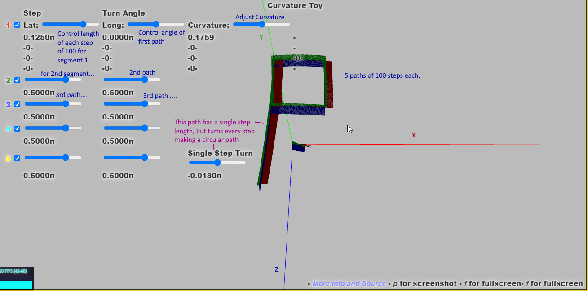

# On parallel Transport

[Demo](https://d3x0r.github.io/STFRPhysics/3d/indexSphereMap2.html)

This is an experiment with parallel transporting a frame for some wandering functions.  There are 5 Line segments which
turn by some amount and then each take 100 steps of some arc-length, The frame that they are in is parallel transported, and the
path that they end up taking depending on the `Curvature` slider, will join back in only 2-4 segments.

There's a second line that take a turn for each step, which results in a circular parallel transport.   It is 400 steps.  There
is no control for the step length of this curve...

Each frame is shown with its relative right/up/forward facing.  XYZ is RGB repsetively (x=red,y=green,z=blue).

Increasing the curvature from near 0 to 1 makes it so that 3 turns of 90 degrees arrive back at the pole, with a 90 degree facing change.

Increasing the curvature to 2 makes it so you get back the the same pole with only a single 90 degree turn; (from the default settings, if the
step length was different it wouldn't nessecarily end up back at the pole.  With the default settings every 2x curvature change results in the same basic paths around the sphere.

The sliders in the `Step` Column control the length each step along a segment is.
The sliders in the `Turn Angle` column control the angle of the turn before beginning the path.

## Links

[See Also](https://github.com/d3x0r/STFRPhysics/blob/master/math/TheNotBang.md); more on spatial displacments...

This is the first demo... Exploring what curvature is on a captive surface.

- https://d3x0r.github.io/STFRPhysics/3d/indexSphereMap2.html

These are the spatial displacement demos - to get what flat space curvature might be like.

- https://d3x0r.github.io/STFRPhysics/math/mathSphereDecay
- https://d3x0r.github.io/STFRPhysics/math/gravityFields.html
- https://d3x0r.github.io/STFRPhysics/math/gravityFields.nbody.html

Another spatial displacement - showing 3d geodesic planes.

- https://d3x0r.github.io/STFRPhysics/3d/index-gravity-field.html

### A note on Sphere Decay demo

This has a graph in the center void (otherwise it would just be white, and uninteresting) the graph that is there are curves that are parallel frame transports from -2pi to 2pi; the rotation span is 4pi across the void.

The middle started as just showing the amount the line is displaced linearly, and I realized that curve was actually the tangent of the rotation curves, and required an addition dialation.

The first space under '0' is 'i', but then there's apparently a 'i2' that's the second half of i. 

## Hyperbole about perspective

If a flatlander was confined the the surface of a plane, and that plane is curved by some extrinsic curvature, than what the flatlander 
thinks of as straight lines aren't, and there will be a measurable change in orientation depending on the direction it wanders around the surface.
If this surface was extended with height, so everywhere there's a point normal to the plane that the flatlander is in; so now it can go up and down.
If it was actually in a curved space, the vertical might betray whether it was in a negatively curved space, because all points going up would converge at a notable distance, and you could
take off vertically from two different places and reverse positions in the air.

The universe we live in is generally flat from what we see; and if we were constrained to the plane and that plane was put on a sphere, then it would be closed, and maybe over infinite distances it is...
there is an attempt to measure the general curvature of space assuming the big bang happened from a point, then there should be a residual arc in the space, as an example.

But light travels on straight lines, but these lines are curved ever so slightly, so they don't exactly live on a closed surface of a ball, or bowl.  (this somehow fails to convey what I'm trying to say)

But it does appear that if curvature of space was a real thing then gravitational lensing is certainly a thing.  Black holes end up black more because they're cloaked... it's hard to actually see how big they are, 
because the light geodesics just go around them without any sort of distrotion or warping.

Gravitational Lensing is NOT like Convex lense lesning... the rays only return to being straight and do not converge in any particular place; I expect the compositions of Einstien rings are not from a single image, but probably a 
time series as the earth orbits the sun, that we get slightly different angles of the object behind a strong spatial displacment source (heavy galaxy).

Playing with rotations, which is generally a space that is a bunch of lines emanating from the origin; it's sort of a spherical coordinate system with a radius; the idea of a basis system that's formed on a sphere at any segment of that isn't so foreign; but
I don't have a great way to give you that visualzation (maybe consider stiff "Koosh balls" ).

## Consequences of Displacement

There's more in the 'TheNotBang' (See Also) link above, and the related see also at the top of that; but this will be another version.

As space is dialated with a displacment, initially there is not much net change.   As a sum of changes happens, the overall space is stretched by a finite amout in a roughly spherical gradient.

The space nearest the displacment is wider and shorter; since the wider part is in a plane tangent to the displacement, the width increase is a squared factor, while the height shortening is only radial.

Electrons I expect are more like photons, and are in the space that is displaced; but have to travel a real distance; because the space near the gravitational displacment is stretched more than away from the source,
electrons spend a small amount of time longer on one side of an atom than another; this net time that the electron is on the one side longer causes the neucleus of that atom to migrate towards where the electron spent its time.

### So here's where the equivalence principle fails.

Moving at a speed, and having a slow clock is not really related to this same electron-side biasing.  And a body being accelerated is somewhat like that?  As the general frame moves forward, there's a general tendancy of things to remain
where they were, and feel like a backwards force; but space hasn't been displace in this case.

A fast moving frame can measure a difference in the speed of light forward/backward along its own frame (when not accelerating); if that frame was also in a gravitational potential then there's a separate direction of difference in gradient that 
can be detected; but that's not from velocity.

