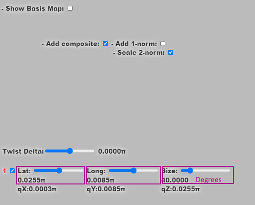
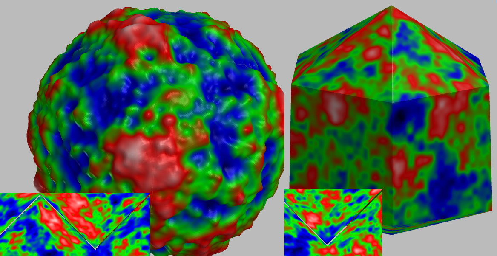
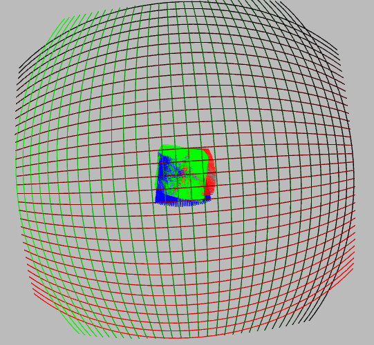
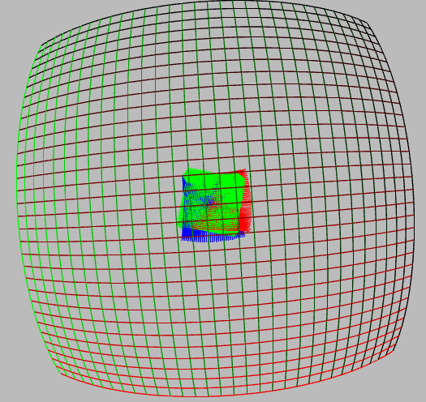
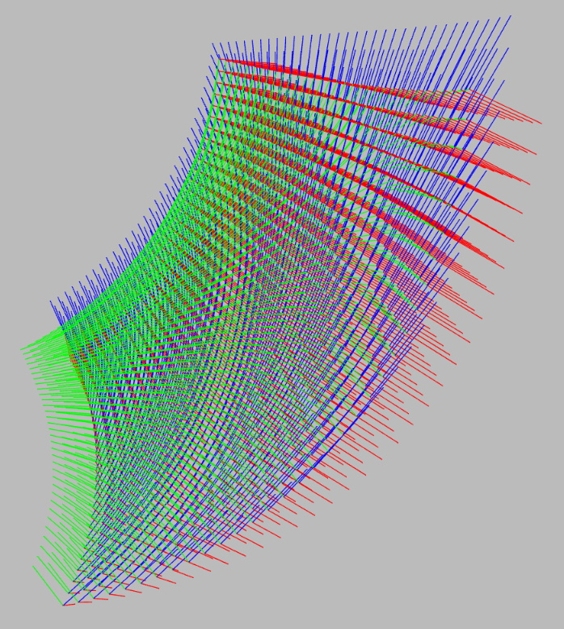

# Mapping Rectangles on Spheres...

Live Demo : https://d3x0r.github.io/STFRPhysics/3d/indexSphereMap.html

## The controls

The sliders at the bottom control Lat(itude), Long(itude), and Size.  Size is the total angle of the patch; it's value
is shown below the slider in degrees.  The other slider, the 'Twist Delta' controls the spin of the patch.  Every point
is also roughly aligned with forward and right vectors at that point aligned with the grid.  

The rotation X/Y/Z coordinate of the angle-angle-angle is shown in its own space.  The top checkbox, 'Show Basis Map' 
shows the grid for x/y/z for a range of +/- 2pi... the effective rotations never exceed this sphere.  All of the rotations
that are at the surface of the sphere are the same orientation.... 
so there's a infinite choice to go back along any other rotation path.

## What this is showing

This demo started as a test to map a rectangular grid onto a sphere using latitude longitude offset
from a single 'orientation point'.  The 'orientation point' is at a specific latitude and longitude on the ball, with
a spin/twist setting to control the 'heading' of the patch.  

I wa going to apply this grid to locally define layouts on a sphere with variable geometry....

I then plotted the rotation coordinate and its basis frame, and then there was a lot of discontinuity in output.
Adding fixups internally on the point already in the rotation space.  

This is an application where addition is the 'proper' operation too, in order to form the grid, one can
either apply latitude and then longitude, or vice versa; or apply infinitesimal steps of each to get the result;
this happens to be the result of adding two rotations.  https://en.wikipedia.org/wiki/Lie_product_formula ,  

Then applying the origientation point's rotation ( which for some grids is a simple addition of the 

## AxB BxA  (applying one rotation and then the other)

## A+B (applying both at once)

## And then....

The grid of points of Green/Red/Blue basis frames represents the rotation to get from 0 to the specified target point of the grid as
the composite of `(A+B)xC`.

The grid is drawn using the normal of the resulting basis only. 

I was able to get a continuous mapping for latitude +/-2pi and longitude +/-2pi and +/-2pi spin.  This provides a 
double covering of the rotations for the grid.... but a continuous mapping of the rotation coordinates around the 
+/- 2pi rotation space. 

### This is based on...

I Don't have a simple explainer/demo for just the lat/long/spin setting... that's a new parameter set.

Sliders for X/y/Z set the rotation coordinate... this is more about showing a single coordinate... (and the path to each point from the prior)

https://d3x0r.github.io/STFRPhysics/3d/indexArmProper.html