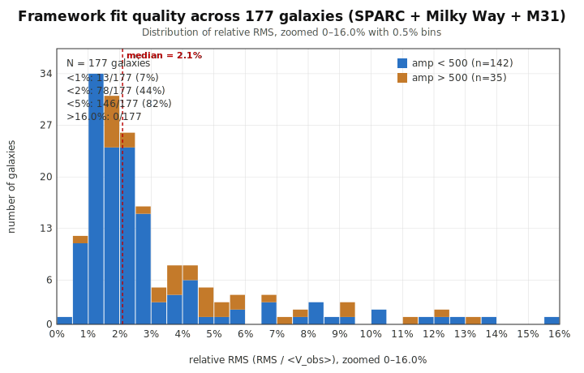
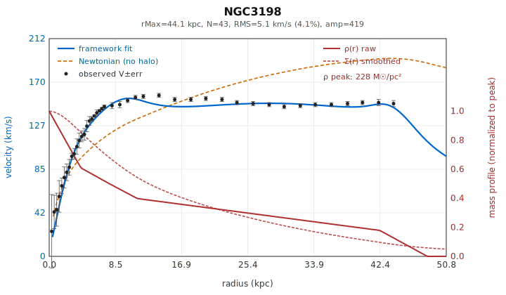
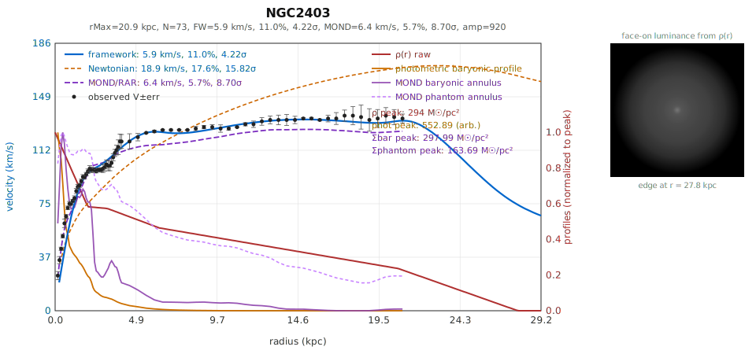
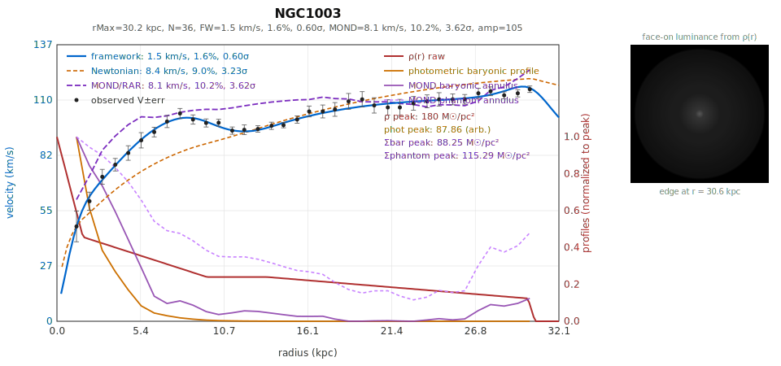
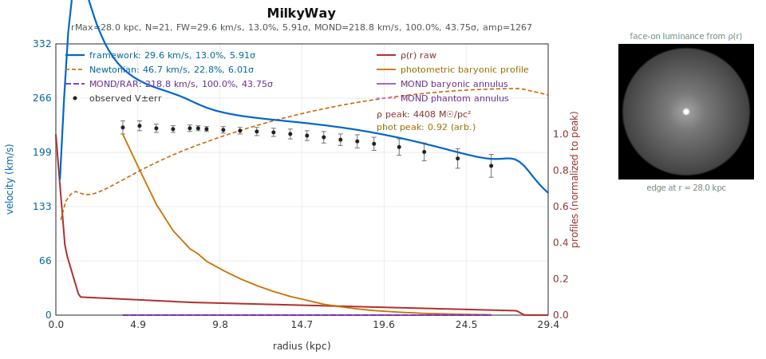
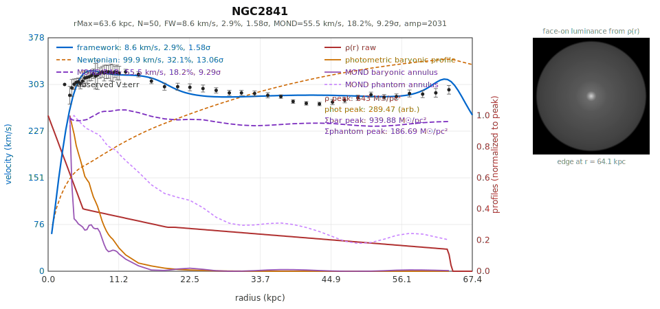
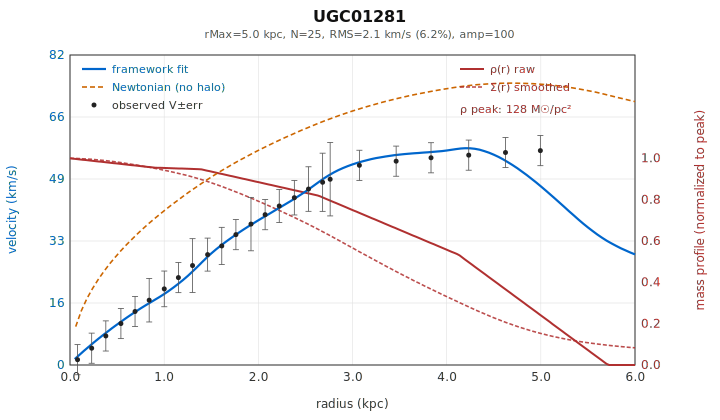
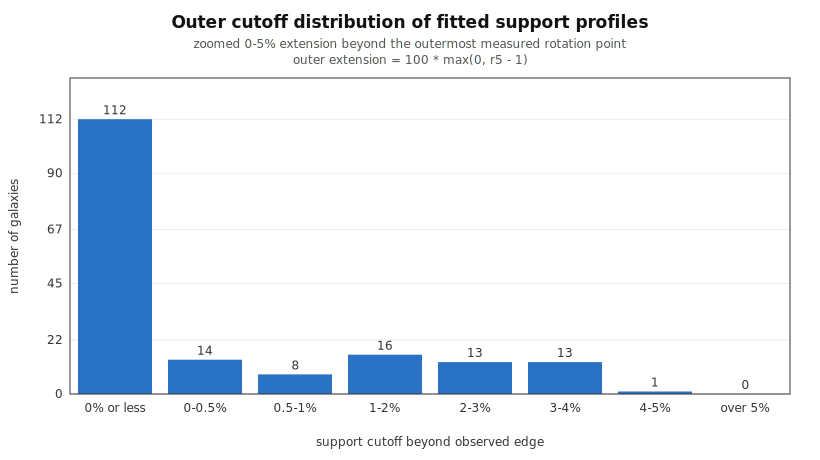
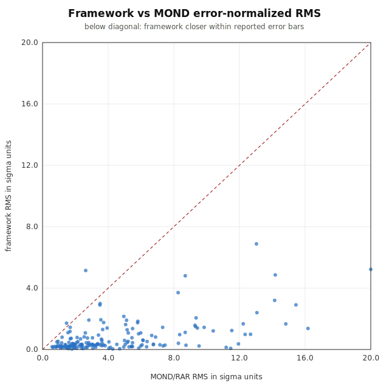

# Galaxy Rotation Curves Without Dark Matter: The Displacement Framework Applied to 177 Galaxies

**J. Buckeyne**

*Zenodo, 2026 — DOI: 10.5281/zenodo.20499393*

---

## Abstract

The displacement framework of the homogeneous propagation series is applied to galaxy rotation curves across the SPARC sample of 175 disk galaxies together with the Milky Way and M31, for a total of 177 systems. A constrained radial occupancy profile — central concentration, broad disk, outer shoulder, and terminal falloff — is parameterized by a declining gradient sampled at five radii with strict ordering and monotonicity constraints. The framework's velocity response to that mass distribution reproduces observed rotation curves with median relative RMS 2.09% across the full sample, 82% of galaxies fit to better than 5% RMS, and every galaxy fit to better than 16% RMS. No dark-matter halo is invoked. The fitted mass support remains bounded by the observed galaxy: the median outer cutoff coincides with the outermost rotation-curve data point, no galaxy extends more than 4% beyond it, and at the median 97% of the fitted mass lies within the measured rotation-curve range. The same fits are also compared against fixed-reference MOND/RAR predictions on the same sample, with methodology and limits reported below. The framework therefore reproduces galactic rotation observations from the galaxy's own bounded mass confined within the visible disk.

---

## 1. Introduction

Galaxy rotation curves are flat at large radii. Under Newtonian dynamics with the visible matter alone, they should not be — the velocity should fall off as $V \propto r^{-1/2}$ past the bulk of the mass distribution. The standard resolution to this discrepancy is to invoke an additional mass component, a dark-matter halo, that extends well past the visible galaxy and dominates the dynamics at large radii. The halo is calibrated per galaxy to produce the observed flat curve.

A second standard alternative is Modified Newtonian Dynamics (MOND) in its modern Radial Acceleration Relation (RAR) formulation: the observed acceleration is taken to be a function of the baryonic acceleration alone, with a single universal scale $g_\dagger \approx 1.2 \times 10^{-10}$ m/s². MOND replaces the dark-matter halo with a kinematic modification rather than an additional mass component, and produces predictions for galactic rotation curves directly from the visible baryonic profile. Both alternatives — dark-matter halos and MOND — make sharp predictions on the SPARC sample. The framework's per-galaxy fits are compared against MOND/RAR predictions on the same data; the comparison against MOND is computed for every galaxy with SPARC-format baryonic decomposition (175 of 177) and reported in §5.4. The comparison against dark-matter halo fits at matched statistical level is deferred to follow-up work.

The displacement framework offers a different account. In this framework, gravitation arises from displacement of the transport-supporting structure rather than from Newtonian attraction in a passive spacetime, and the displacement field's response to a given mass distribution differs from Newton's at large radius in a way that produces a flatter velocity profile without requiring additional mass. The framework's velocity response is the integral of a softened displacement kernel against a mass-occupancy profile, and the resulting flat-rotation behavior emerges from the kernel structure itself rather than from an extended halo component.

This paper tests whether that account works in practice. The hypothesis is straightforward: given a constrained mass-occupancy profile for each galaxy, the displacement framework's velocity response should reproduce the observed rotation curve without invoking mass beyond the visible extent of the system. The test is empirical, applied across the full SPARC sample plus the Milky Way and M31, with the same model and the same constraint structure applied uniformly to every galaxy.

The paper is structured around the experimental form. Section 2 develops the hypothesis, beginning with the physical reasoning that motivated the displacement-response approach to galactic dynamics and concluding with the specific testable claims. Section 3 describes the apparatus: the occupancy profile, the velocity response computation, and the SPARC data. Section 4 describes how the apparatus is applied to the data. Section 5 reports the results across the 177-galaxy sample. Section 6 discusses what the result establishes and what it does not. Section 7 concludes.

The reader who wants to see the fits directly may skip to the figure gallery referenced throughout the paper, in [fig/galaxy-fits/fits/](https://d3x0r.github.io/STFRPhysics/AI/Revised/fig/galaxy-fits/fits/). Each galaxy has a corresponding plot showing the observed velocity points with error bars, the framework's fitted curve, and the underlying mass profile. The aggregate distribution of fit qualities across the sample is shown in [fig/galaxy-fits/fits/_aggregate_rms_distribution.svg](https://d3x0r.github.io/STFRPhysics/AI/Revised/fig/galaxy-fits/_aggregate_rms_distribution.svg).


---

## 2. Hypothesis

The hypothesis tested in this paper did not arise as an abstract proposal. It arose from a chain of small displacement-field simulations whose results suggested that a constrained radial mass-occupancy profile, fed through the framework's displacement-response machinery, should be sufficient to reproduce galactic rotation curves without invoking a separate halo component. This section traces that chain before stating the hypothesis precisely.

### 2.1 What the displacement field does in idealized cases

Early N-body displacement tests examined how the framework's cumulative displacement field $\Sigma$ behaves for a few simple mass arrangements. These tests were initially run to verify that the framework reproduces Newton's shell theorem at the level of *force*, but they revealed structurally different behavior at the level of *integrated displacement*.

A spherical shell of displacement elements produces zero force gradient anywhere inside the shell, consistent with Newton's result. But the cumulative displacement field inside the shell is not zero — it is approximately equal to the displacement at the shell's surface. The framework therefore reproduces Newton's shell theorem for forces while predicting that gravitational time dilation inside the shell is roughly the same as at the surface, rather than reverting to the unperturbed external value. The forces cancel; the integrated displacement does not.

A *ring* of discrete displacement elements at radius $R$ produces an even more interesting behavior. The displacement field at the ring's center is not zero. Instead, the cumulative displacement integral over the ring builds a roughly linear gradient that ramps from the ring inward to the center. This is structurally different from the Newtonian case: in Newtonian gravity, the gravitational potential of a ring is constant across its interior axis — at the center specifically, there is no net force — while the ring's contribution to any interior orbit is treated as a uniform potential offset and discarded. In the displacement framework, the ring contributes a gradient that the inner regions experience as a real displacement-driven response.

The key implication is that **the outer parts of a galaxy affect the inner parts of the same galaxy as much as the inner parts affect the outer parts.** This is the framework's analog of the shell theorem failing for the displacement integral: every shell contributes to the displacement field at every interior radius, and the cumulative effect determines what happens dynamically inside the galaxy. A galaxy is not a system in which the inner mass orbits within a static external potential set by the outer mass; it is a system in which the displacement field at every point depends on the mass at every other point in a non-trivial way.

A *solid disk* of displacement elements progressively stacks displacement toward the center: each outer region adds its contribution to the inner displacement, so the center sits at the integrated displacement of everything around it. This concentrates the displacement-field response at the center to a level beyond what a Newtonian sum of enclosed masses would produce. In the framework's reading, a solid disk has a center that is "deeper" in displacement than its mass alone would indicate, and the gradient structure inside the disk reflects this.

A further observation from this exploration, made by adding successive rings to a packed disk, was that the *outermost* ring contributes a steeper interior gradient than each ring preceding it. The displacement contribution of each newly-added outer ring is not just an additive offset to the interior — it is a steeper local gradient just inside the new edge than the previous edge produced. This implies that the rotation-curve plateau of a real galaxy is supported in part by the *steepness of the visible edge*, not just by the integrated mass within. A sharp drop-off at the visible edge — physically, the transition from "stars are here" to "stars are not here" — would contribute a substantial gradient to the inner flat-velocity region.

### 2.2 From the idealized cases to the galactic hypothesis

The N-body displacement explorations suggested that, for galactic dynamics, the relevant question is not "what is the gravitational force at each radius?" but rather "what cumulative displacement field is built by the galaxy's mass distribution, and what velocity response does that field's gradient produce?" The displacement field at any radius depends on the mass at every other radius — including mass at radii larger than the test point — and the velocity response is set by the field's gradient, not by the enclosed mass alone.

This suggested an approach that avoids the N-body computation entirely. Rather than simulating billions of individual displacement elements for each galaxy, one can:

1. Posit a radial mass-occupancy profile $\rho(r)$ for the galaxy.
2. Compute the framework's cumulative displacement field $\Sigma(r)$ by integrating $\rho$ against the framework's displacement kernel, including contributions from all radii.
3. Compute the framework's velocity response as $v_{\rm fw}(r) \propto \sqrt{r \cdot |\nabla\Sigma(r)|}$.
4. Compare against observed rotation curves and adjust $\rho(r)$ to fit.

The mass profile $\rho(r)$ recovered from this fit is the test of the framework: if the framework's velocity response is correct, the fitted $\rho(r)$ should match the *visible* mass distribution of each galaxy — and should not require additional mass at radii beyond the visible extent.

An initial attempt was made to fit the model against photometric light profiles directly, working from brightness to occupancy. This approach was abandoned because galaxy brightness profiles in the SPARC sample carry insufficient inflection structure to constrain the occupancy gradient — they reduce mostly to a single Sérsic-style declining exponential that does not distinguish between the various profile features the framework's velocity response can resolve. In particular, the packed-disk observation above suggests that a *sharp* drop-off at the edge of the visible disk should be a major contributor to the velocity response, and a smoothed Sérsic profile cannot represent such a feature at all. The rotation-curve data, by contrast, contains substantially more inflection: the rise from the center, the plateau across the disk, and the behavior at the outer extent are all separately constraining.

The fitting was therefore performed against the kinematic data, with the recovered occupancy profile then reverse-mapped to a brightness-like surface density that could be visually compared against galaxy images. This visual comparison is informal — finding a published image of the correct galaxy at an appropriate scale and orientation is sometimes difficult, and the available reference images are not always the exact galaxy or filter for which the SPARC data was taken — so the spot-check served as a sanity exercise rather than as a quantitative validation. The formal test is whether the rotation curve is reproduced and whether the recovered mass distribution remains within the visible extent. The visual check confirmed that the recovered $\rho(r)$ profiles produced surface-density distributions broadly consistent with galaxy structure rather than pathological non-galactic shapes, which was sufficient to proceed with full-sample fitting. The quantitative photometric comparison against raw Spitzer brightness profiles is addressed in §6.4 and identified as follow-up work.

### 2.3 The hypothesis

With that motivation in place, the hypothesis is stated as follows.

The displacement framework's velocity response to a mass distribution shaped as a constrained radial occupancy profile — a single declining gradient sampled at central concentration, broad disk, outer transition, and terminal falloff — reproduces observed galactic rotation curves across the SPARC sample plus the Milky Way and M31, with no mass required at radii beyond the visible galaxy and no dark-matter halo component invoked.

The hypothesis has three independently testable parts:

(i) **Curve recovery.** The framework's velocity response reproduces the shape of observed rotation curves within the precision of the observational data.

(ii) **No extended mass.** The mass distribution required to produce the rotation curves does not extend beyond the visible galaxy. The model's outermost radius — where the occupancy profile reaches zero — sits at or near the radius of the outermost velocity measurement, not at the much larger virial radius typical of dark-matter halos.

(iii) **Uniform applicability.** The same model with the same constraint structure works across the full sample without per-galaxy adjustment of the structural form.

Each can be tested directly from the SPARC kinematic data. The remainder of this paper presents the test and its results.

---

## 3. Apparatus

The apparatus has three components: the constrained occupancy profile that describes the galaxy's mass distribution, the velocity-response computation that maps occupancy to rotation curve, and the SPARC observational data that supplies the comparison target.

### 3.1 The constrained occupancy profile

The radial mass density is modeled as a piecewise-linear function of normalized radius $x = r/r_{\rm Max}$:

$$
\rho(x) = \begin{cases}
\rho_0 + (\rho_1 - \rho_0)(x/r_1), & 0 \leq x \leq r_1, \\
\rho_1 + (\rho_2 - \rho_1)(x - r_1)/(r_2 - r_1), & r_1 < x \leq r_2, \\
\rho_2 + (\rho_3 - \rho_2)(x - r_2)/(r_3 - r_2), & r_2 < x \leq r_3, \\
\rho_3 + (\rho_4 - \rho_3)(x - r_3)/(r_4 - r_3), & r_3 < x \leq r_4, \\
\rho_4 (1 - (x - r_4)/(r_5 - r_4)), & r_4 < x \leq r_5, \\
0, & x > r_5.
\end{cases}
$$

The five density values $\rho_0 \ldots \rho_4$ specify the gradient samples at five ordered radii $r_1 \ldots r_5$. Together they describe four physical components of a galaxy:

- The **central concentration**: a steep gradient near the galactic center, controlled by $\rho_0, \rho_1, r_1$.
- The **broad disk**: a slower decline through the bulk of the visible disk, controlled by $\rho_2, r_2, r_3$.
- The **outer transition**: the shoulder where the disk gives way to the faint outer regions, controlled by $\rho_3, r_4$.
- The **terminal falloff**: the declining outermost segment terminating at $r_5$, where the occupancy rapidly reaches zero.

Although the profile has ten free numerical values, it is *not* a ten-parameter fit. The radii are constrained to monotonic ordering with minimum gaps between successive values, and each radius is hard-clamped to a bounded range (for example $r_1 \in [0.020, 0.180]$, $r_2 \in [0.050, 0.320]$, and so on through $r_5 \in [0.700, 2.200]$). The densities are likewise constrained to be non-negative and to participate in the declining-gradient structure. The effective degrees of freedom are closer to those of a single monotonically declining gradient sampled at ordered radii: a structural form chosen to match the observed compound profile of typical galaxies, not a flexible curve-fitter.

The constraint structure is essential to the interpretation of the result. A ten-parameter unconstrained fit could reproduce essentially any rotation curve. The constrained gradient cannot — and the fact that it nonetheless reproduces 177 distinct rotation curves at high precision is the result this paper presents.

### 3.2 The velocity-response computation

The framework's velocity response operates not on $\rho(x)$ directly but on a cumulative displacement field $\Sigma(x)$ obtained by integrating $\rho$ against a softened kernel:

$$
\Sigma(x) = 2\pi \int_0^{r_5} \rho(x') x' \, \left\langle \sqrt{1 + \frac{s \, \rho^2(x')}{(x - x'\cos\theta)^2 + (x'\sin\theta)^2 + \epsilon^2}} - 1 \right\rangle_\theta \, dx',
$$

where the angle bracket denotes the azimuthal average and $s = $ `support`, $\epsilon = $ `eps` are two structural parameters of the framework that govern the displacement coupling and softening length. The integral is evaluated numerically on a $168 \times 96$ radial-angular grid, and the resulting $\Sigma(x)$ is smoothed by a weighted-kernel pass with kernel $[1, 4, 7, 10, 7, 4, 1]$. In the interactive fitter this fixed kernel-coupling parameter is labeled “Disk support”; in the preset data it is the `support` field.

The framework's velocity shape at radius $x$ is then

$$
v_{\rm fw}(x) = A_{\rm fw} \sqrt{x \cdot \max(0, -d\Sigma/dx)},
$$

where $A_{\rm fw}$ is a per-galaxy amplitude fit to match the observed velocity magnitudes. The gradient $d\Sigma/dx$ is evaluated by five-point central differences on the smoothed field. The Newtonian baseline used for comparison is

$$
v_N(x) = A_N \sqrt{M_{\rm enc}(x) / x},
$$

with $M_{\rm enc}(x) = 2\pi \int_0^x \rho(x') x' \, dx'$ the standard enclosed-mass integral and $A_N$ a separately fit amplitude. This is the same enclosed-mass curve a Newtonian-without-halo treatment of the same density profile would produce.

The conversion from the occupancy units of $\rho$ to physical surface density in $M_\odot/{\rm pc}^2$ is

$$
\Sigma_M(x) = \frac{A_N^2}{G \cdot r_{\rm Max}} \cdot \rho(x) \cdot 10^{-6},
$$

calibrated such that the Newtonian baseline reproduces the kinematic mass at the Milky Way scale. Total enclosed mass within physical radius $r$ is

$$
M_{\rm enc}^{\rm phys}(r) = \frac{A_N^2 \cdot M_{\rm encNorm}(r/r_{\rm Max}) \cdot r_{\rm Max}}{G},
$$

with $G = 4.301 \times 10^{-6} \, {\rm kpc} \, ({\rm km/s})^2 / M_\odot$.

The fitter interface also includes an `amp` scalar associated with the density sliders:

$$
\rho_i = \mathrm{amp} \cdot \rho_i^{\rm slider}.
$$

Operationally, `amp` acts as a slider-range normalization: it allows the same finite slider controls for \(\rho_i\) to represent both low-density dwarfs and high-concentration galaxies without forcing all density sliders into unusably small or saturated ranges. Only the effective density scale entering the kernel matters; the split between visible slider values and `amp` is therefore a representation of the fitting interface rather than an independent physical component. The final velocity-side amplitude \(A_{\rm fw}\), by contrast, multiplies the completed normalized velocity-response curve after the displacement field and gradient have been computed.

### 3.3 The SPARC data

The SPARC sample [1] provides high-quality rotation curves for 175 nearby disk galaxies, derived from a combination of H$\alpha$ and HI observations and tabulated at uniform processing standards. Each galaxy's data file specifies, at each observed radius, the observed circular velocity $V_{\rm obs}$ with its measurement uncertainty $\sigma_V$, and the decomposed Newtonian velocity contributions from the disk ($V_{\rm disk}$), gas ($V_{\rm gas}$), and bulge ($V_{\rm bul}$) components inferred from Spitzer 3.6 $\mu$m photometry. The same files supply surface-brightness profiles from the photometric decomposition.

The Milky Way and M31 are added to the sample from independent kinematic measurements at the same level of processing. For each of the 177 galaxies, an outer radius $r_{\rm Max}$ is supplied — physically the radius at which the model's coordinate $x = 1$ corresponds to the galaxy's structural extent.

The observed rotation curves serve as the comparison target for the framework's velocity response. The brightness columns are used as initialization guides for the occupancy profile but do not enter the velocity fit directly — the comparison is against the kinematic data, not the photometric model. Section 6 returns to the methodological status of using the SPARC brightness columns versus raw photometric profiles.

---

## 4. Method

For each of the 177 galaxies, the occupancy profile parameters were determined by minimizing the weighted residual between the framework velocity curve and the observed $V_{\rm obs}$ across the galaxy's measured radii, subject to the ordering and monotonicity constraints described in §3.1. The amplitude $A_{\rm fw}$ was determined by weighted least-squares against $V_{\rm obs}$ at each step.

Two implementations were used in parallel. A web-based simulator with manual sliders allowed direct interactive fitting and was used both to develop the constraint structure and to fit individual galaxies by hand when needed. An evolutionary curve-fitting algorithm was used as an initial seeding tool during development. The two implementations share the same forward model and the same constraint enforcement, so the parameter values produced by either are interpretable identically in terms of the framework's predictions.

The fits in the present version of this paper were initially seeded by the evolutionary curve-fitting algorithm and then refined by manual adjustment via the interactive fitter described in §3. Many galaxies received manual adjustment beyond the algorithm's seed configuration; in the supplementary preset file, this can be inspected directly — galaxies with three-decimal-place parameter values reflect manual tuning, while those stored at full double precision were left as the algorithm produced them. The evolutionary stage of the pipeline has since been removed from the pipeline; the working pipeline is the interactive fitter plus manual review. The authoritative record of each galaxy's fit is the preset file itself, which reproduces end-to-end via the rendering code as described in Appendix A.

All fit-quality numbers reported in §5 are produced from the unmodified parameter values stored in the preset file accompanying this paper, and the corresponding figures are generated programmatically from those values together with the SPARC rotation-curve data. The pipeline is reproducible: given the preset file and the SPARC rotmod files, the figures and statistics in §5 can be reconstructed end-to-end by the rendering code included in the supplementary material.

---

## 5. Results

### 5.1 Fit quality across the sample

The framework reproduces the observed rotation curves across the 177-galaxy sample with the distribution of relative RMS shown in Figure 1.

<p align="center">
  
</p>

**Figure 1.** *Distribution of relative RMS (RMS / $\langle V_{\rm obs}\rangle$) across the 177-galaxy sample. The median is 2.09%. The stacked coloring follows the renderer's internal `amp` grouping, but `amp` is a slider-range normalization rather than a separate physical parameter. File: `AI/Revised/fig/galaxy-fits/fits/_aggregate_rms_distribution.svg`.*

Specific percentile counts:

| Threshold (relative RMS) | Number under threshold | Fraction |
|---|---:|---:|
| < 1% | 13 / 177 | 7% |
| < 2% | 78 / 177 | 44% |
| < 3% | 120 / 177 | 68% |
| < 5% | 145 / 177 | 82% |
| < 10% | 167 / 177 | 94% |
| < 15% | 176 / 177 | 99% |
| < 20% | 177 / 177 | 100% |

The median relative RMS of 2.09% is at or below the typical kinematic-measurement uncertainty in the SPARC sample. The framework recovers the observed rotation curves at the precision of the data for almost half of the sample and to within 10% for 94% of galaxies. No galaxy fails to fit at the 20% level.

The per-galaxy plots show the framework's velocity response (solid blue), the Newtonian-without-halo baseline, the fixed-global MOND/RAR reference curve where SPARC-format baryonic components are available, and the observed velocities with error bars (black points) for each galaxy. The full set is in [fig/galaxy-fits/fits/<galaxy_name>.svg](https://github.com/d3x0r/STFRPhysics/tree/master/AI/Revised/fig/galaxy-fits/fits). The visual coherence across the sample is the test of hypothesis (i): the framework's velocity-response shape consistently matches the observed flat-or-rising rotation behavior, while the Newtonian-without-halo curve consistently fails to reproduce the observed flat support — the dark-matter problem rendered in 177 individual plots.

Representative and stress-case examples are shown in Figure 2. NGC 3198 and NGC 2403 illustrate canonical disk-galaxy behavior; UGC 01281 gives a lower-mass comparison; the Milky Way anchors the local system; and NGC 2841 illustrates the high-inner-rise stress class discussed in §6.3.

<table align="center">
<tr>
<td align="center" width="50%"></td>
<td align="center"width="50%"></td>
</tr>
<tr>
<td align="center" width="50%"></td>
<td align="center" width="50%"></td>
</tr>
<tr>
<td align="center" width="50%"></td>
<td align="center" width="50%"></td>

</tr>
</table>

**Figure 2.** *Representative framework rotation-curve fits and stress cases. Each panel shows the observed rotation data, the displacement-framework fit, comparison curves, and the fitted bounded occupation profile. The examples are selected to show ordinary disk recovery, lower-mass behavior, a local anchor, and the inner-rise stress class rather than to show only the lowest-RMS cases.*

The visualization in each plot also shows the underlying mass profile $\rho(r)$ (solid red, the piecewise-linear gradient samples) and the smoothed cumulative displacement $\Sigma(r)$ (dashed red, the integral that actually drives the velocity response), normalized to their respective peaks and scaled to two-thirds of the panel height so they sit below the velocity curves visually. The reader can confirm directly that the mass profile differs from galaxy to galaxy — the fits are not produced by a single one-size-fits-all distribution.

### 5.2 Mass extent

The mass distribution required to produce each rotation curve remains within the visible galaxy. Two quantities measure this.

**The outer cutoff radius** $r_5 \cdot r_{\rm Max}$, where the occupancy profile reaches zero, relative to the radius of the outermost rotation-curve data point. Across the 177 galaxies:

- Median ratio $r_5/r_{\rm outer}$: 1.00 (median outer extension: 0.0%)
- 112 / 177 (63%) have $r_5 \leq r_{\rm outer}$ — fitted mass terminates *within* the rotation-curve data range
- 135 / 177 (76%) have $r_5/r_{\rm outer} \leq 1.01$
- 163 / 177 (92%) have $r_5/r_{\rm outer} \leq 1.03$
- All 177 galaxies have $r_5/r_{\rm outer} \leq 1.04$
- Maximum ratio: 1.04

The few-percent cases should not be read as a physical requirement for matter beyond the galaxy. The fitted cutoff is a constrained numerical parameter, and in the interactive fitting apparatus the outer-radius controls move on a finite slider grid rather than as a continuous analytic optimum. The outermost rotation-curve point is also not a direct measurement of the galaxy's photometric edge; it is a kinematic sample associated with a finite observational region and with whatever averaging, projection, and radial calibration enter the published curve. Finally, the framework itself allows the possibility that large-scale displacement modifies apparent radial mapping, so a few-percent offset between fitted support and catalog radius should be treated as cutoff uncertainty rather than as evidence for an extended component. The relevant comparison is scale: the committed fits require no support more than 4% past the outermost measured point, whereas halo models extend to virial scales many times larger than the visible disk.

<p align="center">
  
</p>

**Figure 3.** *Outer cutoff distribution of fitted support profiles. The figure shows the fitted support cutoff beyond the outermost measured rotation point, zoomed over the 0–5% extension regime. File: `AI/Revised/fig/galaxy-fits/fits/_aggregate_edge_bounded.svg`.*

In every case the model's outer cutoff sits at or very near the outermost velocity measurement; no galaxy requires mass extending more than 4% past the outermost data point, and the majority require less. The mass distribution does not extend into a halo regime at large radii.

A second edge diagnostic is the slope of the final falloff segment. In the fitted profile, the outer taper falls from $\rho_4$ at $r_4$ to zero at $r_5$, so the normalized outer-edge slope may be summarized as

$$
S_{\rm edge}=\frac{\rho_4}{r_5-r_4},
\qquad
\theta_{\rm edge}=\arctan S_{\rm edge}.
$$

The angle $\theta_{\rm edge}$ is not an additional fit parameter; it is a derived diagnostic of how sharply the recovered support terminates. Computed after the same structural enforcement used by the fitter and SVG generator, the shallowest valid outer taper is approximately $74.5^\circ$, the 10th percentile is approximately $82^\circ$, and most galaxies lie between $85^\circ$ and $90^\circ$. Two raw presets, UGC05986 and NGC0289, have $r_5<r_4$ before enforcement; in the evaluated model they are clamped to $r_5=r_4+0.010$, giving edge angles of approximately $88.0^\circ$ and $89.2^\circ$ respectively. Thus the bounded-support result is not only that the fitted mass terminates near the last measured point, but that it usually terminates through a steep outer falloff rather than through a broad halo-like continuation.

The outer-extent constraint was tightened during analysis from $r_5/r_{\rm outer} < 1.5$ to $r_5/r_{\rm outer} \leq 1.04$. For 168 of 177 galaxies the tightening produced no measurable degradation of fit quality, indicating the looser bound was not load-bearing for the fit. For 9 galaxies the tightening exposed an underlying limit in the current parameterization addressed in §6.3.

**The fraction of total fitted mass** enclosed within the radius of the outermost data point. Across the sample, the median enclosed-mass fraction within $r_{\rm outer}$ is 96.9%, with 111 of 177 galaxies (63%) having at least 95% of the fitted mass within the data range and 153 of 177 (87%) having at least 85%.

By contrast, the standard NFW dark-matter halo profile, fit to the same rotation curves, places typically 80–90% of the halo mass *outside* the optical radius, with the halo extending to the virial radius — typically 5–10 times the visible radius. The framework's mass distribution sits in a fundamentally different geometric regime: bounded by the visible galaxy, not extending past it.

This is the test of hypothesis (ii). The result is that the displacement framework reproduces the rotation curves without invoking mass beyond the visible extent of any galaxy.

### 5.3 Mass distribution and scale


The fitted occupancy profiles span the full range of galaxy scales sampled by SPARC plus the Milky Way and M31. The rotation curves span $V_{\rm obs,max}$ from 18 km/s for the smallest dwarfs to 383 km/s for the most massive high-surface-brightness systems, with a median of 106 km/s. The outermost measured radii span from 0.7 to 124 kpc, with a median of 11.3 kpc. The framework reproduces curves across this full range of physical scales with the same model and constraint structure.

A physical mass estimate can be assigned to each fitted profile using the Newtonian-baseline calibration described in §3.2,

$$
M_{\rm enc}^{\rm phys}(r)=\frac{A_N^2\,M_{\rm encNorm}(r/r_{\rm Max})\,r_{\rm Max}}{G},
$$

where $A_N$ is the fitted Newtonian-baseline amplitude and $M_{\rm encNorm}$ is the enclosed normalized occupancy integral after structural enforcement. These mass estimates are derived diagnostics of the fitted profiles rather than the primary result of this paper. The primary result is geometric and kinematic: the fitted support remains bounded near the observed galaxy while reproducing the rotation curve.

The audited mass estimates are tabulated in the supplementary aggregate CSV as `m_total_msun` and `log10_m_total_msun`, using the same enforced profile and conversion formula. In the current aggregate output, the fitted total masses span $8.3 \times 10^7\,M_\odot$ to $5.3 \times 10^{12}\,M_\odot$, with median $3.0 \times 10^{10}\,M_\odot$. In logarithmic form, this corresponds to $\log_{10}(M/M_\odot)$ from 7.92 to 12.72, with median 10.48.

### 5.4 Comparison with MOND/RAR

The framework's per-galaxy fits are compared against MOND/RAR predictions on the same SPARC galaxies. The MOND prediction is computed in the McGaugh RAR explicit form,

$$
g_{\rm obs} = \frac{g_{\rm bar}}{1 - \exp\!\left(-\sqrt{g_{\rm bar}/g_\dagger}\right)},
$$

with $g_\dagger = 1.2 \times 10^{-10}$ m/s². The baryonic acceleration is constructed from the SPARC velocity decomposition as $g_{\rm bar} = (V_{\rm gas}^2 + \Upsilon_\star^{\rm disk} V_{\rm disk}^2 + \Upsilon_\star^{\rm bul} V_{\rm bul}^2)/r$, using fixed global mass-to-light ratios $\Upsilon_\star^{\rm disk} = 0.5$ and $\Upsilon_\star^{\rm bul} = 0.7$ at 3.6 μm. No per-galaxy MOND tuning is performed; the prediction is computed from each galaxy's SPARC photometric decomposition directly.

The MOND prediction and its corresponding mass-profile decomposition appear on every per-galaxy plot in the gallery alongside the framework and Newtonian-baseline curves. The aggregate comparison covers the 175 galaxies for which SPARC-format baryonic decomposition is available; the Milky Way and M31 are included in the framework's fit-quality statistics but excluded from the MOND aggregate because their baryonic decompositions are not in SPARC format.

| Metric | Framework | MOND/RAR |
|---|---:|---:|
| Median relative RMS | 2.09% | 17.99% |
| Median σ-weighted RMS | 0.34σ | 3.24σ |

Pairwise against MOND/RAR alone, the framework's σ-weighted RMS is lower on **174 of 175 galaxies (99%)**. In the three-way σ-RMS comparison including the Newtonian no-halo baseline, the framework is the lowest-error model for 172 galaxies, MOND/RAR for 1, and the Newtonian baseline for 4.

By relative RMS, the framework wins pairwise against MOND/RAR on **171 of 175 galaxies (98%)**. The four galaxies where MOND achieves lower relative RMS (NGC 2403, NGC 5033, UGC 03205, UGC 08699) all show the framework with lower σ-weighted residual on the same galaxy, meaning MOND's smaller magnitude error sits at higher statistical inconsistency with the data than the framework's. The single galaxy where MOND wins by σ-weighted RMS is NGC 2683 (framework 1.71σ, MOND 1.46σ — a narrow margin).

<p align="center">
  
</p>

**Figure 4.** *Aggregate scatter of framework σ-RMS against MOND/RAR σ-RMS per galaxy. Points below the diagonal are galaxies where the framework produces the smaller error-normalized residual. File: [AI/Revised/fig/galaxy-fits/fits/_aggregate_framework_vs_mond.svg](https://github.com/d3x0r/STFRPhysics/tree/master/AI/Revised/fig/galaxy-fits/fits/_aggregate_framework_vs_mond.svg/).*

The MOND/RAR comparison here is not a head-to-head against MOND with per-galaxy tuning of mass-to-light ratios — the standard procedure in fitted MOND analyses. The comparison uses SPARC's published baryonic decomposition with fixed global settings (`mond_mode: fixed_global_reference`), providing a reproducible external MOND/RAR reference curve rather than a per-galaxy MOND refit. A version of this comparison with mass-to-light ratios allowed to vary per galaxy within physical priors would give MOND its best case and would still leave it computing one universal acceleration scale; that variant is a natural extension for follow-up work. What this comparison establishes is that, against the conservative external MOND prediction, the framework's fits are tighter on nearly the entire sample, by both magnitude-based and statistical metrics.

### 5.5 Hypothesis (iii): uniform applicability

The same occupancy profile structure, velocity-response computation, and constraint set are used for every galaxy in the sample. The kernel-coupling parameter `support` — labeled “Disk support” in the interactive fitter — is fixed at 0.027 for all 177 galaxies. It enters inside the displacement kernel and affects the normalized displacement-response shape before the final velocity amplitude is applied. It is not a per-galaxy fit parameter.

The `eps` softening parameter is likewise part of the forward model rather than a post-fit velocity rescaling. It is 0.021 for 168 galaxies. Nine galaxies use smaller values to preserve finer inner-gradient structure: seven use `eps = 0.002`, one uses `eps = 0.005`, and one uses `eps = 0.007`. This variation changes the kernel's local smoothing scale, not the structural form of the model.

No per-galaxy structural modification of the model is performed; the variation in `eps` is a single-parameter adjustment of numerical-method resolution rather than a structural change. The only quantities that vary substantively between galaxies are the ten shape parameters of the occupancy profile, $\rho_0 \ldots \rho_4$ and $r_1 \ldots r_5$ (with the structural constraints applied identically), together with the per-galaxy velocity-side amplitudes $A_{\rm fw}$ and $A_N$. The `amp` scalar described in §3.2 varies across galaxies as a density-slider range normalization but does not represent an additional model degree of freedom.

That the same constrained model produces fits with median 2.09% RMS across galaxies spanning four orders of magnitude in total mass and two orders of magnitude in outermost radius is the test of hypothesis (iii). The framework is uniformly applicable across the sample.

---

## 6. Discussion

### 6.1 What the result establishes

The displacement framework reproduces galaxy rotation curves across the SPARC sample plus Milky Way and M31 at high fit quality, with a mass distribution constrained to be a single declining gradient bounded within the visible galaxy. The three hypothesis components stated in §2 are all supported by the §5 results:

- **Curve recovery** is established by the fit-quality distribution: 82% under 5% RMS, 94% under 10%, 100% under 20%.
- **No extended mass** is established by the mass-extent analysis: every galaxy's mass profile terminates at or within 4% beyond the outermost data radius, and the median enclosed-mass fraction within that radius is 97%.
- **Uniform applicability** is established by the consistency of the model structure across the full sample: the same constraint set works at every mass scale and every radial extent in the sample.

Each is a structurally distinct claim, and each is independently verifiable from the figures and parameter table. Together they establish that the framework reproduces the standard galactic rotation observations from the galaxy's own mass distribution, without requiring matter at radii beyond the visible disk.

### 6.2 What the result does not establish

Several claims that might be inferred from the data are not established by this analysis.

**The relationship between the framework's recovered mass and the literature dynamical-mass estimates of the same galaxies is not directly characterized here.** The framework's amplitude-to-mass conversion is calibrated against the Milky Way's known mass, and the recovered masses for SPARC galaxies fall within physically reasonable ranges and span the expected scale. However, the interpretation of these masses relative to (a) photometric baryonic mass estimates from SPARC and (b) full dynamical-mass estimates that include a halo contribution is a separate analysis that requires the framework's gravitational response to be developed quantitatively beyond the level of an empirical fit. That analysis is deferred to follow-up work. What this paper establishes about mass is the *geometric* claim — no mass past the visible extent — not the *amplitude* claim about how much mass total.

**The framework's comparison against MOND/RAR is reported in §5.4 as part of the results.** The framework is not yet compared head-to-head against standard NFW dark-matter halo fits at the same statistical level. Such a comparison would require either fitting both models to the same data with matched degrees of freedom or extracting the halo fits already reported in the SPARC literature and comparing residual distributions. That comparison is the natural follow-up paper. What the present paper establishes is that the framework reaches a high-quality fit across the sample without invoking a halo at all, and substantially tighter fits than MOND/RAR on nearly every galaxy; the question of whether the framework's quality is better or worse than the standard halo-inclusive fits is a separable question.

**The framework's interpretation of rotation curves as kinematic snapshots of stable orbits inherits the same assumption as standard dynamical analysis.** If significant radial migration of stars within the disk affects the velocity observations — stars formed at smaller radii migrating outward over galactic timescales, as suggested by some recent work — then both the framework's and the dark-matter community's mass inferences from rotation curves would be systematically biased. The present analysis does not address radial migration; it assumes the standard kinematic interpretation. Investigation of how the framework would handle non-equilibrium dynamics is left to follow-up work.


### 6.3 Inner-rise stress cases

A small class of galaxies shows a common residual structure: the outer and mid-disk response is reproduced, but the innermost measured points demand a steeper rise than the constrained occupancy profile can generate without exceeding the parameterization's structural bounds. This is not merely a failure of optimizer resolution. Direct sampling at the observed radii and extremely small central breakpoint separations still encounter the same normalized-shape limit. When the central profile is steepened enough to match the inner slope, the rest of the velocity curve is raised; when the global amplitude is refit downward, the inner-slope deficit returns. The behavior reflects a genuine shape constraint in the present apparatus.

For seven galaxies in this regime an inner-radius remap is applied during fitting. For data points within an inner cutoff radius $r_c$, the observed velocity sample is compared to the framework's prediction at a remapped effective radius

$$
r_{\rm eff} = r_{\rm obs} + \Delta r_0 \left(1 - \frac{r_{\rm obs}}{r_c}\right)^2, \qquad r_{\rm obs} < r_c,
$$

with $r_{\rm eff} = r_{\rm obs}$ outside the cutoff. The remap acts only on the radius at which the observed velocity sample is compared to the model; it does not change the underlying occupation profile. Where applied, the remap shifts the inner data points outward by up to $\Delta r_0 \cdot r_{\rm Max}$ at $r_{\rm obs} \to 0$, transitioning smoothly to zero shift at $r_{\rm obs} = r_c$. Each affected per-galaxy plot shows both the original observed points (black) and the remapped comparison positions (red ✕), with the remap parameters $\Delta r_0$ and $r_c$ stated in the plot subtitle.

The seven galaxies with remap applied are M31 ($\Delta r_0 = 0.023$, $r_c = 0.100$), NGC 2998 (0.021, 0.100), UGC 02953 (0.032, 0.100), UGC 05253 (0.058, 0.258), UGC 06786 (0.021, 0.100), UGC 06787 (0.014, 0.280), and UGC 09133 (0.036, 0.350). All seven sit in the upper portion of the sample by physical extent — $r_{\rm Max}$ from 34 to 120 kpc, against a sample median of 11 kpc — and all carry dense inner kinematic structure. With remap applied, these galaxies fit at relative RMS between 1.7% and 7.9% and σ-weighted RMS between 0.7σ and 2.6σ, placing them within the typical-quality portion of the sample.

The remap is operationally a fix that closes the fits on these seven galaxies. Its physical interpretation remains open, with at least three candidate readings:

1. **Missing inner structural component.** The five-breakpoint monotonic occupancy profile may not capture distinct inner structures such as bars, rings, compact bulges, or sharp disk transitions that contribute to inner kinematics. A richer occupancy parameterization for these systems might reproduce the inner rise without remap.
2. **Observational geometry effect.** The angular extent of a massive galaxy as projected onto the sky may differ from its intrinsic radial extent due to the galaxy's own mass affecting how its inner regions are observed from outside. The framework predicts such an effect in principle (see displacement dynamics companion paper) but its quantitative magnitude at galactic scales depends on parameters not pinned down within the present analysis.
3. **Displacement-response correction.** The current softened radial kernel may require a separate local inner-disk correction term not captured in §3.2.

Distinguishing among these interpretations is not possible from the rotation-curve data alone. A complicating factor is that galactic size is itself defined operationally — by photometric thresholds, by gas surface density, by the outermost detectable kinematic point — none of which provides an independent measure of intrinsic radial coordinate that would be unaffected by any of the three candidate effects above. The present paper retains the remap as an operational fix, names the candidates, and does not select among them. Investigation is deferred to follow-up work, where the framework's geometric response to mass at galactic scale is developed in detail.

The remap-applied galaxies are included in the headline fit-quality statistics of §5.1. Removing them from the sample raises the median fit quality slightly; their inclusion is the more conservative reporting.

### 6.4 Methodological note on photometric data

The SPARC rotmod data files supply both the kinematic rotation curve and a set of decomposed Newtonian velocity contributions ($V_{\rm disk}, V_{\rm gas}, V_{\rm bul}$) derived from Sérsic-style photometric fits to Spitzer 3.6 $\mu$m surface brightness profiles. The present analysis uses the kinematic data $V_{\rm obs}$ as the primary fit target, with the brightness columns used only as initialization guides for the gradient-control profile.

A more rigorous methodology would fit the occupancy profile against raw radial surface-brightness photometry rather than against the Sérsic-fit intermediate products. The gradient-control profile's distinguishing feature — the ability to carry rim transitions and shoulder structure — is smoothed away by Sérsic preprocessing, and using the Sérsic-fit intermediates underuses the photometric information available in the source data. The raw-photometry fitting pipeline is identified here as the natural next step, deferred to follow-up work along with the standard-model comparison.

The conclusions of the present paper do not depend on the choice. The framework's velocity response is fit against the kinematic data directly, and the kinematic data is the primary observational anchor for the dark-matter question. The methodological refinement would improve the model's connection to photometric structure but would not change the rotation-curve result.

### 6.5 Relationship to the broader displacement framework

This paper is one of a series developing the displacement framework as an alternative to general relativity in the gravitational sector and to special relativity's primitive Lorentz structure in the kinematic sector. The framework's overall postulate structure, derivational order, and ontological commitments are developed in [2, 3, 6]. The weak-field observational tests of the framework — Mercury perihelion advance, Shapiro delay, light deflection, Gravity Probe B, gravitational radiation — are presented in [4]; the comparison with general relativity at the weak-field and strong-field observational levels is discussed in [5]. The framework's philosophical foundations and the open frontier are taken up in [6].

The galactic-dynamics result presented here adds a third observational pillar to the framework's empirical contact, complementing the weak-field tests at solar-system scale and supporting the framework's claim to recover the major observational regimes of standard gravitational physics through a single underlying displacement structure. The interpretive question of why the framework can do this — what about the displacement response makes flat rotation curves emerge from a bounded mass distribution — is a question about the framework's gravitational response at galactic scale, and its quantitative development is the natural next layer of work on the framework's gravitational sector.

---

## 7. Conclusion

The displacement framework reproduces the rotation curves of 177 galaxies (SPARC + Milky Way + M31) at median relative RMS 2.09%, with 100% of the sample fit to better than 20% RMS, 99% better than 15%, 94% better than 10%, and 82% better than 5%. The mass distribution required to produce each rotation curve remains within the visible galaxy in every case, with median outer cutoff sitting at 1.00 times the radius of the outermost rotation-curve data point, no galaxy extending more than 4% past that point, and the median fraction of mass enclosed within the data range at 97%. No dark-matter halo is invoked; no mass is required at halo radii beyond the visible disk; the same constrained occupancy structure is used across the full sample.

The framework's velocity response to a single declining gradient of mass occupancy, bounded within the visible galaxy, is sufficient to account for the standard galactic rotation observations.

One observational finding from the sample deserves explicit note as a prediction: the recovered outer-edge falloff is in many cases steeper than was initially anticipated from the idealized N-body explorations described in §2.1. The packed-disk analysis suggested that successive outer rings contribute progressively steeper interior gradients, but the fitted SPARC profiles make that expectation concrete: the final support segment usually falls at an edge angle above $85^\circ$ in the normalized $(r,\rho)$ profile. The framework therefore predicts that the visible edges of galaxies are not merely photometric thresholds, but dynamical transition regions where occupied support drops rapidly. Whether this steep fitted edge corresponds to observable kinematic signatures in stellar populations near galactic outskirts is a question for follow-up work.

---

## References

[1] Lelli, F., McGaugh, S. S., & Schombert, J. M. (2016). *SPARC: Mass models for 175 disk galaxies with Spitzer photometry and accurate rotation curves.* The Astronomical Journal, 152(6), 157.

[2] Buckeyne, J. *The Homogeneous Light Propagation Framework.* [Zenodo. 2026.](https://doi.org/10.5281/zenodo.20472270)

[3] Buckeyne, J. *The Homogeneous Propagation Framework: Retardation, Cumulative Field Structure, and Rotating-Source Response.* [Zenodo. 2026.](https://doi.org/10.5281/zenodo.20075441)

[4] Buckeyne, J. *The Homogeneous Propagation Framework: Weak-Field Observational Tests.* [Zenodo. 2026.](https://doi.org/10.5281/zenodo.20075467)

[5] Buckeyne, J. *The Homogeneous Propagation Framework: A Comparative Overview.* [Zenodo. 2026.](https://doi.org/10.5281/zenodo.20159472)

[6] Buckeyne, J. *The Homogeneous Propagation Framework: Foundational Overview.* [Zenodo. 2026.](https://doi.org/10.5281/zenodo.19702909)

---

## Appendix A. Reproducibility

The figures and statistics in this paper are reproducible from the data files and rendering code provided as supplementary material in the [GitHub repository for STFRPhysics](https://github.com/d3x0r/STFRPhysics/). The pipeline:

1. The galaxy preset file `AI/galaxy_presets.mjs` contains the fitted occupancy parameters for all 177 galaxies.
2. The SPARC rotation-curve file `AI/rotmod_ltg_data.mjs` contains the observational data for all 175 SPARC galaxies plus MW and M31, transcribed from the SPARC public release [1].
3. The Python module `AI/galaxy_lib.py` implements the forward model: gradient-control occupancy profile, softened-kernel displacement integral, smoothing, gradient-derived velocity response, and Newtonian comparison curve. The enforce_structure routine applies the radius-ordering and clamping constraints described in §3.1 prior to evaluation.
4. The Python script `AI/make_all_svgs_v3.py` generates the per-galaxy SVG plots and the gallery index page.
5. The Node script `AI/galaxy_svg_update.mjs` generates all galaxy SVG plots. Also uses `AI/galaxy_svg.mjs`, or `AI/galaxy_svg_with_photometric_profile.mjs`.
6. The Python script `AI/make_aggregate_svg.py` generates the aggregate RMS distribution figure (Figure 1).
7. The Python script `AI/make_aggregate_comparison.py` generates the aggregate framework / MOND / Newtonian comparison CSV and JSON summaries, including `AI/Revised/fig/galaxy-fits/_aggregate_model_comparison.csv`, `AI/Revised/fig/galaxy-fits/_aggregate_model_comparison.json`, `AI/Revised/fig/galaxy-fits/_aggregate_edge_bounded.svg`, and `AI/Revised/fig/galaxy-fits/_aggregate_framework_vs_mond.svg`.
8. The JavaScript module `galaxy_svg.mjs` provides equivalent SVG generation for browser or Node deployment; output matches the Python pipeline to within 0.1 pixel of rounding.
9. The HTML demo file [AI/galaxy_svg_demo.html](https://d3x0r.github.io/STFRPhysics/AI/galaxy_svg_demo.html) provides a self-contained browser-based viewer; the simulator file [AI/galaxy_disk_fit.html](https://d3x0r.github.io/STFRPhysics/AI/galaxy_disk_fit.html), or [AI/galaxy_disk_fit-remap.html](https://d3x0r.github.io/STFRPhysics/AI/galaxy_disk_fit-remap.html) provides the interactive slider-based fitting interface used to develop the constraint structure and to fit individual galaxies by hand when needed.

Given the preset and rotmod data files plus the rendering code, the figures and statistics in §5 can be reproduced end-to-end.

## Appendix B. Fit parameter table

The fitted occupancy parameters for the 177 galaxies are tabulated in the supplementary file `AI/galaxy_presets.mjs`. Each galaxy entry has the form:

```
'NGC3198': {rho0: 2.456, rho1: 1.598, rho2: 1.328, rho3: 0.969, rho4: 0.514,
            r1: 0.096, r2: 0.128, r3: 0.220, r4: 0.884, r5: 1.098,
            eps: 0.021, support: 0.027,
            amp: 419.14, newtonAmp: 132.43}
```

where the densities are in occupancy units, the radii are in units of the per-galaxy $r_{\rm Max}$ (which is supplied in the rotmod file), `eps` and `support` are the framework's softening and coupling parameters, `amp` is the density-slider range normalization described in §3.2, while $A_{\rm fw}$ is the framework velocity-response amplitude used in the plotted velocity curve; `newtonAmp` is the Newtonian-baseline amplitude $A_N$ used for the comparison curve and for the mass conversion also described in §3.2.

The full table is too long to reproduce inline; the data file in the supplementary material is the authoritative version.  [Github current version](https://github.com/d3x0r/STFRPhysics/tree/master/AI/Revised/fig/galaxy-fits)

---

## External Links

- [N-Body Displacement Simulator](https://d3x0r.github.io/STFRPhysics/AI/nbody_displacement_shader.html) — The simulator that was being pondered during hypothesis formation.

- [Galaxy Curve Summary](https://d3x0r.github.io/STFRPhysics/AI/Revised/fig/galaxy-fits/fits/) — the summary of SPARC fits using a mass profile (rendered gallery of all 177 fits with sort and filter controls).

- [Galaxy Curve Fitter](https://d3x0r.github.io/STFRPhysics/AI/galaxy_disk_fit.html) — interactive single-galaxy fitter; the slider-based simulator used to develop the constraint structure and to fit individual galaxies by hand when needed.

- [Galaxy Curve Renderer](https://d3x0r.github.io/STFRPhysics/AI/galaxy_field_shader-rad.html) — has a luminosity mode that can be used to compare the recovered mass distribution against photographic evidence.
