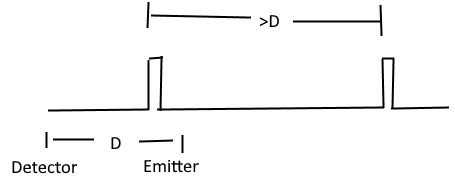

# Light Speed Experiment Proposal

Using unsynchronized clocks, an apparatus with 2 devices, called emitters, which have stable clocks, that don't drift between themselves so they always emit a pulse of light(or radio > 5Ghz) with a fixed interval.  The pulse should be short, but only needs to be off long enough to register a distinct 'on' event later.  The time between the pulses should be more than the transmission time between pulse generator and detector, given a standard speed of light.

A third device called detector, detects the pulses from the emitters, and records the time from a local clock when the leading edge of the pulse is detected, or when the pulse is first able to be detected.

This image shows the short pulse and long delay; or at least as much delay as between the detector and emitter.  (This isn't strictly a requirement, but a higher frequency isn't going to add any information either.)

## The arrangement

The detector should receive from two emitters, which are placed in opposing directions at the same distance from the detector.  The central detector records the time pulses are received from each detector against a local high precision clock.  This clock needs to be at least a few hundred picoseconds in resolution.

Arms are formed from the center detector and each emitter; the angle between the arms should be 180 degrees to catch worst case.  If one arm is  90 degrees to the other, then there will aways just be an average on one; and the maximum difference will not be found.

## Notes on clocks

Relativistic time dilation effects don't matter once the device is placed, and the clock in the central detector is used to record the time the remote clocks are seen; the clocks in the pulse generators are used to generate stable span between leading edges of the pulse they emit.  The modulation might be something like a moving mirror, or a wheel with a notch; rather than having to warm up a laser diode or some other emission source.

Gravitational time dilation might affect the clocks of the various devices depending on where they are placed.  It's more important that the pulse generators are in a similar gravitational gradient; otherwise a constant skew will be in the data also; which can be removed when analysing the signals, but would of course be best if the skew wasn't there.  The exact tick rates of the emitters versus the central detector is irrelavent; the span recorded between the pulses may be contracted or dilated vs the emitters, the interval will still be a constant against the local clock.

## Hypothesis

If the speed of light is different, by a rate of $C+V$ or $C-V$, where $C$ is what's used for the constant speed of light, and $V$ is a velocity.  In the direction of the velocity, those are the speeds that apply, laterally, it's just C.  But, the distance in this worst case direction is contracted by $\gamma=\sqrt{CC-VV}$ and the clock is contracted by the same amount.  The effective time to cross 1 unit is $\frac {\gamma^2} {C+V}$ or $\frac {\gamma^2} {C-V}$ (distance times gamma(1*$\gamma$)(m) divided by speed(m/s) = time(s) times gamma).  The lateral time is $\frac{\frac {1\cdot \gamma}{C}} {\gamma}$ or $1/C$.

### Some relavent speeds

- 370,000m/s : We are moving at 370km/s relative to the CMB in the direction of the constellation of Virgo.  
- 30,290 m/s : Earth orbits the sun so +/-10%(roughly) deviation
- 460 m/s : Earth spins this fast, so +/-0.1%(roughly) devation (1/100 orbit speed)

The most significant part is the motion towards the Virgo constellation as demonstrated by the redshift of the CMB.  

## Expected Result

Using an approximation of light travelling 1 foot per nanosecond (one Ghz tick is 1ns; so in the clock rate of CPU's, light goes about 1 foot (slightly less)). The worst case advance/delay of the speed 1.2ns per 1000ns, so in 10,000 ns (distance/C) a +/-12ns difference can be measured - one arm will be +12ns and the other -12ns for a total delta of 24ns.  This will reach a maximum when the apparatus is aligned in the direction of motion with the CMBR- and minimum separation at 90 degrees to the velocity.  So this should be placed on the ground such that virgo is seen on the horizon at some point; but this will only happen once per day, when the planet is 180 degrees around (12 hours later) the device will have a negative angle of alignment with the constellation.    Perhaps deploying something at the north or south pole at 9 degrees off the pole would be an option?

10,000ns is 10,000 ft which is about 2 miles; which is a total span of 4 files with 2 emitters and a detector.

## Alternative deployments

A satellite maybe could be built, which would be able to rotate the apparatus with 2 detectors tethered - but then I'd expect 4 miles of rope might be an issue?
