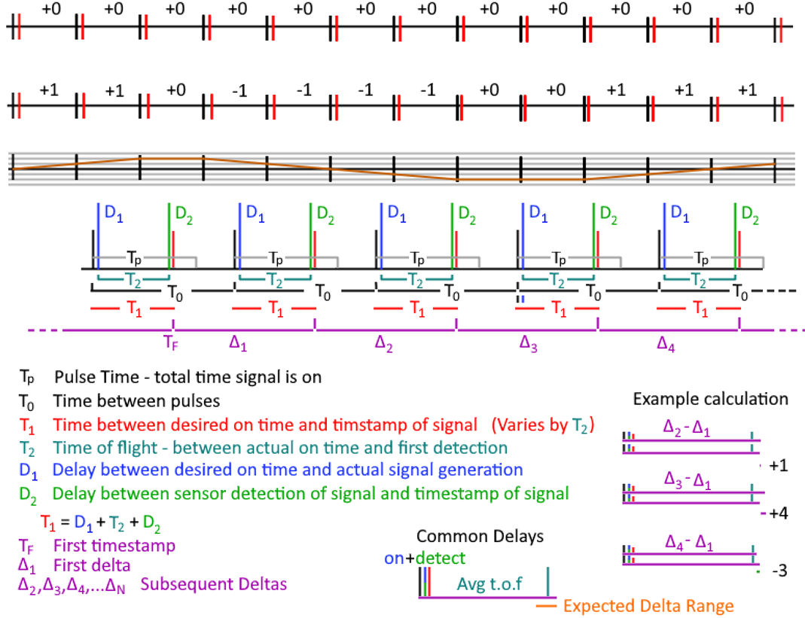
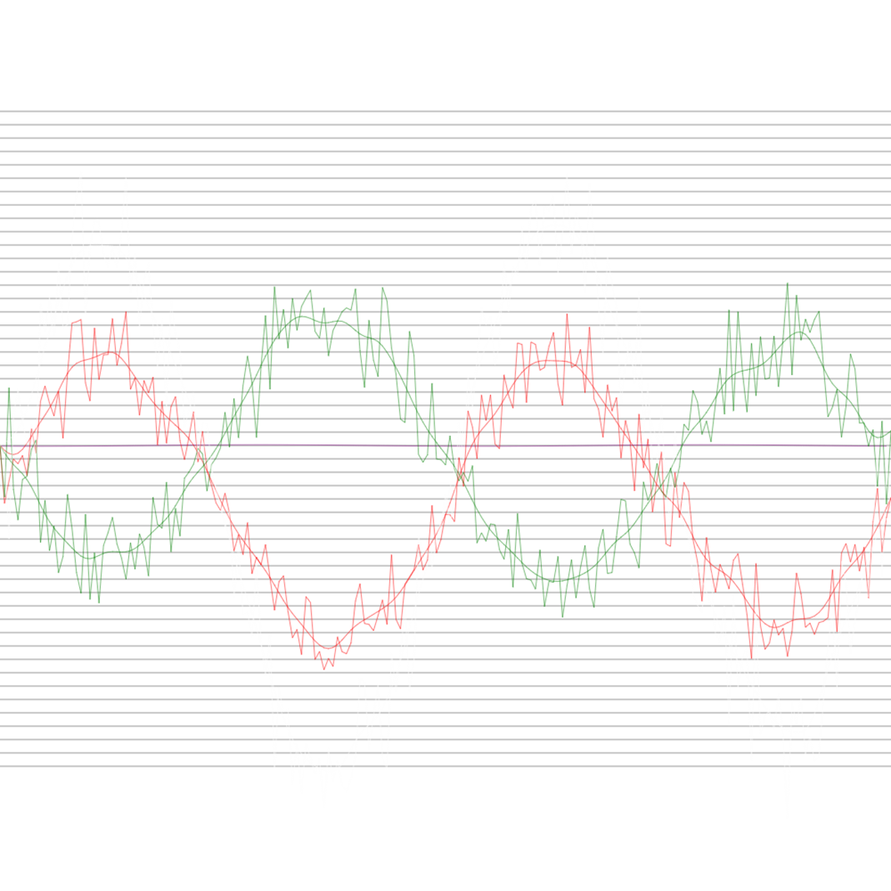

# Light Speed Experiment Proposal

This is a test for difference in 1 way speed of light, rather than strictly measuring any speed of light.

Using unsynchronized clocks, an apparatus with 2 devices, called emitters, which have stable clocks, with minimal drift between each other so they always emit a pulse of light(or radio > 5Ghz) with a fixed interval.  The pulse should be short, but only needs to be off long enough to register a distinct 'on' event later.  The time between the pulses should be more than the transmission time between pulse generator and detector, given a standard speed of light.

A third device called detector, detects the pulses from the emitters, and records the time from a local clock when the leading edge of the pulse is detected, or when the pulse is first able to be detected.

This image shows the short pulse and long delay; or at least as much delay as between the detector and emitter.  (This isn't strictly a requirement, but a higher frequency isn't going to add any information either.)

## The arrangement

The detector should receive from two emitters, which are placed in opposing directions at the same distance from the detector.  The central detector records the time pulses are received from each detector against a local high precision clock.  This clock needs to be at least a few hundred picoseconds in resolution.

Arms are formed from the center detector and each emitter; the angle between the arms should be 180 degrees to catch worst case.  If one arm is  90 degrees to the other, then there will aways just be an average on one; and the maximum difference will not be found.

## Notes on clocks

Relativistic time dilation effects don't matter once the device is placed, and the clock in the central detector is used to record the time the remote clocks are seen; the clocks in the pulse generators are used to generate stable span between leading edges of the pulse they emit.  The modulation might be something like a moving mirror, or a wheel with a notch; rather than having to warm up a laser diode or some other emission source.

Gravitational time dilation might affect the clocks of the various devices depending on where they are placed.  It's more important that the pulse generators are in a similar gravitational gradient; otherwise a constant skew will be in the data also; which can be removed when analysing the signals, but would of course be best if the skew wasn't there.  The exact tick rates of the emitters versus the central detector is irrelavent; the span recorded between the pulses may be contracted or dilated vs the emitters, the interval will still be a constant against the local clock.

## Hypothesis

If the speed of light is different, by a rate of $C+V$ or $C-V$, where $C$ is what's used for the constant speed of light, and $V$ is a velocity.  In the direction of the velocity, those are the speeds that apply, laterally, it's just C.  But, the distance in this worst case direction is contracted by $\gamma=\frac{\sqrt{CC-VV}}{C}$ and the clock is contracted by the same amount.  The effective time to cross 1 unit is $\frac {\gamma^2} {C+V}$ or $\frac {\gamma^2} {C-V}$ (distance times gamma(1*$\gamma$)(m) divided by speed(m/s) = time(s) times gamma).  The lateral time is $\frac{\frac {1\cdot \gamma}{C}} {\gamma}$ or $1/C$ (the lateral distance increases with speed; hence dividing by gamma; while the clock contraction is also still applied so there are fewer pulses emitted to cover the distance, which maintains a constant number of wavelengths).

### Some relevant speeds

- 370,000m/s : We are moving at 370km/s relative to the CMB in the direction of the constellation of Virgo.  
- 30,290 m/s : Earth orbits the sun so +/-10%(roughly) deviation
- 460 m/s : Earth spins this fast, so +/-0.1%(roughly) deviation (1/100 orbit speed)

The most significant part is the motion towards the Virgo constellation as demonstrated by the redshift of the CMB.  

## Expected Result

Using an approximation of light travelling 1 foot per nanosecond (one Ghz tick is 1ns; so in the clock rate of CPU's, light goes about 1 foot (slightly less)). The worst case advance/delay of the speed 1.2ns per 1000ns, so in 10,000 ns (distance/C) a +/-12ns difference can be measured - one arm will be +12ns and the other -12ns for a total delta of 24ns.  This will reach a maximum when the apparatus is aligned in the direction of motion with the CMBR- and minimum separation at 90 degrees to the velocity.  So this should be placed on the ground such that Virgo is seen on the horizon at some point; but this will only happen once per day, when the planet is 180 degrees around (12 hours later) the device will have a negative angle of alignment with the constellation.    Perhaps deploying something at the north or south pole at 9 degrees off the pole would be an option?

10,000ns is 10,000 ft which is about 2 miles; which is a total span of 4 files with 2 emitters and a detector.

## Data Evaluation

Events from a single detector, and the related timestamps are a stream.  The streams are mostly independent.  Starting with a pulse, subtracting the timestamp from itself biases the tick to 0.  Each stream is biased to 0 itself; this synchronizes the pulses at a specific point.  This may be a average case, or a worst case or somewhere in-between.   One stream should be slightly ahead of the 0, and have at a positive offset, this stream is delayed; the other stream should be behind 0, and have a negative offset that is the same as the positive from that point.  This offset will go toward a maximum case and then to an average case.  Given that only alignment in a very specific direction produces THE worst case, random chance will be that there will be little deviation from average and just be +/-0.  Any progressive skew that does not go away is probably from a slightly different gravitational gradient; though slight differences in north latitude will also skew the clock time, from a difference in linear rate while the earth rotates.

- $A$    : constant delay between beginning a transmission.
-  $D_1$   : delay between starting a transmission and signal starts transmitting.
-   $D_2$  : delay between receiving circuit registers signal and timestamp is recorded.
-  $T_0$   : Fixed tick rate of signal emitters
-  $T_1$   : Total time between tick and timestamp.
-  $T_2$   : Time-of-flight between laser and detector.  Hypothesis predicts this will vary depending on direction of devices.
-  $T_F$  : First timestamp.
-  $\Delta_1,\Delta_2,\Delta_3,...$   : Example deltas between recorded timestamps.

In the above figure ?, the first line demonstrates a consistent clock period and constant time of propagation; the black marks (or the left of two marks together) are the clock pulses that trigger a transmission.  When transmission is triggered, a small delay happens represented by $D_1$, which is time for the laser to turn on.  Then the time-of-flight of light happens represented by $T_2$ as the time between $D_1$ and $D_2$.  Then the laser will hit the detector, and a small delay happens represented by , and finally the time of observation by the detector is marked at $T_1$.

The delay in turning it on, and the delay for the electronics to register the signal should be constant.  The time-of-flight is predicted to change over time in small increments.  When the time-of-flight is shorter, then an offset will show up as a shorter time between subsequent pulses.  While the time-of-flight remains constant, there will be no offset between the pulses.  When the time-of-flight increases, then a longer time between two pulses will appear, but while the time-of-flight remains the same, there is no difference between subsequent pulses.

The second line in the graph shows an example of transmission timestamp delays.  The first tick is the same width as the first line.  The second tick is slightly longer, and that delta is marked as +1.  The next tick is again to be longer marked with a +1, until the time settles out and the delta between red marks remains at 1 second.  Then after a few ticks, the time-of-flight decreases, which offsets the red mark from the black mark, and gets indicated with -1 steps. 

The third line shows the sum of the delta times, which shows the total delta over time.

The receiver only needs to record the times it receives a pulse and compare the differential time between each pulse.  The very first timestamp($T_F$) marked is subtracted from all other timestamps, to bias the entire graph to 0; this step isn’t absolutely required.  The first differential time($\Delta_0$) is then subtracted from all other differential timestamps, which then shortens the delta to just how much difference there is between each red mark to the next red mark minus the off time between each mark, and the offset of the on time and reception triggering time.  Then all differentials are added together to get a total sum of differentials, and the total is divided by the number of samples minus one, and for each differential n from 1 to $N$, $(n*total/(N-1))$ is subtracted from each differential to remove any drift or cumulative error.  The first delta might be longer or shorter than expected, which will cause an overall shift to all deltas.  The test is meant to be done over 24 hours, so the speed of the first and last samples should be basically the same.  The last step to flatten the graph puts the start and end at 0.

Figure 16: This is an example graph of simulated data ([https://d3x0r.github.io/STFRPhysics/math/indexAsyncClocks.html](https://d3x0r.github.io/STFRPhysics/math/indexAsyncClocks.html)).  Both very noisy data and a smoothed function.  The horizontal grid represents nanoseconds of separation.  The send and receive time offsets are given 5 nano seconds of jitter instead of assuming they are constant.  The resulting signal is still quite legible.

Red is one simulated sensor; green is the other simulated sensor and white is the total difference between the sensors (red minus green in this case).

The algorithm for analyzing the data is to take the first time delta as a base clock step ( ).  Each step is then computed from .  This is saved in a separate array that accumulates the deltaTime for each step.  The last store total deltaTime is divided by the samples, and then scaled as a linear adjustment between the first and last sample and subtracted from the accumulated time.  This is assuming a complete run of data spans 1 day, and the measured differences in the speed of light at the start and at the end should be identical and are computed as 0.

The resulting accumulated delta can be smoothed by stepping from 1 to the number of samples -1 and calculating .  The above graph applied the smoothing 10 times to get the smoothed curve.

A smoothing of the times of the events vs the time-of-day clock recorded with the data, so comparisons can be made at the same moment.  The simulated data test filled in an array, and only compared each array entry to the other same index in the array; while the actual times recorded in each are skewed.  A simple linear interpolation is probably sufficient.
## Alternative deployments

A satellite maybe could be built, which would be able to rotate the apparatus with 2 detectors tethered - but then I'd expect 4 miles of rope might be an issue?

LISA - The interferometer satellite array could measure +/-10ms; millisecond resolution is surely notable - although it does have bent arms, so the difference between the arms is fairly minimal.

GPS satellites are synchronous clocks that emit pulses and are clocked over a distance for the speed of light.  GPS satellites orbit at an altitude of 20,200km or 12,550 miles (66,264,000 feet).  It was argued that if there was an anisotropic speed of light, then they would be off by a significant amount of time when received; they would be off by potentially approximately 81 microseconds. 
$$\frac{Altitude}{C\pm V}$$

Gravity also propagates at the speed of light.  This means that in the direction of travel of the solar system relative to the CMBR (370km/s or 0.00123 light-seconds per second) that effectively the orbit of the satellites in the direction of the velocity is 24.9km (15.5 miles or 81,624ft) further from the earth, as the gravity field has not yet extended as far, compensating for the shorter reception time as the earth moves into the emitted signal.  Conversely, the gravity field on the trailing side is extended, and makes the orbit closer, compensating for the earth moving away from the emitted signal.  This is only extreme in a specific alignment.

It’s not that the space of that whole system is contracted; space does not contract with velocity, only the matter in the space.

This then goes to what about the laser ranging satellites.  They rely on a two-way communication, and if there was such an elevation difference, that would show up in their measurements, and the model they build would be offset.  Satellite programs that map the elevation of Earth have low orbit, and the difference would only be a couple hundred meters, which is larger than the difference of their perigee-apogee.

·        ICESat-2 orbits @ 479-482km.

·        Cryosat-2 @ 718-732km

·        ADM-Aeolus @ 320km

·        [TanDEM-X](https://en.wikipedia.org/wiki/TanDEM-X "TanDEM-X") & TerraSAR-X @  514-516km