d3x0r
Independent Research

Fernandina Beach, FL 32034; United States  
Email: <d3ck0r@gmail.com>  
ORCID iD: 0009-0004-2865-6447

# Abstract

 This paper presents equations for the propagation of a constant
 one-way speed of light. Challenges to the Theory of Special Relativity
 are made. Space has through time been thought to be a medium which has properties, until Einstein, and Special Relativity. Space is thought
 to not exist as a medium because interferometer tests do not show any
 drag. This paper will show that, given the proper math, that a null
 result from interferometer experiments should have been expected even
 at the time, and that space as a medium can still exist.

# Introduction

Starting from the ground up to derive the math of Special Relativity, by
developing the math for the propagation of light at a constant speed in
a stationary medium, or alternatively that there were at least three
observers, who all agree that the speed of light was constant in any
direction, they may have to consider their own velocity relative to the
point the light was emitted from, and any effects their velocity may
have on their own clock. The resulting equations challenge aspects of
the Principle of Equivalence employed by Einstein. The math also results
in a system that expects a null result from any interferometer
experiments such as Michelson-Morley, or interferometer implementations
such as The Laser Interferometer Gravitational-Wave Observatory (LIGO).

A frame is a set of orthogonal axes which measure distances between
locations within the frame, the orientation of the frame, and a time.
When a velocity is applied, the frame moves in the direction and speed
of the velocity. There are a minimum of 3 frames; the global frame
itself has no velocity, and is always in the same location, both the
observer and observed have their own frames. The global frame has an
origin defined at a location defined as appropriate for the situation
being evaluated. In this paper all frames share the same origin
*X⃗* = {0,0,0} and orientation *Q⃗* = {0, 0, 0} at T=0. The global frame
is the frame light propagates in; given the constant clarity we observe
in galaxies out to the edge of the universe, it can be assumed that the
space this global frame represents does not have significant currents or
motions, and represents space. There are minor oscillations in the
density and curvatures in this space, but it’s not like looking through
hot air currents.

Light is given a constant propagation speed of *C* in global frame.

Bodies move at some speed and direction or combining speed and direction
into a single term, at a velocity. This medium is called space. Space
has no velocity or orientation, and the clock in the frame of space
ticks at constant rate. The clock in this frame is called the global
clock. A frame which moves within the space frame, or global frame, is
called a local frame. A local frame has a local clock, which may tick at
a different rate than the global clock.

The specific density of space (the average distance between two points)
in a frame may differ at various locations. This paper does not
implement varied density, and only considers frames that have entirely
homogeneous coordinates. It should not be entirely discounted given
gravitational wave detection that space can move at least slightly.

A body can only be observed if it has emitted or re-emitted a photon. A
photon on an observed body will come from position on the observed body.
The photon, once emitted, travels in the global frame, independent of
the body it was emitted from. An observer has a body itself and will
observe the photon from the observed body at some position in the frame
of the observer a later time after the body emitted a photon.

Once the basic math of propagation of light at a constant speed in
space, with an observed frame and an observer’s frame was developed,
other aspects detailed by Special Relativity were considered, since they
were not immediately obvious from the propagation. Those aspects being
length contraction, and time dilation. Time dilation would be better
called time contraction, since less time passes on a clock, much like
length contraction there’s less distance than a real distance. The
details of [length contraction](#_Length_Contraction) and [time
contraction](#_Time_Contraction) will be discussed later.

Light aberration was the last missing factor from the system. Light
aberration is an effect that for a moving body, the angle light is seen
is advanced in the direction of the velocity of the viewer. While light
propagation usually results in a time-lagged view of an observed body,
light aberration advances the angle, which counteracts the effects of a
delayed propagation. Light aberration then makes two bodies that are
relatively stationary, at the same speed that are side-by-side still
appear side-by-side, even though the photons seen by an observer would
normally appear to be lagged to the observer.

Evaluating the resulting math with an [interferometer
demonstration](#InterferometerDemo), then led to the development of the
expression for doppler effect, or the shift of frequency of photons
emitted from a body at a velocity, or as seen from another body with
another velocity. The doppler effect equation is quite dissimilar from
Einstein’s equation. There are predicted red/blue shifts with Transverse
Doppler Effect with Einstein’s equations, while these would show no
frequency change in the transverse direction.

## Conventions

Variables are upper case unless they come from an external reference.
This makes variables mentioned in the text stand out.

-   Equations with numbers that have been stricken are invalid, for
    example: (999). They are provided for consideration only.

-   Velocity is a vector $\vec{V}$.

-   Speed refers to the magnitude of the velocity (  ||$\vec{V}$|| ).

-   Direction refers to the unit vector of velocity ($\frac{\vec{V}}{||\vec{V}||}$).

-   Position is a vector of the same order as velocity, $\vec{V}$ is an
    example.

-   $\vec{X}$ × $\vec{Y}$ denotes a cross product.

-   *X⃗* ⋅ *Y⃗* denotes a dot product. This may also be written as *X⃗**Y⃗*.

-   *X⃗*2 is the same as *X⃗* ⋅ *X⃗*.

-   ||*X⃗*|| is the same as $\sqrt{{\vec{X}}^{2}}$

-   X ⋅ Y denotes a multiplication of two simple numbers; may also be
    written as XY.

*C* is the constant speed of propagation defined in light-seconds per
second as used in this paper. It may also be used as a distance, in
which case *C**L* light-seconds and has the same value as
*C*, but with units of length instead of speed. For example, *C* could
be in meters per second (300,000,000 approximately), and then
*C**L* meters would be 300,000,000. The value is always
actually identical to *C* other than the units:
$\frac{C}{C_{L}} = \\1s^{- 1}$ or $\frac{C_{L}}{C}\\ = \\1s$.

The phrase 'emits an event' is 'emits a photon that will be seen'
describes the creation of a signal that propagates through space. A body
that emits an event, emits a signal. It is the signal that propagates
through space. Reception of a signal is also observation of an event.

## Rotation

Rotations are 3D vectors *Q⃗* is an example; they are effectively the log
of a quaternion. This is used for [light
aberration](#d-aberration-with-rotation).

-   The angular rate is the magnitude of a rotation vector ( ||*Q⃗*|| ).

-   The axis of rotation is the unit vector of a rotation(
    $\frac{\\\vec{Q}}{\\||\vec{Q}||}$).

-   An applied rotation will be represented like a function Q(X) that
    results in X rotated around Q.

-   Given a rotation vector *Q⃗*, the angular rate is *θ* = ∥*Q⃗*∥ and
    axis $\vec{A} = \frac{\vec{Q}}{\theta}$ used
    in the following
    equation:$\vec{X'}\\ = \\cos(\theta)\vec{X}\\ + \\sin(\theta)\\(\vec{A} \times \vec{X}) + (1 - \\cos(\theta)) \cdot (\vec{A} \cdot \vec{X})\vec{A}$

## The Equivalence Principle

The equivalence principle is an idea which is used for thought
experiments to equate one situation to another similar situation. The
principle only applies within certain limits, or under certain
conditions.

Two bodies that are moving at the same velocity to each other are
relatively stationary, that is not equivalent to being stationary.
Through the development of this it is shown that an observer moving at
any velocity with an observed body will see the body exactly the same as
if they were actually stationary ( see [3D Demo](#VoxelariumDemo) ).
However, let us consider a more classical example, instead of locking
the observer in a room with no access to the outside, they are freely
able to go to the deck of a ship and observe things. On a boat that is
stationary, let’s say it bobs up and down, and therefore emits waves in
concentric circles around it. When it starts to move, a wake is formed,
and the concentric circles from its bobbing motion are no longer
concentric but are offset. If there were two boats stationary, and one
takes off at some speed, it is illogical to say 'no, I'm not moving,
it's the other boat moving, and it has a wake in front of it'. You can
clearly see that your boat is making a wake, and that the other is still
emitting concentric circles of waves. This is also true of light
traveling at a one-way constant speed in space, that all observers can
agree it is traveling at. A stationary body is one that is still near
where it has previously emitted photons, while a moving body is one that
has changed position from where it has previously emitted photons. This
doesn't remove the idea of a frame being relatively stationary with
another frame, or having a relative velocity to another, but it does
have consequences which will be discussed later. The equivalence
principle will not be used, and further issues will be discussed later.

## Consistency of Physics

There is a postulate of Special Relativity that no experiment to an
isolated experimenter can determine the ambient velocity of the frame.
This idea isolates an experimenter in a box with no ability to take note
of information outside of the box. For example, an experimenter in the
hold of a sea going ship, without senses to the outside world. For an
observer that can look out a window, the aberration of stars and
galaxies will give an idea of direction and speed of motion at
relativistic speeds.

Quoted from Wikipedia: “The [laws of
physics](https://en.wikipedia.org/wiki/Laws_of_physics) are [invariant](https://en.wikipedia.org/wiki/Invariant_(physics)) (identical)
in all [inertial frames of
reference](https://en.wikipedia.org/wiki/Inertial_frame_of_reference) (that
is, [frames of
reference](https://en.wikipedia.org/wiki/Frame_of_reference) with
no [acceleration](https://en.wikipedia.org/wiki/Acceleration)).“

This is essentially true, but like General Relativity modified Newton’s
Gravity, there are certain physics laws that need additional correction
factors.

## Relative Light Speed

Once a photon is emitted, then it is in space and is no longer related
to the body that emitted it. The photon travels at its own constant
speed through space. This means that a photon emitted from the front of
a moving body towards the back, where front and back are determined by
the velocity of the body; the back is moving towards the photon moving
at C with a speed of V, and the light effectively travels at C+V.
Conversely, a photon emitted from the back, and moving towards the front
is moving at C, and the front is moving away from the photon at V, which
gives an effective velocity of C-V; that the photon is never relatively
at the speed of light, unless the body is stationary.

## One Way Constant Speed of Light(C)

Given a propagation speed of C, in a stationary, frictionless, massless
medium, bodies move at various speeds in various directions, or combined
into a single term at a certain velocity. This medium is called space.
Space has no velocity, so there is nothing like length contraction or
time contraction (this is a term that will be defined later) that
applies, the clock in the frame of space ticks at the fastest and
constant rate. This clock may also be called the global clock as opposed
to a local clock on a moving body, or in a local frame.

# Light Propagation

Light propagation at a constant speed is the core of this system. It
involves at least two points, one that emits an event at a time, and one
that later observes that event.

A point observed on a body that emits an event is represented by
$\vec{X_{E}} + T_{E}\vec{V_{E}}$ where
$\vec{X_{E}}$ is the position on the body that emitted a
signal, $\vec{V_{E}}$ is the velocity of the body,
$T_E$ is a time in the frame of space (it is an
un-contracted time).

The point representing an observer is
$\vec{X_{O}} + T_{O}\vec{V_{O}}$ where
$\vec{X_{O}}$ is the observer’s position in the observing
frame, $\vec{V_{O}}$ is the velocity of the observer's
frame, and $T_O$ is a time in the frame of space which the
observer sees the event.

The time of observation may be decomposed into the base time of emission
plus time delta to observation:
$T_O$ = $T_E$ + *T**Δ**O*. In
practice, computing the delta time just adds an additional step of
adding the delta to the base time.

Propagation time is computed by taking the observer’s point and
subtracting the observed point, to find the shortest directed distance
from the observer to the emitter; this essentially treats emission as a
perfect circle from the point of emission until observation. The
distance calculated is then divided by *C*, which results in the time it
takes of the observer to see the emitted event.

The time for the observer to see an emitted event is:
$window.MathJax = {  tex: {tags: 'ams'}};$

$$\begin{equation}\begin{array}{r}
T_{O} = \frac{\left\| \left( \vec{X_{E}} + T_{E}\vec{V_{E}} \right) - \left( \vec{X_{O}} + T_{O}\vec{V_{O}} \right) \right\|}{C} + T_{E} 
\end{array}\end{equation}$$

The delta time for the observer to see the emitted event is:

$$\begin{array}{r}
T_{O} = T_{E} + T_{\Delta O}
\end{array}$$

$$\begin{array}{r}
T_{E} = T_{O} - T_{\Delta E}\\
\end{array}$$

Replace $T_O$ terms in equation \[1\] with equation \[2\]:

$$\begin{array}{r}
T_{E} + T_{\Delta O} = \frac{\left\| \left( \vec{X_{E}} + T_{E}\vec{V_{E}} \right) - \left( \vec{X_{O}} + \left( T_{E} + T_{\Delta O} \right)\vec{V_{O}} \right) \right\|}{C} + T_{E}\\
\end{array}$$

Resulting with *T**Δ**O* equation, which is the delta from
emission to observation:

$$\begin{array}{r}
T_{\Delta O} = \frac{\left\| \left( \vec{X_{E}} + T_{E}\vec{V_{E}} \right) - \left( \vec{X_{O}} + \left( T_{E} + T_{\Delta O} \right)\vec{V_{O}} \right) \right\|}{C}\\
\end{array}$$

Can also replace $T_E$ terms in equation \[1\] with equation
\[3\]:

$$\begin{array}{r}
T_{O} = \frac{\left\| \left( \vec{X_{E}} + \left( T_{O} - T_{\Delta E} \right)\vec{V_{E}} \right) - \left( \vec{X_{O}} + T_{O}\vec{V_{O}} \right) \right\|}{C} + (T_{O} - T_{\Delta E})\\(1.6)
\end{array}$$

Resulting with *T**Δ**E* equation, which is the delta from
observation to emission:

$$\begin{array}{r}
T_{\Delta E} = \frac{\left\| \left( \vec{X_{E}} + \left( T_{O} - T_{\Delta E} \right)\vec{V_{E}} \right) - \left( \vec{X_{O}} + T_{O}\vec{V_{O}} \right) \right\|}{C}\\(1.7)
\end{array}$$

## Solution for $T_E$ from $T_O$

This solution is used to find where an event was emitted that an
observer sees at some point. It is the most used solution in the
demonstration programs.

Equation (1) solved for $T_E$ (step-by-step solution in
[Appendix A](#appendix-a-t-solve)), define partial expression
$\vec{P_{O}}$, which is roughly base the position of the
emitted event to the observer. $\vec{P_{O}}$ makes the
solution somewhat shorter.

$$\begin{array}{r}
\vec{P_{O}} = \vec{X_{E}} - \left( \vec{X_{O}} + T_{O}\vec{V_{O}} \right)\\(1.8)
\end{array}$$

This results with time of emission from a time of observation:

$$\begin{array}{r}
\boxed{T_{E} = \frac{\sqrt{\left( C^{2}T_{O} + \vec{V_{E}}\vec{P_{O}} \right)^{2} - \left( C^{2} - \vec{V_{E}}\vec{V_{E}} \right)\left( C^{2}{T_{O}}^{2} - \vec{P_{O}}\vec{P_{O}} \right)} + C^{2}T_{O} + \vec{V_{E}}\vec{\vec{P_{O}}}}{C^{2} - \vec{V_{E}}\vec{V_{E}}}}\\(1.9)
\end{array}$$

Alternative expressions for above solution for T, equation (4) using
partial expressions...

$$\begin{array}{r}
A_{E} = C^{2}T_{O}^{2} - \vec{P_{O}}\vec{P_{O}}\\(1.10)
\end{array}$$

$$\begin{array}{r}
B_{E} = C^{2}T_{O} + \vec{V_{E}}\vec{P_{O}}\\(1.11)
\end{array}$$

$$\begin{array}{r}
D_{E} = C^{2} - \vec{V_{E}}\vec{V_{E}}\\(1.12)
\end{array}$$

$$\begin{array}{r}
T_{E} = \frac{\sqrt{{B_{E}}^{2} - D_{E}A_{E}} + B_{E}}{D_{E}}\\(1.13)
\end{array}$$

The position the event was emitted is then:

$$\begin{array}{r}
\vec{X_{P}} = \vec{X_{E}} + T_{E}\vec{V_{E}}\\(1.14)
\end{array}$$

$$\begin{array}{r}
\vec{X_{P}} = \vec{X_{E}} + \frac{\sqrt{{B_{E}}^{2} - D_{E}A_{E}} + B_{E}}{D_{E}}\vec{V_{E}}\\(1.15)
\end{array}$$

If the observer has a velocity, the resulting point should also have
light aberration applied, and if the time on the observer’s local clock
is shown, then $T_O$ should also have time contraction
applied, but then maybe the delay to the position of the clock might
also have to be calculated. An observer’s clock that is 1 light-second
away from the observer may be lagged by a second.

## Solution for $T_O$ from $T_E$

This is the solution that computes the time of observation from a time
of emission. The stepwise solution for $T_O$ is in [Appendix
B](#appendix-b-mathbft_mathbfomathbf-solve):

This is roughly the position of the emitted event:

$$\begin{array}{r}
\vec{P_{E}} = \left( \vec{X_{E}} + \vec{V_{E}}T_{E} \right) - \vec{X_{O}}\\(1.16)
\end{array}$$

$$\begin{array}{r}
\boxed{T_{O} = \frac{\sqrt{\left( C^{2}T + \vec{P_{E}}\vec{V_{O}} \right)^{2} - \left( C^{2} - {\vec{V_{O}}}^{2} \right)\left( C^{2}T^{2} - \vec{P_{E}}\vec{P_{E}} \right)} + \left( C^{2}T + \vec{P_{E}}\vec{V_{O}} \right)}{C^{2} - \vec{V_{O}}\vec{V_{O}}}}\\(1.17)
\end{array}$$

Simplify with partial expressions:

$$\begin{array}{r}
A_{O} = C^{2}T^{2} - \vec{P_{E}}\vec{P_{E}}\\(1.18)
\end{array}$$

$$\begin{array}{r}
B_{O} = C^{2}T + \vec{V_{O}}\vec{P_{E}}\\(1.19)
\end{array}$$

$$\begin{array}{r}
D_{O} = C^{2} - \vec{V_{O}}\vec{V_{O}}\\(1.20)
\end{array}$$

$$\begin{array}{r}
T_{O} = \frac{\sqrt{{B_{O}}^{2} - D_{O}A_{O}} + B_{O}}{D_{O}}\\(1.21)
\end{array}$$

The result is of the same format as equation \[8\], but the calculation
is from T when an event is emitted and results with the time the event
is observed. $\vec{X_{S}}$ is the position of an observer
that sees the event.

$$\begin{array}{r}
\vec{X_{S}} = \vec{X_{O}} + T_{O}\vec{V_{O}}\\(1.22)
\end{array}$$

$$\begin{array}{r}
\vec{X_{S}} = \vec{X_{O}} + \frac{\sqrt{{B_{O}}^{2} + D_{O}A_{O}} + B_{O}}{D_{O}}\vec{V_{O}}\\(1.23)
\end{array}$$

## Solution for $T_{\Delta O}$ from time of emission

For completeness, can calculate just the delta time after an event is
emitted until the event is observed.

$$\begin{array}{r}
T_{\Delta O} = \frac{\left\| \left( \vec{X_{E}} + T_{E}\vec{V_{E}} \right) - \left( \vec{X_{O}} + \left( T_{E} + T_{\Delta O} \right)\vec{V_{O}} \right) \right\|}{C}\\(1.5)
\end{array}$$

Solution for equation \[5\] given a time of emission ([Appendix
C](#appendix-c-mathbfdeltat-solve)):

$$\begin{array}{r}
\vec{P_{\mathrm{\Delta}}} = \vec{X_{E}} + \vec{V_{E}}T_{E} - \left( \vec{X_{O}} + T_{E}\vec{V_{O}} \right)\\(1.19)
\end{array}$$

$$\begin{array}{r}
T_{\Delta O} = \frac{\sqrt{\vec{P_{\mathrm{\Delta}}}\vec{P_{\mathrm{\Delta}}}\left( D_{E} + \vec{V_{O}}\vec{V_{O}} \right)} - \vec{P_{\mathrm{\Delta}}}\vec{V_{O}}}{D_{E}}\\(1.20)
\end{array}$$

Broken into partial expressions:

$$\begin{array}{r}
A_{\Delta O} = - \vec{P_{\mathrm{\Delta}}}\vec{P_{\mathrm{\Delta}}}\\(1.21)
\end{array}$$

$$\begin{array}{r}
B_{\Delta O} = \vec{P_{\Delta}}\vec{V_{O}}\\(1.22)
\end{array}$$

$$\begin{array}{r}
D_{\Delta O} = C^{2} - {\vec{V_{O}}}^{2}\\(1.23)
\end{array}$$

$$\begin{array}{r}
T_{\Delta O} = \frac{\sqrt{{B_{\Delta O}}^{2} - D_{\Delta O}A_{\Delta O}} + B_{\Delta O}}{D_{\Delta O}}\\(1.24)
\end{array}$$

The position an event is seen:

$$\begin{array}{r}
\vec{X_{S}} = \vec{X_{O}} + \left( T_{E} + T_{\Delta O} \right)\vec{V_{O}}\\(1.25)
\end{array}$$

$$\begin{array}{r}
\vec{X_{S}} = \vec{X_{O}} + \left( T_{E} + \frac{\sqrt{{B_{\Delta O}}^{2} - D_{\Delta O}A_{\Delta O}} + B_{\Delta O}}{D_{\Delta O}} \right)\vec{V_{O}}\\(1.26)
\end{array}$$

## Solution for $T_{\Delta E}$ from time of observation

Calculation for the delta time before an event is observed that an event
was emitted.

$$\begin{array}{r}
T_{\Delta E} = \frac{\left\| \left( \vec{X_{E}} + \left( T_{O} - T_{\Delta E} \right)\vec{V_{E}} \right) - \left( \vec{X_{O}} + T_{O}\vec{V_{O}} \right) \right\|}{C}\\(1.7)
\end{array}$$

$$\begin{array}{r}
\vec{P_{\Delta O}} = \vec{X_{E}} + T_{O}\vec{V_{E}} - \vec{X_{O}} - T_{O}\vec{V_{O}}\\(1.28)
\end{array}$$

$$\begin{array}{r}
\boxed{T_{\Delta E} = \frac{\sqrt{D_{\Delta O}\vec{P_{\Delta O}}\vec{P_{\Delta O}} + {\vec{P_{\Delta O}}}^{2}{\vec{V_{E}}}^{2}} + \vec{P_{\Delta O}}\vec{V_{E}}}{D_{\Delta O}}}\\(1.29)
\end{array}$$

Broken into partial expressions:

$$\begin{array}{r}
A_{\Delta E} = - \vec{P_{\Delta O}}\vec{P_{\Delta O}}\\(1.30)
\end{array}$$

$$\begin{array}{r}
B_{\Delta E} = \vec{P_{\Delta O}}\vec{V_{O}}\\(1.31)
\end{array}$$

$$\begin{array}{r}
D_{\Delta E} = C^{2} - {\vec{V_{E}}}^{2}\\(1.32)
\end{array}$$

$$\begin{array}{r}
T_{\Delta E} = \frac{\sqrt{{B_{\Delta E}}^{2} - D_{\Delta E}A_{\Delta E}} + B_{\Delta E}}{D_{\Delta E}}\\(1.33)
\end{array}$$

Event seen position, change in emitter position:

$$\begin{array}{r}
\vec{X_{P}} = \vec{X_{E}} + \left( T_{O} - T_{\Delta E} \right)\vec{V_{E}}\\(1.34)
\end{array}$$

$$\begin{array}{r}
\vec{X_{P}} = \vec{X_{E}} + \left( T_{O} - \frac{\sqrt{{B_{\Delta E}}^{2} - D_{\Delta E}A_{\Delta E}} + B_{\Delta E}}{D_{\Delta E}} \right)\vec{V_{E}}\\(1.35)
\end{array}$$

## Special Case for V=C

The above equations are the propagation delay between any two points on
two moving bodies each with their own independent velocities. The above
solutions are only valid for *V* &lt; *C*, or *V* &gt; *C*; if
*V* &gt; *C*, then the negative of the square root should also be
considered as a solution; this will show the craft going backwards
towards where it came from, as the signals it had emitted when it was
there will finally reach the viewer. If *V* = *C*, the following special
case formula can used.

This solution also only works if
$\vec{X_{E}} \neq \vec{X_{O}}$; and then only
when $T_O$ &gt; *T*, the observer can’t see an event before
it is emitted. If the position an event is emitted is the same as the
observer, then it can be assumed there is 0 time to observe the event.

Instead of the first equation:

$$\begin{array}{r}
T_{O} = T + \frac{\left\| \left( \vec{X_{E}} + T\vec{V_{E}} \right) - \left( \vec{X_{O}} + T_{O}\vec{V_{O}} \right) \right\|}{C}\\(1.1)
\end{array}$$

Replace C with ||Ve||, and solve as normal ([Appendix
D](#appendix-d-vc)):

$$\begin{array}{r}
T_{O} = T_{E} + \frac{\left\| \left( \vec{X_{E}} + T_{E}\vec{V_{E}} \right) - \left( \vec{X_{O}} + T_{O}\vec{V_{O}} \right) \right\|}{\left\| \vec{V_{E}} \right\|}\\(1.36)
\end{array}$$

Solved for $T_E$:

$$\begin{array}{r}
T_{E} = \frac{C^{2}{T_{O}}^{2} - \left( \vec{X_{E}} - \vec{X_{O}} - \vec{V_{O}}T_{O} \right)^{2}}{2\cdot\left( T_{O}C^{2} + \left( \vec{X_{E}} - \vec{X_{O}} - \vec{V_{O}}T_{O} \right) \cdot \vec{V_{E}} \right)}\\(1.37)
\end{array}$$

Simplified with partial expression:

$$\begin{array}{r}
\vec{P_{O}} = \vec{X_{E}} - \left( \vec{X_{O}} + T_{O}\vec{V_{O}} \right)\\(1.8)
\end{array}$$

$$\begin{array}{r}
A_{E} = C^{2}T_{O}^{2} - \vec{P_{O}}\vec{P_{O}}\\(1.10)
\end{array}$$

$$\begin{array}{r}
B_{E} = C^{2}T_{O} + \vec{V_{E}}\vec{P_{O}}\\(1.11)
\end{array}$$

$$\begin{array}{r}
T_{E} = \frac{A_{E}}{2B_{E}}\\(1.38)
\end{array}$$

# Length Contraction

There is a phenomenon called Length Contraction, where the length of a
body moving with a velocity is contracted in the direction of the
velocity. The length of the body is physically contracted. It is
impossible to measure length contraction of a frame because any ruler in
the frame is likewise contracted, and even if LIDAR is used – the
propagation time to a target and back in any direction takes the same
time. The contraction comes from the fact that propagation of
electromagnetic forces happens at the same speed as the propagation of
light; therefore, even the electron clouds of atoms are contracted so
the electrons orbit the same speed in any direction. The worst-case
travel time of forward-backward gets scaled to the best-case lateral
travel time; that is the time a photon travels perpendicular to the
velocity, that scalar is then applied to the length in the direction of
the velocity vector.

In the following equations, $\vec{V}$ is the velocity of a moving body, to
determine contraction in the specified direction:

$$\begin{array}{r}
{T_{W}} = \frac{1}{{2}}\left( \frac{C_{{L}}}{C + \left\| \vec{{V}} \right\|} + \frac{C_{{L}}}{C - \left\| \vec{{V}} \right\|} \right)\\(2.1)
\end{array}$$

$$\begin{array}{r}
{T}_{{W}} = \frac{1}{{2}}\left( \frac{{\left( C - \left\| \vec{{V}} \right\| \right)C}_{{L}}}{\left( C - \left\| \vec{{V}} \right\| \right)\left( C + \left\| \vec{{V}} \right\| \right)} + \frac{\left( C + \left\| \vec{{V}} \right\| \right)C_{{L}}}{\left( C + \left\| \vec{{V}} \right\| \right)\left( C - \left\| \vec{{V}} \right\| \right)} \right)\\(2.2)
\end{array}$$

$$\begin{array}{r}
{T}_{{W}} = \frac{1}{{2}}\left( \frac{2CC_{L}}{C^{{2}} - \vec{{V}}\vec{{V}}} \right)\\(2.3)
\end{array}$$

$$\begin{array}{r}
{T}_{{W}} = \frac{CC_{L}}{C^{{2}} - \vec{{V}}\vec{{V}}}\\(2.4)
\end{array}$$

The best-case time is:

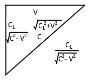  
Figure 1: Graph relating *C**L* for distance related to
velocity and *C* for velocity related to velocity. Used to show the
geometric relation used for calculation *T**B*.

$$\begin{array}{r}
T_{B} = \frac{C_{L}}{\sqrt{C^{2} - \vec{{V}}\vec{{V}}}}\\(2.5)
\end{array}$$

$$\begin{array}{r}
\frac{T_{B}}{T_{W}} = \frac{\frac{C_{L}}{\sqrt{{C_{L}}^{2} - \vec{{V}}\vec{{V}}}}}{\frac{CC_{L}}{C^{{2}} - \vec{{V}}\vec{{V}}}} = \frac{C_{L}}{\sqrt{C^{2} - \vec{{V}}\vec{{V}}}}\frac{C^{{2}} - \vec{{V}}\vec{{V}}}{CC_{L}}\\(2.6)
\end{array}$$

$$\begin{array}{r}
\boxed{\Gamma = \frac{T_{B}}{T_{W}} = \frac{\sqrt{C^{2} - \vec{V}\vec{V}}}{C}}\\(2.7)
\end{array}$$

## **Vector Expression to Apply Length Contraction**

Compute the vector that is the position projected on the velocity
vector. This vector is in the same direction as the velocity, scaled by
the length of X projected on V.

$$\begin{array}{r}
\vec{A} = \frac{\vec{V}\left( \vec{X} \cdot \vec{V} \right)}{{\vec{V}}^{2}}\\(2.8)
\end{array}$$

Subtract the projected position vector, and then add the projection
length contracted:

$$\begin{array}{r}
\vec{X^{'}} = \vec{X} - \vec{A} + \vec{A}\frac{\sqrt{CC - VV}}{C}\\(2.9)
\end{array}$$

Refactor of the previous equation – subtract the amount of the projected
vector that has been contracted out.

$$\begin{array}{r}
\vec{X^{'}} = \vec{X} - \vec{A}\left( 1 - \frac{\sqrt{CC - VV}}{C} \right)\\(2.10)
\end{array}$$

# Light Aberration

"The discovery of the aberration of light in 1725 by James Bradle"(ref
1).

Light aberration is an effect that is seen as advancing the angle of a
received photon in a moving frame. It also applies for photons that are
emitted.

I used the existing math for light aberration as derived by Einstein
from Wikipedia 'Relativistic Aberration' \[[ref
2](#RelativsiticAberration)\]:

$$\begin{array}{r}
\cos\theta_{o} = \frac{\cos\theta_{s}\\ - \\\frac{V}{C}}{1 - \\\frac{V}{C}\\\cos\theta_{s}}\\(3.1)
\end{array}$$

Where *θ**o* is the observed angle for a frame moving at
speed *V*. I extended the math slightly to include the direction part of
the velocity:

$$\begin{array}{r}
\vec{dX} = \left( \vec{X_{E}} - \vec{X_{O}} \right)\\(3.2)
\end{array}$$

Equation 20 is the cosine of the angle a body is observed:

$$\begin{array}{r}
\cos{\theta_{s} =}J = \frac{\vec{dX} \cdot \vec{V_{O}}}{\left| \left| \vec{dX} \right| \right| \cdot \left| \left| \vec{V_{O}} \right| \right|}\\(3.4)
\end{array}$$

$$\begin{array}{r}
\Delta A = \cos^{- 1}\frac{\\J\\ + \\\\\frac{V_{o}}{C}}{1 + J\frac{V_{o}}{C}} - \cos^{- 1}J\\(3.5)
\end{array}$$

*Δ**A*, the result of equation 21, is the change in the angle observed.
This, again, applies for both transmission and reception. If this did
not apply to transmission, then a light beam emitted at 90 degrees
across a rocket of sufficient size, the light would drift down the wall
by an amount relative to the speed of the rocket, and an interferometer
would have a non-null result.

The above formula generally works for the 3D case, but because arccos
aka  cos−1 only returns 0 to *π*, a correction needs to be
applied based on the input angle.

(*A*×*D*&lt;0?−1:1) Given an input of *D* which is the direction the
body is travelling (where 0 is towards positive infinity on the X axis),
and *A* which is the angle the observer is travelling, the delta angle
is *d**A* = *D* − *A*. The multipart equation *N* computes a multiplier
based on the angle; every *π* units the sign of the result flips; this
is the absolute value of the floor of dA divided by *π*, mod 2, then if
the result is 0 the value is 1, otherwise the value is -1:

$$\begin{array}{r}
dA = D - A\\(3.6)
\end{array}$$

$$\begin{array}{r}
N = \left\{ x = \left| \left\lfloor \frac{dA}{\pi} \right\rfloor \right|mod\\2\\\begin{aligned}
1,\\\\ & x = 0 \\
 - 1,\\\\ & x = 1
\end{aligned} \right.\\\\(3.7)
\end{array}$$

And the aberrated angle for a body moving at *V* is:

$$\begin{array}{r}
a = N\cdot\cos^{- 1}\frac{\cos{dA} + \frac{V}{C}}{1 + \frac{V}{C}\cos{dA}} + D\\(3.8)
\end{array}$$

The inverse calculation to determine the angle that resulted in an
aberrated angle of *d**A* is:

$$\begin{array}{r}
b = N\cdot\cos^{- 1}\frac{V - C\cos{dA}}{V\cos{dA} - C} + D\\(3.9)
\end{array}$$

Light aberration is one clue that a moving body has to determine that
they are actually the ones moving, although the parallax of the stars
shifts too, distant galaxies are still going to be distant enough that
their aberrated position can be compared to a base stellar map.

## 3D Aberration with Rotation

The partial expressions required for producing the angle of aberration
can also be used to perform a rotation on a 3D vector. In the 3D case,
the potential error from arccos only resulting with a value from 0 to pi
are fixed by having the full cross product which is rotated around. Even
in the case of the plane that is entirely edge-on to the observer, the
cross-product Z axis is positive or negative whether the angle is on the
left or right side, so the above N term does not have to be computed.
The cross-product also gives the axis of rotation for the aberration.

Calculate delta position:

$\begin{array}{r}
\vec{\Delta X_{d}} = \vec{X} - \vec{X_{O}}\\(3.10)
\end{array}$

Compute cross product of position and observer's velocity:

$\begin{array}{r}
\vec{V_{c}} = \vec{\Delta X_{d}} \times \vec{V_{O}}\\(3.11)
\end{array}$

Normalize the cross product (axis of rotation):

$$\begin{array}{r}
V_{cn} = \frac{\vec{V_{c}}}{\left\| \vec{V_{c}} \right\|}\\(3.12)
\end{array}$$

Calculate dot product of position and normalized observer's velocity:

$$\begin{array}{r}
\vec{V_{d}} = \vec{\Delta X_{d}} \cdot \vec{V_{O}}\\(3.13)
\end{array}$$

Normalize the dot product (cosine of angle between delta position and
velocity)

$$\begin{array}{r}
\vec{V_{dn}} = \frac{\vec{V_{d}}}{\left\| \vec{V_{d}} \right\|}\\(3.14)
\end{array}$$

Compute angle of aberration:

$$\begin{array}{r}
\theta = cos^{- 1}\frac{V_{dn} + \frac{\left\| V_{O} \right\|}{C}}{1 + \frac{\left\| V_{O} \right\| V_{dn}}{C}}\\(3.15)
\end{array}$$

Rotation of observed point *X**d* plus position of observer:

$$\begin{array}{r}
X_{r} = \vec{X_{O}} + \cos(\theta)\vec{\Delta X_{d}} + \sin(\theta)\left( \vec{V_{C}} \times \vec{\Delta X_{d}} \right) + \left( \left( 1 - \cos\theta \right)\vec{V_{c}} \cdot \vec{\Delta X_{d}} \right)\vec{\Delta V_{cn}}\\(3.16)
\end{array}$$

# Time Contraction

Time contracts according to the speed of a moving body. Contraction in
the sense that clocks run slower. This contraction happens when
normalizing the time it takes for worst-case time of forward and
backward propagation across the contracted length, or by normalizing the
lateral propagation time.

Forward and backward, the time light takes to cover the contracted
distance of C light-seconds is:

$$\begin{array}{r}
T_{W} = \frac{1}{2} \bullet \frac{\sqrt{C^{2} - V^{2}}}{C}\left( \frac{C_{L}}{(C + V)} + \frac{C_{L}}{(C - V)} \right)\\(4.1)
\end{array}$$

Multiplying the fraction for the distance of *C**L* over
*C* + *V* by *C* − *V* over *C* − *V* and *C**L* over
*C* − *V* by *C* + *V* over *C* + *V* reduces the expression to the
following expression. The units will not change since
$\frac{C + V}{C + V}$ cancels out the units and becomes just a scalar
$\frac{x}{C^{2} - V^{2}}$ still has units of length over velocity, not
velocity squared.

$$\begin{array}{r}
\frac{\sqrt{C^{2} - \vec{V^{2}}}}{2C} \cdot \left( \frac{2C_{L}C}{C^{2} - \vec{V^{2}}} \right)\\(4.2)
\end{array}$$

Which is then:

$$\begin{array}{r}
\frac{C}{\sqrt{C^{2} - \vec{V^{2}}}}\\(4.3)
\end{array}$$

And the reciprocal, which scales the clock so 1 tick happens per
light-tick is

$$\begin{array}{r}
\boxed{\Gamma = \frac{\sqrt{C^{2} - \vec{V^{2}}}}{C}}\\ or\\\sqrt{1 - \left( \frac{\vec{V}}{C} \right)^{2}}\\(4.4)
\end{array}$$

Alternatively, it is possible to compute the time it takes for a photon
clock mounted laterally to tick... and the result is the same as above.
the time it takes for light to travel along the lateral path of C
light-seconds is

$$\begin{array}{r}
\frac{C}{\sqrt{C^{2} - \vec{V^{2}}}}\\(4.5)
\end{array}$$

And, again, the reciprocal, which scales the clock so 1 tick happens per
light-tick is:

$$\begin{array}{r}
\boxed{\Gamma = \frac{\sqrt{C^{2} - \vec{V^{2}}}}{C}}\\ or\\\sqrt{1 - \left( \frac{\vec{V}}{C} \right)^{2}}\\(4.6)
\end{array}$$

# Full Process to Compute Observation

Length contraction is applied to points on each body according to their
own velocities.

The time between a point on the emitting body and observing body is
computed using the observing body's real time coordinate, giving the
emitting bodies real time when the event was emitted.

The absolute position can then be computed from emitter to observer, and
then the light aberration for the observer based on the angle the signal
is detected, resulting in a final actual position that the body being
observed is perceived.

Given:

-   *X⃗* : Position being observed at T=0

-   $\vec{V_{E}}$ : Velocity of body emitting a signal

-   $\vec{X_{O}}$ : Position of observer at T=0

-   $\vec{V_{O}}$ : Velocity of observer

Length contract points:

$$\begin{array}{r}
\vec{X^{'}} = \vec{X} - \frac{\vec{V_{E}}\left( \vec{X} \cdot \vec{V_{E}} \right)}{{\vec{V_{E}}}^{2}}\left( 1 - \frac{\sqrt{CC - {V_{E}}^{2}}}{C} \right)\\(5.1)
\end{array}$$

$$\begin{array}{r}
\vec{{X_{O}}^{'}} = \vec{X_{O}} - \frac{\vec{V_{O}}\left( \vec{X_{O}} \cdot \vec{V_{O}} \right)}{{\vec{V_{O}}}^{2}}\left( 1 - \frac{\sqrt{CC - {V_{O}}^{2}}}{C} \right)\\(5.2)
\end{array}$$

Propagation Delay from contracted point to observer:

$$\begin{array}{r}
\vec{P} = \vec{X^{'}} - \left( \vec{X_{O}'} + T_{O}\vec{V_{O}} \right)\\(5.3)
\end{array}$$

$$\begin{array}{r}
T = \frac{\sqrt{\left( C^{2}T_{O} + \vec{V_{E}} \cdot \vec{P} \right)^{2} - \left( C^{2} - \vec{V_{E}}\vec{V_{E}} \right)\left( C^{2}T_{O}^{2} - \vec{P} \cdot \vec{P} \right)} + C^{2}T_{O} + \vec{V_{E}} \cdot \vec{P}}{C^{2} - \vec{V_{E}}\vec{V_{E}}}\\(5.4)
\end{array}$$

Light aberration:

$$\begin{array}{r}
\vec{X^{''}} = \vec{X_{E}} + \vec{V_{E}}T\\(5.5)
\end{array}$$

$$\begin{array}{r}
\vec{\Delta X_{d}}\\ = \vec{X^{'}} + \vec{V_{E}}T - \vec{{X_{O}}^{'}}\\(5.6)
\end{array}$$

$$\begin{array}{r}
\vec{V_{d}} = \vec{\Delta X_{d}} \cdot \vec{V_{O}}\\(5.7)
\end{array}$$

$$\begin{array}{r}
\vec{V_{dn}} = \frac{\vec{V_{d}}}{\left\| \vec{V_{d}} \right\|}\\(5.8)
\end{array}$$

$$\begin{array}{r}
\theta = cos^{- 1}\frac{V_{dn} + \frac{\left\| V_{O} \right\|}{C}}{1 + \frac{\left\| V_{O} \right\| V_{dn}}{C}}\\(5.9)
\end{array}$$

$$\begin{array}{r}
\vec{V_{c}} = \vec{\Delta X_{d}} \times \vec{V_{O}}\\(5.10)
\end{array}$$

$\begin{array}{r}
\vec{V_{cn}} = \frac{\vec{V_{c}}}{\left\| \vec{V_{c}} \right\|}\\(5.11)
\end{array}$

$$\begin{array}{r}
X^{'''} = \vec{X^{''}} + \cos(\theta)\vec{\Delta X_{d}} + \sin(\theta)\left( \vec{V_{cn}} \times \vec{\Delta X_{d}} \right) + \left( \left( 1 - \cos\theta \right)\vec{V_{cn}} \cdot \vec{\Delta X_{d}} \right)\vec{V_{cn}}\\(5.12)
\end{array}$$

Finally:
*X*‴ *i**s* *t**h**e* *p**o**s**i**t**i**o**n* *o**f* *t**h**e* *p**o**i**n**t* *b**e**i**n**g* *o**b**s**e**r**v**e**d* *r**e**l**a**t**i**v**e* *t**o* *t**h**e* *o**b**s**e**r**v**e**r*.

# Doppler Effect or Frequency Shift

The frequency shift depends on the angle the light was emitted, after
aberration is applied. Theta (*θ*) in the equation is the emission angle
relative to the velocity direction, and V is just the speed component of
the velocity.

$$\begin{array}{r}
F = \frac{1}{\sqrt{1 + \frac{V^{2}}{C^{2}} - \frac{2V}{C}\sin(\theta)}}\\(6.1)
\end{array}$$

The above factor is a scalar on the frequency, and $\frac{1}{F}$ should
be used to scale the wavelength.

The composite frequency shift and light aberration function:

$$\begin{array}{r}
F = \frac{1}{\sqrt{1 + \frac{V^{2}}{C^{2}} - \frac{2V}{C}\\\cos\left( N\cdot{\cos^{- 1}\left( \frac{\cos(dA) + \frac{V}{C}}{1 + \frac{V}{C}\cos(dA)} \right)} \right)}}\\(6.2)
\end{array}$$

## Derivation of Doppler Shift

$A_O$ is the angle observed. (same as in aberration)

$D$ is the direction the emitter is travelling. (same as in aberration)

Equation \[57\] is the distance the signal travels in 1 tick:

$$\begin{array}{r}\vec{A} = \text{\{}C\cos\left( A_{O} \right),C\sin\left( A_{O} \right)\text\}\\(6.3)\end{array}$$
Equation \[58\] is the distance the body travels in 1 tick:

$$\begin{array}{r}
\vec{B} = \left\{ V\cos(D),V\sin(D) \right\}\\(6.4)
\end{array}$$

This is the difference between the distance traveled by 1 wave in 1 tick
minus the distance traveled by the body:

$$\begin{array}{r}
\vec{A - B} = \left\| C\cos(A) - V\cos(D),C\sin(A) - V\sin(D) \right\|\\(6.5)
\end{array}$$

Square both sides, to work to getting length of the vector:

$$\begin{array}{r}
{\vec{A - B}}^{2} = \left( \begin{array}{r}
\left( C^{2}\cos^{2}(A) - 2CV\cos(A)\cos(D) + V^{2}\cos^{2}(D) \right) \\
 + \left( C^{2}\sin^{2}(A) - 2CV\sin(A)\sin(D) + V^{2}\sin^{2}(D) \right)
\end{array} \right)\\(6.6)
\end{array}$$

Combine common terms:

$$\begin{array}{r}
{\vec{A - B}}^{2} = \left( \begin{array}{r}
C^{2}\left( \cos^{2}(A) + \sin^{2}(A) \right) \\
 - 2CV\left( \cos(A)\cos{(D) + \sin(A)\sin(D)} \right) \\
 + V^{2}\left( \cos^{2}{(D) + \sin^{2}(D)} \right)
\end{array} \right)\\(6.7)
\end{array}$$

Remove terms that combine to be 1, and simplify complex trig identity:

$$\begin{array}{r}
{\vec{A - B}}^{2} = C^{2} - 2CV\left( \sin(D - A) \right) + V^{2}\\(6.8)
\end{array}$$

Take square root of both sides to result in length, and divide both
sides by C to convert the distance to a time:

$$\begin{array}{r}
\frac{\left\| \vec{A - B} \right\|}{C} = \frac{\sqrt{C^{2} - 2CV\left( \sin(D - A) \right) + V^{2}}}{C}\\(6.9)
\end{array}$$

Resulting equation:

$$\begin{array}{r}
\boxed{\frac{\left\| \vec{A - B} \right\|}{C} = \sqrt{1 + \frac{V^{2}}{C^{2}} - \frac{2V}{C}\left( \sin(D - A) \right)}}\\(6.10)
\end{array}$$

# Results

The first thing that was learned through the development of the above
system of equations, is that a body that is approaching an observer at a
high speed appears expanded, while a body that is leaving an observer
appears contracted. This is only an apparent expansion and contraction,
the physical length contraction of a moving body is not related to this
appearance; the appearance expands the body even longer than it is
non-contracted, and the apparent contraction is even more than the
contracted length (even if the body was not calculated to have any
length contraction).

The propagation of light delays when an observer sees a body, so the
observer sees the body in a position that is always behind a moving
body’s real position. If the observer is also moving, at a similar speed
to the body being observed, then the observer’s perception is advanced
in angle by light aberration. The light aberration makes it appear that
the body is further forward.

The application of perspective to the result is also important; just
plotting points as they would appear from light propagation, length
contraction, and light aberration in a 2D space-time graph makes the
graphs very distorted; or in the following case plogging the x-y change
of a square body that is observed moving.
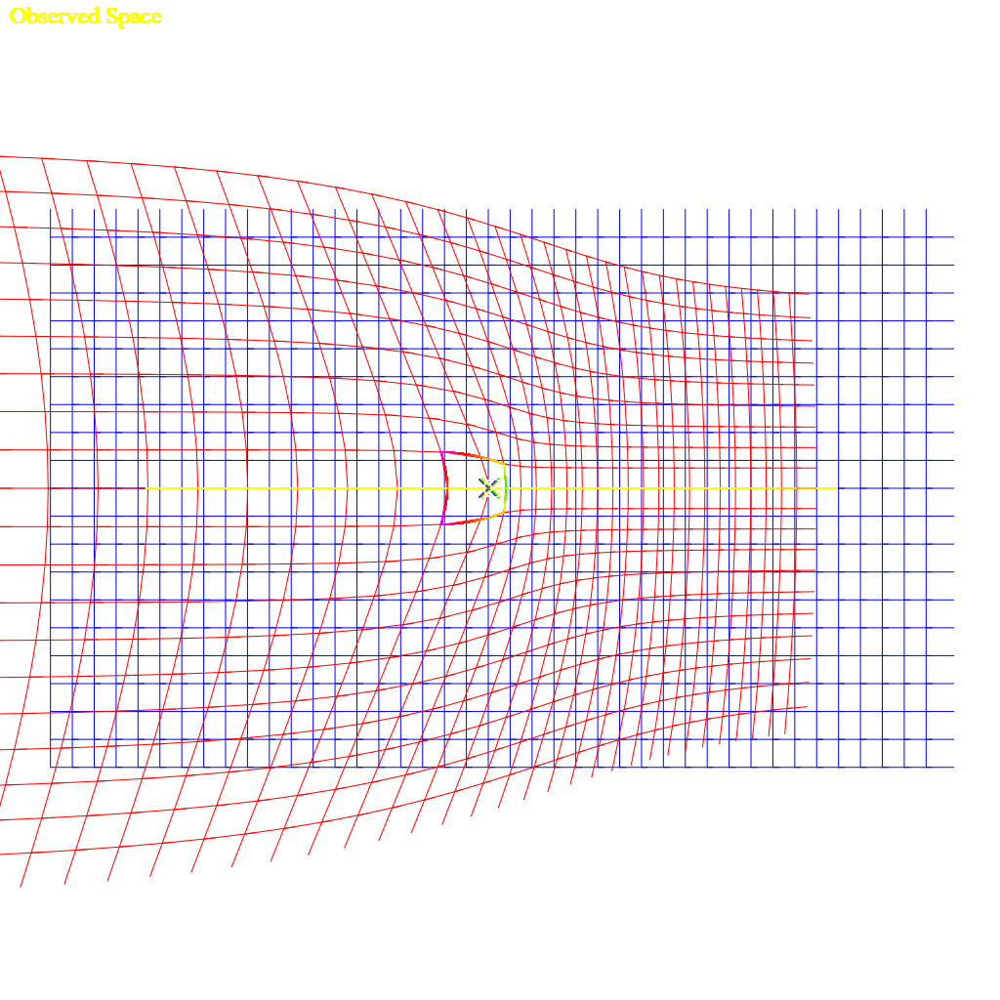Figure
2: Distortion of an observed space that is moving at 0.61c for an
observer moving at 0.31c. This from [this demo.](#two_space_demo) The
demonstration program allows toggling length contraction and aberration,
but light propagation effects are always applied.

This showed that there is a distinct asymmetry to the equations.

## Relative Velocities

An observer which is offset from the path of an observer has several
relative velocities while the body only has a constant velocity. An
observed body will at the furthest extent be seen as traveling towards
the observer with a velocity that points towards the observer (-V in a
2D sense), will slowly change to 0, and then appear to accelerate back
to velocity V away from the observer. If there is 0 distance (or an
insignificant fraction of the speed of light-seconds away), then the
velocity instantly changes from -V (towards the observer) to V (away
from the observer).

In the following equation, D is the distance to the straight line (1 in
the graph), V is the velocity (1 in the graph), T is the time (x in the
graph).

These equations give the position of an object some distance from an
observer at some time at a given velocity:

$$\begin{array}{r}
X = VT,Y = D,X^{'} = V(T - 0.001)\\(73,74,75)
\end{array}$$

The change position between a ‘now’ and ‘now’ minus one one-thousandth
of a time unit, dividing the change in distance by 1/1000 is the same as
multiplying by 1000:

$$\begin{array}{r}
v_{x} = \left( \sqrt{\left( X^{2} + Y^{2} \right) - \left( \left( X^{'} \right)^{2} + Y^{2} \right)} \right) \bullet 1000\\(76)
\end{array}$$

Expanded:

$$\begin{array}{r}
v_{x} = \left( \sqrt{(VT)^{2} + DD} - \sqrt{DD + \left( V(T - 0.001) \right)^{2}} \right) \cdot 1000\\(77)
\end{array}$$

Give this graph:

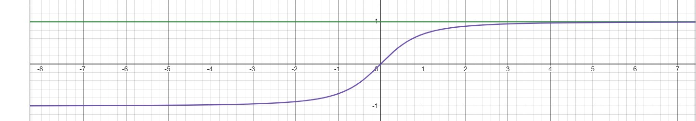  
Figure 3: a constant velocity (V) at an offset distance (D on the Y
axis) is shown as the green line, while the relative time to an observer
at X=0 is shown in purple. The X-axis is a distance from the observer.
The Y-axis for the purple line is the relative velocity.

The Lorentz Transform does not account for this sort of relative
velocity. It does not even consider that before passing an observer the
relative velocity is negative, or toward the observer, and positive
after a body has passed an observer.

## The Lorentz Transform

In an attempt to get from propagation to derive the Lorentz
Transform\[[Ref 4](\l)\], there are a few points discovered to be issues
with the Lorentz Transform. First, the Lorentz Transform does not
include any consideration to change any propagation delay from an offset
of the body, instead falling back to a Galilean Transform for the Y and
Z coordinates, or from an offset on the observer; the further away a
point is in any direction, the longer it takes to see that point, and
the more lagged the position along the velocity of the observed body.
Second, there’s no support for [relative
velocity](#relative-time-dilation). The velocity is instead treated as a
differential between the two absolute velocities. A train going 60mph
and a car on the highway going 80mph, the train has a differential
velocity of -20mph compared to the car, but the relative velocity
changes as the car passes the train. Before the car passes the train,
the relative velocity between the two bodies is negative as they get
closer together, the delta is -20mph; and after the car passes the train
the velocity is positive and is 20mph. During the passing of the train,
relative to a particular point on the train, the relative velocity to a
specific point on the train is 0mph when it is at the closest distance
to the car. The velocity slowly changes from -20mph to 0mph to 20mph
relative to any point on the train.

The Lorentz Transform is also only valid for an event at the origin,
with an observer at the origin.

This isn’t an attempt to get the same result, since the behaviors are
not the same, it’s more to identify where the differences are. In the
case of basic light propagation calculation, there are two independent
velocities relative to a third frame. This might be *G*, *L*1
and *L*2 frames, where *L*1 and *L*2
are local frames moving with independent constant velocities within the
frame of *G*.

### Lorentz Transform Equations

$$\begin{array}{r}
\gamma = \frac{1}{\sqrt{1 - \frac{v^{2}}{c^{2}}}} = \frac{c}{\sqrt{c^{2} - v^{2}}}\\(78)
\end{array}$$

$${\begin{array}{r}
t^{'} = \gamma\left( t - \frac{vx}{c^{2}} \right)\\(79)
\end{array}
}\begin{array}{r}
x^{'} = \gamma(x - vt)\\(80)
\end{array}$$

$${\begin{array}{r}
y^{'} = y\\(81)
\end{array}
}\begin{array}{r}
z^{'} = z\\(82)
\end{array}$$

The above set of equations are a solution for an event occurring at the
origin, and the primed frame is the observer also at the origin and is
the one is moving\[[ref 5](#Ref4_lorentz_derivation)\]; this is a pretty
typical derivation. But then that means the resulting equations have
only a limited scope of applicability. The offset in the *y* or *z*
directions also changes when an event is received, and it becomes
apparent that although the solved set of equations claims to use *c**t*
as the propagation time of an event, that at some time *t* that the
signal is *c**t* units from the origin, the solution doesn’t include
that factor, and only really tracks time dilation and length expansion.
The gamma term as defined increases to infinity as the velocity
approaches the speed of light.

Einsteins derivation in 1920 \[[ref 6](#Ref5_Einstein_derivation)\]
assumes a lot and does not give a step-by-step derivation.

The sequence of steps given to work from a Galilean transform to the
Lorentz Transform seems plausible, but it appears that the solution is
really reversed between the time direction and the space direction, when
considered from specialized consideration of light propagation formulae
given above. To approach the Lorentz Transform equivalent math, the
emitted event an observed event must be located at the origin of the
frame, which might also be, at an insignificant fraction of a
light-time-unit from the origin; given that the speed of light is very
fast, anything within a lab-scale distance is also 0. Lab-scale in this
sense is approximately anything up to the scale of the Earth, but maybe
1/40th of the radius of Earth is a more reasonable limit.

### Another Derivation

The Wikipedia derivation of the Lorentz Transform starts with two
stationary points, {*x*1, *y*1, *z*1}
and {*x*2, *y*2, *z*2}. The distance
between those points takes an amount of time from *t*1 to
*t*2, times the speed of light \[[ref](#Lorentz_derivations)
7\]. It does immediately present that *c**t* is somehow a meaningful
value itself, rather than the differential length divided by c is equal
to the delta time between the events; which then c can later be moved
over to the time side, and squared.

$$\begin{array}{r}
c^{2}\left( t_{2} - t_{1} \right)^{2} = \left( x_{2} - x_{1} \right)^{2} + \left( y_{2} - y_{1} \right)^{2} + \left( z_{2} - z_{1} \right)^{2}\\(83)
\end{array}$$

or

$$\begin{array}{r}
c^{2}\left( t_{2} - t_{1} \right)^{2} - \left( x_{2} - x_{1} \right)^{2} - \left( y_{2} - y_{1} \right)^{2} - \left( z_{2} - z_{1} \right)^{2} = 0\\(84)
\end{array}$$

Equation \[65\] itself I cannot find fault in; other than it is for the
time between two stationary events and does not include any motion.

The next point is establishing invariance of interval \[[ref
7](#Lorentz_derivations)\]:

$$\begin{array}{r}
ds^{2} = c^{2}dt^{2} - dx^{2} - dy^{2} - dz^{2}\\(85)
\end{array}$$

Then this *d**s* term is used to apply a relative velocity. Although
since *d**s*2 = 0, it does seem to just be an exercise. But
as mentioned above, there isn’t a single relative velocity between two
bodies, except when the two bodies have the same velocity and are
relatively stationary with 0 relative velocity between them.
Additionally, *d**s* being an infinitesimal since
*d**s*2 = 0, this is still only valid near 0.

### Comparison working from Light Propagation

Starting with equation \[1\]:

$$\begin{array}{r}
T_{O} = T + \frac{\left\| \left( \vec{X_{E}} + T\vec{V_{E}} \right) - \left( \vec{X_{O}} + T_{O}\vec{V_{O}} \right) \right\|}{C}\\(2)
\end{array}$$

To match equation \[71\], which specifies that the emission of the event
(subscript 1) invert some signs. However, the right side will always be
positive, so the left side the observed event must be after the
emission, so it would be untrue to reverse the signs on the left. In the
above equations, *t*2 − *t*1is a negative term,
but it shouldn’t matter after squaring.

$$\begin{array}{r}
T_{O} - T = \frac{\left\| \left( \vec{X_{O}} + T_{O}\vec{V_{O}} \right) - \left( \vec{X_{E}} + T\vec{V_{E}} \right) \right\|}{C}\\(86)
\end{array}$$

Convert magnitude expression to square root of squared difference:

$$\begin{array}{r}
T_{O} - T = \frac{\sqrt{\left( \left( \vec{X_{O}} + T_{O}\vec{V_{O}} \right) - \left( \vec{X_{E}} + T\vec{V_{E}} \right) \right)^{2}}}{C}\\(87)
\end{array}$$

Move C to the left side, and square both sides to remove radical:

$$\begin{array}{r}
C^{2}\left( T_{O} - T \right)^{2} = \left( \left( \vec{X_{O}} + T_{O}\vec{V_{O}} \right) - \left( \vec{X_{E}} + T\vec{V_{E}} \right) \right)^{2}\\(88)
\end{array}$$

At this point we can introduce another variable that makes the equation
non-zero on the left… though the invariance interval above (equation
\[66\]) is already in a delta, dropping the static initial points that
defined the terms. Also simplify to a single dimension instead of a
vector here.

$$\begin{array}{r}
{dS}^{2} = C^{2}\left( T_{O} - T \right)^{2} - \left( \left( \vec{X_{O}} + T_{O}\vec{V_{O}} \right) - \left( \vec{X_{E}} + T\vec{V_{E}} \right) \right)^{2}\\(89)
\end{array}$$

But then the velocities are already part of the math, and don’t have to
be applied to the *d**S* term. If there was a single differential (not
relative) velocity specified, then we could define:

$$\begin{array}{r}
\vec{V_{E}} = - \vec{V};\vec{V_{O}} = 0\\(90,91)
\end{array}$$

Substitute velocity expressions \[71\] and \[72\] into \[70\]:

$$\begin{array}{r}
{dS}^{2} = C^{2}\left( T_{O} - T \right)^{2} - \left( \left( \vec{X_{O}} \right) - \left( \vec{X_{E}} - T\vec{V} \right) \right)^{2}\\(92)
\end{array}$$

Remove some parenthesis:

$$\begin{array}{r}
{dS}^{2} = C^{2}\left( T_{O} - T \right)^{2} - \left( \vec{X_{O}} - \vec{X_{E}} - T\vec{V} \right)^{2}\\(93)
\end{array}$$

Change $T_O$ to *T* + *T**Δ*, and
$\vec{X_{O}} - \vec{X_{E}}$ to
$\vec{X_{\mathrm{\Delta}}}$

$$\begin{array}{r}
{dS}^{2} = C^{2}\left( T + T_{\Delta} - T \right)^{2} - \left( \vec{X_{\mathrm{\Delta}}} - T\vec{V} \right)^{2}\\(94)
\end{array}$$

Simplify expressions, and this resembles equation\[73\], but still has a
differential velocity that works as a relative velocity in the equation:

$$\begin{array}{r}
{dS}^{2} = C^{2}{T_{\Delta}}^{2} - \left( \vec{X_{\mathrm{\Delta}}} + T_{\Delta}\vec{V} \right)^{2}\\(95)
\end{array}$$

### Solving Light Propagation at the Origin

Alternatively, a shorter method that approaches the Lorentz Transform,
but doesn’t quite get there is to start with Equation 2:

$$\begin{array}{r}
T_{O} = T + \frac{\left\| \left( \vec{X_{E}} + T\vec{V_{E}} \right) - \left( \vec{X_{O}} + T_{O}\vec{V_{O}} \right) \right\|}{C}\\(2)
\end{array}$$

Define gamma:

$$\begin{array}{r}
\gamma = \frac{C}{\sqrt{C^{2} - V^{2}}}\\(96)
\end{array}$$

Simplify so there is 0 distance between the observers, the point being
observed is 0, and a 0 velocity for the emitter, gives the following
equation:

$$\begin{array}{r}
C\left( T_{O} - T \right) = \left\| \left( - T_{O}\vec{V_{O}} \right) \right\|\\(97)
\end{array}$$

Converting the magnitude expression to the square root of the vector
squared:

$$\begin{array}{r}
C\left( T_{O} - T \right) = \sqrt{\left( - T_{O}V \right)^{2}}\\(98)
\end{array}$$

$$\begin{array}{r}
C^{2}T_{O}T_{O} - {2C^{2}T}_{O}T + {C^{2}T}^{2} = \left( - T_{O}V \right)^{2}\\(99)
\end{array}$$

$$\begin{array}{r}
C^{2}T_{O}T_{O} - V^{2}T_{O}T_{O} - {2C^{2}T}_{O}T = - C^{2}T^{2}\\(100)
\end{array}$$

$$\begin{array}{r}
\left( C^{2} - V^{2} \right)T_{O}T_{O} - {2C^{2}T}_{O}T = - C^{2}T^{2}\\(101)
\end{array}$$

$$\begin{array}{r}
\left( \sqrt{\left( C^{2} - V^{2} \right)}T_{O} - \frac{C^{2}T}{\sqrt{\left( C^{2} - V^{2} \right)}} \right)^{2} = \frac{{C^{4}T}^{2}}{\left( C^{2} - V^{2} \right)} - {C^{2}T}^{2}\\(102)
\end{array}$$

$$\begin{array}{r}
T_{O} = \frac{\sqrt{\frac{{C^{4}T}^{2}}{\left( C^{2} - V^{2} \right)} - {C^{2}T}^{2}} + \frac{CT}{\sqrt{\left( C^{2} - V^{2} \right)}}}{\sqrt{\left( C^{2} - V^{2} \right)}}\\(103)
\end{array}$$

$$\begin{array}{r}
{T_{O}}^{} = \frac{\sqrt{{C^{4}T}^{2} - {\left( C^{2} - V^{2} \right)C^{2}T}^{2}} + C^{2}T}{C^{2} - V^{2}}\\(104)
\end{array}$$

$$\begin{array}{r}
\boxed{T_{O} = \frac{\sqrt{V^{2}C^{2}T^{2}} + C^{2}T}{C^{2} - V^{2}}}\\(105)
\end{array}$$

Which, naively, the square root of the square simplifies (incorrectly):

$$\begin{array}{r}
T_{O} = \frac{C^{2}T\\ \pm \\VCT}{C^{2} - V^{2}}\\(106)
\end{array}$$

Scaled by gamma, this should be equivalent the *t*′ equation
of the Lorentz Transformation:

$$\begin{array}{r}
T_{O} = \gamma CT\left( \frac{C \pm V}{C^{2} - V^{2}} \right)\\(107)
\end{array}$$

$$\begin{array}{r}
T_{O} = \gamma CT\left( \frac{1}{C \pm V} \right)\\(108)
\end{array}$$

$$\begin{array}{r}
X_{O} = \gamma VCT\left( \frac{1}{C \pm V} \right)\\\\(109)
\end{array}$$

Should be:

$$\begin{array}{r}
t' = \gamma\left( t - \frac{vx}{c^{2}} \right)\\(79)
\end{array}$$

Or:

$$\begin{array}{r}
X = \frac{tv}{C}\\(110)
\end{array}$$

$$\begin{array}{r}
t' = \gamma\left( t - \frac{v}{C}\frac{vt}{C} \right)\\(111)
\end{array}$$

$$\begin{array}{r}
x^{'} = \gamma(x - vt)\\(80)
\end{array}$$

It can be noted, the simplification between \[105\] and \[106\] is not
correct, and the results are not equivalent. The result of the square
root should always be positive (except if V &gt; C, at which point, the
observer can notice the event in two places, and the negative solution
that is greater than T should also be considered), since observation
always occurs at a time after a signal is emitted, so it should at least
be an absolute value. This is invariably why the graph is taken as
symmetric across the origin, when with the full expression there is an
asymmetry to the observed space. Propagation is not a coordinate
transformation though, but when scaled with gamma correction factors,
the results are very close near the slow speed the Earth is moving
through the universe.

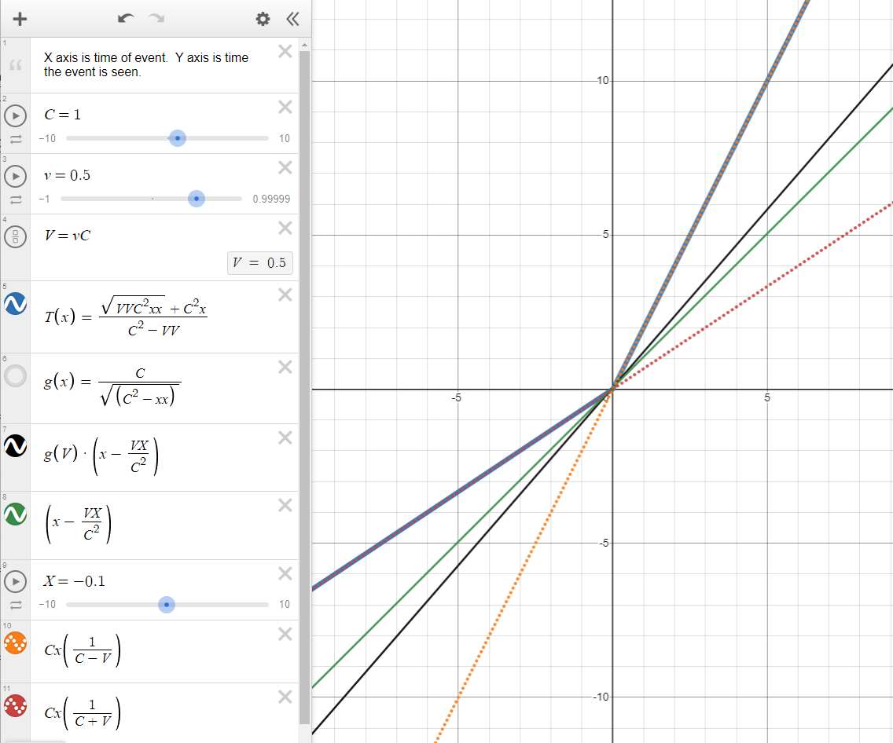

Figure 4: https://www.desmos.com/calculator/vrvjp9vzcr. This is a
comparison of Lorentz Time plot vs Light Propagation time. The blue line
is the correct plot, at time *T* =  − 5, the event will be observed at
nearly $T_O$ =  − 3.33, because the observer is before the
event at the origin when it goes off, and it will run into the signal
from the event as it goes to the origin. At T=1, the event will be seen
at $T_O$ = 2, because the observer will have already passed
the event, and will take twice the time for the event to catch up to the
observer. The orange and red dashed lines are the incorrect
simplification for equation \[106\]. They each represent part of the
blue line, but continued, without following the blue line. The black
line is the Lorentz Transform, which results in an inexplicable graph.
The green line is the Lorentz time transformed without the gamma term.

### Another Approach, working from solved equation for propagation:

$$\begin{array}{r}
\vec{P_{O}} = \vec{X_{E}} + \vec{V_{E}}T - \vec{X_{O}}\\(11)
\end{array}$$

$$\begin{array}{r}
\boxed{T_{O} = \frac{\sqrt{\left( C^{2}T + \vec{P_{O}}\vec{V_{O}} \right)^{2} - \left( C^{2} - {\vec{V_{O}}}^{2} \right)\left( C^{2}T^{2} - \vec{P_{O}}\vec{P_{O}} \right)} + \left( C^{2}T + \vec{P_{O}}\vec{V_{O}} \right)}{C^{2} - {\vec{V_{O}}}^{2}}}\\(12)
\end{array}$$

Again, simplify for $\vec{X_{E}} = \vec{0}$,
$\vec{X_{O}} = \vec{0},\\\vec{V_{E}} = \vec{0}$,
$\vec{V_{O}} = \vec{V}$:

$$\vec{P_{O}} = 0$$

$$\begin{array}{r}
T_{O} = \frac{\sqrt{\left( C^{2}T \right)^{2} - \left( C^{2} - {\vec{V}}^{2} \right)\left( C^{2}T^{2} \right)} + C^{2}T}{C^{2} - {\vec{V}}^{2}}\\(112)
\end{array}$$

Expand terms:

$$\begin{array}{r}
T_{O} = \frac{\sqrt{C^{4}T^{2} - C^{2}C^{2}T^{2} + {\vec{V}}^{2}C^{2}T^{2}} + C^{2}T}{C^{2} - {\vec{V}}^{2}}\\(113)
\end{array}$$

$$\begin{array}{r}
\boxed{T_{O} = \frac{\sqrt{{\vec{V}}^{2}C^{2}T^{2}} + C^{2}T}{C^{2} - {\vec{V}}^{2}}}\\(114)
\end{array}$$

Incorrect simplification here:

$$\begin{array}{r}
T_{O} = \frac{\left\| \vec{V} \right\| CT + C^{2}T}{C^{2} - {\vec{V}}^{2}}\\(115)
\end{array}$$

$$\begin{array}{r}
T_{O} = \frac{\left( \left\| \vec{V} \right\| + C \right)(CT)}{C^{2} - {\vec{V}}^{2}}\\(116)
\end{array}$$

$$\begin{array}{r}
T_{O} = \frac{\left( \vec{V} + C \right)(CT)}{\left( C - \left\| \vec{V} \right\| \right)\left( C + \left\| \vec{V} \right\| \right)}\\(117)
\end{array}$$

$$\begin{array}{r}
T_{O} = \frac{(CT)}{\left( C - \left\| \vec{V} \right\| \right)}\\(118)
\end{array}$$

Again, the simplification removing the radical between \[114\] and
\[115\] is incorrect. The squaring of the terms and the square root is
effectively an absolute value on the T and V terms.

## **E****=****m****c****2**?

The expression for energy and mass only depends on time dilation
gamma\[[ref 3](\l)\], and the gamma term is the same; there is no
consequence or modification for this expression.

## The Problems

The following sections are problems that were found with the above math.
They are places where the idea of relativity and the equivalence
principle do not match what would happen in reality.

### Relative Time Dilation

This is an issue with Relativity as a concept.

It's said that only the relative difference matters between two bodies.
Consider a scenario where 8 craft pass by Earth at the same time (T=0),
and their clocks are all exactly synchronized. Each craft is 0.1c faster
than the previous.

Each ship has an additional distance of 0.1 light seconds per second,
which is a lag of +0.1 seconds per second, or after 10 seconds there's 1
light-second between them which is an additional delay of 1 second.
Between the first and last ship then is 8 seconds of delay per 10
seconds of travel.

If considered entirely relatively, then each ship has a relative time
contraction of 0.995 compared to the previous ship, or the same as the
contraction between the earth and the first ship. After 1 second, each
ship’s clock is 10*(1-0.995) = 0.050 slower seconds per 10 seconds of
travel slower than the previous ship.

A side note: obviously the Lorentz Transform that results in 0.05 second
contraction does not include the 1 second of propagation time between
each ship. Each ship would see the next as 1.05 seconds per 10 seconds
slower when including the propagation delay. The total difference from
the first ship to the last is at least 7 seconds of lag.

The time contraction for the 8th ship relative to the earth
is (1-0.6 = 0.4 which indicates it loses 4 seconds in 10) and
8*(1-0.995) is 0.040, which is the total contraction the 8th
ship would have if considered as only relative to the prior ship.
0.040(total relative) is not equal to 0.40(relative to earth).

The below table shows the actual and relative differences for their
local clock.

Table 1

<table>
<colgroup>
<col style="width: 7%" />
<col style="width: 9%" />
<col style="width: 9%" />
<col style="width: 9%" />
<col style="width: 9%" />
<col style="width: 9%" />
<col style="width: 9%" />
<col style="width: 8%" />
<col style="width: 11%" />
<col style="width: 16%" />
</colgroup>
<thead>
<tr class="header">
<th>0</th>
<th>1</th>
<th>2</th>
<th>3</th>
<th>4</th>
<th>5</th>
<th>6</th>
<th>7</th>
<th>8</th>
<th>Comments</th>
</tr>
</thead>
<tbody>
<tr class="odd">
<td>
1.0

0
</td>
<td>
0.995

0.005
</td>
<td>
0.978

0.022
</td>
<td>
0.954

0.046
</td>
<td>
0.917

0.073
</td>
<td>
0.866

0.134
</td>
<td>
0.800

0.200
</td>
<td>
0.714

0.276
</td>
<td>
0.600

0.400
</td>
<td>Actual time contraction; how much time each clock loses</td>
</tr>
<tr class="even">
<td>
1.0

0
</td>
<td>
0.995

0.005
</td>
<td>
0.990

0.010
</td>
<td>
0.985

0.015
</td>
<td>
0.980

0.020
</td>
<td>
0.975

0.025
</td>
<td>
0.970

0.030
</td>
<td>
0.965

0.035
</td>
<td>
0.960

0.040
</td>
<td>Total tTime contraction if time was relative to the previous</td>
</tr>
</tbody>
</table>

The following is across 10 seconds, and including propagation delay:

-   Observer 1 sees 2 as 1 second + 10(0.995-0.978)=0.15 seconds ... so
    1 sees 2 lagged by 1.15 seconds*.*

-   Observer in 7 sees 8 as 1 second + 10(0.714-0.600)=1.14 seconds ...
    so 7 to 8 sees 8’s clock lagged by 2.14 seconds per 10 seconds
    compared to its own clock.

Remember 7 to 8 and 1 to 2 are both relative to each other by only 0.1c,
so the time dilation that 7 sees from 8 should still be just 0.995
seconds from time dilation according to Special Relativity.

### The Twin Paradox

There is no paradox in this system. Every observer can agree which is
moving and which is stationary. The moving twin ages slower, and at a
known rate compared to their twin back in the nearly stationary frame of
Earth.

The Twin Paradox stems from equivalence where the moving twin pretends
that they are stationary, and therefore the stationary twin is the one
that is moving, and therefore has the slow clock, when really the slow
clock is always on the side which is really moving.

The moving ship can use the aberration of the stars compared to the
aberration the twin on earth sees, if they send stellar charts back and
forth, they can identify which IS moving, and which clock is running
slow. Relativity and the Equivalence principle says it’s just as valid
that the ship is not moving and the earth is moving away, therefore the
twin on the earth is aging slower; this is not what happens. It’s been
said that the other solution to this is to measure the acceleration, and
the body that has undergone more acceleration is the one with the slow
clock, but then that implies it’s acceleration that causes time
contraction, and that not accelerating or coasting at a velocity will
have non-contracted time, which is untrue… acceleration may lead to a
velocity which then is a cause of contracted time, but it is not
directly responsible for the contraction of time.

## Demonstrations and Simulations

While developing this I made a series of demonstration programs to
investigate various behaviors. This is not a comprehensive list.

<https://github.com/d3x0r/STFRPhysics/blob/master/LightSpeedSim.md> Is
the main document for the project that has the list of demos, and more
information about the demonstrations.

[Stationary Observer, Moving Observable, at
V&gt;C](https://d3x0r.github.io/STFRPhysics/math/indexLightSpeed.html) –
This was the first idea – just to see what the behavior was for a body
that was able to move faster than the speed of light (or speed of sound,
or speed of water waves); an interesting realization was that for a
supersonic plane, as I often heard when living in Las Vegas from Nellis
Air Force Base, there would be a loud noise, followed by very loud jet
sounds; but the sound would actually appear to go towards the base and
away from the base. It was very hard to know if they were returning or
leaving, since the plane was closest before I ever heard it, and then
the sound for whatever direction it came from would overlap the sound
from the direction it was going.

[Stationary Observer, moving Observable, V as a fraction of
C](https://d3x0r.github.io/STFRPhysics/math/indexLightSpeed1.html) –
This is the same as the first demonstration, but limits velocity to a
maximum of C.

[Stationary Observable, moving
observer](https://d3x0r.github.io/STFRPhysics/math/indexLightSpeed2a.html)
– this becomes mostly about light aberration, since the position the
observes sees the stationary thing from is always the same. The length
does not contract for things that are not moving relative to the moving
observer; this is another place where the symmetry of the Lorentz
Transform, and when claiming that the moving observer is stationary,
while the body that is stationary is the one that is moving, is invalid.

[Moving body with an observer in
it](https://d3x0r.github.io/STFRPhysics/math/indexLightSpeed3.html) –
this would be like a train with a passenger inside the train. This
demonstration only supported one direction.

[Moving body with observer, supports changing direction of
velocity](https://d3x0r.github.io/STFRPhysics/math/indexLightSpeed4.html)

[2D Bodies, each with their own velocity and
direction](https://d3x0r.github.io/STFRPhysics/math/indexLightSpeed3b.html)
– This showed the transform of space and was part of trying to match the
Lorentz Transform space-time graphs; there’s an option to enable X-T
Graph specifically about that. This compares how a 2D space is
transformed for an observer in a square ship, watching another square
ship with its own velocity and directions. This employs length
contraction and light aberration, and I had an inspiration that maybe
because of light aberration of the propagation delayed points might look
more correct in perspective. In 2D, however, this would just be a
circle, and not being a flatlander, I’m not very good with interpreting
a perspective of a plane in a circle.

[3D Orthogonal vs Perspective
Test](https://d3x0r.github.io/Voxelarium.js/index2-dual-view.html) – I
implemented another test in another project that had a voxel cube. I
implemented moving the points according to the velocity and delay of
propagation and light aberration in the shader which changes the shape
of the geometry in real time. The orthogonal view and perspective views
do the same transformation, and the camera position and orientation is
also exactly the same. This shows, when velocity and direction are
locked, that even though the geometry is highly deformed by the
propagation time of where a point on the moving body is seen from, and
the light aberration, that at any speed the frame still looks exactly
square. Even with VR enabled, other than the color changes, there is no
perceivable difference between moving along with the body at any speed
and being stationary in that body. The wide aspect ratio of this expect

[Testing Time dilation and propagation
delays](https://d3x0r.github.io/STFRPhysics/math/indexLightSpeed-Clocks.html)
– This demonstration was to challenge an [entrance exam
question](#appendix-e-exam-question) for college. I further implemented
various clocks to test time contraction.

[Interferometer
demonstration](https://d3x0r.github.io/STFRPhysics/math/indexInterferometer4.html),
I implemented various versions of an interferometer which used light
aberration, and length contraction, and this final version allows
choosing an arbitrary angle, to show the identical lengths of each path
of light takes, demonstrating the expected null result. This version has
a ‘4’ at the end of its link, there is also (no number), 2 and 3
versions; 3 is almost like 4, but for also includes multiple photons
emitted at the nodes of a specified wavelength and assisted in deriving
the doppler shift equation.

## Consequences

Several consequences of a one-way speed of light are immediately
obvious.

1.  For all clocks to behave the same in all frames, acceleration due to
    a specific force is no longer constant. Instead, the velocity
    imparted due to a specific acceleration must be scaled depending on
    the direction of the force relative to the velocity of the frame it
    is in. An acceleration applied backward must be scaled by
    $A\frac{C}{(C - V)}$ and applied forward must be scaled by
    $A\frac{C}{(C + V)}$; or more generally an acceleration applied in a
    direction θ is $A\frac{C}{C + cos(\theta)V}$ (approximately). I
    don’t know if the acceleration itself just ends up scaled or if it’s
    just effectively different than it would seem. Here are a few clock
    ideas for 0G clocks like an hourglass in a centrifuge, a machine
    that launches marbles in various directions until they hit a
    detector, similarly a turntable with marbles in a cage, that the
    cage drops launching the ball centrifugally. (With a spring-plunger
    mechanism, with a magnetic field, etc. In the case of the magnetic
    field, then it behaves like photons, and the ball in one direction
    would see more flux from the field in one direction that some other
    direction, which would mean the force was actually changed, rather
    than just resulting in a different momentum).

2.  The one-way velocity of light is not constant, and adding the
    velocity of the two directions is not a constant, but what is
    constant is the amount of time it takes light to cover a certain
    distance two-ways. The time can be expressed as A + B = 2C (C here
    is just a variable, not the speed of light constant). A distance
    divided by a time is a velocity, but it’s not the velocity of light
    in either direction.

3.  The experience of travelling at a velocity ends up meaning that for
    a given velocity V, with the time factor scaled by the time
    contraction of $\sqrt{C^{2} - V^{2}}$, means that at 0.707c, that
    the frame ‘feels like’ it is travelling at 1c. It travels 1 light
    second in what feels like 1 second in the frame. If the ship emitted
    a signal every second, a pulse would be seen by external observers
    every 1 light second, but there would be more than 1 second between
    pulses (ignoring light propagation time). At 0.861 the ship would
    emit a pulse every 2 light seconds every second... a ship would feel
    like it was going many times the speed of light before it reached
    the speed of light. (this could probably be expanded). (This idea
    has been criticized as not making any sense since nothing can go
    faster than the speed of light - but it's not faster than light, it
    just 'feels like' it's going faster than the speed of light.)

4.  The universe doesn't contract when a body is moving through it - a
    stationary object that is bounded by say 2 walls that emit a signal
    that is its local time, will always be seen as 2 light seconds apart
    (other than effects from light aberration).

5.  An observer that is traveling with a body at some speed will always
    see that body in perspective as the same as when it was stationary.
    The length contraction and light aberration causes the various
    observed positions to look, in perspective (as in 3D graphics
    perspective, or as light is projected on the retina as a 2D surface)
    to be the same.... the light from the back of the craft takes a
    longer time to reach the observer, and intuitively it would seem
    like it would come from further away, but the light aberration from
    the back widens out the perceived distance, and results after a
    perspective correction as the same perspective as being stationary.
    Similarly light from the front of the craft would arrive sooner, and
    the front wall should appear closer to the viewer, but light
    aberration contracts the width of it, and ends up looking in
    perspective exactly as it did when the frame was stationary. If
    there was a perceivable cycling signal of lights say going
    red-green-blue-red-etc, then the light that is closest to 'now'
    would come from further in front of the observer, and the back would
    lag behind; but within reasonable limits, (since we don't build
    space craft that are 300,000km long), there is no notable
    difference.

6.  As mentioned before, light aberration takes place on transmission
    too - this is somewhat like a transfer of inertia to the emitted
    light. If this aberration did not take place, then a laser light
    shining across a craft moving at some speed would drift down the
    wall when not under acceleration, but at increased speeds; this
    doesn't happen. That means the light from the laser when it leaves
    the last bit of the lens medium and enters free space, will have
    been aberrated by some angle such that it will cross the craft at
    exactly 90 degrees; similarly if there is a reflective surface like
    a mirror, the mirror will aberrate the light it receives, and appear
    to have received the light from directly across, instead of an angle
    lagged behind, and on reflection, will aberrate the light further
    forward. This is part of the reason that interferometers like LIGO
    or Michelson-Morley experiment don't detect any drag on the light.
    The other part that plays a part is length contraction. Between the
    two effects, the time light travels between splitters, and mirrors
    is the same in any direction; but depending on the direction of the
    device may take a longer or shorter time, but the time along each
    path the light takes will still be the same, and the light will come
    back in phase with itself and interfere as expected.

7.  The Lorentz Transform is incomplete; and is truly only valid
    considering bodies that are 0 distance from each other, or at best
    an insignificant fraction of a light-second. I tried several times
    to bias a space-time graph to the Lorentz Transform space-time
    graph, but it truly only aligns at T&gt;0 and X&gt;0 if V&gt;0 or
    X&lt;0 if V&lt;0; there is an asymmetry that is induced when you
    consider the propagation delay. A ship that is travelling towards an
    observer is elongated, even factoring in the length contraction,
    it’s still seen as longer; while a ship that is moving away from an
    observer is contracted, even more than the length contraction
    applies.

8.  General Relativity – A side project included applying the Einstein
    Field equations to space, and performing the curvature directly,
    without a factor of time; more information in [Appendix
    G](#appendix-g-gr-hypothesis)

# Proposed Experiment

This is a test for difference in 1 way speed of light, rather than
strictly measuring the speed of light.

Using unsynchronized clocks, an apparatus with 2 devices, called
emitters, which have stable clocks, with minimal drift between each
other so they always emit a pulse of light (or radio &gt; 5Ghz) with a
fixed interval. The pulse should be short, but only needs to be off long
enough to register a distinct 'on' event later. The time between the
pulses should be more than the transmission time between pulse generator
and detector, given a standard speed of light.

A third device called a detector detects the pulses from the emitters
and records the time from a local clock when the leading edge of the
pulse is detected, or when the pulse is first able to be detected.

This image shows the short pulse and long delay, or at least as much
delay as between the detector and emitter. (This isn't strictly a
requirement, but a higher frequency isn't going to add any information
either.)

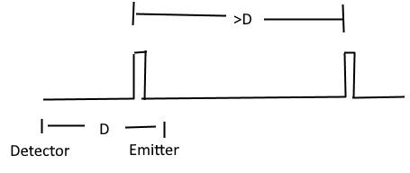  
Figure 5: Example of pulse generation, which has a very short period of
on-time, and a delay between pulses that is longer than the transmission
delay between emitter and detector.

## The arrangement

The detector should receive from two emitters, which are placed in
opposing directions at the same distance from the detector. The central
detector records the time that pulses are received from each detector
against a local high precision clock. This clock needs to be at least a
few hundred picoseconds in resolution.

Arms are formed from the center detector and each emitter; the angle
between the arms should be 180 degrees to catch the worst case. If one
arm is 90 degrees to the other, then there will always just be an
average on one; and the maximum difference will not be found.

The emitters should be 10,000ft away from the central detector, which
makes the total length 20,000ft or about 4 miles.

This is about the limit of what can be seen – the horizon at 2.67ft is 2
miles away; at 5ft is 2.73 miles away, much further than 2 miles would
require a tower to mount the emitters to be seen by the detector.
($d \approx \sqrt{2hR}$, R = 20,856,000ft, h is height, d is distance to
horizon).

## Notes on clocks

Relativistic time dilation effects don't matter once the device is
placed, and the clock in the central detector is used to record the time
the remote clocks are seen; the clocks in the pulse generators are used
to generate stable span between leading edges of the pulse they emit.
The modulation might be something like a moving mirror, or a wheel with
a notch, rather than having to warm up a laser diode or some other
emission source.

Gravitational time dilation might affect the clocks of the various
devices depending on where they are placed. It's more important that the
pulse generators are in a similar gravitational gradient; otherwise, a
constant skew will be in the data also; which can be removed when
analyzing the signals but would of course be best if the skew wasn't
there. The exact tick rates of the emitters versus the central detector
are irrelevant; the span recorded between the pulses may be contracted
or dilated vs the emitters, the interval will still be a constant
against the local clock.

## Hypothesis

If the speed of light is different, by a rate of C + V or C − V, where C
is what's used for the constant speed of light, and V is a velocity. In
the direction of the velocity, those are the speeds that apply,
laterally, it's just C. The distance in the worst-case direction is
contracted by $\gamma = \frac{\sqrt{C^{2}\\ - \\{\\V}^{2}}}{C}$ and the
clock is contracted by the same amount. The effective local time to
cross 1 unit is $\frac{\gamma^{2}}{C + V}$ or $\frac{\gamma^{2}}{C - V}$
(distance(1) times gamma divided by relative speed = time in seconds
times gamma). The lateral time is
$\frac{\gamma}{\sqrt{C\hat{}2 - V\hat{}2}}$ or $\frac{1}{C}$ (the time
to cover the lateral distance increases with speed; hence dividing by
square root of C squared minus V squared and the resulting time
contracted, so multiply by gamma).

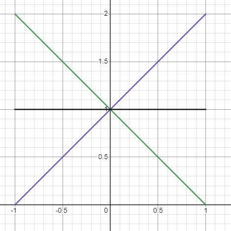  
Figure 6: the X-axis is the speed of a body, the Y-axis is time to cover
a unit distance, the green line is the time from front to back at a
speed, the purple line is the time from back to front, and the black
line through 1 is the time laterally. Green plus purple over 2 is a
constant 1 time, matching the two-way propagation in the worst-case
scenario.

## Some relevant speeds

-   370,000m/s: We are moving at 370km/s relative to the CMB in the
    direction of the constellation of Virgo.

-   30,290 m/s: Earth orbits the sun so +/-10%(roughly) deviation.

-   460 m/s: Earth spins this fast, so +/-0.1%(roughly) deviation (1/100
    orbit speed)

The most significant part is the motion towards the Virgo constellation
as demonstrated by the redshift of the CMB.

## Expected Result

Using an approximation of light travelling 1 foot per nanosecond (one
Ghz tick is 1ns; in the clock rate of CPU's, light goes about 1 foot
(slightly less)). The worst-case advance/delay of the speed 1.2ns per
1000ns, so in 10,000 ns (distance/C) a +/-12ns difference can be
measured - one arm will be +12ns and the other -12ns for a total delta
of 24ns. This will reach a maximum when the apparatus is aligned in the
direction of motion with the CMBR- and minimum separation at 90 degrees
to the velocity. So, this should be placed on the ground such that Virgo
or Cetus is seen on the horizon at some point; but this will only happen
once per day, when the planet is 180 degrees around (12 hours later) the
device will have a negative angle of alignment with the constellation.
Perhaps deploying something at the north or south pole at 9 degrees off
the pole would be an option?

10,000ns is 10,000 ft which is about 2 miles, which is a total span of 4
files with 2 emitters and a detector.

## Data Evaluation

Events from a single detector, and the related timestamps are a stream.
The streams are mostly independent. Starting with a pulse, subtracting
the timestamp from itself biases the tick to 0. Each stream is biased to
0 itself; this synchronizes the pulses at a specific point. This may be
an average case, or a worst case or somewhere in-between. One stream
should be slightly ahead of the 0, and have at a positive offset, this
stream is delayed; the other stream should be behind 0 and have a
negative offset that is the same as the positive from that point. This
offset will go toward a maximum case and then to an average case. Given
that only alignment in a very specific direction produces THE worst
case, random chance will be that there will be little deviation from
average and just be +/-0. Any progressive skew that does not go away is
probably from a slightly different gravitational gradient; though slight
differences in north latitude will also skew the clock time, from a
difference in linear rate while the earth rotates.

## Increased Accuracy

It might be a good idea to put a splitter near each emitter, and record
locally a similar resolution timestamp to the central detector, which
can compensate for jitter in the electronics which switch the laser on.

## No Clock Transport

There is no requirement for synchronization of the remote clocks, and it
doesn't matter whether they are transported or not, they can be switched
on at any time, and as long as they tick at the same period can still
produce a signal that the delta can be detected.

## Alternative deployments

LISA - The interferometer satellite array could measure +/-10ms;
millisecond resolution is surely notable - although it does have bent
arms, so the difference between the arms is fairly minimal.

## What’s different about GPS?

GPS satellites are synchronous clocks that emit pulses and are clocked
over a distance for the speed of light. GPS satellites orbit at an
altitude of 20,200km or 12,550 miles (66,264,000 feet). It was argued
that if there was an anisotropic speed of light, then they would be off
by a significant amount of time when received; they would be off by
potentially approximately 81 microseconds.

$$\frac{Altitude}{C \pm V}$$

Gravity also propagates at the speed of light. This means that in the
direction of travel of the solar system relative to the CMBR (370km/s or
0.00123 light-seconds per second) that effectively the orbit of the
satellites in the direction of the velocity is 24.9km (15.5 miles or
81,624ft) further from the earth, as the gravity field has not yet
extended as far, compensating for the shorter reception time as the
earth moves into the emitted signal. Conversely, the gravity field on
the trailing side is extended, and makes the orbit closer, compensating
for the earth moving away from the emitted signal. This is only extreme
in a specific alignment.

It’s not that the space of that whole system is contracted; space does
not contract with velocity, only the matter in the space.

This then goes to what about the laser ranging satellites. They rely on
a two-way communication, and if there was such an elevation difference,
that would show up in their measurements, and the model they build would
be offset. Satellite programs that map the elevation of Earth have low
orbit, and the difference would only be a couple hundred meters, which
is larger than the difference of their perigee-apogee.

-   ICESat-2 orbits @ 479-482km.

-   Cryosat-2 @ 718-732km

-   ADM-Aeolus @ 320km

-   [TanDEM-X](https://en.wikipedia.org/wiki/TanDEM-X) & TerraSAR-X @
    514-516km

# Data availability

Data sharing is not applicable to this article as no datasets were
generated or analyzed during the current study.

# Code availability

Example code and demonstrations are available on Github at
<https://github.com/d3x0r/STFRPhysics>.

# References

1.  https://en.wikipedia.org/wiki/Special_relativity

2.  <https://en.wikipedia.org/wiki/Relativistic_aberration>

3.  [Physics
    Explained](https://www.youtube.com/@PhysicsExplainedVideos),
    “Deriving Einstein's most famous equation: Why does energy = mass x
    speed of light squared?”:
    <https://www.youtube.com/watch?v=KZ8G4VKoSpQ>

4.  https://en.wikipedia.org/wiki/Derivations_of_the_Lorentz_transformations

5.  [For the Love of
    Physics](https://www.youtube.com/@FortheLoveofPhysics), “Derive
    Lorentz Transformations”,
    <https://www.youtube.com/watch?v=6pj1f8x3APg>

6.  https://www.bartleby.com/lit-hub/relativity-the-special-and-general-theory/appendix-i-simple-derivation-of-the-lorentz-transformationsupplementary-to-section-xi/ -
    Albert Einstein (1879–1955). Relativity: The Special and General
    Theory. 1920.

7.  Author Unknown, “Lorentz Transformation Derivation”,
    <https://byjus.com/physics/derivation-of-lorentz-transformation>

## Other Interesting Articles

These have some content that was mentioned in passing, but are not
directly referenced.

-   <https://en.wikipedia.org/wiki/Relativistic_Doppler_effect>

-   <https://en.wikipedia.org/wiki/Aberration_(astronomy)>

# Author Contributions

Single author, no other contributions.

# Competing Interests

The author declares no competing interest.

# Appendix A (T solve)

Solve equation \[1\] for T...

$$\begin{array}{r}
T_{O} = \frac{\left\| \left( \vec{X_{E}} + T\vec{V_{E}} \right) - \left( \vec{X_{O}} + T_{O}\vec{V_{O}} \right) \right\|}{C} + T\\(1.1)
\end{array}$$

Can also be written as:

$$\begin{array}{r}
T_{O} = \frac{\sqrt{\left( \left( \vec{X_{E}} + T\vec{V_{E}} \right) - \left( \vec{X_{O}} + T_{O}\vec{V_{O}} \right) \right)^{2}}}{C} + T\\(A.1)
\end{array}$$

Use partial term \[3\] for base position:

$$\begin{array}{r}
\vec{P} = \vec{X_{E}} - \left( \vec{X_{O}} + T_{O}\vec{V_{O}} \right)\\(3)
\end{array}$$

Substitute *P⃗*:

$$\begin{array}{r}
T_{O} = \frac{\sqrt{\left( \vec{P} + T\vec{V_{E}} \right)^{2}}}{C} + T\\(A.2)
\end{array}$$

Move *T* to the left side, substitute *P⃗*, and multiply both sides by
*C*, then square both sides to remove the square root.

$$\begin{array}{r}
C^{2}\left( T_{O} - T \right)^{2} = \left( \vec{P} + T\vec{V_{E}} \right) \bullet \left( \vec{P} + T\vec{V_{E}} \right)\\(A.3)
\end{array}$$

Expand expressions which have T in them, expand right side:

$$\begin{array}{r}
C^{2}T_{O} - {2C}^{2}T_{O}T + C^{2}T^{2} = {\vec{P}}^{2} + 2\vec{P}T\vec{V_{E}} + T^{2}{T\vec{V_{E}}}^{2}\\(A.4)
\end{array}$$

Move T terms to the left, else to the right; also combined terms,
reorder right side terms with a negation:

> $$\begin{array}{r}
> C^{2}T^{2} - 2C^{2}T_{O}T - 2T\vec{P}\vec{V_{E}} - T^{2}{\vec{V_{E}}}^{2} = - \left( C^{2}{T_{O}}^{2} - {\vec{P}}^{2} \right)\\(A.5)
> \end{array}$$

Combine coefficients of T 2 and T:

> $$\begin{array}{r}
> \left( C^{2} - {\vec{V_{E}}}^{2} \right)T^{2} - 2T\left( C^{2}T_{O} + \vec{P}\vec{V_{E}} \right) = - \left( C^{2}{T_{O}}^{2} - {\vec{P}}^{2} \right)\\(A.6)
> \end{array}$$

Combine expressions with T, factor to a simple square:

> $$\begin{array}{r}
> \left( T\sqrt{\left( C^{2} - {\vec{V_{E}}}^{2} \right)} - \frac{\left( C^{2}T_{O} + \vec{P}\vec{V_{E}} \right)}{\sqrt{\left( C^{2} - {\vec{V_{E}}}^{2} \right)}} \right)^{2} - \frac{\left( C^{2}T_{O} + \vec{P}\vec{V_{E}} \right)^{2}}{C^{2} - {\vec{V_{E}}}^{2}} = - \left( C^{2}{T_{O}}^{2} - {\vec{P}}^{2} \right)\\(A.7)
> \end{array}$$

Move $T_O$ expression to right side, take the square root of
both sides:

> $$\begin{array}{r}
> T\sqrt{\left( C^{2} - {\vec{V_{E}}}^{2} \right)} - \frac{\left( C^{2}T_{O} + \vec{P}\vec{V_{E}} \right)^{2}}{\sqrt{\left( C^{2} - {\vec{V_{E}}}^{2} \right)}} = \sqrt{\frac{\left( C^{2}T_{O} + \vec{P}\vec{V_{E}} \right)^{2}}{C^{2} - {\vec{V_{E}}}^{2}} - \left( C^{2}{T_{O}}^{2} - {\vec{P}}^{2} \right)}\\(A.8)
> \end{array}$$

Move $T_O$ term to the right, and divide by coefficient of
*T*, group left expression under radical, and negate sign of group:

> $$\begin{array}{r}
> T = \frac{\sqrt{\frac{\left( C^{2}T_{O} + \vec{P}\vec{V_{E}} \right)^{2}}{C^{2} - {\vec{V_{E}}}^{2}} - \left( C^{2}{T_{O}}^{2} - {\vec{P}}^{2} \right)} + \frac{\left( C^{2}T_{O} + \vec{P}\vec{V_{E}} \right)}{\sqrt{\left( C^{2} - {\vec{V_{E}}}^{2} \right)}}}{\sqrt{\left( C^{2} - {\vec{V_{E}}}^{2} \right)}}\\(A.9)
> \end{array}$$

Multiply right-side top and bottom by
$\frac{\sqrt{\left( C^{2} - {\vec{V}}^{2} \right)}}{\sqrt{\left( C^{2} - {\vec{V}}^{2} \right)}}$

> $$\begin{array}{r}
> T = \frac{\sqrt{\left( C^{2}T_{O} + \vec{P}\vec{V_{E}} \right)^{2} - \left( C^{2} - {\vec{V_{E}}}^{2} \right)\left( C^{2}{T_{O}}^{2} - {\vec{P}}^{2} \right)} + C^{2}T_{O} + \vec{P}\vec{V_{E}}}{C^{2} - {\vec{V_{E}}}^{2}}\\(A.10)
> \end{array}$$

Fully expanded form (s):

> $$\begin{array}{r}
> T = \frac{\begin{array}{r}
> \sqrt{\begin{array}{r}
> \left( C^{2}T_{O} - \vec{X_{E}}\vec{V_{E}} + \vec{X_{O}}\vec{V_{E}} + T_{O}\vec{V_{O}}\vec{V_{E}} \right)^{2} \\
>  - \left( C^{2} - {\vec{V_{E}}}^{2} \right)\left( C^{2}{T_{O}}^{2} - \left( \vec{X_{E}} - \vec{X_{O}} - T_{O}\vec{V_{O}} \right)^{2} \right)
> \end{array}} \\
>  + C^{2}T_{O} + \vec{X_{E}}\vec{V_{E}} - \vec{X_{O}}\vec{V_{E}} - T_{O}\vec{V_{O}}\vec{V_{E}}
> \end{array}}{C^{2} - {\vec{V_{E}}}^{2}}\\(A.11)
> \end{array}$$

Simplify with partial expressions:

$$\begin{array}{r}
\vec{P} = \vec{X_{E}} - \left( \vec{X_{O}} + T_{O}\vec{V_{O}} \right)\\(1.3)
\end{array}$$

$$\begin{array}{r}
A = C^{2}{T_{O}}^{2} - \vec{P}\vec{P}\\(1.6)
\end{array}$$

$$\begin{array}{r}
B = C^{2}T_{O} + \vec{V_{E}}\vec{P}\\(1.7)
\end{array}$$

$$\begin{array}{r}
D = C^{2} - \vec{V_{E}}\vec{V_{E}}\\(1.8)
\end{array}$$

$$\begin{array}{r}
T = \frac{\sqrt{B^{2} - DA} + B}{D}\\(1.9)
\end{array}$$

# Appendix B ($T_O$ **s****o****l****v****e****)**

Solve propagation equation for $T_O$

$$\begin{array}{r}
T_{O} = \frac{\sqrt{\left( \left( \vec{X_{E}} + \vec{V_{E}}T \right) - \left( \vec{X_{O}} + \vec{V_{O}}T_{O} \right) \right)^{2}}}{C} + T\\(1.2)
\end{array}$$

Define position term $\vec{P_{O}}\\$:

$$\begin{array}{r}
\vec{P_{O}} = \vec{X_{E}} + \vec{V_{E}}T - \vec{X_{O}}\\(1.11)
\end{array}$$

Substitute P into the expression:

$$\begin{array}{r}
T_{O} = T + \frac{\sqrt{\left( \vec{P_{O}} - \vec{V_{O}}T_{O} \right)^{2}}}{C}\\(B.1)
\end{array}$$

Isolate the radical, move T to the left, multiply both sides by C:

$$\begin{array}{r}
C\left( T_{O} - T \right) = \sqrt{\left( \vec{P_{O}} - \vec{V_{O}}T_{O} \right)^{2}}\\(B.2)
\end{array}$$

Square both sides:

$$\begin{array}{r}
C^{2}\left( T_{O} - T \right)^{2} = \left( \vec{P_{O}} - \vec{V_{O}}T_{O} \right)^{2}\\(B.3)
\end{array}$$

Expand squared expressions:

$$\begin{array}{r}
C^{2}T^{2} - 2C^{2}TT_{O} + C^{2}{T_{O}}^{2} = \vec{P_{O}}\vec{P_{O}} - 2\vec{P_{O}}\vec{V_{O}}T_{O} + {\vec{V_{O}}}^{2}{T_{O}}^{2}\\(B.4)
\end{array}$$

Move terms with $T_O$ to the left, and terms with only *T*
to the right.

$$\begin{array}{r}
 - 2C^{2}TT_{O} - 2\vec{P_{O}}\vec{V_{O}}T_{O} + C^{2}{T_{O}}^{2} - {\vec{V_{O}}}^{2}{T_{O}}^{2} = \vec{P_{O}}\vec{P_{O}} - C^{2}T^{2}\\(B.5)
\end{array}$$

Reverse right hand terms by negation:

$$\begin{array}{r}
 - 2C^{2}TT_{O} - 2\vec{P_{O}}\vec{V_{O}}T_{O} + C^{2}{T_{O}}^{2} - {\vec{V_{O}}}^{2}{T_{O}}^{2} = - (C^{2}T^{2} - \vec{P_{O}}\vec{P_{O}})\\(B.6)
\end{array}$$

Combine common factors of $T_O$:

$$\begin{array}{r}
\left( C^{2} - {\vec{V_{O}}}^{2} \right){T_{O}}^{2} - 2T_{O}\left( C^{2}T + \vec{P_{O}}\vec{V_{O}} \right) = \vec{P_{O}}\vec{P_{O}} - C^{2}T^{2}\\(B.7)
\end{array}$$

Define partial expression to simplify terms later:

$$\begin{array}{r}
D_{O} = C^{2} - \vec{V_{O}}\vec{V_{O}}\\(16)
\end{array}$$

Substitute *D**O* partial expression:

$$\begin{array}{r}
D_{O}{T_{O}}^{2} - 2T_{O}\left( C^{2}T + \vec{P_{O}}\vec{V_{O}} \right) = \vec{P_{O}}\vec{P_{O}} - C^{2}T^{2}\\(B.8)
\end{array}$$

Factor left side into a square expression, plus a correction for the
extra term that shows up:

$$\begin{array}{r}
\left( \sqrt{D_{O}}T_{O} - \frac{\left( C^{2}T + \vec{P_{O}}\vec{V_{O}} \right)}{\sqrt{D_{O}}} \right)^{2} - \frac{\left( C^{2}T + \vec{P_{O}}\vec{V_{O}} \right)^{2}}{D_{O}} = \\(B.9)
\end{array}$$

Move expression with T in it to the right side:

$$\begin{array}{r}
\left( \sqrt{D_{O}}T_{O} - \frac{\left( C^{2}T + \vec{P_{O}}\vec{V_{O}} \right)}{\sqrt{D_{O}}} \right)^{2} = \frac{\left( C^{2}T + \vec{P_{O}}\vec{V_{O}} \right)^{2}}{D_{O}} - \left( C^{2}T^{2} - \vec{P_{O}}\vec{P_{O}} \right)\\(B.10)
\end{array}$$

Take square root of both sides:

$$\begin{array}{r}
\sqrt{D_{O}}T_{O} - \frac{\left( C^{2}T + \vec{P_{O}}\vec{V_{O}} \right)}{\sqrt{D_{O}}} = \sqrt{\frac{\left( C^{2}T + \vec{P_{O}}\vec{V_{O}} \right)^{2}}{D_{O}} - \left( C^{2}T^{2} - \vec{P_{O}}\vec{P_{O}} \right)}\\(B.11)
\end{array}$$

Move expression with T to the right side:

$$\begin{array}{r}
\sqrt{D}T_{O} = \sqrt{\frac{\left( C^{2}T + \vec{P_{O}}\vec{V_{O}} \right)^{2}}{D_{O}} - \left( C^{2}T^{2} - \vec{P_{O}}\vec{P_{O}} \right)} + \frac{\left( C^{2}T + \vec{P_{O}}\vec{V_{O}} \right)}{\sqrt{D_{O}}}\\(B.12)
\end{array}$$

Divide by Coefficient of $T_O$:

$$\begin{array}{r}
T_{O} = \frac{\sqrt{\frac{\left( C^{2}T + \vec{P_{O}}\vec{V_{O}} \right)^{2}}{D_{O}} - \left( C^{2}T^{2} - \vec{P_{O}}\vec{P_{O}} \right)} + \frac{\left( C^{2}T + \vec{P_{O}}\vec{V_{O}} \right)}{\sqrt{D_{O}}}}{\sqrt{D_{O}}}\\(B.13)
\end{array}$$

Multiply right-side by $\frac{\sqrt{D_{O}}}{\sqrt{D_{O}}}$,
substituting *D**O* will give equation (12).

$$\begin{array}{r}
\boxed{T_{O} = \frac{\sqrt{\left( C^{2}T + \vec{P_{O}}\vec{V_{O}} \right)^{2} - D_{O}\left( C^{2}T^{2} - \vec{P_{O}}\vec{P_{O}} \right)} + \left( C^{2}T + \vec{P_{O}}\vec{V_{O}} \right)}{D_{O}}}\\(B.14)
\end{array}$$

Simplify with partial expressions:

$$\begin{array}{r}
\vec{P_{O}} = \vec{X_{E}} + \vec{V_{E}}T - \vec{X_{O}}\\(1.11)
\end{array}$$

$$\begin{array}{r}
A_{O} = C^{2}T^{2} - \vec{P_{O}}\vec{P_{O}}\\(1.14)
\end{array}$$

$$\begin{array}{r}
B_{O} = C^{2}T + \vec{V_{O}}\vec{P_{O}}\\(1.15)
\end{array}$$

$$\begin{array}{r}
D_{O} = C^{2} - \vec{V_{O}}\vec{V_{O}}\\(1.16)
\end{array}$$

$$\begin{array}{r}
T_{O} = \frac{\sqrt{{B_{O}}^{2} - D_{O}A_{O}} + B_{O}}{D_{O}}\\(1.17)
\end{array}$$

# Appendix C (**Δ**T solve)

Delta time can be the delta from emitted time or from observed time.

$$\begin{array}{r}
T_{O} = T_{E} + T_{\Delta O}\\(C.1)
\end{array}$$

$$\begin{array}{r}
T_{E} = T_{O} - T_{\Delta E}\\(C.2)
\end{array}$$

## Solve for $T_{\Delta O}$ from $T_E$

(Follows the same basic steps as above, description of steps omitted)

$$\begin{array}{r}
T_{\Delta O} = \frac{\left\| \left( \vec{X_{E}} + T_{E}\vec{V_{E}} \right) - \left( \vec{X_{O}} + \left( T_{E} + T_{\Delta O} \right)\vec{V_{O}} \right) \right\|}{C}\\(1)
\end{array}$$

$$\begin{array}{r}
\vec{P_{\Delta O}} = \vec{X_{E}} + \vec{V_{E}}T_{E} - \left( \vec{X_{O}} + T_{E}\vec{V_{O}} \right)\\(19)
\end{array}$$

$$\begin{array}{r}
T_{\Delta O} = \frac{\sqrt{\left( \vec{P_{\mathrm{\Delta}}} - T_{\Delta O}\vec{V_{O}} \right)^{2}}}{C}\\(C.1)
\end{array}$$

$$\begin{array}{r}
\left( CT_{\Delta E} \right)^{2} = \left( \vec{P_{\mathrm{\Delta}}} - T_{\Delta E}\vec{V_{O}} \right)^{2}\\(C.2)
\end{array}$$

$$\begin{array}{r}
C^{2}{T_{\Delta E}}^{2} = \vec{P_{\mathrm{\Delta}}}\vec{P_{\mathrm{\Delta}}} - 2\vec{P_{\mathrm{\Delta}}}T_{\Delta E}\vec{V_{O}} + T_{\Delta E}\vec{V_{O}}T_{\Delta E}\vec{V_{O}}\\(C.3)
\end{array}$$

$$\begin{array}{r}
C^{2}{T_{\Delta E}}^{2} - {\vec{V_{O}}}^{2}{T_{\Delta E}}^{2} - 2\vec{P_{\mathrm{\Delta}}}T_{\Delta E}\vec{V_{O}} = \vec{P_{\mathrm{\Delta}}}\vec{P_{\mathrm{\Delta}}}\\(C.4)
\end{array}$$

$$\begin{array}{r}
D_{\Delta} = C^{2} - {\vec{V_{O}}}^{2}\\(C.5)
\end{array}$$

$$\begin{array}{r}
D_{\Delta}{T_{\Delta E}}^{2} - 2T_{\Delta E}\vec{P_{\Delta}}\vec{V_{O}} = \vec{P_{\mathrm{\Delta}}}\vec{P_{\mathrm{\Delta}}}\\(C.6)
\end{array}$$

$$\begin{array}{r}
\left( \sqrt{D_{\Delta}}T_{\Delta E} - \frac{\vec{P_{\Delta}}\vec{V_{O}}}{\sqrt{E_{\Delta}}} \right)^{2} - \frac{{\vec{P_{\Delta}}}^{2}{\vec{V_{O}}}^{2}}{D_{\Delta}} = \vec{P_{\mathrm{\Delta}}}\vec{P_{\mathrm{\Delta}}}\\(C.7)
\end{array}$$

$$\begin{array}{r}
\left( \sqrt{D_{\Delta}}T_{\Delta E} - \frac{\vec{P_{\Delta}}\vec{V_{O}}}{\sqrt{D_{\Delta}}} \right)^{2} = \vec{P_{\mathrm{\Delta}}}\vec{P_{\mathrm{\Delta}}} + \frac{{\vec{P_{\Delta}}}^{2}{\vec{V_{O}}}^{2}}{D_{\Delta}}\\(C.8)
\end{array}$$

$$\begin{array}{r}
\sqrt{D_{\Delta}}T_{\Delta E} - \frac{\vec{P_{\Delta}}\vec{V_{O}}}{\sqrt{D_{\Delta}}} = \sqrt{\vec{P_{\mathrm{\Delta}}}\vec{P_{\mathrm{\Delta}}} + \frac{{\vec{P_{\Delta}}}^{2}{\vec{V_{O}}}^{2}}{D_{\Delta}}}\\(C.9)
\end{array}$$

Move non *T**Δ* expression to the right, divide by
coefficient of *T**Δ**E*

$$\begin{array}{r}
T_{\Delta E} = \frac{\sqrt{\vec{P_{\mathrm{\Delta}}}\vec{P_{\mathrm{\Delta}}} + \frac{{\vec{P_{\Delta}}}^{2}{\vec{V_{O}}}^{2}}{D_{\Delta}}} + \frac{\vec{P_{\Delta}}\vec{V_{O}}}{\sqrt{D_{\Delta}}}}{\sqrt{D_{\Delta}}}\\(C.10)
\end{array}$$

Multiply by $\frac{\sqrt{D_{\Delta}}}{\sqrt{D_{\Delta}}}$, reorder
terms under radical:

$$\begin{array}{r}
\boxed{T_{\Delta E} = \frac{\sqrt{{\vec{P_{\Delta}}}^{2}{\vec{V_{O}}}^{2} + D_{\Delta}\vec{P_{\mathrm{\Delta}}}\vec{P_{\mathrm{\Delta}}}} + \vec{P_{\Delta}}\vec{V_{O}}}{D_{\Delta}}}\\(C.11)
\end{array}$$

Simplify with partial expressions, inner term gets negated so *A*
expression matches sign of other partial breakdowns:

$$\begin{array}{r}
\vec{P_{\Delta O}} = \vec{X_{E}} + \vec{V_{E}}T - \vec{X_{O}}\\(10)
\end{array}$$

$$\begin{array}{r}
A_{\Delta O} = - \vec{P_{\Delta O}}\vec{P_{\Delta O}}\\(11)
\end{array}$$

$$\begin{array}{r}
B_{\Delta O} = \vec{P_{\Delta}}\vec{V_{O}}\\(12)
\end{array}$$

$$\begin{array}{r}
D_{\Delta O} = C^{2} - {\vec{V_{O}}}^{2}\\(C.12)
\end{array}$$

$$\begin{array}{r}
T_{\Delta O} = \frac{\sqrt{{B_{\Delta O}}^{2} - D_{\Delta O}A_{\Delta O}} + B_{\Delta O}}{D_{\Delta O}}\\(C.13)
\end{array}$$

## Solve for **T****Δ** from $T_O$

$T_E$ = $T_O$ − *T**Δ**E*

(Follows the same basic steps as above, description of steps omitted)

$$\begin{array}{r}
T_{O} = \frac{\left\| \left( \vec{X_{E}} + T_{E}\vec{V_{E}} \right) - \left( \vec{X_{O}} + T_{O}\vec{V_{O}} \right) \right\|}{C}\\(2)
\end{array}$$

$$\begin{array}{r}
T_{E} = T_{O} - T_{\Delta E}\\(C.14)
\end{array}$$

$$\begin{array}{r}
T_{\Delta E} = \frac{\left\| \left( \vec{X_{E}} + \left( T_{O} - T_{\Delta E} \right)\vec{V_{E}} \right) - \left( \vec{X_{O}} + T_{O}\vec{V_{O}} \right) \right\|}{C}\\(C.15)
\end{array}$$

$$\begin{array}{r}
\vec{P_{\Delta O}} = \vec{X_{E}} + T_{O}\vec{V_{E}} - \vec{X_{O}} - T_{O}\vec{V_{O}}\\(29)
\end{array}$$

$$\begin{array}{r}
T_{\Delta E} = \frac{\sqrt{\left( \vec{P_{\Delta O}} - T_{\Delta E}\vec{V_{E}} \right)^{2}}}{C}\\(C.16)
\end{array}$$

$$\begin{array}{r}
\left( CT_{\Delta E} \right)^{2} = \left( \vec{P_{\Delta O}} - T_{\Delta E}\vec{V_{E}} \right)^{2}\\(C.17)
\end{array}$$

$$\begin{array}{r}
C^{2}T_{\Delta E} = \vec{P_{\Delta O}}\vec{P_{\Delta O}} - 2\vec{P_{\Delta O}}T_{\Delta O}\vec{V_{E}} + T_{\Delta O}\vec{V_{E}}T_{\Delta E}\vec{V_{E}}\\(C.18)
\end{array}$$

$$\begin{array}{r}
C^{2}{T_{\Delta E}}^{2} - {\vec{V_{E}}}^{2}{T_{\Delta E}}^{2} - 2\vec{P_{\Delta O}}T_{\Delta E}\vec{V_{E}} = \vec{P_{\Delta O}}\vec{P_{\Delta O}}\\(C.19)
\end{array}$$

$$\begin{array}{r}
D_{\Delta O} = C^{2} - {\vec{V_{E}}}^{2}\\(C.20)
\end{array}$$

$$\begin{array}{r}
D_{\Delta O}{T_{\Delta E}}^{2} - 2T_{\Delta E}\vec{P_{\Delta O}}\vec{V_{E}} = \vec{P_{\Delta O}}\vec{P_{\Delta O}}\\(C.21)
\end{array}$$

$$\begin{array}{r}
\left( \sqrt{D_{\Delta O}}T_{\Delta E} - \frac{\vec{P_{\Delta O}}\vec{V_{E}}}{\sqrt{D_{\Delta}}} \right)^{2} - \frac{{\vec{P_{\Delta O}}}^{2}{\vec{V_{E}}}^{2}}{D_{\Delta O}} = \vec{P_{\Delta O}}\vec{P_{\Delta O}}\\(C.22)
\end{array}$$

$$\begin{array}{r}
\left( \sqrt{D_{\Delta O}}T_{\Delta E} - \frac{\vec{P_{\Delta O}}\vec{V_{E}}}{\sqrt{D_{\Delta}}} \right)^{2} = \vec{P_{\Delta O}}\vec{P_{\Delta O}} + \frac{{\vec{P_{\Delta O}}}^{2}{\vec{V_{E}}}^{2}}{D_{\Delta O}}\\(C.23)
\end{array}$$

$$\begin{array}{r}
\sqrt{D_{\Delta O}}T_{\Delta E} - \frac{\vec{P_{\Delta O}}\vec{V_{E}}}{\sqrt{D_{\Delta}}} = \sqrt{\vec{P_{\Delta O}}\vec{P_{\Delta O}} + \frac{{\vec{P_{\Delta O}}}^{2}{\vec{V_{E}}}^{2}}{D_{\Delta O}}}\\(C.24)
\end{array}$$

Move non *T**Δ**O* expression to the right, divide by
coefficient of
*T**Δ**O*, *r**e**o**d**e**r* *t**e**r**m**s* *u**n**d**e**r* *r**a**d**i**c**a**l*:

$$\begin{array}{r}
T_{\Delta E} = \frac{\sqrt{\frac{{\vec{P_{\Delta O}}}^{2}{\vec{V_{E}}}^{2}}{D_{\Delta}} + \vec{P_{\Delta O}}\vec{P_{\Delta O}}} + \frac{\vec{P_{\Delta O}}\vec{V_{E}}}{\sqrt{D_{\Delta}}}}{\sqrt{D_{\Delta}}}\\(C.25)
\end{array}$$

Multiply by $\frac{\sqrt{D_{\Delta O}}}{\sqrt{D_{\Delta O}}}$:

$$\begin{array}{r}
\boxed{T_{\Delta O} = \frac{\sqrt{{\vec{P_{\Delta O}}}^{2}{\vec{V_{E}}}^{2}D_{\Delta O} + \vec{P_{\Delta O}}\vec{P_{\Delta O}}} + \vec{P_{\Delta O}}\vec{V_{E}}}{D_{\Delta O}}}\\(C.26)
\end{array}$$

Simplify with partial expressions, inner term gets negated so *A*
expression matches sign of other partial breakdowns:

$$\begin{array}{r}
\vec{P_{\Delta O}} = \vec{X_{E}} + T_{O}\vec{V_{E}} - \vec{X_{O}} - T_{O}\vec{V_{O}}\\(C.27)
\end{array}$$

$$\begin{array}{r}
A_{\Delta O} = - \vec{P_{\Delta O}}\vec{P_{\Delta O}}\\(C.28)
\end{array}$$

$$\begin{array}{r}
B_{\Delta O} = \vec{P_{\Delta O}}\vec{V_{E}}\\(C.29)
\end{array}$$

$$\begin{array}{r}
D_{\Delta O} = C^{2} - {\vec{V_{E}}}^{2}\\(C.30)
\end{array}$$

$$\begin{array}{r}
T_{\Delta E} = \frac{\sqrt{{B_{\Delta E}}^{2} - D_{\Delta O}A_{\Delta O}} + B_{\Delta O}}{D_{\Delta O}}\\(C.31)
\end{array}$$

# Appendix D (V=C)

When V=C, then the equations can be solved by substituting C for the
appropriate velocity. Later in the process the V term that was replaced
can be restored back to C, but then this covers the singularity of
dividing by *C*2 − *V*2 = 0 when it equals 0.

## Solve for T when $\left\| \vec{{V}_{{E}}} \right\|$=C…

This only works if
$\vec{X_{E}} \neq \vec{X_{O}}$.

$$\begin{array}{r}
T_{O} = T + \frac{\left\| \left( \vec{X_{E}} + T\vec{V_{E}} \right) - \left( \vec{X_{O}} + T_{O}\vec{V_{O}} \right) \right\|}{\left\| \vec{V_{E}} \right\|}\\(1.1)
\end{array}$$

Convert magnitudes to square root of vectors squared:

$$\begin{array}{r}
T_{O} = T + \frac{\sqrt{\left( \left( \vec{X_{E}} + T\vec{V_{E}} \right) - \left( \vec{X_{O}} + T_{O}\vec{V_{O}} \right) \right)^{2}}}{\sqrt{\vec{V_{E}}\vec{V_{E}}}}\\(D.1)
\end{array}$$

Define partial expression P to simplify later operations:

$$\begin{array}{r}
\vec{P} = \vec{X_{E}} - \left( \vec{X_{O}} + \vec{V_{O}}T_{O} \right)\\(3)
\end{array}$$

Substitute P into expression:

$$\begin{array}{r}
T_{O} = T + \frac{\sqrt{\left( \vec{P} + T\vec{V_{E}} \right)^{2}}}{\sqrt{\vec{V_{E}}\vec{V_{E}}}}\\(D.2)
\end{array}$$

Move T expression to left side, preparing to square both sides:

$$\begin{array}{r}
T_{O} - T = \frac{\sqrt{\left( \vec{P} + T\vec{V_{E}} \right)^{2}}}{\sqrt{\vec{V_{E}}\vec{V_{E}}}}\\(D.3)
\end{array}$$

Square both sides:

$$\begin{array}{r}
{T_{O}}^{2} - 2T_{O}T + T^{2} = \frac{\left( \vec{P} + T\vec{V_{E}} \right)^{2}}{\vec{V_{E}}\vec{V_{E}}}\\(D.4)
\end{array}$$

Expand squares, move $\vec{V_{E}}\vec{V_{E}}$ to
the left side:

$$\begin{array}{r}
\vec{V_{E}}\vec{V_{E}}{T_{O}}^{2} - 2\vec{V_{E}}\vec{V_{E}}T_{O}T + \vec{V_{E}}\vec{V_{E}}T^{2} = \vec{P}\vec{P} + 2T\vec{P}\vec{V_{E}} + T^{2}\vec{V_{E}}\vec{V_{E}}\\(D.5)
\end{array}$$

Move expressions with only $T_O$ to the right:

$$\begin{array}{r}
 - 2\vec{V_{E}}\vec{V_{E}}T_{O}T + \vec{V_{E}}\vec{V_{E}}T^{2} = \vec{P}\vec{P} + 2T\vec{P}\vec{V_{E}} + T^{2}\vec{V_{E}}\vec{V_{E}} - \vec{V_{E}}\vec{V_{E}}{T_{O}}^{2}\\(D.6)
\end{array}$$

$\vec{V_{E}}\vec{V_{E}}T^{2}$ is removed since
it’s on both sides, move T term to left:

$$\begin{array}{r}
 - 2\vec{V_{E}}\vec{V_{E}}T_{O}T - 2T\vec{P}\vec{V_{E}} = \vec{P}\vec{P} - \vec{V_{E}}\vec{V_{E}}{T_{O}}^{2}\\(D.7)
\end{array}$$

Factor out common  − 2*T* term:

$$\begin{array}{r}
 - 2T\left( \vec{V_{E}}\vec{V_{E}}T_{O} + \vec{P}\vec{V_{E}} \right) = \vec{P}\vec{P} - \vec{V_{E}}\vec{V_{E}}{T_{O}}^{2}\\(D.8)
\end{array}$$

Divide both sides by coefficient of T:

$$\begin{array}{r}
T = - \frac{\vec{P}\vec{P} - \vec{V_{E}}\vec{V_{E}}{T_{O}}^{2}}{2\left( \vec{V_{E}}\vec{V_{E}}T_{O} + \vec{P}\vec{V_{E}} \right)}\\(D.9)
\end{array}$$

Remember $\sqrt{\vec{V_{E}}\vec{V_{E}}} = C$ so
replace some expressions with *C*2, distribute negative sign:

$$\begin{array}{r}
T = \frac{C^{2}{T_{O}}^{2} - \vec{P}\vec{P}}{2\left( C^{2}T_{O} + \vec{P}\vec{V_{E}} \right)}\\(D.10)
\end{array}$$

Simplify with partial expressions:

$$\begin{array}{r}
\vec{P} = \vec{X_{E}} - \left( \vec{X_{O}} + \vec{V_{O}}T_{O} \right)\\(14)
\end{array}$$

$$\begin{array}{r}
A_{O} = C^{2}{T_{O}}^{2} - \vec{P}\vec{P}\\(15)
\end{array}$$

$$\begin{array}{r}
B_{O} = C^{2}T_{O} + \vec{V_{O}}\vec{P}\\(16)
\end{array}$$

$$\begin{array}{r}
T = \frac{A_{O}}{2B_{O}}\\(12)
\end{array}$$

## Solve for $T_O$ when $\left\| \vec{{V}_{{O}}} \right\|$=C…

This only works if
$\vec{X_{E}} \neq \vec{X_{O}}$.

$$\begin{array}{r}
T_{O} = T + \frac{\left\| \left( \vec{X_{E}} + T\vec{V_{E}} \right) - \left( \vec{X_{O}} + T_{O}\vec{V_{O}} \right) \right\|}{\left\| \vec{V_{O}} \right\|}\\(D.11)
\end{array}$$

Convert magnitudes to square root of vectors squared:

$$\begin{array}{r}
T_{O} = T_{E} + \frac{\sqrt{\left( \left( \vec{X_{E}} + T\vec{V_{E}} \right) - \left( \vec{X_{O}} + T_{O}\vec{V_{O}} \right) \right)^{2}}}{\sqrt{\vec{V_{O}}\vec{V_{O}}}}\\(D.12)
\end{array}$$

Define partial expression P to simplify later operations:

$$\begin{array}{r}
\vec{P_{O}} = \vec{X_{E}} + \vec{V_{E}}T_{E} - \vec{X_{O}}\\(11)
\end{array}$$

Substitute P into expression:

$$\begin{array}{r}
T_{O} = T_{E} + \frac{\sqrt{\left( \vec{P_{O}} - T_{O}\vec{V_{O}} \right)^{2}}}{\sqrt{\vec{V_{O}}\vec{V_{O}}}}\\(D.13)
\end{array}$$

Move T expression to left side, preparing to square both sides:

$$\begin{array}{r}
T_{O} - T_{E} = \frac{\sqrt{\left( \vec{P_{O}} - T_{O}\vec{V_{O}} \right)^{2}}}{\sqrt{\vec{V_{O}}\vec{V_{O}}}}\\(D.14)
\end{array}$$

Square both sides:

$$\begin{array}{r}
{T_{O}}^{2} - 2T_{O}T_{E} + {T_{E}}^{2} = \frac{\left( \vec{P_{O}} - T_{O}\vec{V_{O}} \right)^{2}}{\vec{V_{O}}\vec{V_{O}}}\\(D.15)
\end{array}$$

Expand squares, move $\vec{V_{O}}\vec{V_{O}}$ to
the left side:

$$\begin{array}{r}
\vec{V_{O}}\vec{V_{O}}{T_{O}}^{2} - 2\vec{V_{O}}\vec{V_{O}}T_{O}T_{E} + \vec{V_{O}}\vec{V_{O}}{T_{E}}^{2} = \vec{P_{O}}\vec{P_{O}} - 2T_{O}\vec{P_{O}}\vec{V_{O}} + {T_{O}}^{2}\vec{V_{O}}\vec{V_{O}}\\(D.16)
\end{array}$$

$\vec{V_{O}}{T_{O}}^{2}$ is removed since it’s on both
sides, move T term to left:

$$\begin{array}{r}
 - 2\vec{V_{O}}\vec{V_{O}}T_{O}T_{E} + 2T_{O}\vec{P_{O}}\vec{V_{O}} + \vec{V_{O}}\vec{V_{O}}{T_{E}}^{2} = \vec{P_{O}}\vec{P_{O}}\\(D.17)
\end{array}$$

Factor out common  − 2$T_O$ term:

$$\begin{array}{r}
 - 2T_{O}\left( \vec{V_{O}}\vec{V_{O}}T_{E} + \vec{P_{O}}\vec{V_{O}} \right) = \vec{P_{O}}\vec{P_{O}} - \vec{V_{O}}\vec{V_{O}}{T_{E}}^{2}\\(D.18)
\end{array}$$

Divide both sides by coefficient of $T_O$:

$$\begin{array}{r}
T_{O} = - \frac{\vec{P_{O}}\vec{P_{O}} - \vec{V_{O}}\vec{V_{O}}{T_{E}}^{2}}{2\left( \vec{V_{O}}\vec{V_{O}}T_{E} + \vec{P_{O}}\vec{V_{O}} \right)}\\(D.19)
\end{array}$$

Remember $\sqrt{\vec{V_{O}}\vec{V_{O}}} = C$ so
replace some expressions with *C*2, distribute negative sign:

$$\begin{array}{r}
T_{O} = \frac{C^{2}{T_{E}}^{2} - \vec{P_{O}}\vec{P_{O}}}{2\left( C^{2}T_{E} + \vec{P_{O}}\vec{V_{O}} \right)}\\(D.20)
\end{array}$$

Simplify with partial expressions:

$$\begin{array}{r}
\vec{P_{O}} = \vec{X_{E}} + \vec{V_{E}}T_{E} - \left( \vec{X_{O}} \right)\\(11)
\end{array}$$

$$\begin{array}{r}
A_{E} = C^{2}{T_{E}}^{2} - \vec{P_{O}}\vec{P_{O}}\\(15)
\end{array}$$

$$\begin{array}{r}
B_{E} = C^{2}T_{E} + \vec{P_{O}}\vec{V_{O}}\\(16)
\end{array}$$

$$\begin{array}{r}
T_{O} = \frac{A_{E}}{2B_{E}}\\(12)
\end{array}$$

# Appendix E (Exam Question)

Having developed the math, even though it was different from the Lorentz
Transformation, I figured it would be good to test in answering some
questions on a forum; unfortunately, I found that although the answers
were correct, they were incorrect if the Lorentz Transform was required
to be applied. Here’s the question.

"While you're having breakfast in the morning, a creature in the
Andromeda galaxy is doing the same. We call the two breakfast events
event X (on Earth) and event Y (in the Andromeda galaxy).
"Simultaneously" means simultaneous in your reference frame. If instead
we describe the two events in another reference frame, that of a space
traveler who is traveling at a very high speed from the Andromeda galaxy
towards Earth, which of the following statements is correct?

\- A. Event X and event Y are simultaneous.

\- B. Event X occurs before event Y.

\- C. Event Y occurs before event X.

\- D. The question is not well-defined, as we cannot define simultaneity
for events that do not occur at the same place in space.

I get that it has something to do with that the traveler is going at
relativistic speeds which means things will move slower relative to him.
I just don't get how the gamma factor ties in to the problem context"

To get a single answer, I had to interpret that the breakfast was
simultaneous \*to 'you' while eating breakfast\* (that you were watching
them eat breakfast on a monitor while you are also eating), which makes
the answer ‘C’. (The ‘correct’ answer is ‘B’) Otherwise there are
multiple choices. And even made an image.

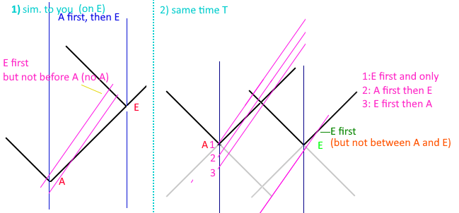  
Figure E-1 : On the left, would be based on the reasoning applied to get
a single answer. On the right, however, at some real time A(ndromeda)
and E(arth) have breakfast, and the light cones of those events are
drawn in black; probably the thickness of the line is the entire
duration of that event. Depending on when the ship passes Andromeda at
some high speed, they could see (1) earth first, and then never
Andromeda, if they passed Andromeda after breakfast was eaten. (2) that
they see andromeda first and then earth. Or (3) that they could see
earth first and then andromeda. Another line between 2 and 3 could be
drawn that would intersect in the middle when the light cones intersect,
and they could say they were simultaneous. The 4th line off
the bottom would also show Earth first and Andromeda some long time
later; but they would be past earth when they saw the earth event catch
up to them. This doesn’t even really care about the relatively variable
speed of light for the observing ship; it’s just a flat world line
graph.

I would think light cones in figure E-1 would be pretty much the
constant speed of light every frame can agree with. It’s also not a
matter of poor phrasing of the question, but rather is an inherent flaw
in Lorentz Transform that students will just have to ‘shut up and
calculate’ since there’s no other means to reason the solution.

<https://phys.libretexts.org/Bookshelves/University_Physics/Book%3A_University_Physics_(OpenStax)/University_Physics_III_-_Optics_and_Modern_Physics_(OpenStax)/05%3A__Relativity/5.06%3A_The_Lorentz_Transformation>
This link has a section about halfway down that is basically the same
scenario, and uses the Lorentz Transform in the same way that would get
‘B’ as an answer. I didn’t record the math of another person who helped
the questioner, since it was the same sort of terms as this.

In these scenarios the observer that is ‘between’ Andromeda and Earth or
in the train is chained to the center of the train and is unable to
move. An observer that is ‘near the train’ is really under the train, or
the train is passing through them. Given those constraints, then since
the ship is moving from andromeda to earth, they must see the earth
event first and then andromeda. There is no freedom to intersect
anywhere in-between, but rather they must start from the center between
Andromeda and Earth.

# Appendix F (Wayback Demo Links)

Wayback Machine links to demos

These pages were captured to make sure they will exist – it is doubtful
the github sources will disappear… but anything can happen.

<https://web.archive.org/web/20231205094627/https://d3x0r.github.io/STFRPhysics/math/indexLightSpeed.html>

<https://web.archive.org/web/20231205115312/https://d3x0r.github.io/STFRPhysics/math/indexLightSpeed1.html>

<https://web.archive.org/web/20231205115526/https://d3x0r.github.io/STFRPhysics/math/indexLightSpeed2a.html>

<https://web.archive.org/web/20231205095133/https://d3x0r.github.io/STFRPhysics/math/indexLightSpeed3.html>

<https://web.archive.org/web/20231205094911/https://d3x0r.github.io/STFRPhysics/math/indexLightSpeed4.html>

<https://web.archive.org/web/20231205095346/https://d3x0r.github.io/STFRPhysics/math/indexLightSpeed-Clocks.html>

<https://web.archive.org/web/20231205084208/https://d3x0r.github.io/STFRPhysics/math/indexInterferometer4.html>

The Voxelarium demo is too complex – and relies on import; wayback wraps
the javascript in a function which makes the imports fail though.

# Appendix G (GR Hypothesis)

General Relativity was developed on the back of Special Relativity.
There are several factors of Special Relativity which have been
challenged, and probably in the case of the reality of relativity will
in turn affect General Relativity.

Before developing math for the one-way constant speed of light through
space, I had researched General Relativity and Einstein Field Equations.
I found that it would be possible to curve space directly, rather than
over time. The equation of
*S*2 = *c**T*2 + *V*2 is not symmetric
in this case; the propagation equations would be something of a
replacement for this expression. In General Relativity it’s taken that
everything moves at the speed C through space-time. Moving at the speed
of C for an object which has a low velocity means it’s moving quickly
through time to compensate. This idea would require each body to have
its own time, when in reality it seems there is only a single ‘now’
across the whole universe; a single moment of time. During each moment
of time things move, emit and receive photons, but there is nothing that
has already happened, which would be something that happens after ‘now’,
and things that have already happened no longer exist in that state,
there is no before ‘now’ that one could return to. The only thing about
time that changes is the speed of clocks, so having a different velocity
through time would be meaningless.

I started testing the compression idea using Geogebra, which provides a
free 3D graphing calculator.

-   [Geogebra 3D graph](https://www.geogebra.org/3d/mb5wpnu6) - I
    started testing the math here but subtracting |x| and |y|
    independently from the hyperbolic displacements make more of a bell
    curve instead of an arc; especially very close to 0.

Then I did some demos to test displacing straight lines by an extrinsic
curvature. Light travels straight lines through space, although due to a
displacement or curvature of space, the path may not be actually
straight.

-   [Single
    Source](https://d3x0r.github.io/STFRPhysics/math/mathSphereDecay) -
    This shows curvature for a single point displacement.

-   [4
    Sources](https://d3x0r.github.io/STFRPhysics/math/gravityFields.html) -
    This is four point displacements; the points do not move and do not
    scale with the displacement they generate.

-   [3D 4
    sources](https://d3x0r.github.io/STFRPhysics/3d/index-gravity-field.html) -
    3D stack of multiple planes; with the 'zLevel' set near 0, the
    planes of 'geodesic light paths' include the plane of the
    displacements.

-   [Inner Rotation Curve
    Explorer](https://d3x0r.github.io/STFRPhysics/3d/indexSphereMap3.html) -
    This explores what the frames are for the proposed filler curve;
    turns out to be geodesic rotations of a frame from one pole through
    the other and back to the start with the originating orientation.

It has been proposed that to curve space, that one additional dimension
is required. In the case of a 1-dimensional, straight line, it only
requires one dimension to represent, but requires 2 in a higher level to
bend the line, and 3 to curve the line into a helix. Similarly, if you
have a 2D plane, and make a hill in it, it requires an additional
dimension to represent, but you can also maintain the flat plane
orientation and curve it only in that plane. Finally, in the case of a
3D space, it might seem logical to propose that a 4th
dimension is required to curve it, but it doesn’t take a 4th
dimension in order to curve a block of clay into a vase.

Space as an incompressible medium could also be curved by just applying
a force to displace the space from its original position. This would
stretch/elongate the space around the displacement source, and to
maintain the same volume, would shorten in the direction perpendicular
to the displacement. The Geogebra graph above has a hyperbolic plane
that represents the ratio of compression of various levels.

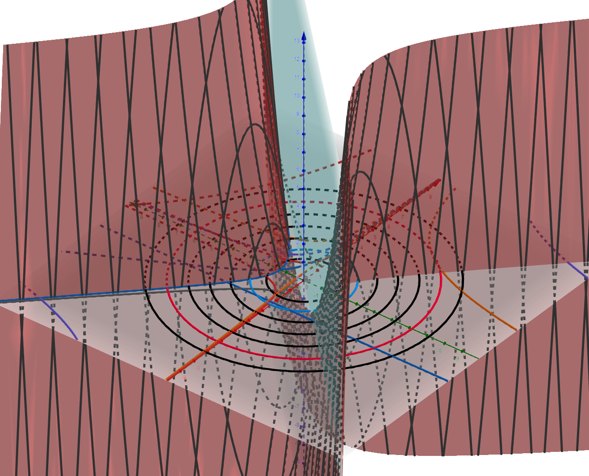  
Figure G-1 : Example graph from Geogebra calculator showing hyperbolic
surface, and falloff rings.

The falloff of the compression is $\frac{1}{r^{2}}$, which is the same
as the falloff of gravity. I haven’t fully developed and applied the
math for this to physics but did experiment with curvature as seen by
the Eddington Experiment. (I don’t find the notes I made, was somewhat
temporary, so there may be glaring errors) The displacement required at
the surface of the sun is only 9000km, to displace the path of light
through space the 1.75 arcseconds that was seen. Computing how much
space from the total mass of the sun, if it was filled entirely with
hydrogen atoms, gave a number for the size of a proton as 200fm. The
actual size is expected to be 3.3fm; there is a rather large discrepancy
and gets worse if considering that heavier atoms don’t displace much
more space.

## Hypothesis regarding the difference between calculation and experiment

Hypothetically, this difference is because of the way space is curved
around a mass. Since photons travel through space, the space very near a
mass will deflect the photon around the mass and not actually interact
with it. If the photon is exactly head on, then there isn’t so much
distinction about what direction to go around the mass, and there’s a
high degree of uncertainty. Since the wavelength of the measurement
occupies some lateral space, it will only really be able to detect the
displacement in space at a distance of the wavelength of the wave;
otherwise, the wave would likely all go around one side or another of
the mass, and not actually interact with it.

## Some other papers

These are some other long notes with images and examples.

<https://github.com/d3x0r/STFRPhysics/blob/master/math/TheNotBang.md>

<https://github.com/d3x0r/STFRPhysics/blob/master/math/mathSphereDecay.md>

## Gravitational Redshift

The Pound-Rebka experiment tested red and blue shift of heated Iron
emitting photons up and down a very tall tower at Harvard. Light emitted
from lower in a gravity well, will be in space that is stretched, but is
also compressed along the gravitational gradient, and as it goes up
enters space, which is less stretched, but relaxes in the length of the
space along the gravity gradient which is less compressed. Additionally,
the detector will be in space that is less stretched and be smaller than
expected; relatively it will detect a photon as more red shifted from
space with more stretch, while additionally the photon will already be
emitted as a wider version of itself and would seem red shifted compared
to a photon emitted in more compressed space. This process reverses and
causes a blue shift when light is emitted in compressed space and enters
more stretched space; the detector will be wider than a detector higher
in the gravity well and receive the wavelength as longer than it is, but
additionally the photon will be more compressed along the direction of
the gravitational gradient. It may be that the lateral
stretching/compression which happens affects the amplitude of the wave
while the stretching/compression along the length of a photon (although
at the speed of light, one would expect a photon to be contracted to 0
length, but it may be that this length contraction doesn’t apply as much
as the time it takes – since light is emitted in a wave the start and
end of the wave happen at different times, so the overall length of a
photon depends on the amount of time it took to emit it.

Any displacement that occurs is persistent and never actually
disappears. The space between galaxies across the universe is
cumulatively stretched by all of the galaxies that exist. Light which
passes through this space is progressively red shifted since the space
is effectively more and more stretched from the point of emission until
the point of reception. We only see photons that do not collide/interact
with something along the way. At one point I did a random source of
displacements of various sizes to see what the cumulative effect might
be.

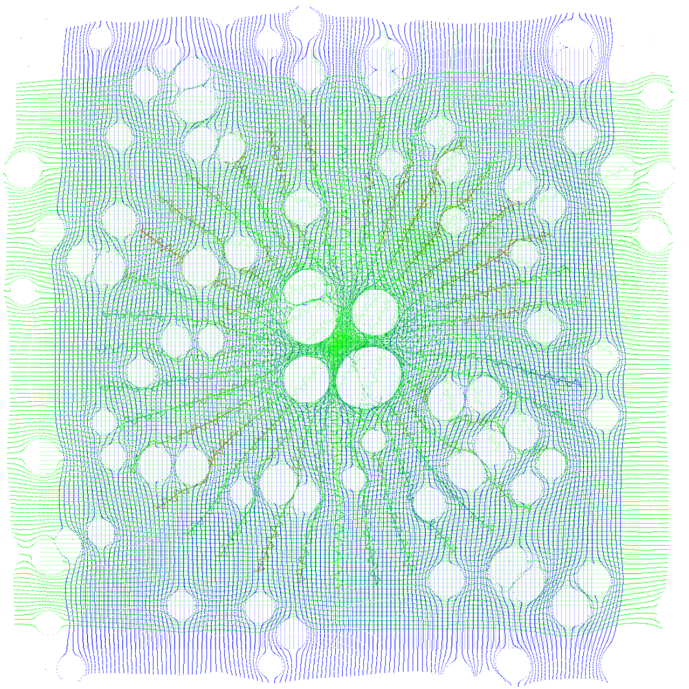  
Figure G-2 : An example of a bunch of displacements of space scattered
around. This makes for a fairly homogeneous expansion of space.

I later turned it into a more algorithmic demonstration:

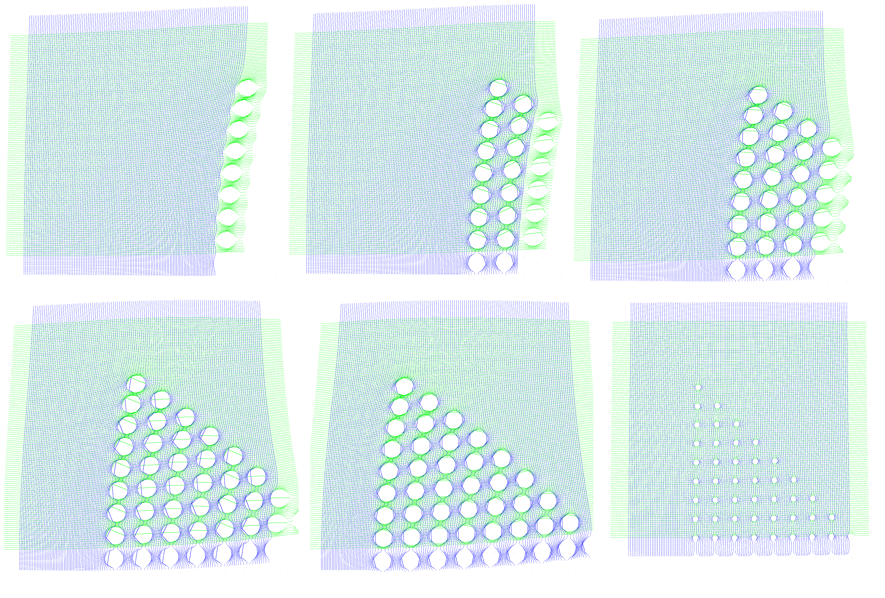Figure
G-3: Progressive expansion with a geometric distribution. Showing how
space has definitive cumulative expansion.

As more and more sources of displacement are passed, the space is
stretched more and more. But even this is not actually so obvious, since
all of the displacements along the bottom row also shove the space to
the left, which makes it look further to the left… until they are all
visible, then the right edge is somewhat stretched to the right (mostly
visible in the blue light geodesics).

The basic math is just $\sqrt{D^{2} + X^{2} + Y^{2} + Z^{2}}$ where D is
the displacement. This could be negative to test a negative curvature,
but in experimentation, a negative curvature, as it is assumed space
currently has around massive objects, would mean that a black hole would
block out an arc of the light behind it, and there would be space
missing; though hypothetically it could be a pocket into a imaginary 3
dimensions or an additional 3 dimensions beyond X,Y, and Z.

This calculation is really a very one-dimensional sort of calculation,
since it’s just a radial offset of a distance from its original
position. The $L = \sqrt{X^{2} + Y^{2} + Z^{2}}$ is just the distance
from a point of displacement to some point in space, and the
displacement might as well be $d = \sqrt{D^{2} + L^{2}}$. The summation
of multiple points of displacement must also be done such that the
closest point of displacement to the point is applied last. This allows
space to flow over a displacement, without being counter-displaced by
the last displacement. Algorithmically, just maintain 1 closest
displacement, until a closer displacement is found, and then replace the
closest with the new closest, then after all other displacements have
been applied, apply the closest.

## On Curvature

I had investigated parallel transport curvature on a surface for a
while, and setup [this curvature explorer
demo](https://d3x0r.github.io/STFRPhysics/3d/indexSphereMap2.html). It
takes 100 steps of some length around a curved surface and then turns a
specified angle 5 times. I also included taking one step, turning by a
fixed amount, and then taking another step for 100 steps. This was to
compare what taking a long chain of 100 step and turn to the step-turn
result ending up back at the pole (or at some point on the sphere).

The curvature of the sphere initially starts at very near 0, so it is
basically like walking on a plane, the curvature can go up quite high,
such that you can walk all the way around back to the pole before
turning, or that it might only take one turn to get back to the starting
pole by going 180 degrees around the sphere to its opposite pole.

The 3D rotation vectors are plotted too, and the difference in the Y
direction might be compared as the Ricci Tensor… (might as in, it’s
something like that but not exactly).

I realized that as curvature increased more and more (as one might
expect for a black hole), that really the radius was just tighter, and
effectively would be somewhat meaningless. The universe as far as we can
see IS flat, but space is locally curved. At that point, I dug deeper
into the Einstein Field Equations, to see what they would effectively
generate, and found they simplified to just adding a 4th
dimension to the length; although, it’s not really a 4th
dimension, it’s just a force that is otherwise outside of what we think
of as 3D space that photons travel through, but still within the 3
dimensions of space.

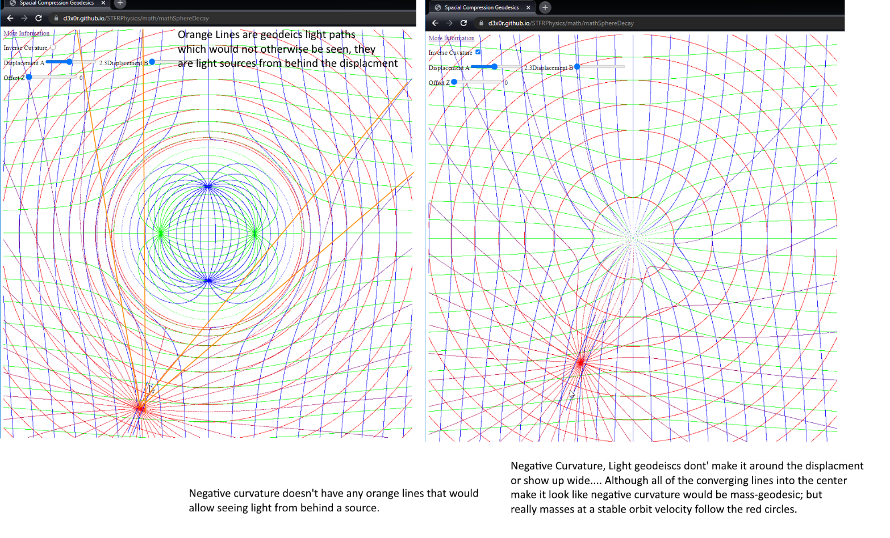  
Figure G-4: Comparison graph of positive curvature (on the left), and
negative curvature (on the right). Positive curvature inserts volume
into space, while negative curvature would subtract a volume of space.

## Gravity and Time Dilation (Contraction)

The time dilation caused by gravity is the same as travelling at the
escape velocity from that gravity well. Since time contraction is caused
by a clock having to cover more space in a certain time than it would if
it was stationary, this also gives how much space is stretched at a
level in a gravitational well.

# Appendix H (Paradoxes)

Since the inception of Special Relativity, people have challenged the
idea with many wonderful thought experiments.

## A Rotating Body

<https://en.wikipedia.org/wiki/Ehrenfest_paradox>

The radius does not contract, and light aberration happens, so an
observer in the middle of the wheel spinning with it observes no
particular change.

The specific moments at tangents to the wheel do contract, which
increases the space between the atoms, lowering their coupling forces,
and results in the wheel flying apart far before it gets to a huge
fraction of the speed of light. The lowered cohesion is overwhelmed by
centrifugal forces.

But assuming an ideal virtual spinning body, the local area of the disk
is always the same for an observer at any point on the disk. If the disk
is viewed from an external source, then distortions to the disk may be
observed. The opposing side of a disk viewed from a point on the disk
will travel potentially at 2c if the edge you’re on is rotating at c.

## A Neutral Buoyant Body

<https://en.wikipedia.org/wiki/Supplee%27s_paradox>

A contracted body which previously displaced an amount of water to
maintain its depth no longer displaces as much water around it, and
appears heavier, sinking.

## Two Ships Attached with a Thread

<https://en.wikipedia.org/wiki/Bell%27s_spaceship_paradox>

As the ships contract, and the thread contracts, it will eventually
break in many places at once at a sufficiently high velocity.

Saving property – the thread’s contraction can drag on the forward ship
causing it to not accelerate as much, since the force it applies get
amplified; if the ships were already going at a very fast rate, the
thread’s drag would be enough to stop them from contracting away; but at
a low speed, the thread would undoubtedly break.

## Ladder Passing Through a Barn

<https://en.wikipedia.org/wiki/Ladder_paradox>

This one is interesting. It depends on the observer’s position in the
situation. This is assuming also that the contracted length of the
ladder makes it still be longer than the barn; but even a ladder that
does fit in the barn, can be seen as extending past the barn, based on
the observation of the doors, or fitting entirely within the barn.

-   An observer in the barn, centered between the doors, only one door
    is open at a time.

-   An observer outside the barn, centered between the doors will see
    both doors open at some point, and the ladder didn’t fit.

-   An observer biased towards the first door that opens sees both doors
    closed at a time, and the ladder fit in the barn.

-   An observer biased towards the second door sees both doors open, and
    the ladder did not fit in the barn.

# Appendix I (Changelog)
