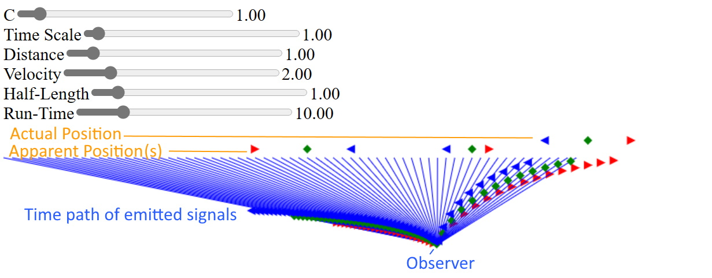

# Minimized speed of light test

## Demo

[Demo](https://d3x0r.github.io/STFRPhysics/math/indexLightSpeed.html) This is a brute force method of calculating apparent relative position of objects moving at some speed>0. The body emits Red at its head, Green at its center and Blue at its tail.  The emissions then go towards an observer; when they pass the observer, the apparent position is indicated on the reference line.

Sliders allow adjusting `C` or the speed of light, the time scale (run faster/slower), the distance of the observer from the line of the path being observed, velocity of the body moving along a line, Half-Length of the body (a length of 1 is 2, and is center (0) +L and -L); and the run-time... or how far into the past/future the time extends.

The 0 time event is centered on the line, and the simulation starts at -1/2 Run time; or -5 seconds with the default settings.  The default has the velocity at 2 times the speed of light, so for the first 5 seconds, you don't actually see anything, then you see an image of the ship continuing forward, and reverting backward to its source.  Neither of these images travel faster than the speed of light.

## The Math
At some time T, a body is at a position VT; the extents of the body are at `(VT+L)` and `(VT-L)`.  Each part of the body emits a signal at the position it is, and that signal time to the observer is recorded.

The position divided by the speed of light is how long that signal will travel to the observer.  

Observed time of head
$$T_O = \frac {\sqrt{{D}^{2}+\left({VT+L}\right)^{2}}} C+T$$

Real time observer at time `x` sees (head); should be able to have a function that includes the base time, and the position along the craft to get the following; I asked Wolfram Alpha to solve this... `solve for T  x=sqrt( D^2+(VT+L)^2)/C+T`.

$$f(x,L) = \frac{\sqrt{C^{2}D^{2}+C^{2}L^{2}+2C^{2}LVx+V^{2}\left(\ C^{2}x^{2}-D^{2}\right)}+C^{2}x+LV}{C^{2}-V^{2}}
$$

The above returns the real time from an observer time `T_O`, and an offset along the body (`L`).  The resulting time times velocity and then add the offset gives the real position of the body seen.  The above reverse equation has a singularity when `C` equals `V`; so this equation is used instead

if (V=C), then `V/C = 1`, so equation 1 simplifies to this...
$$T_O = \sqrt{\left(\frac{DD}{CC}+\left(T+\frac{L}{C}\right)^{2}\right)}+T
$$

And the inverse when (V=C) is this; which has a singullarity when C=0; which is irrelavent, if events don't propagate than they never go anywhere.  When `T_O=-L/C`; `-L/C` is the time the ship if first 'seen'; and is the oldest signal from the ship first; each closer signal has slightly more slope to get to the observer.
$$T = \frac {C^2 {T_O}^2 -  D^2 - L^2} {2 C (C {T_O} + L)}$$

(Note sections are potentially incomplete/inaccurate).
## Other notes...

### Dev Notes

a craft that is 3 long (-1,0,1) is moving along.

at any given time T the craft is a color that  cycles through colors by changing the hue.
(maybe the brightness/saturation can be scaled for distance? no?)

at some time T=1, the craft is centered on 2, and its color is green(or subgradient from red to green).   The observer is 1 unit away  from the point 0 that is centered... so 
at 0, the craft is seen 1 second after where it is, as red.

|T|  a| p | ends| observer|
|---|---|---|---|---|
| -1 | red | 0 |  -1,1| (observes pre-time) |
| 0 | green | 0 |  -1,1| (observes pre-time) |
|1 | blue | 2 | 1,3|   observes green-red, green-red past time positions other than the center |
| 2 | red | 4 | 3,5|  1.414 seconds for tail(partially red-green at +1 tick) and sqrt(10)=3.16 to see the front) |
| 3 | green | 6 | 5,7| 

so at T=2, the observer needs to know how far the ship would have gone to have a light line that is 2 long.

(center-tail)
$$t*t = (x+vt)^2 + d^2$$
$$ \sqrt(t^2-d^2)-vt=x $$

at T=1 I do see the center at 0, but the front would be from a time in the past... so it wouldn't be where it is, based on its velocity.... because when I do see it at T=1.414 both the head and tail are in the same (correct 1:1 ratio) position... and green.

At some time T<0, the front of the space craft would have been seen at T=1 ... T=-0.1  H= c+h+vt; 
A=time 
B=time offset

A+B=1

(A+B) = 
c+h+vB ; c+h+v(T-A)

FTL condition...
T=-1; observer won't see anything, until after 0 (get hit with the bullet before seeing it).
T=0; observer doesn't see anything
T=0.5; observer sees nose of craft pass 0 point.
T=1, observer sees the craft center pass the 0 point. (some time before 1 it can see some thing?)
T=1.5, observer sees tail of craft pass 0 point.

T= 2, observer sees the craft receeding where it came from, and where it's going to; but slower than the craft actually goes. light from the past is finally getting to this point

STL condition...
T=-1; observer sees at a distance; all of the images will be superimposed on each other... 
T=0; 
T=1; observer sees the craft center at 0
T=2, observer sees the craft past the center, all light from past is gone

T=-0.5, H=0, and is 1 second away; but this will appear at 0.5 then, so 0.5 seconds after need 
T=-0.3, H = (C+H+VT)
T=0.5, T=0, and is 1 second away.

I can scale the X into a total time.
How do I find out when the Head is seen at a time T?  The time T at say 1.1 

1) real position of the object
2) apparent position of the object (1 second later)

sqrt( xx - CC) = +/- numberline seen at some time given C propagation

when head is at that number... sqrt( (x+h)^2 - CC ) = +/-

v=2 (2x speed of light)
d=1 (closest distance)
c=1 (speed of light)
T_r = sqrt( xx+dd/cc )

X_r = +/- sqrt( xx - dd/cc )

T=0 does not see anything on line... 
T_1=D/C first instanct closest point can be seen.

T_1 + 0.1 can see  

X_r(T_1+0.1) is a spot I see.
The ships front was at that spot at (C+H+v)
P_h=tv+1; T=(P_h-1)/v

?? X_r(T_1+0.1) = (P_h-1)/v  

T=x

$$(L V + C^2 x - sqrt(C^2 D^2 + C^2 L^2 - D^2 V^2 + 2 C^2 L V x + C^2 V^2 x^2))/(C^2 - V^2)) $$

$$(C^2 (1 - (V (L + V x))/sqrt(C^2 (D^2 + (L + V x)^2) - D^2 V^2)))/(C^2 - V^2)$$
