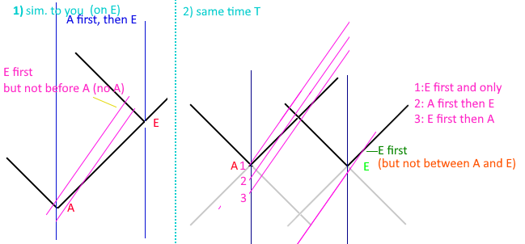

# Reality of Relativity

I started this project ([step-by-step](https://github.com/d3x0r/STFRPhysics/blob/master/LightSpeedSim.md#Step-by-Step)) to observe first what it would look like to see something going faster than the speed of light (faster than the speed of sound, faster than waves in water...).  
I didn't concern myself so much with practical limitations like clocks would tick backwards at faster than the speed of light (even clocks that are seen).  I've later refined portions of this to include special relativity.

## Demos

~~[Demo + Special relativity](https://d3x0r.github.io/STFRPhysics/math/indexLightSpeed-SR.html) not completed...is just 
about showing clocks... ~~

[Demo](https://d3x0r.github.io/STFRPhysics/math/indexLightSpeed.html) This started with a brute force method of calculating apparent relative position of objects moving at some speed>0. The body emits Red at its head, Green at its center and Blue at its tail.  The emissions then go towards an observer; when they pass the observer, the apparent position is indicated on the reference line.  This also has a function to reverse calculate, and show a computed observed position.


Sliders allow adjusting `C` or the speed of light, the time scale (run faster/slower), the distance of the observer from the line of the path being observed, velocity of the body moving along a line, Half-Length of the body (a length of 1 is 2, and is center (0) +L and -L); and the run-time... or how far into the past/future the time extends.

The 0 time event is centered on the line, and the simulation starts at -1/2 Run time; or -5 seconds with the default settings.  The default has the velocity at 2 times the speed of light, so for the first 5 seconds, you don't actually see anything, then you see an image of the ship continuing forward, and reverting backward to its source.  Neither of these images travel faster than the speed of light.


## The Math

Each part of the body emits a signal at the position it is, and that signal time to the observer is recorded.

At some time T, a body is at a position VT; the extents of the body are at `(VT+L)` and `(VT-L)`.  
A relatively stationary observer, at some `D` distance from the body; then `Do = sqrt(DD+(VT+L)^2)` is the photon has to travel
to the observer.  `To = sqrt(DD+(VT+L)^2)/C` is the time it takes (the C can be factored into the expression as `C^2`).  (Special case `D=0`,`L=0`, `To = TV/C`).


The relative distanct to the position divided by the speed of light is how long that signal will travel to the observer.  

Observed time of (some position along body L) ( head, center, tail)

$$T_O = \frac {\sqrt{{D}^{2}+\left({VT+L}\right)^{2}}} C+T$$

Real time observer at time `x` sees (head); should be able to have a function that includes the base time, and the position along the craft to get the following; I asked Wolfram Alpha to solve this... `solve for T  x=sqrt( D^2+(VT+L)^2)/C+T`.

$$f(x,L) = \frac{\sqrt{C^{2}D^{2}+C^{2}L^{2}+2C^{2}LVx+V^{2}\left(\ C^{2}x^{2}-D^{2}\right)}+C^{2}x+LV}{C^{2}-V^{2}}$$

The above returns the real time from an observer time `T_O`, and an offset along the body (`L`).  The resulting time times velocity and then add the offset gives the real position of the body seen.  The above reverse equation has a singularity when `C` equals `V`; so this equation is used instead:

if (V=C), then `V/C = 1`, so equation 1 simplifies to this...
$$T_O = \sqrt{\left(\frac{DD}{CC}+\left(T+\frac{L}{C}\right)^{2}\right)}+T$$


Simplified, and this is again still having a sqrt, which has to be at least an absolute value on the distance from the observer. (D=0, L=0) $$T_{real}\left(x\right)=\frac{\sqrt{VVCCxx}+CCx}{CC-VV}$$ 
or
$$T_{real2}\left(x\right)=\frac{VC\left|x\right|+CCx}{CC-VV}$$

And the inverse when (V=C) is this; which has a singullarity when C=0; which is irrelavent, if events don't propagate than they never go anywhere.  When `T_O=-L/C`; `-L/C` is the time the ship if first 'seen'; and is the oldest signal from the ship first; each closer signal has slightly more slope to get to the observer.
$T = \frac {C^2 {T_O}^2 -  D^2 - L^2} {2 C (C {T_O} + L)}$

https://mathb.in/74833

### Space time index

https://geogebra.org/3d/bsv5xcnx

The graph shows light seconds away, and how long ago you're seeing that point.

$$b(x,y,z)=-\sqrt {  (|x|*(x<0,  \frac { C+V} {C-V}, {\frac { C-V} {C+V} } ))^{2}+(|y|\frac {\sqrt{ C C+ V V}} {C})^{2} + (|z|\frac{\sqrt{ C C+V V}}{C})^{2}}$$

Then if space was moving, instead of myself... [Demo](https://d3x0r.github.io/STFRPhysics/math/indexLightSpeed3a.html)

`b(x,y,z)*V+x, y, z`

## Gamma

https://www.desmos.com/calculator/fbl7sujtzp

This is derrived from a clock perpendicular to the velocity, that each time a photon hits a side of the clock is 1 tick.

Lorentz Gamma: $f\left(x\right)=\frac{c}{\sqrt{cc-xx}}$ or $\frac{1}{\sqrt{\left(1-\frac{xx}{cc}\right)}}$

At a fraction of the speed of light, a body feels a certain effective speed; which is their real speed * gamma.  The following function
takes some speed a body feels like it is going, and results in the fraction of the speed of light.  (which can conversely be taken to 
determine that this is the speed the moving body feels)

Velocity Lorentz Real for feels like x:  $V_{lr}\left(x\right)=\left(\ \frac{cx}{\sqrt{cc+xx}}\right)$

This is the gamma factor for two-way speed of light...

Two-Way SoL Gamma: $g\left(x\right)=\frac{cc}{cc-xx}$ or $\frac{1}{1-\frac{xx}{cc}}$

which comes from, A+B=2C; a=A/C; b=B/C; a+b=2; that going one way and the other way is 2 ticks.  The time between one side and the other
may be different, as long as the total of 2 bounces is 2 ticks.

from: $a+b=2$, $a=c/(c+x)$, $b=c/(c-x)$, $1=1 second$, $\frac{c}{2\left(c+x\right)}+\frac{c}{2\left(c-x\right)}=1 = \frac{cc}{cc-xx}$

Again the inverse from feels like to real velocity, but for the two-way speed of light.

Velocity Real for Feels like x: $V_{r}\left(x\right)=\frac{\left(\sqrt{\left(c^{4}+4c^{2}x^{2}\right)}-cc\right)}{2x}$ 


### Lorentz Problem

This is a more typical example was on Physics Discord...

---

"While you're having breakfast in the morning, a creature in the Andromeda galaxy is doing the same. We call the two breakfast events event X (on Earth) and event Y (in the Andromeda galaxy). "Simultaneously" means simultaneous in your reference frame. If instead we describe the two events in another reference frame, that of a space traveler who is traveling at a very high speed from the Andromeda galaxy towards Earth, which of the following statements is correct?

  - A. Event X and event Y are simultaneous.
  - B. Event X occurs before event Y.
  - C. Event Y occurs before event X.
  - D. The question is not well-defined, as we cannot define simultaneity for events that do not occur at the same place in space.

I get that it has something to do with that the traveler is going at relativistic speeds which means things will move slower relative to him. I just don't get how the gamma factor ties in to the problem context"

---

I solved this as above, but assuming that a moving observer would basically see the same times as the other sim (Although, to get a single answer, I had to interpret that the breakfast was simulateous *to 'you' eating breakfast*);
otherwise there are multiple choices.  And even made an image.



Which shows the light cones of the problem, and several observers in different times, all going exactly the same speed (was very careful to copy the lines and not re-draw them); which clearly shows observers that can answer more than one
answer... The conversation continued, and then we have to go learn about the derviation of the Lorentz Transform (including gamme factor); not just the derivation, but the justification of why that math works.

[This demo](https://d3x0r.github.io/STFRPhysics/math/indexLightSpeed2a.html) was revised, to calculate a different projection factor from a large relatively stationary event that occurs at 2 distant places.   (The Half-(L)ength must be large).

There is a triangle, `CT` that is for some time seconds the speed of light long.  Another side is the distance from the observed events (defaults to 1 light second offset, gives the observer some space to avoid planets events might be generated on).
The other side is the current position `A` of the craft relative to an event (the event on the left is `-L` and the event on the right is `L` in terms of the demo), plus the craft's actual postion `VT` or some velocity in time.

$$(CT)^2 = (D)^2 + (A+VT)^2$$ 

solved for T...

$$A=((TV)- (+L))$$

$$\frac {AV+ \sqrt { A^2C^2+D^2(C^2-V^2)}} {C^2-V^2}$$

and some tinkering with refactoring

$$\frac {((TV)- (+L))V+ \sqrt { (((TV)- (+L)))^2C^2+D^2(C^2-V^2)}} {C^2-V^2}$$
 
since the problem assumed `D=0` then this will simplify...

$$\frac {(TV-L)(V+C)} {C^2-V^2}$$

$$X = TV $$

$$\frac {(X-L)(V+C)} {C^2-V^2}$$

This is getting closer to the lorentz transform than the above... but still to use this time span, it has to be added to the current time `T`...

``` js
	hLen = /* time until light emission from head and ship intersect*/ A=TV-L
		// f(T,TV-L)
	tLen = /* time until light emission from tail and ship intersect*/ A=TV-(-L)
		// f(T,TV-(-L))

		const nowE = (del * runT)-runT/2;
		frame.hue =120*(Treal%3)-240;
		frame.Pc = Treal*V;
		// position head intersects observer
		frame.Ph = frame.Pc + hLen*V;
		frame.Pt = frame.Pc + tLen*V;
		frame.T_start = Treal;

		// time head intersects observer
		frame.T_see_h = Treal+hLen;
		
		// time tail intersects observer
		frame.T_see_t = Treal+tLen;

```

### Homework Reframed

Okay looking at https://phys.libretexts.org/Bookshelves/University_Physics/Book%3A_University_Physics_(OpenStax)/University_Physics_III_-_Optics_and_Modern_Physics_(OpenStax)/05%3A__Relativity/5.06%3A_The_Lorentz_Transformation
example 5.6.3; the phrase 'an observer' doesn't mean any observer, but a specific observer. 

[This demo](https://d3x0r.github.io/STFRPhysics/math/indexLightSpeed3.html) has an observer tied to the train.  Instead of a Distance from the train, you can postion the observer in the train.

This is non-lorentz transformed, and probably falls under a Gallilean relativity; arguably, I could put a mesh of sensors which must also receive the light around the train at the speed of light, so the inside
experience can't be much different; arguably a laser sensor of the occupant would measure the position in proper light speed/2 ticks.

``` js
" T:" + (-2*(C*D2+L*V)/(C*C-V*V)).toFixed(2) + " O:"+ (-2*(C*D2+L*V)).toFixed(2);
```
Difference in time, that an external observer notes between when the chained observer will first see the light to when they will see the other simultaneous event.

$$\frac{ -2(CD+LV)}{CC-VV}$$

Difference in time, noted by the observer on the train between the signals.

$$-2*(CD+LV)$$


# Connection to Quantum Mechanical Correlations

The above last two sections, to answer a textbook question (still can't get the 'right' answer, so I shouldn't help people with their homework or to learn the material everyone else has learned.)   I just derrived it all myself.

The 'gamma factor' in Lorentz Transform is just a clock scalar, and is applied to the `T`, which is really used for everything else since `position= V*T`, and time Passed is T... so everything that has time gets gamma if you just scale the clock. 
(see previous demo - Homework Rework).

[Quantized Probablity](https://github.com/d3x0r/STFRPhysics/blob/master/QuantizedProbability.md) was a earlier project, using a LHV of quantum mechanics called 'spin axis' led me to this method of calculation QM probabliities.
It's within 3% of QM predictions, which is less than experimental apparatus error bars...

```
		//2(CD+LV)/(CC-VV)

		// 2D  //  V=0, L=any(any time after a fixed start point is same), C=1  sqrt(1-v/c)=1
		// A+B = 2D
		// a = A/D   b = B/D
		// a+b=2
		// 1-a/b = b/a-1 = 0   QM balance.
```


(Note sections are potentially incomplete/inaccurate).

## Generalized to 3D Vectors

`(D,E,F)` and `(J,K,L)` are velocity vectors; T is the real time, and S is the observed time.

$S = \frac { || {(X, Y, Z) + (D, E, F) T - (J, K, L) S} || } {C} + T$; solve for S and for T.

$S = \frac { \lVert {\overrightarrow{X}-\overrightarrow{X_o} + \overrightarrow{V} T - \overrightarrow{V_o} S} \rVert } {C} + T$ 

$S = \frac {\sqrt{(-C^2 T + D J T + E K T + F L T + J X + K Y + L Z)^2 - (C^2 - J^2 - K^2 - L^2) (C^2 T^2 - D^2 T^2 - 2 D T X - E^2 T^2 - 2 E T Y - F^2 T^2 - 2 F T Z - X^2 - Y^2 - Z^2)} + C^2 T - D J T - E K T - F L T - J X - K Y - L Z}{C^2 - J^2 - K^2 - L^2}$

$T = \frac {\sqrt{(-C^2 S + D J S + E K S + F L S - D X - E Y - F Z)^2 - (C^2 - D^2 - E^2 - F^2) (C^2 S^2 - J^2 S^2 + 2 J S X - K^2 S^2 + 2 K S Y - L^2 S^2 + 2 L S Z - X^2 - Y^2 - Z^2)} + C^2 S - D J S - E K S - F L S + D X + E Y + F Z}{C^2 - D^2 - E^2 - F^2}$

For a more general 3D case, with Y aligned with direction of D to path; Z aligned perpendicular to the line, and X aligned with the original L direction on the line.

Implemented as a 3D graph here for X/Y plane, shows T seen as Z.  https://geogebra.org/3d/ckphajff

---
Another refactor of above

$$T_o = \frac { \lVert ({\overrightarrow{X}-\overrightarrow{X_o}) + \overrightarrow{V} T - \overrightarrow{V_o} {T_o}} \rVert } {C} + T$$

$$\overrightarrow{a}=(\overrightarrow{X}-\overrightarrow{X_o})-\overrightarrow{V_o}T_o $$

$$A = C^2{T_o}^2 - \overrightarrow{a}\cdot\overrightarrow{a}$$

$$B = C^2{T_o} + \overrightarrow{V}\cdot\overrightarrow{a}$$

$$D = C^2-\overrightarrow{V}\cdot\overrightarrow{V}$$

if( D ~ 0 ) $T = B/2A$ else $T = \frac {\sqrt{ B^2-DA } +B} {D}$
---


## Time Dilation 
According to special relativity

(?) = m-m/s-s-s-s - m-m/s-s
$$ \Delta s^{2}\,=\,c^{2}\Delta t^{2}-\Delta x^{2}$$


Speed Scalar (Real to observed)

$$ T_S(x) = \frac {x} {\sqrt { CC-xx }} $$

Speed Scalar (observed to Real)

$$ T_R(x) = \frac {Cx} {\sqrt{xx+1 } } $$

Time scalar (observed velocity to real time scalar)

$$ \sqrt{CC - T_R(x)^2}$$

$$ \sqrt{CC - \frac {CCxx} {xx+1}} = C/\sqrt{(xx+1)}$$

## Extended clock rotations

[This Demo](https://d3x0r.github.io/STFRPhysics/math/indexLightSpeed4.html) Allows changing the direction of the velocity,
while keeping the orientation of the moving frame the same direction.  This then required a function like this...

$$f\left(a\right)=\frac{\left(\sqrt{\left(\left(\left(-VVXX\right)\sin\left(a\right)\sin\left(a\right)-VVYY\cdot\cos\left(a\right)\cdot\cos\left(a\right)+2\cdot VVXY\ \cdot\sin\left(a\right)\cdot\cos\left(a\right)+CCXX+CCYY\right)\right)}+VX\cdot\cos\left(a\right)+VY\left(\sin\left(a\right)\right)\right)}{\left(CC-VV\right)}$$

to compute when the observed signal would go away.  (position is not draw ATM).

https://www.desmos.com/calculator/ryles5r3h4 https://www.desmos.com/calculator/qucxqp3wsq These graphs encapsulate
 the various parameters... Across the X axis is angle
of the velocity.  This shows the various speeds observed from various angles around an offet.  
The X and Y parameters are the X and Y
offset from a point source emitter. I did add green and blue horizontal lines, and a vertical marker for 90 degree rotation.
At 90 degrees, the clock should work like the standard Lorentz Transformation clock.  The green line intersects with the
Purple and is the computed Loretnz gamma factor.  The Blue horizontal line is 1/2 max+min clock speeds - as if the clock
was always horizontal. There's probably a third option that's roughly the average of the areas under the curve.

The second graph I added (f(x)+f(x+pi)/2) and the mid point of that would probably be a best choice.
I'm really fine with either gamma factor... neither corrects every condition enough to matter.

Result maybe - (C+sqrt(CC-VV)) / 2(CC-VV)

6 way speed of light doesn't appear to be much better... https://geogebra.org/3d/twjua74e
Using a 4 way speed of light calculated with `(f(x)+f(x+pi/2)+f(x+pi)+f(x+3*pi/2))/4` is actually itself
fairly constant.  This is slightly slower occastionally than the worse-case two-way and one-way gamma factors averaged.
But, is the minimum error at either worst/best cases, and inbetween has only a slight error at even `0.404c` at which 
time it's about a 1% deviation.  (https://www.desmos.com/calculator/pbconetjkf)


## STFR Take on it

$$\theta = angle-in-cycles$$
Lambda is the unit cycles
$$\Lambda$$

frequency(phi) * wavelength(omega) = speed of light
$$\phi\omega = \frac \Lambda s * \frac m \Lambda = c $$
arc length is cylces per second times meters per cycle.  
$$ arc-length = \frac m \Lambda * \frac \Lambda s $$sqrt( Spin in arc-length squared plus velocity squared ) = speed of light
$$\sqrt {S^2  + V^2} = c  $$

a = sqrt( cc - at at ); v = at
v = at
p = 1/2 at^2 + vt 


### Dev Notes

( incomplete sentence fragments follow.  This was setting up how to think about the points... )
a craft that is 3 long (-1,0,1) is moving along.

at any given time T the craft is a color that  cycles through colors by changing the hue.
(maybe the brightness/saturation can be scaled for distance? no?)

at some time T=1, the craft is centered on 2, and its color is green(or subgradient from red to green).   The observer is 1 unit away  from the point 0 that is centered... so 
at 0, the craft is seen 1 second after where it is, as red.


|T|  a| p | ends| observer|
|---|---|---|---|---|
| -1 | red | 0 |  -1,1| (observes pre-time) |
| 0 | green | 0 |  -1,1| (observes pre-time) |
|1 | blue | 2 | 1,3|   observes green-red, green-red past time positions other than the center |
| 2 | red | 4 | 3,5|  1.414 seconds for tail(partially red-green at +1 tick) and sqrt(10)=3.16 to see the front) |
| 3 | green | 6 | 5,7| 

so at T=2, the observer needs to know how far the ship would have gone to have a light line that is 2 long.

(center-tail)
$$t*t = (x+vt)^2 + d^2$$
$$ \sqrt(t^2-d^2)-vt=x $$

at T=1 I do see the center at 0, but the front would be from a time in the past... so it wouldn't be where it is, based on its velocity.... because when I do see it at T=1.414 both the head and tail are in the same (correct 1:1 ratio) position... and green.


At some time T<0, the front of the space craft would have been seen at T=1 ... T=-0.1  H= c+h+vt; 
A=time 
B=time offset

A+B=1

(A+B) = 
c+h+vB ; c+h+v(T-A)


FTL condition...
T=-1; observer won't see anything, until after 0 (get hit with the bullet before seeing it).
T=0; observer doesn't see anything
T=0.5; observer sees nose of craft pass 0 point.
T=1, observer sees the craft center pass the 0 point. (some time before 1 it can see some thing?)
T=1.5, observer sees tail of craft pass 0 point.

T= 2, observer sees the craft receeding where it came from, and where it's going to; but slower than the craft actually goes. light from the past is finally getting to this point

STL condition...
T=-1; observer sees at a distance; all of the images will be superimposed on each other... 
T=0; 
T=1; observer sees the craft center at 0
T=2, observer sees the craft past the center, all light from past is gone

T=-0.5, H=0, and is 1 second away; but this will appear at 0.5 then, so 0.5 seconds after need 
T=-0.3, H = (C+H+VT)
T=0.5, T=0, and is 1 second away.

I can scale the X into a total time.
How do I find out when the Head is seen at a time T?  The time T at say 1.1 


1) real position of the object
2) apparent position of the object (1 second later)


sqrt( xx - CC) = +/- numberline seen at some time given C propagation

when head is at that number... sqrt( (x+h)^2 - CC ) = +/-


v=2 (2x speed of light)
d=1 (closest distance)
c=1 (speed of light)
T_r = sqrt( xx+dd/cc )

X_r = +/- sqrt( xx - dd/cc )

T=0 does not see anything on line... 
T_1=D/C first instanct closest point can be seen.

T_1 + 0.1 can see  

X_r(T_1+0.1) is a spot I see.
The ships front was at that spot at (C+H+v)
P_h=tv+1; T=(P_h-1)/v

?? X_r(T_1+0.1) = (P_h-1)/v  

T=x


$$(L V + C^2 x - sqrt(C^2 D^2 + C^2 L^2 - D^2 V^2 + 2 C^2 L V x + C^2 V^2 x^2))/(C^2 - V^2)) $$

$$(C^2 (1 - (V (L + V x))/sqrt(C^2 (D^2 + (L + V x)^2) - D^2 V^2)))/(C^2 - V^2)$$

what about turning the clock?  $\frac 1 {C+V(2-\sin(\theta))} + \frac {1} {C-V(2-\sin(\theta))} = 2C$  then 90 degrees the velocity part disappears... really probably should still include lorentz 1-way...

simulation 3: D = -V  sqrt( D^2 + (L+V)^2 )  L-V
   // at a frame, position = ( cos(A)VT+L,sin(A)VT )
   //  is seen at ( D_2+cos(A)V(T+T_2),D+sin(A)V(T+T_2) )
   //  
   //  CT_2 = sqrt( ((D_2+cos(A)V(T+T_2) - cos(A)VT+L)^2 +
                    ((D+sin(A)V(T+T_2)-sin(A)VT)^2 ) ) )

   //  CT_2 = sqrt( ((D_2+cos(A)V T_2 - L)^2 +
                    ((D+sin(A)V(T_2))^2 ) ) )

`solve C*T_2 = sqrt( ((D_2+cos(A)V*T_2 - L)^2 +       ((D+sin(A)*V*(T_2))^2 ) ) ) for T_2 `

```
T_2 = (sqrt(V^2 (-2 D sin(A) - 2 D_2 cos(A) + 2 L cos(A))^2 - 4 (-D^2 + 2 D_2 L - D_2^2 - L^2) (-V^2 sin^2(A) - V^2 cos^2(A) + C^2)) - V (-2 D sin(A) - 2 D_2 cos(A) + 2 L cos(A)))/(2 (-V^2 sin^2(A) - V^2 cos^2(A) + C^2))

```


---
# SR Devnotes

'if two observers have clocks, and are in motion relative to one another at high velocities, then each should see the other's time as moving slower than theirs. when they meet back up, what determines which observer's clock has ticked more?'  from a user on physics discord.. 

"depends on whether they are approaching or leaving each other whether they see clocks tick faster or slower; a rule I saw someone say was the one that accelerated more will have the slower clock (much like someone deeper in a gravity well has a slower clock and feels like there's more acceleration).   " ... 

and then I could continue on... but this is only a bit of it
" If one was travelling towards the other at the speed of light, then all of its clock ticks would be seen at once which makes for seeing a very fast clock.  (although if they are each going 1/2 the speed of light toward each other, then the light has time to travel away and ahead of each, so you don't see all ticks at once).  "

Because then, with SR, the lightspeed craft has 0 ticks, and the clock doesn't 'go' and the stationary observer sees for all time that it was the same tick until some point before the craft was AT light speed.

But then shifting the problem, they are each `sqrt(2)/2`  for their time scalar, so I should then apply that to when ticks are emitted from their clocks (in theory each tick generates a photon that can be seen at some point in the future...)

At emmision, the photon source knows its position, and it is treated as a stationary point, and the other end is the difference in velocities to calculate where the light has to go, to know how long the light will take to get to be seen....

'ticks in the air'  is really where the missing information on the clocks goes, other than when a clock is also retarded.  Tron experiment, it was decided that the slowest clock would be used as the tick rate for the game;   This means in terms of the simulator, players that are going slower than the fastest player goes even slower....  The world clock ticks VERY fast overall though.

### Tron-lightcycles

There's several frames of importance - the arena, and the people in it, and each player's local frame.

A player going 0.707x LS  means the world is 1.414x faster (vendors in the stands would rush around)   
A player going 0.894x LS means the world is 2x faster(?) not really - but the player is feeling like 2x the speed of light.   so anything from light sources is received 2x as fast?  Then how is the other 1.414x at 1x speed of light?


## math/indexLightSpeed-SR.html

Initial conditions...
1) both bodies start at some negative time T such that at T=0 both observe a signal sent from the other (including offset between them).
2)  `T=Math.sqrt( (D*D)/(C*C) / (C*C-V*V));` given V=Real velocity (sublight).
3) the next signal they emit will be ... 


# Revisited Math

Basic Posulates 
  - the two way speed of light is measured as C.
  - the clock dialation is measured with a horizontal photon clock, that is parallel to the direction of travel.   Classically the photon clock is arranged to be perpendicular ot the direction of travel. 
    This has problems, that you would have to angle the mirrors based not only on your acceleratinn but on your velocity.  Instead the photon clock is put in the worst-case scenario.  The dilation is then computed with 


```
  tf(x) = L/(C+V)  // time of front - moving forward, signals from head are C+V.
  tb(x) = L/(C-V)  // time of back - signals from the rear are C-V.
  c(x) = 1/C     // the unit length of the length of the clock

  tf(x)+tb(x) = 2LC

// well... this scalar is from the triangles?   
//  d(x) = CC/(CC-VV) // clock scalar (result)
//         C/2 (1/(C+V) + 1/(V-C)
//

   (ta(x)+tb(x)) * ((CC-xx)/CC) = 2LC(seconds)

```

I don't see how light in every direction in every frame is the speed of light in one direction; especially when moving very fast, the light from the back of the craft to an observer in the middel and the time from the front are logically different.


This makes what feels like travelling at the speed of light only `0.6184` time the speed of light with an unscaled clock; this is the golden ratio.

# Step-by-Step

This is a detailed summary of how I approached building the simulation.

 - define the speed of light C.  This is a value that starts at 1, but can be changed (and should be to confirm equivalent realtionships).
 - define a train having length 2L.  +L is the head of the train and -L is the tail of the train with the center of the train at 0.
 - define an observer that is some distance D from the train (don't want them(it?) to be run over).
 - define a variable V that can be used to control the velocity of the train(or observer).
 - define a run length 2R, such that that time goes from -R to R.
 - define a clock that has 'now', and picks a moment between -R to R.
 - define storage `frames=[]` for the above, a number of steps(N) are allocated ahead of time.

 - create a canvas/drawing surface
 - figure out an x/y spatial coordinate system for that surface. I'm working around '1' so maybe +/-10 across the drawing surface?
 - multiple points of view of situations look different; and since this is about what's being observed by an observer in a situation, there are several independant modes.
   - one simulation with a stationary observer and a moving train.
   - consider more general situation of V1 and V2... or `V` and `V*ratio` where the ratio is like +/-100%.
   - another simulation with a stationary train, and a moving observer.
   - another simulation with a moving train which has on it a stationary observer.
 - first simulation
   - for each step to compute each frame's information  `frame = frames[step]`
     - `T = frame.time = step/steps * 2*R - R`.  Scale the steps from -R to R run time.
     - `frame.hue = (frame.time % 3)*120`.  Assign a color per second to the frame, this helps later to know which time you're seeing now.
     - `frame.position = T * V`.  At a constant velocity the position of a body is VT.
     - `frame.head_position = V*T+L` and `frame.tail_position = V*T-L`
     - `Math.sqrt( D*D + (V*T+/* 0, +L, -L*/)*(V*T+/* 0, +L, -L*/))/C`. Compute how long light takes to get from each of the previous positions to the observer.  The observer has a position `D` perpendicular to the body moving.  The distance divided by the speed of light = Time.
     - `frame.observed_center = Math.sqrt( D*D + V*T*V*T )/C + T`;  The final time that it will be seen by the observer is the frame's now plus the time it takes for light to get from a point to another point.
     - `frame.observed_head = Math.sqrt( D*D + (V*T+L)*(V*T+L) )/C + T`; ...
     - `frame.observed_tail = Math.sqrt( D*D + (V*T-L)*(V*T-L) )/C + T`;  ...
     - together, the last three are referred to as 'frame.observed_times' and means do the same thing to all 3; frame.observed_time refers to any one of the 3.
   - draw the resulting frames...
     - for some 'now' if `frame.time < now` draw the frame.  If any of the frame.observed_times are less than now, then it no longer needs to be drawn.
     - draw markers of the photons scaled from the origin point (frame.position, 0) to (0, D), iterated by (now-frame.time)~0 and (frame.observed_time-frame.time)~1; `del = (now-frame.time)/(frame_observed_time-frame.time)`; then `photon position = (frame.position*(1-del)+0*(del), 0*(1-del),D*(del))`.
     - draw lines from frame.position to observer's position.
     - draw the body at (now * V) and it's head and tail at (now*V) +/-L.
   - observe the behavior.  Notice there's a thing called 'length expansion' that happens too, and lengths are not just contracted. 
   - Solve all of the above factors for the inverse function, such that given a D, T and L, I can know when some part of a train was in that position that it would be seen.
     - $T_O = \frac {\sqrt{{D}^{2}+\left({VT+L}\right)^{2}}} C+T$  time-observed from time-event.
     - $f(x,L) = \frac{\sqrt{C^{2}D^{2}+C^{2}L^{2}+2C^{2}LVx+V^{2}\left(\ C^{2}x^{2}-D^{2}\right)}+C^{2}x+LV}{C^{2}-V^{2}}$ get the time of the event from time-observed.
     - Not such a friendly inverse; and honestly I had Wolfram Alpha help.
   - revisit drawing, add circles that animate simply from each `frame.position` and have a radius of `now * C`.  These should coincide with the above photon marks.  (double check nothing went wrong in the math)
 - Second simluation, very much like the first, except in the frame computations.
  -  for each step to compute each frame's information  `frame = frames[step]`
     - `T = frame.time = step/steps * 2*R - R`.  Scale the steps from -R to R run time.
     - `frame.hue = (frame.time % 3)*120`.  Assign a color per second to the frame, this helps later to know which time you're seeing now.
     - `frame.position = 0`.  At a constant velocity the position of a body is VT.
     - `frame.head_position = +L` and `frame.tail_position = -L`
     - `Math.sqrt( D*D + (V*T- /* +/-L */)^2 )/C`. Compute how long light takes to get from each of the previous positions to the observer.  The observer has a position `((VT +/-L),D)` to the stationary train.  The distance divided by the speed of light = Time.
     - `frame.observed_center = Math.sqrt( D*D + V*T*V*T )/C + T`;  The final time that it will be seen by the observer is the frame's now plus the time it takes for light to get from a point to another point.
     - `frame.observed_head = Math.sqrt( D*D + (V*T-L)*(V*T-L) )/C + T`; ...
     - `frame.observed_tail = Math.sqrt( D*D + (V*T+L)*(V*T+L) )/C + T`;  ...
     - together, the last three are referred to as 'frame.observed_times' and means do the same thing to all 3; frame.observed_time refers to any one of the 3.
   - draw (same as above)
   - observe the behavior, a stationary object will not appear contracted or expanded.  The photons received from the train are in the same position always.  If it had a small velocity itself, then the light received will come from a different time, and be in a different place.
   - solve the reverse... which appears to be very much the same?)
 - Third simluation, very much like the first, except in the frame computations.
  -  for each step to compute each frame's information  `frame = frames[step]`
     - `T = frame.time = step/steps * 2*R - R`.  Scale the steps from -R to R run time.
     - `frame.hue = (frame.time % 3)*120`.  Assign a color per second to the frame, this helps later to know which time you're seeing now.
     - `frame.position = T * V`.  At a constant velocity the position of a body is VT.
     - `frame.head_position = V*T+L` and `frame.tail_position = V*T-L`
     - `( (V*T+(L-D)) )/C`, `( (V*T-(L-D)) )/C`.  The observer is in the train, so the D in this case is an offset within the train.
     - `frame.observed_center = `, well, in this case, don't really need the center to show... the center is the observer, except offset
     - `frame.observed_head = ( (V*T+(L-D)) )/C + T`; ...
     - `frame.observed_tail = ( (V*T-(L-D)) )/C + T`;  ...
     - together, the last three are referred to as 'frame.observed_times' and means do the same thing to all 3; frame.observed_time refers to any one of the 3.
   - draw (same as above)
