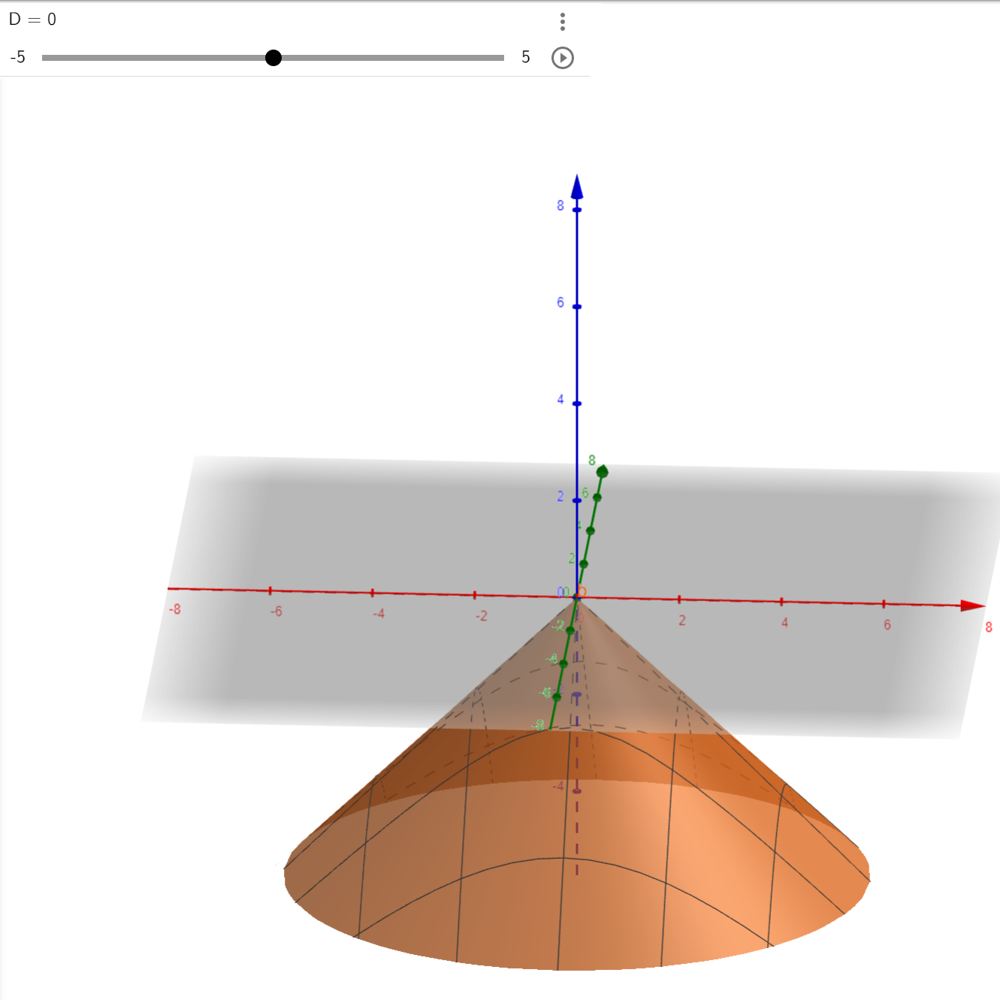
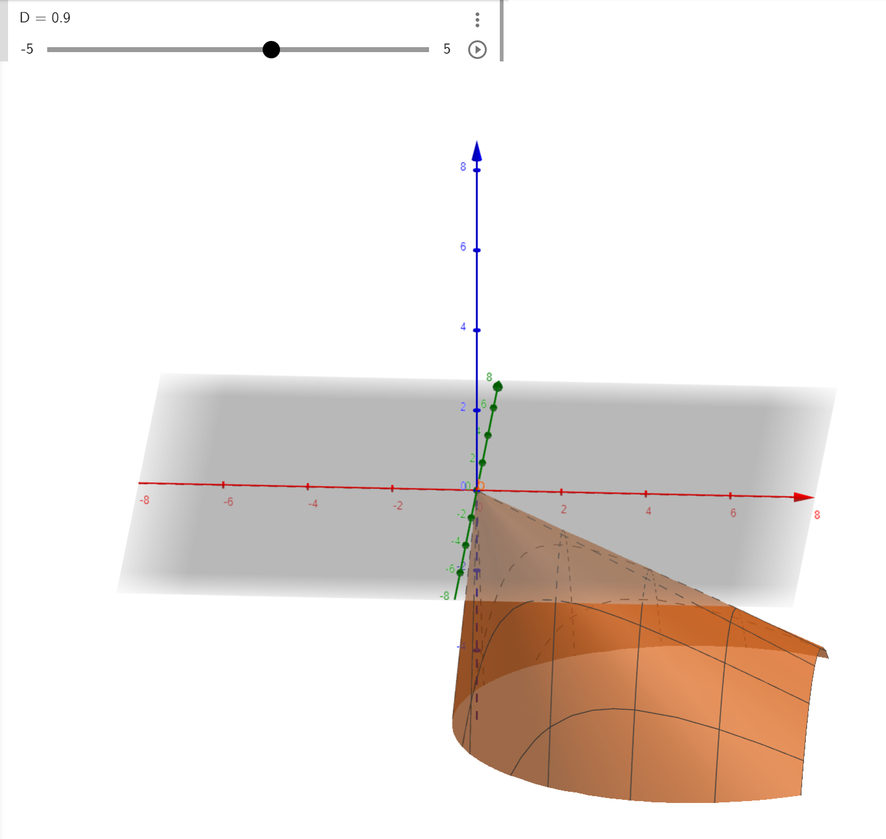
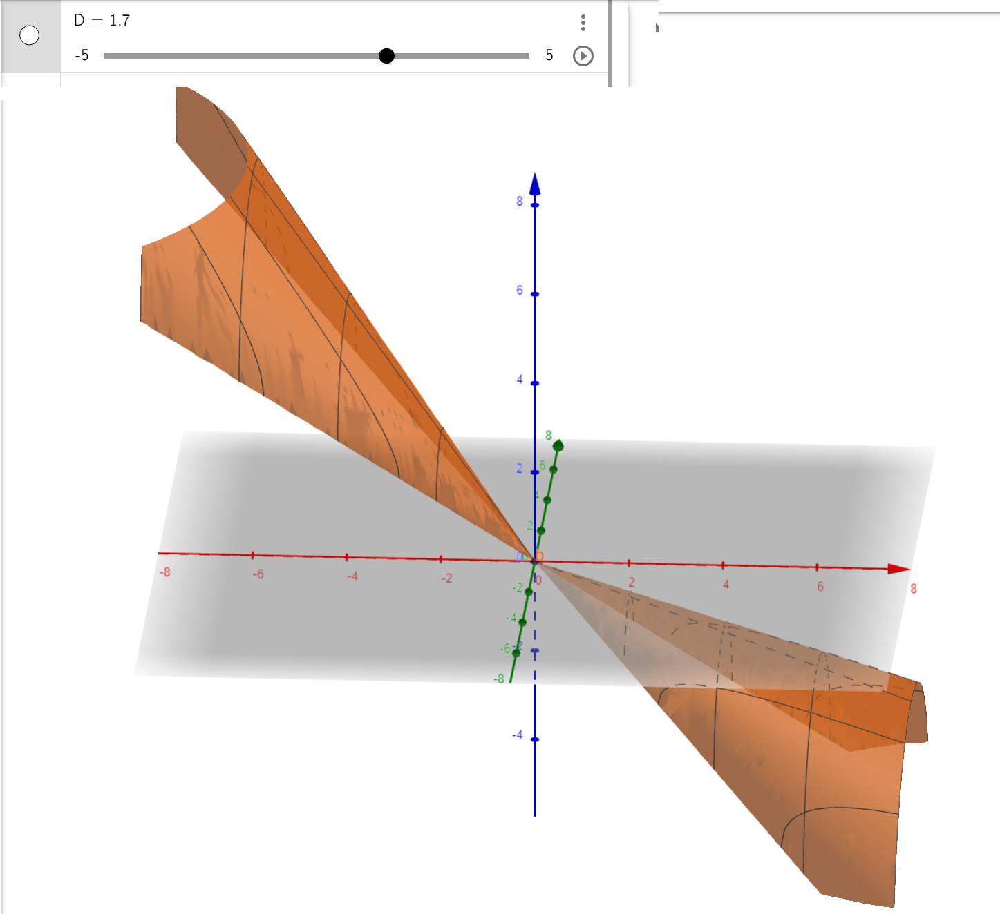
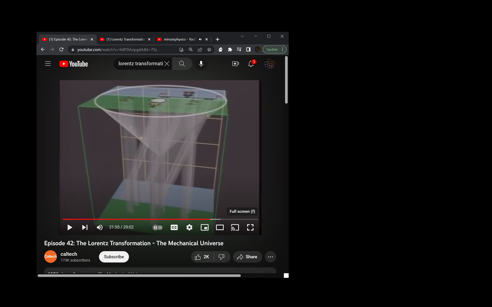
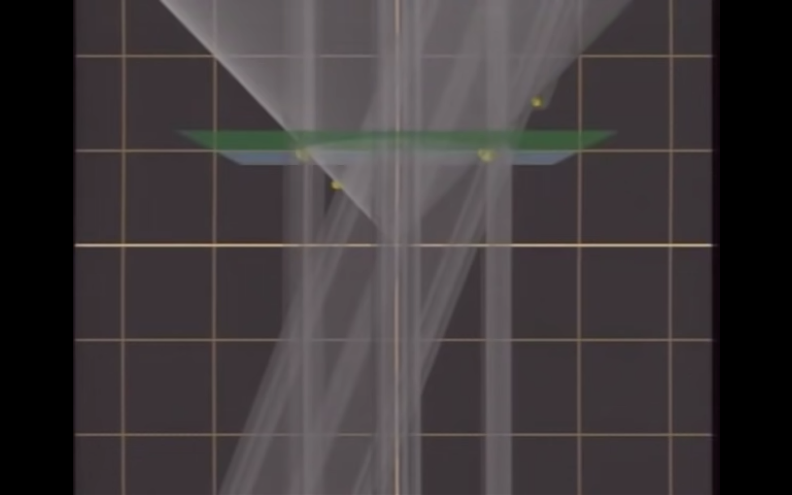
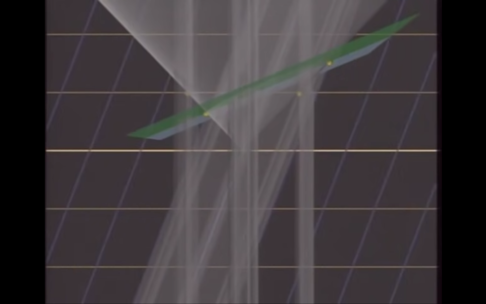
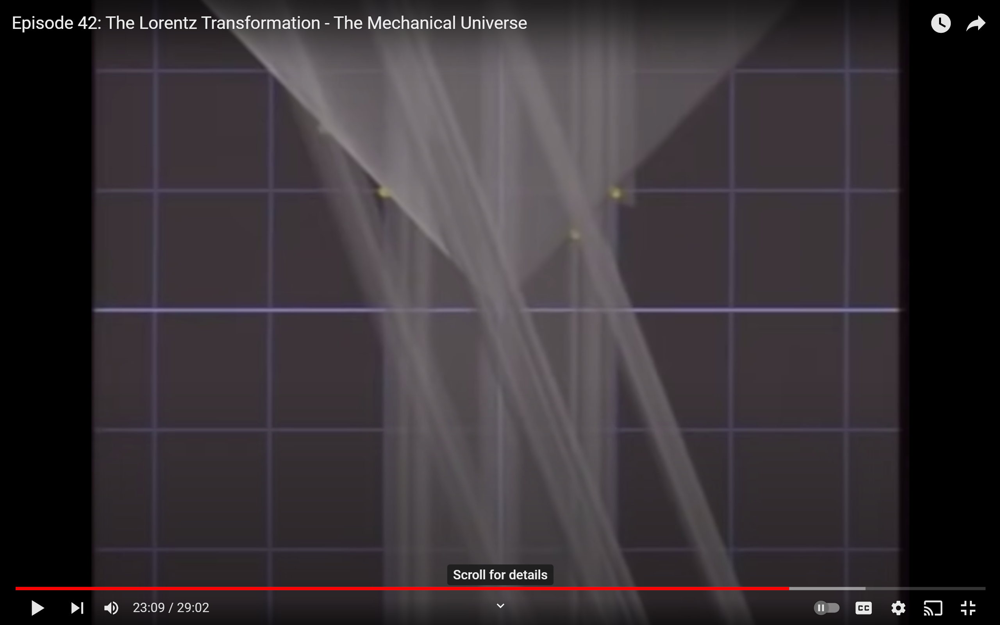
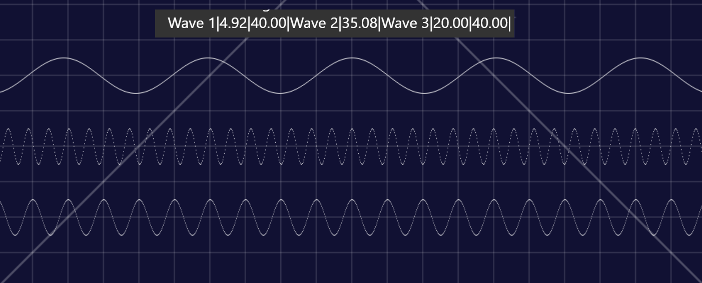

# Lorentz Transform

The light cone is not translated in the transform.  This leads to an approximation of what things look like and when they appear, but fails reality.

In reality the light cone is translated when someone is at a velocity.

https://www.geogebra.org/3d/ckphajff  The D= slider controls the velocity.  Really it's a 3D velocity vector, but no need to complicate things.

Stationary - the light cone is symmetric and covers all past (there is no future cone)

This is approaching the speed of light. What is seen from behind you is time dilated; while what you see ahead of you is closer in time.

This is faster than light
 Faster than light

## Good Explainer

https://youtu.be/feBT0Anpg4A?t=1315

This Is a train, with 2 detectors, and observer with 2 detectors, and a light pulse emitted when they are all at 0.

This is the light's frame, which is also the stationary observer's frame.  It says that albert will see the back detector on the train first, then his own detectors simultaneously and then the front detector on the train.

This is a shifted view, and is the stationary observer's viewpoint, when his events happen simultaneously.

This is the moving observer's view, that says that the two events that they will see at the same time in their frame is the detector on the fron and the detector on the back.  The light cone is still untranslated.

This leaves the light cone untranslated, but skews everyone elses motion.  This is where reality and Lorentz Transform do not agree; the observed light cone is different; (I would threaten violation of causality, but probably not)

## Agreements
 - The speed of light travelling in the direction of an observer's velocity is measured as the speed of light faster than the observer.  This comes about from time dilation/contraction.  Since the observer's clock is slowed, and all detections are marked against the observer's clock, the velocity of light will always exceed the current velocity by the speed of light.
 - Null of any two-way experiment (and the state of stable destructive interferance which LIGO uses).  With length contraction, and time dilation, the number of waves that are 'in the air' in a two way trip is the same for the forward-backward trip as the lateral trip.
     - The above graph is at 0.754c.  
     - Light has about 1,000,000 more waves per unit than I'm showing; this is more like a very low frequency radio wave at 1Ghz (1ns/ft).
     - The top wave (Wave 1) has 4.92 wavelenghts in flight.  This is the trip from the front to the back (against the velocity vector).  This is a red shifted signal, but since a detector in that frame would be moving into the wave, the result would be the same frequency as (wave 3).
     - The middle wave (Wave 2) has 35.08 wavelengths in flight.  This is the trip from the back of the ship towards the front.  Where the detector is moving away from the emitted signal, so it takes a longer time to detect a wave.  This signal is blue shifted, and will be seen as blue shifted for an observer not on the moving body.  If the detector is moving with the velocity, then it takes a longer time to detect one wave, and the result is the same frequency as (wave 3).
     - The bottom wave (Wave 3) has 20 wavelenghts in flight laterally.  Due to time dilation, the additional travel time, of the extended diagonal (as in ![[Pasted image 20230520123646.png]]) there are exactly the same number of wavelengths in the air at any time.  And a 2 way trip is 40 wavelengths. 
     - The sum of (Wave 1) + (Wave 2) = 40 = 2*(Wave 3).  Which any two-way trip, in any direction, has the same number of wavelengths.
    - However, having the same number of wavelengths is not exactly the same has having the same speed of light; so really any wavelength/frequency measurement to gauge a difference in the realtive speed of light in a frame is a null result. (Agree, but predict a way out)

## Disagreements
  - One frame moving forward is the same as the other frame moving backward.
     -  This is untrue.  The clock dilation and length contraction experienced by a stationary body is not the same as a moving body, or really any moving body with a distinct velocity.  
     - A body that is moving relatively stationary to another body, does not have a distinct velocity.  Mostly everything that one experiences in a stationary frame as a observer in that frame are the same for any other frame at any velocity with an observer stationary relative to that frame.
     - If one frame is moving, their clock is contracted.  They can allow themselves to observe the universe around them and measure the light aberration from known start positions to know they are going at a speed; they can then adjust their clocks appropriately and have a sense of what 'real time' is.
     - Light from the back of a ship at 1ft/ns, is seen at $L(C-V)$seconds.

---
But let's go back to the train, and add a second flash from the train itself.
Both lights that are emitted are green; for simplicity their other states will be blue and red, but probably not shifted that extreme to be a new color.

1) detectors T1,T2 and H1,H2 are aligned as the same +/- offsets.  The offset is +/-1 light-second.
2) Observers O1, O2 are haflway between T1 to H1 and T2 to H2. They are at 0.
3) 1 is the stationary frame, and 2 is the moving body frame.
4) The moving frame is moving at 0.5c. This makes the relative speeds 0.5c, 1,c  and 1.5c. 
   - 1.5 is also known as 3/2. 
   - At 1.5, 1 lightsecond is crossed in 2/3 of a second. 
   - 0.5 is also known as 1/2.  
   - At 0.5c it takes 2 seconds to cross a distance.
   - Length contraction is $\sqrt{CC-VV}$; the faster you go, the shorter you are.  This is also clock contraction, the faster you go, the slower your clock ticks.  $CC-VV$ is $Length*time$ contraction.  In this example, woith $V=0.5c$ and $C=1$, then $1 - 0.5^2 = 1-0.25 = 0.75 = \sqrt{\frac {3} 4} = \frac{\sqrt 3}2$.  
1) A pulse is emitted at O1 called P1 and at O2 called P2 at time 0.
2) Time goes forward...
   - At shortly after the start, let's say the observers see each other when they emit their opposite photons; O2 sees P1 and O1 sees P2.  O1 will see P2 before O2 sees P1(To a third observer body); although because of time dilation, O2 sees their signal at the same relative time. O1 sees the signal as directly in a line to 0 from the train.  O2 sees the signal lagged slightly, because they moved while the signal got there; however in a more than 1D case, Light Aberration for O2 advances the angle so it appears to be at position 0, and perpendicular to their own 0.  O1 sees O2 green; O2 sees O1 slightly red.
   - at 2/3s ($\frac{\sqrt 3}2 \cdot \frac 2 3 = \frac {\sqrt{3}} {3}$s with length contraction, at local time 1/2s) : detector T2 sees  P1 and P2.  P1 is green and P2 is blue. It emits its state DT2P1 and DT2P2. This is tracked further as if it was contracted
   - at 1s : Observer O1 sees DT2P1 and DT2P2; so it sees the events from the back of the train fire first. The detector is blue. (time was 0.5 seconds)
   - at 1s : Detector T1 and H1 see P1 and P2.   T1 sees P1 green; T1 sees P2 red; H1 sees P1 green, H1 sees P2 blue;  They emit DT1P1,DT1P2,DH1P1, and DH1P2. Time is 1second.
   - $1 + ( 1/(C+V) * V(0.5)*T ) * = 1+ 1/3 = 4/3$s )(1.158s or $\frac{\sqrt 3} 2 \frac 4 3 = \frac{2\sqrt{3}}{3}$s on O2's watch) Observer O2 sees Detector H1 blue, and signals DH1P1, and DH1P2.
   - at ($2 \frac {\sqrt{3}}{2} = \sqrt{3}$s with length contraction, local clock is $\sqrt 3 \frac{\sqrt 3}{2} = 1.5s$): Detector H2 sees P1 and P2.  H2 sees P1 red, and sees P2 green.  Emits DH2P1 and DH2P2.  At position $(0.5 * \sqrt 3 = \frac{\sqrt 3} 2) + \frac {\sqrt 3} 2 = \sqrt 3$.  Add 1(length contracted) because it's the head not the center.  The center is at sqrt(3)/2. 
   - at 2s : Observer O1 sees detectors H1,T1 both statuses of the signals it saw.  both green.(detectors fire at the same time)
   - 2 2/3s ( $\frac{\sqrt{3}}2 * 8/3 = \frac{4\sqrt 3}3 =$ 2.309s with length contraction)($\frac{\sqrt{3}}2 \frac {4\sqrt 3} 3 = \frac {3*4}{6}=2$ seconds on observer's clock; with time contraction): Observer O2 sees detectors T2 and detector H2 both green, which report with states DT2P1,DT2P2,DH1P1,DH1P2 from 0.5s and 1.5s.
   - 3s: Observer O2 sees Detector T1 red with DT1P1,DT1P2.
   - 4s (3.46s ( $\sqrt{3} + \sqrt{3} = 2\sqrt{3}$s )): Observer O1 sees Detector H2 red with DH2P1, HD2P2.  Detector H2 was at $\sqrt 3$ so it took $\sqrt 3$ seconds to get back; plus the detection happened at $\sqrt 3$ seconds.
   

In the above scenario, it can only be said that the observers, by their own clock, see events in their own frame simultaneously, if measured on a 2 way trip.  In this case the signal started at the observer, hit some detectors, and then those detector's response to the observer is what's seen.

So the various 1-way questions that have been presented, the answers make no sense; such as breakfast at earth and andromeda independant of an observer moving between; they didn't send an question "You havin breakfast" and getting a reply "ya, having breakfast". [As in this question.](LightSpeedSim.md#lorentz-problem)

## Maybe a more general approach to the times?

- D=1 (distance between observers), L = 1, (offset of head and tail detectors); the above will work as long as Head and Tail are 1 or more ? 
|T | local T pos|| Math |
|---|---|---|--|
| 0 | 0 | 0 | events emitted |  |
| $L\sqrt{CC-VV} \cdot \frac 1 {C+V} = L\frac{ C-V} {\sqrt{CC-VV}}$ | L(C-V) | $-L+VL\frac {\sqrt{CC-VV}}{(C-V)}$ | T2 sees P1,P2 saves local (C-V)|
| L/C | $L/C*\sqrt{CC-VV}$ | 0,-1,1 |O1 sees T2P1,T2P2; T1,H1 see P1,P2 saves (1)|
| $1+ (1-V(T=1))/(C+V)$ | $\sqrt{CC-VV} (1+(1-V)/(C+V))$ | ? | O2 sees H1(1) | 
| $\sqrt{CC-VV}/(C-V)$ | $C+V$ | C+V? |H2 sees P1,P2; O1 sees T1 and H1 detectors. H2 saves 1.5;  |
| $2*L/C$ | - | 0 |O1 sees T1 and H1 detectors. both show 1.0s |
| $2 / \sqrt{CC-VV}$ | $2$ | O2 sees T2,H2 detectors.  T2 shows 0.5, H2 shows 1.5 both green |
| 3 | $\sqrt{CC-VV}$ 3 | O2 sees T1 detector (red) (1 sec) |
| $4/ \sqrt{CC-VV}$ | 4 | O1 sees H2 detector(red) (1.5 sec) |

---
## Time Synchronization Protocol
 (in progress... shouldn't be so very hard though)
 - send 'set to N'
 - receive 'set to N', reply with last delta, with last N, set clock to N.
 - from the delay of the reply heard, and the delay of the last reply heard  
   - you can deduce the distance increased; and what their current velocity is.
   - If the delay is not increasing/decreasing then they are relatively the same distance;  This is a 2-way measure, and as such is a constant in all frames.  The offset of when it is received to when it is sent along that path is really what we're working to deduce.
   - The time is noted, and the fraction of '1' between the N specified is the clock dilation, compared to the local clock.
|local clock| local remote clock | remote clock | remote local clock| action|
|----|----|----|---|--|
| 0 | 0 | 0 | 0 |  send set to 0.|
| A | A | $A* \alpha$ | $A*\alpha$ | heard set to 0 at A times alpha, reply 'set to 0' |
| A' | A' | $A' \alpha$ | $A' \alpha$ | heard 'was set to 0' |
| | | | |
| A+1 | A+1 | $(0+1)\alpha$|$(A+1)\alpha$ | send 'set to 1' | 
| A'+1 | A'+1 | $\alpha$ | $A*\alpha$ | heard set to 0 at 0 plus alpha, reply 'set to 1', \alpha |
| A'+1+A' | $(A'+1+A') \alpha$ | $A' \alpha$ | $A' \alpha$ | heard 'was set to 1', \alpha |

