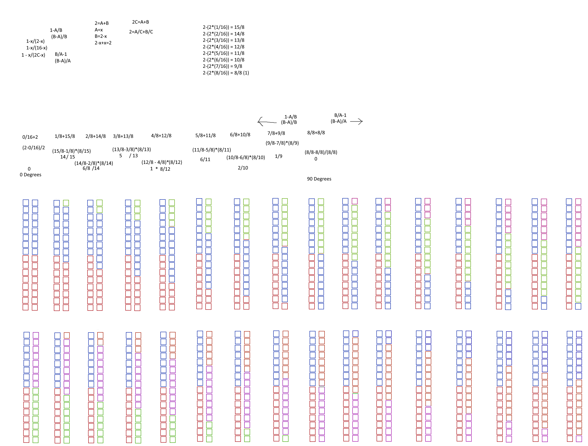
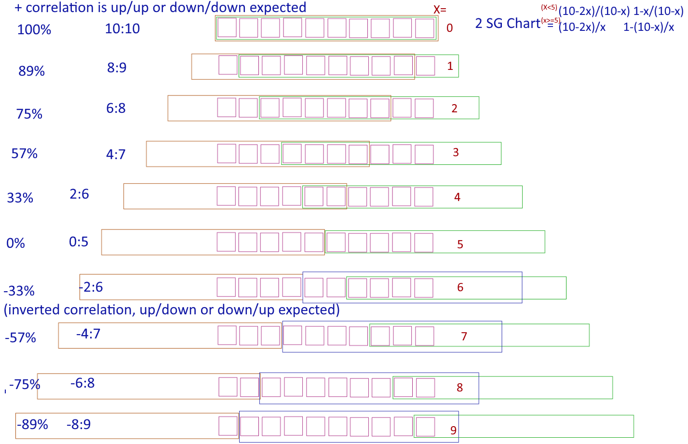
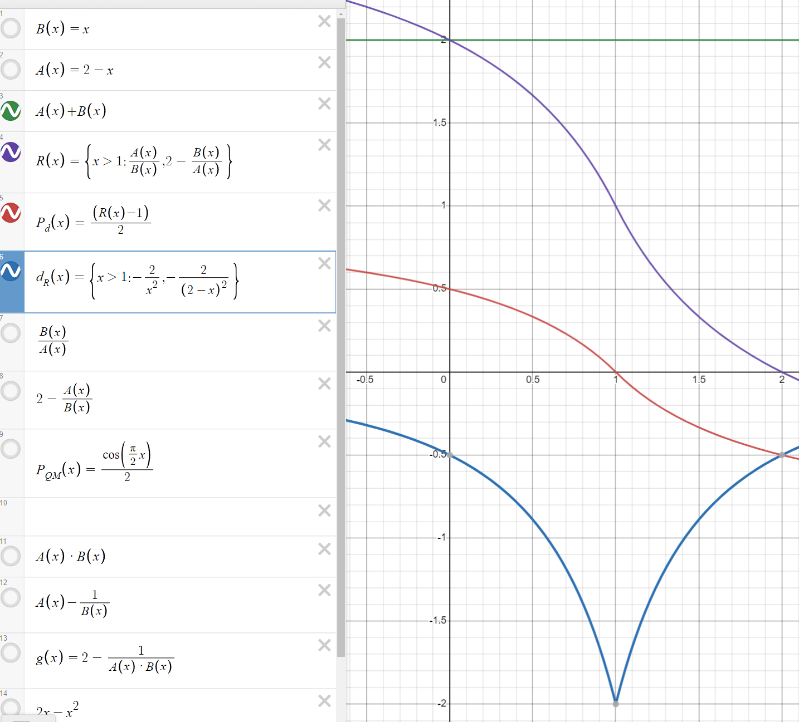
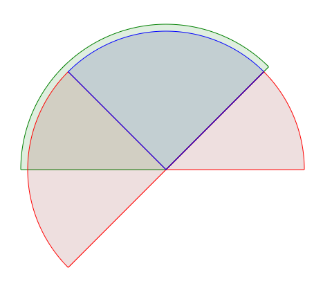
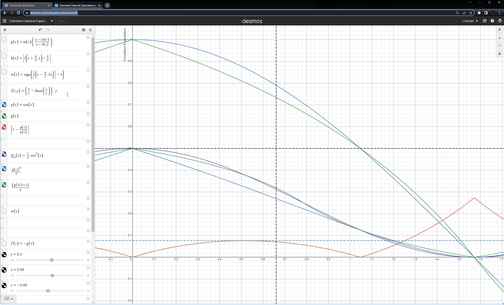

# Quantized Probability

This is a long exploration of correlation of events between two different observers with 2 outcomes each, it computes the correlation of events that happened, based on the ratio of events that were the Same or Different.  This differs from the method required by Bell's Theorum and CHSH for local hidden variables(LHV), and gives a result that is compatible with the ratio that Quantum Mechanics provides (they require a ratio of samples to the total samples, while the QM result is the ratio of one type of sample vs another, and not vs the total.)

There are two ratios, depending on which is larger, one that's a ratio of Same, and one that's a ratio of Different. If the results have more Same
than Different, then the ratio of how many differed (Same-Different) to how many Same happened; otherwise with more differences the ratio of how many
differed to the total Different happened.

This is related to Quantum Mechanics, and correlation of results, transmission of polarizers. There are different measurements you can do,
and the method of measure changes considerations slightly.  A Stern-Gerlach(SG) device passes every event to the next, while a polarizer
ends up blocking the event instead, and nothing is transmitted.

This is also quantized weight on a beam-balance. (This is not in conflict with Newtonian Physics, as there was nothing given for this).

## Thought Experiment (RNG simulation)

There are red and blue boxes that catch balls, decide on a direction based on the color of the previous input box, and then exit either to that path or to
the next layer.  Boxes are arranged in 2 rows, with a single row of boxes being 1 set of possible events. 
Each box on the first row is related with a box on the second row. 
There are two types of sets of boxes are added to the two rows:  red-red,blue-blue and red-blue,blue-red. 

This might be an example...

|row|.|.|.|.|
|---|---|---|---|---|
|1|R|B|R|B|
|2|B|R|R|B|


A ball is dropped randomly initially into any box of the first row.
If a ball falls into a red box, it will come out of any other red box in its row; 
similarly a ball will come out of any blue box if it entered a blue box.

The second row's boxes will get inputs from only the red or blue boxes above it, but they have optional behavior
depending on if the input came from a red or blue box, summarized by the following table. 

| From | Into | Polarizer| direction | SG/Independant Observations |Same/Diff|
|-----|-----|----|----|----|----|
| red | red | pass | right  | up/up | Same |
| blue | red | pass |  right| down/up | Different |
| red | blue | block |  left | up/down | Different |
| blue | blue | block | left | down/down | Same |

Several questions can be asked of this setup.
  - as a polarizer - how many photons pass through vs are blocked.
  - as a SG device - how many are measured up vs down.

| from first layer | second layer |  grouping |  Polarizers | SG  |
|----|----|---|---|---|
| red | red |  (BR) S | Transmitted | up up |
| red | blue |  (BB) D | blocked | up down   |
| blue | red | (RR) S | blocked | down up |
| blue | blue | (RB) D | blocked | down down |


A parallel row of box pairs can be constructed.  For every red box there is a blue box.  The size of this set of boxes is the total sample size times 2; `2C` where
C is the number of red or blue boxes.  Balls are dropped such that they will hit one of these pairs.
Pairs can be (red-red,blue-blue) or (red-blue,blue-red) in any ratio.  

To this point, there is nothing special in the stipulations above compared to any other QM Inequality; until Balls that fall out of the second row are collected into 
one of two baskets, which are put on a balance beam scale and compared.  The angle of the indicator is the intensity.

The total set size must be even, and this can be defined as `2C`. The count of boxes is then `2C = A+B`, `B/C=2-A/C`, `2C=2A` or `2C=2B`.

Then we also have `A-B` is the difference between what was counted for A and B.
Then applying some algebra: when `B > A` or `A < 1` or `B > 1`, making `B-A=P*2B`, then `(B-A)/B=P*2`, `1-A/B=P*2`;
 otherwise `A-B=P*2B`, then `(A-B)/B=P*2`, `A/B-1=P*2`.


`S` and `D` are normalized such that `S+D=2`; `s+d=x`, `S=2s/x`, `D=2d/x`; Really this doesn't matter, 
`D` and `S` are divided against each other cancelling any constant scalar (2 and x in this case) like set size.
If 'transmitted' is the expected relation, then start with '1', and remove the
ratio that were blocked (`Diff/Same`).  Otherwise if `block` is the expected relation, calculate the ratio that were transmitted, and subtract 1 instead.
The calculated intensity is then `1-D/S` if `(S-D)>=0`, or `S/D-1` if `(S-D)<=0`. 

```
  left|red + right|red = 2 - ( (left|blue) + (right|blue) )

also:

  A = (left|red) + (right|red)
  B = (left|blue) + (right|blue)
  A+B=2
```

(image needs to be revered to delete a row(?); polarizers are 1/2 cycle of SG, only mutual transmission is abs(SG) independant observations)


#### Considering the above picture, at 1 offset

Of those that went left, the portion becomes blue or purple does not transmit which is 2-1/8; the remaining portion 7/8 do transmit.

Of those that went right, the portion that becomes green or red does transmit, which is +1/8; the remaining porition 7/8 do not transmit.

```
left = 2
right = 2

A+B=2
2-A = B
B +A -A = B

   B            A            B
( 2 -(1/8) - +(1/8) ) / (2 - 1/8) = 14/8 / 15/8 =  14/15     (also 1-A/B)


```


```
( 1-B/A : A/B-1 ) is 1 to -1 for 100% to inverse-related 100%. 

The larger of A and B are used for the divisor, so the divisor is never 0.

```

## Correlation Explanation (take 3)

Let's suppose we have 10 slots, which have a grated mesh over them.  Then from above, drop marbles.  When the marble goes through the first grate,
it's bounced such that it could end up coming out over any of it's 10 spots.

In the best case, both meshes are directly over all 10 slots, and dropping a marble there's 100% probability that marbles dropped with end up in some bucket.

In the next case, we move both of the meshes in opposite directions, so they cover only 9 spots. Consider the first mesh, at a quick glance, 
there's one slot which the marble won't hit the grating at all; the chance of this being a success is 0 in 1 in 10; But there's s slot that 
isn't over a bucket, which can still drop a marble into a bucket, so there's a 1:10 chance the marble shows up anyway.

That is until the grates are 100% non-overlapped, and then there's no possibility it makes it through both.  At this point, the consideration becomes
the inverse of the expected correlation of inverse correlation; in this case how much everything falls out.  In the case of a SG detector it becomes 
the probability that the results are inverted (+1:-1 or -1:+1).  

This is a quick table of 12 slot probabilities.

| shift  |  odds |   correlation |
|-----|-----|-----|
| 0   | 12:12 |  + 100%  |
| 1   | 10:11   | + 90.9% |
| 2   | 8:10   | + 80% |
| 3   | 6:9   | + 66% |
| 4   | 4:8   | + 50% |
| 5   | 2:7   | + 29% |
|     |       |  |
| 6   | 0:6   | +/-0% There is a shift of divisor here |
|     |       |  |
| 7   | 2:7   | - 29% |
| 8   | 4:8   | - 50% |
| 9   | 6:9   | - 66% |
| 10  | 8:10   | - 80% |
| 11  | 10:11  | - 90.9% |
| 12  | 12:12  | - 100% |
 




## LHV Graph


 - R(x) = { x>1:A/B,2-B/A }
   - Ratio of Bucket A vs Bucket B
   - A+B=2
   - 1-(A/B)=0
 - P_r(x) = (R(x)-1)/2
   - Convert ratio to probability.


```
A+B=2
(A=B)*(A=B)=1

(B-A)/B = 1-A/B
(B-A)/A = B/A-1


```

Note: The slope of the change in the ratio of probability for N samples with 1 not correlated, is -0.5.
QM's prediction of cos(theta) has slope 0, and is near 0 for a long time before it is `-0.5` at `cos(0.5)`.




## LHV Setup

There is always near zero correlation between LHV Predicted results and LHV Simulation results.LHV Simulation is simply comparing if the dot product of vectors is greater than zero. 

The probability for a single detector and single particle is a sphere centered on the origin from -1 to 1, where < 0 indicates inversed result will be received; that is if expecting a up, should expect a down.

The probability of 2 detectors and the same local variable is the ratio of overlaped arcs where the dot product is > 0 for two circles; this ends up being just the ratio of the arcs covered by the angles.  `1-x/(2-x)` is the ratio of correlation; 
where both detections will be aligned vs detections that were expected aligned and were inverted.  The inverse of this is `1-1-x/(2-x)` or `x/(2-x)`. [Live Demo](https://d3x0r.github.io/STFRPhysics/math/indexBellInquality.html)


## Bell's Experiment

There's so many [The Sience Asylum, Bell Theory](https://www.youtube.com/watch?v=hiyKxhETXd8) There was a very recent done; lots can explain this idea.

QM prediction `cos(60 degrees)` = 50% chance or 0.5.  Or that at 60 degrees there's a 50% correlation, and 60 degrees is Bells Test Setting.

LHV prediction `x = 60 *pi/180 * 2/pi  120/180 = 2/3; p=1-(x/(2-x))` = 50% or 0.5.     `1-(2/3/(2-2/3))` = `1-(2/3/(4/3))` = `1-(2/3*(3/4))` = `1-(2/4)` =  0.5.


## GHZ Experiment

This test passes through a polarizer to align first within 90 degrees, and then tests with the same alignment detector and two other detectors at 45 degrees.  The assumed correlation is that measuring with the center detector aligns the reults for the other
detectors. This does not happen with 100% chance but  [However, we experimentally observed such terms with a fraction of 0.87 +/-0.04  (Fig. 4c), which violates the local realistic](https://web.physics.ucsb.edu/~quopt/ghz.pdf).

GHZ QM predcition - 100% (?) 

GHZ LHV Prediction - 66%+16% = 83.33%  (if the experiemental result is 0.87 minus 0.4, that's 0.83; and within the error bars).


## CHSH Experiment

https://qubit.guide/6.3-chsh-inequality

QM Max correlation `2*sqrt(2)` = 2.828.

LHV Prediction `3*0.8 + 1` = 3.4.  That is to say I can (and did: [CHSH Game](https://d3x0r.github.io/STFRPhysics/math/CHSH_Game.html)) implement a game that two people isolated by distance with an entangled RNG can get 80% correlation on 3 of the 4 choices, and 0% correlation on the last, which is a full point for S: (4/5)+(4/5)+(4/5)+(1-0).

LHV Prediction using CHSH Experimental angles of 0, 22.5, 45, and 67.5 : ( 0.86 + 0.86 + 0.86 - 0.6 )  or (2.58 - 0.6 ) = 3.18;  (still higher than QM prediction).


### Scoring in Game

The game's input starts with a measured up down on two devices in two different positions. These are ++, +-, -+, and -- result counts.  These are each 
divided by the sum of the inputs such that they are scaled to 1/4 and add together to equal 1.

The results are then grouped into pairs of either Same (++,--) or Different(-+,+-) results.  The sum of each of these is 1/2, and still the sum of the
total is 1.  These Same and Different results are evaluated in chains, with an expectation of correlation.  4 independant streams of results are generated
one for each pair of devices and settings.

In a sequence of (S)ame and (D)ifferent results, for example `SDSDSDSD`; for each 'S', +1 is asdded and for each 'D', -1 is 
added to a counter; this is also simply `S-D`
Then if the total is > 0, then it is divided against 'S' that it expects correlations to be the same (they were MOSTLY the same); and if the total is < 0
divide by 'D' in which case it expects inverse correlations.   Another way of approaching this is with edge trigger on change that saves the current count
of correlations, and resets the counter to 0, and begins to accumulate correlations for the new state;  Then only a count of 1 adds any meaningful information
and `SDSDSD` ends up saving a bunch of 0's. ~~ Penalizing the ratio again for the total count of samples is... (unfair)~~; At the end I end up with a total count
of each type of chain, which again can be subtracted, or evaluated in order, only this time (doing something like) subtracting the length of the chain from each previous chain, 
until you end up with a single chain of 'S' or 'D'.  The final length of that chain is compared against the possible expected correlations, rather than against all samples.


Evaluating `(S-D)/(S+D)`  for a chain of `SSD` is 1/3; and overall looks like `(1-pi/2 x)`; which is a flat line, and is the proposed sum of probabilities 
asserted by Bell in 1964.  I somehow expect that the actual numbers from these experiments correlate more like I've describe above.  The expectation
is that a correlation will occur, the first result should only determine which direction of correlation (same or different), and at 100% correlation
of Same results there are no differences.  If there start to occur a few differences, then these only penalize the correlations.


Examples

String is assumed to be a repeating segment forever, order does not matter.

|string | score | angle | QM | (S-D)/(S+D) |
|---|---|---|----|---|
| SD | 0 | 90 or -90 | 0  | 0 |
| SSD | 0.5 | +/-60 |  0.5 |  0.33 |
| SDD  | -0.5 | +/-120 | -0.5 | -0.33 |
| SSS   | 1 | 0 |  1 | 1 |
| DDD   | -1 | 180 | -1 | 1 |
| SSSD  | 0.66 | +/-45 | 0.707 | 0.5 |
| SSSSD | 0.75 | +/-36 | 0.809 | 0.6 |


```
  (max(a,b)-min(a,b))/max(a,b)  this loses the sign.


   (a-b)<0 ? (a-b)/b : (a-b)/a  //this keeps the sign.


```


I also made this [interactive circle chart](https://d3x0r.github.io/STFRPhysics/math/indexBellInquality2.html) 
there's a slider toward the bottom to control the angle of overlap.
The blue wedge compared to the green+blue wedge is what's being measured.

### Sources of Experimental Error

Experiments often comment
 - polarizers are lossy; in the high range, correlations are lost
 - electrons are hard to get to go where you want them and they often miss entirely
 - photo detectors get false triggers (low range, is additional counts )

Additional noise
 - at high angles, the low ratio of correlation is also very noisy ( correlations are (S11D7), an artificial error bar should be able to be made. The simulation line shows jitter.


### CHSH Real Life Comparisons

I have some other tests: [Game Correlation](https://d3x0r.github.io/STFRPhysics/math/indexBellInquality.html), [Stacked Polarizers](https://d3x0r.github.io/STFRPhysics/math/indexBellInquality2.html), having just implemented a stack of polarizers test version to match https://escholarship.org/content/qt2f18n5nk/qt2f18n5nk.pdf?t=p2au19  pages 83-85(ish) are the experimental results.

With a stack of polarizers, the only events that count are those that correlate (make it through both), 
vs the total amount that would normally be received in the same amount of time.   If the photon passes the 
first polarizer, and since there is only a second polarizer, then it doesn't matter if the first polarizer 
modifies the result, it would still be in the same arc as the original input.  This makes the probability of 
making it through both polarizers `((1-2x)/(((1-2x)<0)?x:(1-x)) +1)/2` for x in quarter turns; 

Below is the experimental results from the link above, and new LHV predictions to relate... is far off?

After re-evaluating the math and going ahead with the relations, [THis Demo Graph](https://d3x0r.github.io/STFRPhysics/math/indexBellInquality2_polarizers.html), I applied
the same sort of math to evaluating the results, which meant I had to find the other non-linear curve that matched this percentage.  While I have it above, and it works here
and even below in the desmos link, this is yet to be decomposed to simpler expressions.

[Live Demo](https://d3x0r.github.io/STFRPhysics/math/indexBellInquality2.html); this demonstration program explores amont of difference (difference of angle) of 
2 polarizers and one side of a Stern-Gerlach or CHSH Independant Objserver Game.  


This used to be different, and has been revised, there's a different prediction for a stack of polarizers.

[Expectations adjusted here](https://www.desmos.com/calculator/lpkgsac90c) The adjusted LHV values account for 0.035 excess counts in the low side, and -0.05 counts
because of losses on the high end.

```    	                                                    
    experimental   angle              QM pred.  QM/Exp      LHV pred. LHV adj.    LHV/QM     LHV(Adj)/
    result	                                                                  (exp pred)   Exp. Res.
    0.457 � 0.009 0.00                0.464     1.015       0.5       0.486        1.07       1.06
    0.451 � 0.013 11.25  (0.438)      0.448     0.993       0.464     0.451        1.03       1.00
    0.400 � 0.007 22.5                0.401     1.003       0.4167    0.403       1.04        1.00
    0.340 � 0.010 33.75               0.333     0.979       0.350     0.336        1.051      0.97
    0.249 � 0.007 45                  0.251     1.008       0.250     0.250        0.996      1.00
    0.164 � 0.007 56.25               0.170     1.03        0.150     0.164        0.88       1.00
    0.100 � 0.003 67.5                0.100     1.0         0.083     0.095        0.83       0.95
    0.052 � 0.004 78.75               0.055     1.058       0.036     0.048        0.65       0.92
    0.041 � 0.003 90                  0.039     0.951       0.000     0.035        100        0.85 
```

My prediction does not account for experimental bias of 1 in 35 counts just happen, or a similar percentage of counts lost.
Non-detection doesn't imply non-correlation, just that something happened that made the possible truth not go through the filter; the polarizers are lossy themselves.

The above comparison shows QM is +/-3% and I'm +25% -8% (the 25% is at low counts, where polarizers are mostly an inverse coorelation).

#### Graphic Representation

This is a sample (probably large, and I should look into resizing it).



Given two SG devices mounted in a fixed location; in the image one is labeled 'A' and outlined in red; the other is labeled 'B' and is outlined in blue.

I feel like I should quote 'photon'; as I do mean it in more of a point like entity (not a particle per say, since when spins interact, 
it's like skipping stones on water, and the composite has multiple deflection fronts).  A photon has a spin axis, a position, and a direction;
while the rate of spin might matter whether it is a short enough wavelength to make it through the polarizers is a different thing; the speed is 
assumed to be a constant that's the speed of light. It only has a position in the sense that it starts on one side of a polarizer, moves to between both polarizers, and 
ends after the second polarizer.

Polarizer is another word that should be quoted, this polarizer knows 'up' and 'down', (not 'up or down' but 'not left or right'); and when a photon mentioned
above passes through it, the photon is allowed to be modified up to +/-90 degrees from the detectors axis.  The detectors axis is a line from the midpoint to 1/2
of their respective arcs.

This can be then modeled by considering two polarized plates that are overlapped.
'Correlation' means that a photon will pass through both polarizers and is not stopped along the way, 
and because they are symmetric order does not matter, the 'A' polarized plate is in front (or the first to be interacted with) for explanation purposes.
Polarized plates affect photons, and photons passing through them 
are changed; the limit of this change is within (in this case, +/-90 degrees) of their alignment.
                                                                                                                                                                               
The red regions on the right side, and below the middle 'A' are regions where a 'up' event will not pass through both polarizers as the same spin direction.
In the case of the region on the right side (near the A ), anything in this region is up for A detector and down for B.  In the region on the lower left,
these are also definitely different results, that B will detect as 'up' and A will detect as 'down'. 

The remaining intersection of A and B (the arc in green) are the potential correlations that there can be; however, when passing through 'A', and having
a spin axis in that green arc, it can change, and be in the right side red arc; so these are removed from the possible definite correlations. Then 
(it turns out that) the remaining blue arc, after subtracting non-corellations again (this is the third time it's removed), the ratio of the blue arc
tot he green arc is the actual amount of correlation.

are the only correlations to account for (assertion, questionable reasoning).
    The left side has an additional region of red, which overlaps the green, these are correlations which could have been up in cases of both,
    but may measure down (may be transformed into down- see that's a claim from the polarizer aspect part).  That is the behavior that the simulator
    exhibits.  The result of throwing random vectors at two different devices correlate as such.

It seems hard to justify why a ratio like the one shown in the image of 1/4 to 2/3 should be representative of the whole range; but it's really not, and
doesn't have to be.  Consider that at 100%, both are the full range of possibility and 100% of everything goes through both.  At slightly less than 100%,
then the ratio that makes it through both is less than 100%, and doesn't have to be a ratio of 100% of the possible input samples.  You can disregard the rest,
because conversely, there's a portion of photons that can make it through A, and be turned into photons that can also pass through B.

There's probably a nice 3D graph of this  https://www.geogebra.org/3d/zbfqqswd  but better... it sort of needs to be polar...


### CHSH Wikipedia Talk

[Link To Talk](https://en.wikipedia.org/wiki/Talk:CHSH_inequality#CHSH_Game_Implementation_scores_3.40)
It's been contested that my ratio of ratios is wrong, and not the intended result.  I can apply a scalar and offset and correct.

The reported probability is `1/2 cos^2(x)`; which can either be `1/2 g(x)^2` or `(g(2x)+1)/4` as approximations.  Would have to justify 
why this multiplication happens; but here's those graphs.



```

https://en.wikipedia.org/wiki/CHSH_inequality#Optimal_quantum_strategy

(for 0 to pi/2, ranges > pi/2 are inverse correlations and ranges < 0 are reflections of > 0 )

cos(x) ~= (1-(x/(pi-x))

A better expression of this is

// perform modulous with floor (amazingly most math programs do mod 'wrong').
mod(x,y)= (x/y-floor(x/y))*y

// this produces the basic saw wave

k(x)=| mod (x+pi/2, pi )- pi/2 |

// this is a sign correction for > pi/2 inverse correlations
m(x)= sign( | mod( x-pi/2,2pi) | - pi )

g(x)= m(x)(pi-2*k(x))/(pi-k(x));


cos(x) ~= g(x)

1/2 cos^2(pi/8)   is like    g(x)^2 / 2 
      and more like (g(2x)+1)/4 

// WHY?  I do not yet know, it just is.  so then measuring QM predictions should match...
(optimal quantum strategy wikipedia page above)
```


## ~~Local Hidden Variable Theory~~

*I thought it was spin, and the ratios of sqrt(1-x^2); but turns out to just be how probability is calculated*

~~What is a local hidden variable?  It is a variable that is associated with a particle or photon that is carried with the photon.
This variable may change cyclicly with time; that is it may evolve over a set of possiblities, and return to a known state periodically.~~

~~The term originates from EPR vs the specifics of QM and non-locality.~~

~~There have been mathematical methods applied to estimate the maximum detectable behaviors from digital hidden variables that may be either -1 or +1 (or 0 and 1; but always a definite result).
[Bell](https://en.wikipedia.org/wiki/Bell%27s_theorem) used a integral of these digital variables, and figured out their limiting curve, and a Quantum Mechicanlically predicted value that differed; 
this can be done with particle detectors at Bell's Experimental Value of +/-60 degrees (or 120 and in a circle).~~

~~This LHV is a spin axis, something like a dipole moment, associated with the particle.  When a particle with a spin axis in a certain orientation (A) interacts with a particle detector aligned in another certain orientation (B), then
A  � B, describes the result of such an interaction.  The detector and the local variable together form the result; and the result is not known by the particle ahead of time, but it does have part of the information that produces
a result.~~

~~A spin axis is a 3 component vector that includes the spin around the X, Y and Z axii, and the sum of those vectors is a single axis of rotation, scaled by an amount of rotation around that axis; if the components were (0.1, 0.1, 0.1) the resulting
length is pretty short, but the direction is a well defined unit vector when the vector is scaled by the inverse square root of the square sum of the components.  Tnis is also called a normal or normalized unit vector, that's just scaled to 1 using
its own length.~~


## More Links

- https://www.academia.edu/55866414/On_Stern_Gerlach_coincidence_measurements_and_their_application_to_Bells_theorem
- https://inspirehep.net/files/67578c1d19ace842e25198fa5675442e J.S. Bell, 1964.   ; vague on the actual quantum math expectaion which is probably also - expected correlation of a type of result, not of all results.
- https://escholarship.org/content/qt2f18n5nk/qt2f18n5nk.pdf?t=p2au19 CHSH Experiment data; Hidden variable needs adjust ment for 1) lossy polarizers that just fail and 2) noisy detector that just goes off.
- https://www.academia.edu/6157188/Feynmans_Thesis_A_New_Approach_to_Quantum_Theory ; unused, just a bookmark.