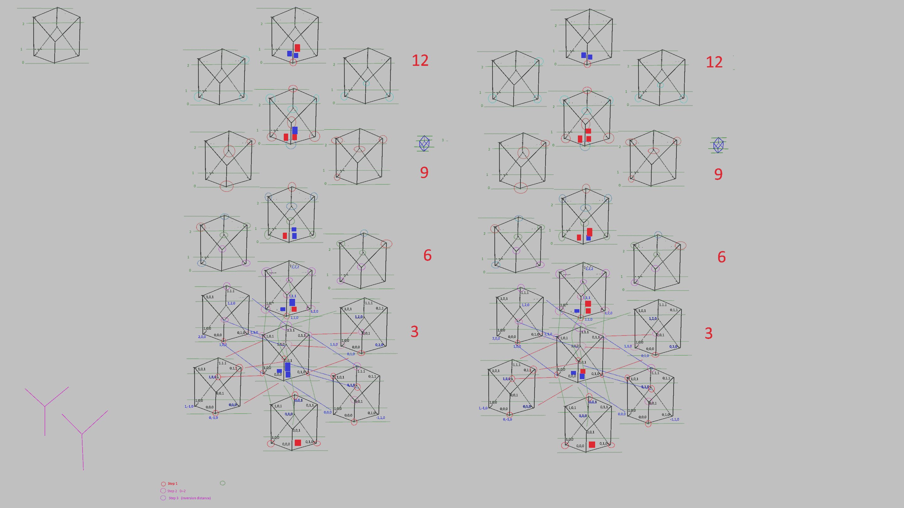
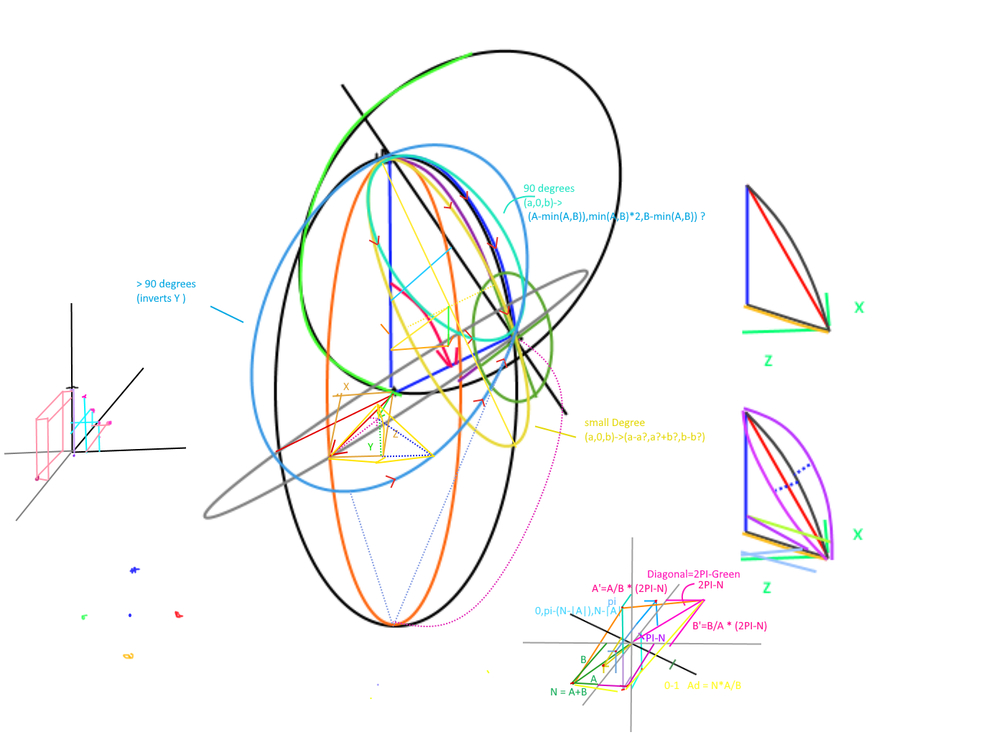

# Space-Time Field Reactor Physics

## Fast Faraday Force Flux Field Reactor (FFFFFR?)

Mostly this project is just about exploring the rotation space of log-quaternions.

## Preface

This is a study of rotation vectors... rotation vectors add similar to the terms here... https://en.wikipedia.org/wiki/Lie_product_formula that each 
is applied in parallel steps until the end.


### Old Preface

There exists a coordinate space of rotations that's not self covering.

The coordinate space of rotations, hence called 'rotation space' or 'rotation map', is a continuous, infinite space consisiting
of N perpendicular axles which together apply curvature to a space.  Curvature is a translation of a Cartesian or linear space around 1 or more axles;
where additional axles composite into a single composite axle, around which all linear space is translated.  The coordinates of a curvature are
in terms of `dθ/dT`, similar to velocity expressed in (X,Y,Z) linear coordinates with units of `dPosition/dT`.
Velocity sums to a position, angular velocity sums to an angular position.  Curvature at time 0 is the same
as a curvature of 0 at any other time `T`; which is the basis frame representing the new (X/Y/Z) vectors used to scale 
all points in the frame to this new frame.

The rotation space is linear, and can be compared relatively(which is to say to take the difference of the rotations).
While the differential rotation is knowable, and defines a specific axis/angle itself, the required path to take to move your rotation point,
when properly constrained to rotation composition, is a different matter (much like in life, just because you can compute a line from here to there, doesn't mean you can use
that line to get there; even in space, gravity applies a curvature to your inertia).
When a rotation is rotated, the operation is the [cross product](whitepaper.md#lna-x-lnb---the-cross-product-of-natural-log-vector-complex-numbers) of two log quaternions: 
`lnQ1 x lnQ2` and not addition; compared to `exp(lnQ1) x exp(lnQ2)`. The math performed is not the same, and the cross product of 
log quaternions retains the correct relative angles within the rotation space; including potential orbital jumps.

In every 3D physics and game engine, objects have 6 dimensions, 3 which represent it's velocity and 3 that
represent it's angular velocity.   The normal vector representing velocity is the direction of motion, while
the normal of the vector representing angular velocity is the axis of rotation.  The length of the velocity
vector represents the speed of an object, similarly the sum of the angles of the angular velocity represents 
the [total angular warp](whitepaper.md#regarding-specific-representation) of coodinate space.

Coordinates within the rotation space have a sort of concentric spherical shell nature to them, any line radially
from the origin is the same rotation axle, with a different angular speed.


## Other Documents

 - [Log vector complex](whitepaper.md)  This describes log-quaternion/log-vector complex conversions, operations, behaviors, ...
 - [Twist operation](Twister.md)  Description of application of Rodrigues' Rotation Formula.
 - [Wiki Article](https://en.wikipedia.org/wiki/Rotation_formalisms_in_three_dimensions#Quaternion_Natural_Log) Formatted math in wiki/latex math.
 - [Curvature Notes](Curvature.md)... This is also a how-to/explanation of earlier demos(1-3).
 - Some(dirty) [notes on development](MATH.md) of the system; this is fairly old, while I was still trying to get rotations in the raw rotation space instead of the modulated result of matricii or quaternions.

## Live Demos
 - [Original Math Test](https://d3x0r.github.io/STFRPhysics) Stereographic projection of quaternion... finding 'circles'
 - [first](https://d3x0r.github.io/STFRPhysics/3d/index.html) Shows curves of interest - shows bundles of rotations around resulting curve...
 - [second](https://d3x0r.github.io/STFRPhysics/3d/index2.html) Shows just the sub-arc of interest; this used to show a more sparely scattered arc because of a bad multiplier.
 - [third](https://d3x0r.github.io/STFRPhysics/3d/index3.html) curvature plots, demonstrate free angle choice, and free 'same normal vector' choice; which doesn't have to be `up`.
 - [Fourth](https://d3x0r.github.io/STFRPhysics/3d/index4.html) Hopf Fibration generator...
 - [Arm Additive](https://d3x0r.github.io/STFRPhysics/3d/indexArm.html) 5 segment arm, with 5 rotation settings, added rotations; shows the curvatures over time too; the 'correct' additions would actually be calculated not arbitrary.
 - [Arm Proper](https://d3x0r.github.io/STFRPhysics/3d/indexArmProper.html) 5 segment arm, with 5 rotation settings, rotation frames applied relative to prior rotation; more what a robot arm would actually do.
 - [Relative Rotations](https://d3x0r.github.io/STFRPhysics/3d/indexRelative.html) 5 Rotations, showing the curvature from 0.0-1.0 in 0.01 increment steps; shows differential rotations...
 - [Grid to Sphere Map](https://d3x0r.github.io/STFRPhysics/3d/indexSphereMap.html) Builds a regular x/y grid that projects onto a sphere... [More Information](https://github.com/d3x0r/STFRPhysics/blob/master/3d/indexSphereMap.md#mapping-rectangles-on-spheres).
 - [Integration Test](https://d3x0r.github.io/STFRPhysics/3d/indexArmProper-Integration.html) Test of integration of internal and external rotations.

## Some included Images

This is a map fo the rotation states; each cube represents +/-2pi rotations, and the other related cubes of rotation near them.


This is a sketch of trying to compute the vector for the twist operation of the normal ball shown in the demos... (`A`/`X` slider, with show normal ball checked)



## Glossary

 - quat - short for 'quaternion'.
 - quats - plural of `quaternion`.
 - lnQuat - short for 'quaternion in natural log mapping'  (lnQuats for plural); may also be said as 'log-quaternion' or 'Log Quat'.
 - dlnQuat - short for 'dual log-quaternion'; this adds a separate x/y/z coordinate that represents the translation/location of the quaternion; this point is the 'origin' of any child frames (more later).
 - Quat - the type `class Quat`.

## Frame Computation Using Dual Log-Quaternions

I've come to relearn much about the quaternions and complex numbers especially with applications to rotation.
Quaternions have a natural logarithm function, and the natural log quaternion has an exponential function. 

Although natural log means, for multiplication of scalars that `exp(ln(A)+ln(B))=A+B`, and this is as much true here,
the actual operation of rotation is actually a cross product, and not multiplication, hence `exp(ln(Q) ⨯ ln(P)) = Q⨯P`.
And although this system does become additive, it only applies for virtual object rotations (in a full time step), and velocity/acceleration.
A difference or differential does give the shortest path between two rates of rotation; and can compare relatively the similarity
of two rotations, which can be used to synchronize rotation.  The ability to rotate in any direction is often constrained by
physical limitations, such as a rocket's engine is on a certain rigid point, and the thrust direction varies with the rotation of the
rocket itself; so knowing when/how to apply a trust in order to get to the target spin is different than knowing spin differential.


### Hypothetical failure case

An IK chain is setup with just a few links, a foot, a body and a couple segments; preferably the segments have rigid bend constraint.  The full calculation carried down the chain results in 
a resulting rotation of 1 degrees; although the total sum of inputs to that is 361 degrees; so to feed 1 back down the chain as the target rotation distorts the motion that the joints up to
that point are 'expected' to do; if the full chain of calculation is calculated in quaternion space.  (And really the limits break at 1/2 of a full rotation)

Log quaternions are the input angle to the sin/cos functions that limit the bounds of quaternions.  This means that the log quaternion can represent total rotations greater than 360 degrees,
and be simply manipulated with addition and subtraction.  (721 degrees is the same sin as 1 degree, but obviously the net motion of 720 is much greater than 1).

## SLERP Comparison

SLERP is an accurate interpolation between two frames by an internal rotation force.  Linear interpolation of axis-angle (log-quaternion)
works more like a rotation of an external exis, but does not follow the path of any single compoition- but rather the required force would have to change with time in order to form a straight line.

However, recovering the rotation between two frames and then applying that in some fraction is also computable.  Take the target frame, rotate the starting frame out of it (apply start frame inversed), using
a axis-angle rotated by axis-angle; and then rotate that result back into the starting frame as a (x/y/z) vector that moves the direction, but keeps the angle.

Free Bodies may run a long accumulation of rotation to get the orientation; application of 
a quaternion with many turns still results in a minimal unit-quaternion representation; although if the accumulator gets too big, loss of precision may 
cause erratic results after a long time.  Free bodies should 'relax' their spin count as required by updating to the principal rotation (except if the value is a angular velocity or acceleration).
Also bodies, that spin very slowly don't need to apply corrections very often.

However, computing a chain from a fixed point like the base of a robot arm it will be more proper to maintain the full spin count (to prevent the robot manipulator from spinning 3 times just because; say on a 
long chain of actuators; but this scenario is also likely to not overflow rotation accumulation.

## Internal VS External rotations

When a rotation force is applied to change the direction of another axis-angle rotation, the force may be mounted within the frame that
the axis-angle represent; this is called an 'internal' rotation.  The effective direction of the rotation axis changes with time, and is an
integration using the base frame through it's rotational step.

The other source of torque is located outside of that frame, in a global space, and is called an external rotation.  The direction of this force does not change with time, and is constant within the frame
itself, every point in the frame along that line will remain the same, leaving any view of that rotation axis also the same.

SLERP is an internal rotation between A and B, and getting the `spinDiff()` axis-angle and applying that is the same... but it does not 
reflect what the actual rotation required to get there was based on.


## Inertial Frame Relavence.

Addition of impulse is the cross product between the vector to the point of impact from the mass' center of gravity and the force of impact. (maybe one of those is negative?)
Addition of translation is the remaining force applied to the dualQuat.
The cross of two nearly parallel vectors is nearly 0; so dead on collisions result in translation.
(The angle is also the arc length, so units of space translate to angle directly).


## Implementation

[JS Implementation](3d/src/dual-quat.js)...

For implementation, existing `Quaternion.log()` function should return a new type 'LogQuaternion' which has different operator to apply and apply-inverse to vectors.

`LogQuaternion.exp()` should result with a 'Quaternion' type.

They are mappings in different projections, and should be considered as a different type of units.

| Type | Description |
|---|---|
| lnQuat | (x,y,z) Quaternion in natural log map.  lnQuat().exp() returns a Quat().


| lnQuat Methods | Parameters | Description |
|---|---|---|
| new | ( theta, direction ) | (constructor) Takes theta angle in radians and direction normal around which the theta angle rotates |
|  "  | ( a,b,c,d ) | (constructor)set literal parameters w,x,y,z respectively |
|  "  | ( normal ) | (constructor)Use normal and create a quaternion pointing in that direction |
| add | (q) | add passed quaternion to this quaternion. |
| addNew | (q) | add passed quaternion to this quaternion, return a new lnQuat(). |
| apply | (v) | apply rotation to vector parameter, result with a new vector. |
| applyInv | (v) | 'unapply' or apply the quaternion inversed to translate point from quaternion space. |
| exp | () | return this log-quaternion as the natural map of this quaternion.  Returns a new Quat(). |
| getBasis | () | return { forward, right, up } object with 3 vectors and the related scalar direction vectors.  (Is also the rotation Matrix) |
| prinicpal | () | Removes excessive turns and results with new lnQuat in its principal angle.  Returns a new lnQuat() that is at the prinicpal angle of this lnQuat. (may be 0).  |
| turn | (turns ) | add a certain number of turns to the current rotation.  ( this += turns * PI, in the current direction (if any) ); If the principle() is 0, cannot re-turn it. (Deprecated before release; except in the case you know your thrust is always on the same twist) |
| torque | ( angles, turns ) | apply a torque to this quaternion.  (this += a * t ). |


## Rotation limits

If we consider the speed of light achievable, 1 half rotation per nano second is a reasonable maximum.  This is 3B RPM is the maximum rotation rate.
This turns out to be a 1 rotation of 0.3m arc-length per nanosecond is the speed of light.


## References


[Youtube Video- Visualizing quaternions (4d numbers) with stereographic projection])https://www.youtube.com/watch?v=d4EgbgTm0Bg)

[Youtube Video - Imaginary Numbers Are Real; Part 1: Introduction](https://www.youtube.com/watch?v=T647CGsuOVU)

[Youtube Video - quaternion expoentiation mapping](https://www.youtube.com/watch?v=UHzAY5Q7ji0), This is actually sort of the inverse way of looking at and understanding log-quaternions. It doesn't
matter so much what the shape of the projection is, but what the source data projects into.

[(FPGA lnQuat adder)](http://www.acsel-lab.com/arithmetic/arith20/papers/ARITH20_Arnold.pdf), Implemented quaternion pose tracking as adders in FPGA Robotics controller.

['Practical Exponential Coordinates using Implicit Dual Quaternions'](http://www.neil.dantam.name/papers/dantam2018practical.pdf) (still not a log system)

[Pose consensus based on dual quaternion algebra with application to decentralized formation control of mobile manipulators (Log- dual-quaternion)](https://arxiv.org/pdf/1810.08871.pdf)

[kinatimatic control with dual quaternions (euler number)](https://reader.elsevier.com/reader/sd/pii/S0022247X12000327?token=C2A88F2FE30E44EC9A7E1439E715AFAE52DDAC7E05FCCB26B5353C6F6EFEE671588329FD76F673D41FAC945FD9B7CAF4)

[Scaling a quaternion to a power through exp() and log(); Example Java Code](https://math.stackexchange.com/questions/939229/unit-quaternion-to-a-scalar-power)


### Applications of Dual Numbers

[dual quaternions, proper euler and imgangary matrix multiplication](https://parasol.tamu.edu/wafr/wafr2018/ppr_files/WAFR_2018_paper_1.pdf); recommends calculation of separate things, since the position is mostly independant of the rotation, don't need to always track the projection AND inverse projection of the point.

[Math - Functions Of Dual Numbers](https://www.euclideanspace.com/maths/algebra/realNormedAlgebra/other/dualNumbers/functions/index.htm), only dual number exp, no ln.

[Meta-Complex Numbers](http://new.math.uiuc.edu/math198/MA198-2014/rgandre2/seminar.pdf), exp and ln; same old stuff, just a nice layout worth the credit.

```
ln dq = 

dual O   Oe + e0e   O^ = O  *O^ = Oe

O^ unchanged  real O part
1/0 

V is angle of rotation total 
thetaHat = v + de;
```

### Other Applications, and common background

[!Spinning T Handle(video)](https://www.youtube.com/watch?v=1n-HMSCDYtM)
[!Kerbal space program - spinning T handle Simulation(same video)](https://www.youtube.com/watch?v=WPRFerc4zqw)
[!The Bizarre Behavior of Rotating Bodies, Explained](https://www.youtube.com/watch?v=1VPfZ_XzisU)  (reiterates on the above)

[Wikpedia - Angular Velocity; especially the 3d particle motion](https://en.wikipedia.org/wiki/Angular_velocity)

[quantum spin modelling](http://bohr.physics.berkeley.edu/classes/221/1011/notes/spinrot.pdf)


[Quaternions and Exponentials - slides](http://www.cs.jhu.edu/~misha/Fall19/29.pdf)


[Quaternions  (long list of general formulas gathered)](https://maxime-tournier.github.io/notes/quaternions.html#interpolation)


[Wikipedia Quaternion(of course)](https://en.wikipedia.org/wiki/Quaternion) (especially exponentiation)

[Wikipedia Natural Logarithms](https://en.wikipedia.org/wiki/Natural_logarithm) (bottom of page, 'Plots of the natural logarithm function on the complex plane (principal branch)' complex number extension, graph of abs(ln(x+yi)) = high speed break of record hydraulic press channel. (30,000 RPM!)


### Other Topics


 tangent topic, about parititioning space; delenay separation provides networks where
 local clusters can be evaulated without searching the whole avaiable space; even if said 
 search is 'fast enough'; in practice objects interact simultaneously with very few other objects
 and those relations are __temporally coherant__.  [3D delaunay tessalation](https://www.ljll.math.upmc.fr/perronnet/delaunay3d/delaunay3d.html)

---

## Approach 2

# Rotations

All rotations can be modeled using a gyroscope located at the origin of a coordinate system. The direction of the 
axle through the rotor is the axis of rotation, and the turn of the rotor around the axis from a certain 0 point represents
the angular velocity with which the space is transformed around the axis.

Rotations which are relative to the current location can be composited in rotation coordinates; before being applied to a rotation.
Rotations which are rlative to other rotations need to be rotated around the base axis, however, the path from the end of the previous rotation to the new one starts at the previous, and is added to this one.

It doesn't HAVE to be done that way, if the rotation is always applied at the target value, instead of iterated between two states, then the 
origin of the rotation does not matter; however, it can be advantageous to know that base position.

For any specific X/Y/Z coordinate in rotation space, there is only one representation of that vector.
If within a single frame, a rotation around the Y axis is applied, the base frame is spun around the Y axis; this means the X and Z direction vectors are also rotating.  An addition X rotation from the position in 
rotation space will be applied as if the rotation was applied to the Z axis, the composite the rotation of the X and Y in the same way as if the rotation was performed the other way.
Rotation around the X axis rotates the frame such that a change in the Y will now be aligned with the Z axis, which is also heading in the same direction as the previous addition.

This is a way to combine angular velocities and get a net axis/angle of rotation.  This is not the same a rotation applied to a rotation.
