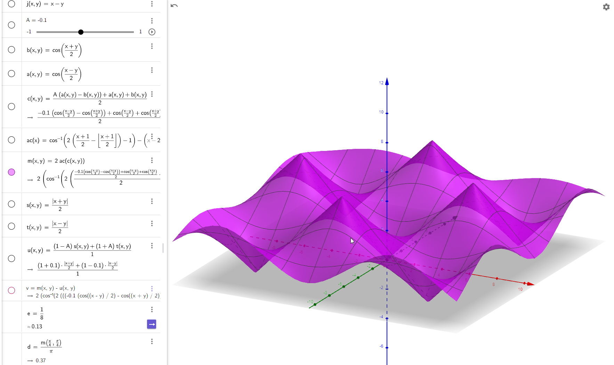

# Rotations

On rotations... (prelude/intro)

## Prerequisites

A basic knowledge of addition, subtraction, multiplication and division; and things like division by `x` is 
just multiplication by `1/x` (by the reciprocal).

A understanding of dot product, especially as a projection of one vector on another; and the cross product of 
vectors which results in a vector perpendicular to both of the inputs; 
assuming they are not parallel or zero length themselves.

An understanding of programming language structures; especially as written in Javascript, but C, C++, etc basic structure notation of
'object.field' to get a field of an object, and the full name is really the object and field; and that an object is specified using `{` followed by 
one or more `fieldName:value` pairs separated by comma's; later the values are referenced using the `fieldName` specified.  A shorthand for defining the 
members of a structure, without values might be listed as `{ field1, field2, field2 }` where there are no colons, then a list of names is just the names, 
and no particular value specified, although is probably a number.


```
const object = { nx: 0, ny:0, nz:0 }
const objectValue = object.nx;  


// just a specication of structure, of 3 named values
  { nx, ny, nz }

```

### Other terms

- apply - This is mathematically 'mulitply' generally.  It means to use some numbers to transform some other numbers to new values.  
- transform - This is a general term for a change to a value.
- value - may be a simple number like `1.5`, or a set of simple numbers like `(0,1,2)`, usually called a vector.

## Presentation

Introduce general ideas

Expand on what rotations are

Apply rotations to rotations


## Introduction

A common representation of rotations is axis-angle.  All forms of non-scaling rotations go back to a form of axis-angle.
These will be called 'Rotation Vectors'; or in this context just 'vectors'.  

For 3D space, an orientation can be reprented with a rotation.  A rotation at some time T=1 is a fixed orientation; 
the change from some base orientation to the new orientation is a rotation applied to the first

On a sphere, a location on the sphere can be established with 2 angles, 2 coordinates like lattitude and longitude; and that position can infer a 'up' 
that is in a direction perpendicular to the surface of the sphere.  The orientation around that up requires 1 more angle to define the spin around that up vector.
Pretty much, no matter how you slice it, a specific orientation in 3D requires at least 3 angles.

'In geometry, Euler's rotation theorem states that, in three-dimensional space, any displacement of a rigid body such that a point 
on the rigid body remains fixed, is equivalent to a single rotation about some axis that runs through the fixed point. It also means 
that the composition of two rotations is also a rotation' [wikipedia](https://en.wikipedia.org/wiki/Euler%27s_rotation_theorem)

A rotation can be considered as a amount of turn per time, where most cases the time is 0; however it's still just a smooth delta-angle (or change-in-angle).

A rotation around the X axis of 0.5 turns moves the points around the x axis to their inversed position....(more examples?less?)

Similarly, a rotation around the Y or Z axis by some amount results in rotating the points around that axis by a certain amount.  A combination of
`X+Y+Z` often represented as a vector `(X,Y,Z)` is the simultaneous rotation around the X Y and Z axis by some amount.  The total length of the vector using 
a square distance `sqrt(xx+yy+zz)` is the total angle of rotation, and the axis of rotation is `(x,y,z) / angle`, which results as a unit vector in a certain direction.

A matrix represents an orientation by using 3 vectors that represent where the X, Y, and Z axises end up.  Mulitplying a vector's X, Y and Z coordinates by the apprpriate vector
in the matrix, and summing those resulting vectors,  results in the new X, Y and Z values for that point.

### General conventions

For 'right' I consider the vector `(1,0,0)` or along the X axis to the 'right' of the page, if looking at a graph... 

For 'up' I consider the vector `(0,1,0)`, or that the Y axis is the direction of up, as usually looking at a graph the y axis is vertical.

For 'forward' I consider the vector `(0,0,1)`, or the Z axis is into and out of the surface you're looking at, and gonig forward is deeper into the graph.

## To Exponentiate or To Not Exponentiate

Rotation vectors are the log of a quaternion; so where quaternions mulitply, these add.... `log(a) + log(b) = log(a*b)`.  Since a rotation vector `A` is the log of a quaternion
`log(a)`, then `A+B = a*b`.   And where the identity for a quaternion is `(1,0,0,0)` identity in log-quaternion space is `0` or `0*(nx,ny,nz)` which is zero times the direction.

The rotation vector, or any vector `(0,0,0)` is identity.  `1+0=1`... Although most math considers rotation added to a rotation as a multiplication, it is an addition here.

(Anything resembling a singularity of rotations is the origin, where dividing the rotation by it's length of 0 result in a direction vector of undefined direction); but defining
that as identity simplifies the error handling.


## Simple Rotation Vectors

The simplest rotation vectors to work with and generate are those around the plane perpendicular to a normal.  Since the convention is Y is up, if Y is a north pole (and -Y the south pole), 
then rotations that point around the vector are great circles that move the point at the north pole to the south pole (and beyond, and forward/backward..).

The vectors in the x-z plane can be treated as a longitude like `x=cos(long), z=sin(long)` where longitude of 0 is positive along the x axis, and 90 degrees is positive along the z axis.
This unit vector is then scaled by the angle of latitude from the north pole to the south.  `Rx = x * lat,  Ry = y * lat`, where 0 is no change, and is the north pole, 
and 90 degrees is on the equator (perpendicular to the axis of rotation),  and 180 degrees moves `(0,1,0)` to `(0,-1,0)`.

These rotations only give you control over the normal, the orientation of the tangent and bi-tangent vectors that define the rest of the frame may not be in a useful alignment; you can 
additionally apply `-lat` as a spin around the 'up' vector, and rotate the frame, such that the forward direction is aligned to the north/south poles, and the right direction is along
the latutude lines.  (Later I will define `up()` and `finishRodrigues` which uses the up and the computed equitorial rotation vector to update; the math doesn't simplify much if combined
into a single function).

Negative degrees can move negative from the pole.

The length of the rotation vector should never exceed 2pi; since any rotation greater than 2pi when applied with a time of 1 looks like the rotation modulo 2pi.

But then this gives a total span of rotation space from -2pi to 2pi in x,y and z dimensions; the effective use of this space is a sphere that is 2pi, and all points on the surface
of the sphere represent the same orientation as the center point.


### Calculating a matrix from a Rotation Vector

The orientation 3x3 matrix is a useful way to visualize the effective orientation of a rotation vector; but
rotation vectors are also analog, in that they may be applied smoothly across different time scales, while the matrix
is only a single snapshot of that rotation.


This code expects to be passed a rotation vector `{x,y,z}`, and result with a matrix or basis object which is the orthagonal direction vectors.

``` js
	// input is something like this; values unspecified

	const rotationVector = { x, y, z };
	const θ = sqrt(xx+yy+zz);

	const axisAngle = { nx:x/θ, ny:y/θ, nz:z/θ, θ };
	if( θ === 0 ) {
		// some value; the normal x,y,z values MUST be a unit vector.
		axisAngle.nx = 1; 
		// this doesn't HAVE to be set, the observation that θ is 0 can
		// also result in no change.
	}

	const q = { nx, ny, nz, θ };


	const nt = q.θ * del;   // new theta
	const s  = sin( nt ); // sin/cos are the function of exp()
	const c1 = cos( nt ); // sin/cos are the function of exp()
	const c = 1- c1;           
	// compute some temp terms
	const xy = c*q.nx*q.ny;  // x * y / (xx+yy+zz) * (1 - cos(2t))
	const yz = c*q.ny*q.nz;  // y * z / (xx+yy+zz) * (1 - cos(2t))
	const xz = c*q.nz*q.nx;  // x * z / (xx+yy+zz) * (1 - cos(2t))

	const wx = s*q.nx;     // x / sqrt(xx+yy+zz) * sin(2t)
	const wy = s*q.ny;     // y / sqrt(xx+yy+zz) * sin(2t)
	const wz = s*q.nz;     // z / sqrt(xx+yy+zz) * sin(2t)

	const xx = c*q.nx*q.nx;  // y * y / (xx+yy+zz) * (1 - cos(2t))
	const yy = c*q.ny*q.ny;  // x * x / (xx+yy+zz) * (1 - cos(2t))
	const zz = c*q.nz*q.nz;  // z * z / (xx+yy+zz) * (1 - cos(2t))

	// this is a 3x3 matrix; but sideways to a math matrix, as the 'right', 'up' and 'forward'
	// vectors are usually vertical columns in the matrix.
	const basis = { right  :{ x : c1 + xx, y : wz + xy, z : xz - wy }
	              , up     :{ x : xy - wz, y : c1 + yy, z : wx + yz }
	              , forward:{ x : wy + xz, y : yz - wx, z : c1 + zz }
	              };

	return basis;	

```

### Apply a rotation to a point

To move a vector around a certain rotation.
This bit of code stores the result in a specified vector `target`.

``` js
	const len = Math.sqrt( axis.x * axis.x + axis.y * axis.y + axis.z * axis.z );
	const qx = axis.x / len, qy = axis.y / len, qz = axis.z / len;

	const c = cos(len*del);
	const s = sin(len*del);

	const vx = v.x
	    , vy = v.y
	    , vz = v.z;
	const dot =  (1-c)*( (qx * vx ) + (qy*vy) + (qz*vz));
	target.set(
		  vx*c + s*(qy * vz - qz * vy) + qx * dot
		, vy*c + s*(qz * vx - qx * vz) + qy * dot
		, vz*c + s*(qx * vy - qy * vx) + qz * dot );
	return target;
```


### Calculate just 'up' from a rotation vector

Direction vectors from a rotation are less overall work to compute than a full basis.
This can be derrived by using the above math to apply a rotation to a constant vector `(0,1,0)`, and simplifying 
the terms to go to zero.

Similarly the right and forward vectors can be calculated.

``` js
	const s = Math.sin( q.θ ); // double angle sin
	const c1 = Math.cos( q.θ ); // sin/cos are the function of exp()
	const c = 1- c1;
	const cn = c*q.ny;
	return new vectorType( 
	        -s*q.nz  + cn*q.nx
	       , c1      + cn*q.ny
	       , s*q.nx  + cn*q.nz
	       );
```


## Rotating a rotation

When a rotation is rotated, the relative direction the rotation is transformed from changes.  When a rotation is at the origin, and has not modified the frame, 
the frame is at a standard `(right,up,forward)`, and a rotation that rotates that frame is in a direction of the right, up and forward, generally such that
a rotation around forward is a roll, the rotation around up is a yaw, and the rotation around right is a pitch.  The general frame of rotation is a circle around you 
with a direction forward being the axis of rotation; generally linear offsets are applied forward first, because thrust is based, so the viewpoint of the implementation
assumes this sort of direction... a rotation around forward is a roll, while the rotation for pitch will deflect the direction the forward motion.

I found a small formula on [Wikipedia article on quaternions and spacial rotation](https://en.wikipedia.org/wiki/Quaternions_and_spatial_rotation#The_composition_of_spatial_rotations);
it applies to quaternions, but is based on Rodrigues' math, and can be taken a step backwards to just axis-angle input.  This is the direction I've not found before....

Then resulting in a axis and an angle... the axis is a normalized unit vector, and the angle is a always-positive number;  This implies mathematically that there is a domain of negative rotations, 
but all negative rotations appear as positive rotations around a different axis direction; the distinction between changing the sign of the angle angle and changing the sign of the axis is indistinguishable 
in the application.


I did some digging, and found the original ariticle referenced on the wikipedia page [Original French article](http://sites.mathdoc.fr/JMPA/afficher_notice.php?id=JMPA_1840_1_5_A39_0), and 
[English translation] (https://arxiv.org/pdf/2006.00196.pdf ), and additional history of Benjamin Olinde Rodrigues.   Rodrigues in 1840 France seems to have not made it into english math.
Hamilton is credited with quaternions in 1843; so it might have been intellectual property theft :)  But then maybe he didn't read french.


There are mulitple calculations left in; for some purposes adding the angles and taking the sin and cos is better than multiplying the sin and cos of the same angles?

Add cheaper than multiply?

There is an `arccos` calculation, but the input is always a number between -1 and 1.

``` js

// this takes a q={nx,ny,nz,0,x,y,z}
// oct is a 'octave' number beyond 0.... a power of rotation
// ax, ay, az are the axis to rotate Q around, and th is the angle 'theta' to rotate by.

function finishRodrigues( q, oct, ax, ay, az, th ) {
	oct = oct || 0;
	// A dot B   = cos( angle A->B )
	// cos( C/2 ) 
	//  cos(angle between the two rotation axii)
	const AdotB = (q.nx*ax + q.ny*ay + q.nz*az);

	/*
	// orbital hopping mechanic... 
	// hypothetical relation mass to orbital
	if( AdotB > 0.99 ) {
		if( q.θ + th > Math.PI*4 )
			oct++;
	} else if( cosCo2 < -0.99 ){
		if( q.θ - th < -Math.PI*4 )
			oct--;
	}
	*/

	// using sin(x+y)+sin(x-y)  expressions replaces multiplications with additions...
	// same sin/cos lookups sin(x),cos(x),sin(y),cos(y)  
	//   or sin(x+y),cos(x+y),sin(x-y),cos(x-y)
	const xmy = (th - q.θ)/2; // X - Y  ('x' 'm'inus 'y')
	const xpy = (th + q.θ)/2  // X + Y  ('x' 'p'lus 'y' )
	const cxmy = Math.cos(xmy);
	const cxpy = Math.cos(xpy);

	// cos(angle result)
	// const cosCo2 = ( ( 1-AdotB )*cxmy + (1+AdotB)*cxpy )/2;
	// ( 2 cos(x) cos(y) - 2 A sin(x) sin(y) ) / 2
	const cosCo2 = ( ( AdotB )*(cxpy - cxmy) + cxmy + cxpy )/2;
	//   (1-cos(A))cos(x-y)+(1+cos(A))cos(x+y)
	//    cos(A) (cos(x + y) - cos(x - y)) + cos(x - y) + cos(x + y)
	// octive should have some sort of computation that gets there...
	// would have to be a small change
	let ang = acos( cosCo2 )*2 + oct * (Math.PI*4);

	if( ang ) {
		const sxmy = Math.sin(xmy);
		const sxpy = Math.sin(xpy);
		// vector rotation is just...
		// when both are large, cross product is dominant (pi/2)
		const ss1 = sxmy + sxpy  // 2 cos(y) sin(x)
		const ss2 = sxpy - sxmy  // 2 cos(x) sin(y)
		const cc1 = cxmy - cxpy  // 2 sin(x) sin(y)

		//1/2 (B sin(a/2) cos(b/2) - A sin^2(b/2) + A cos^2(b/2))
		// the following expression is /2 (has to be normalized anyway keep 1 bit)
		// and is not normalized with sin of angle/2.
		const crsX = (ay*q.nz-az*q.ny);
		const crsY = (az*q.nx-ax*q.nz);
		const crsZ = (ax*q.ny-ay*q.nx);
		const Cx = ( crsX * cc1 +  ax * ss1 + q.nx * ss2 );
		const Cy = ( crsY * cc1 +  ay * ss1 + q.ny * ss2 );
		const Cz = ( crsZ * cc1 +  az * ss1 + q.nz * ss2 );

		// this is NOT /sin(theta);  it is, but only in some ranges...
		const Clx = (lnQuat.sinNormal)
		          ?(1/(2*Math.sin( ang/2 )))
		          :1/Math.sqrt(Cx*Cx+Cy*Cy+Cz*Cz);
		if(0) {
			// this normalizes the rotation so there's no overflows.
			const other = 1/Math.sqrt(Cx*Cx+Cy*Cy+Cz*Cz);
			if( Math.abs( other - Clx ) > 0.001 ) {
				console.log( "Compare A and B:", Clx, other, th, q.θ );
			}
		}
		q.rn = Clx; // I'd like to save this to see what the normal actually was
		q.θ  = ang;
		q.nx = Cx*Clx;
		q.ny = Cy*Clx;
		q.nz = Cz*Clx;

		q.x  = q.nx*ang;
		q.y  = q.ny*ang;
		q.z  = q.nz*ang;

		q.dirty = false;
	} else {
		// result angle is 0
		if( AdotB > 0 ) {
			q.θ  = q.θ+th;
		}else {
			q.θ  = q.θ+th;
		}
		q.x = (q.nx) * q.θ;
		q.y = (q.ny) * q.θ;
		q.z = (q.nz) * q.θ;
		q.dirty = false;
	}
	return q;
}

```

### In parts

The above Rodrigues

#### The resulting angle

The resulting angle expression for the above, where 'th' is the amount to rotate by, and `q.θ` is the original angle.

``` js
	const AdotB = (q.nx*ax + q.ny*ay + q.nz*az);
	const xmy = (th - q.θ)/2; // X - Y  ('x' 'm'inus 'y')
	const xpy = (th + q.θ)/2  // X + Y  ('x' 'p'lus 'y' )
	const cxmy = Math.cos(xmy);
	const cxpy = Math.cos(xpy);
	let ang = acos( ( ( AdotB )*(cxpy - cxmy) + cxmy + cxpy )/2 )*2;
```

This demo page has a slider 'A' which is the AdotB product, which just controls how much of one angle or another is used.
The math is like `(A*B)+((1-A)*C)` and the value of A is always between 0 and 1 (like, not exactly).

https://www.geogebra.org/3d/cytxuen9

 
 

#### The direction vector

The resulting direction vector is a calculation on the unit vectors, and the angle calculation above is independant (other than depending on the same inputs).

This demo has 6 sliders, `(A,B,C)` and `(D,E,F)` which control the input `(x,y,z)` of the input vectors.  `(A,B,C)` is the rotation being rotated, and `(D,E,F)` is the rotation it is
being rotated around.

This works best if the normalization of the direction vector is done from its own length.  The normal is also supposed to be `1/sin(result angle)`, but that fails in some ranges; and
the error is lost later when the axis is normalized - otherwise the non-unit normal axis causes skew in projected vectors to which the rotation is applied.

https://www.geogebra.org/3d/rjq9hx7s


``` js
		const cxmy = Math.cos(xmy);
		const cxpy = Math.cos(xpy);
		const sxmy = sin(xmy);
		const sxpy = sin(xpy);

		const ss1 = sxmy + sxpy  // 2 cos(y) sin(x)
		const ss2 = sxpy - sxmy  // 2 cos(x) sin(y)
		const cc1 = cxmy - cxpy  // 2 sin(x) sin(y)

		// the following expression is /2 (has to be normalized anyway keep 1 bit)
		// and is not normalized with sin of angle/2.
		const crsX = (ay*q.nz-az*q.ny);
		const crsY = (az*q.nx-ax*q.nz);
		const crsZ = (ax*q.ny-ay*q.nx);
		const Cx = ( crsX * cc1 +  ax * ss1 + q.nx * ss2 );
		const Cy = ( crsY * cc1 +  ay * ss1 + q.ny * ss2 );
		const Cz = ( crsZ * cc1 +  az * ss1 + q.nz * ss2 );

		// this is NOT /sin(theta);  it is, but only in some ranges...
		const Clx = (lnQuat.sinNormal)
		          ?(1/(2*Math.sin( ang/2 )))
		          :1/Math.sqrt(Cx*Cx+Cy*Cy+Cz*Cz);
		if(0) {
			// this normalizes the rotation so there's no overflows.
			const other = 1/Math.sqrt(Cx*Cx+Cy*Cy+Cz*Cz);
			if( Math.abs( other - Clx ) > 0.001 ) {
				// this generally doesn't mis-compare
				console.log( "Compare A and B:", Clx, other, th, q.θ );
			}
		}

		// this is the assignments of the output; Clx is the C length scalar to 
		// make a unit normal.

		q.θ  = ang;
		q.nx = Cx*Clx;
		q.ny = Cy*Clx;
		q.nz = Cz*Clx;

		q.x  = q.nx*ang; // normal rotation cooredinates are just axis*angle
		q.y  = q.ny*ang;
		q.z  = q.nz*ang;

```

### Averaging Normals

A rotation vector can represent a direction vector, or a direction normal as applied to lighting and textures in games.   The normal to the texture is the
direction the texture is facing.  Converting a normal to a rotation coordinate is simple

This assume the normal is the 'up' vector or `(0,1,0)`, so if there is no x or z offset, then the direction vector is either identity of 180 degrees around any axis in the x-z plane.

This converts a normal to a rotation vector;  It is a normalized rotation that is only in the x/z plane.  This is like a azimuth-elevation sort of vector.

``` js

// x/y/z normal (no spin, based at 'north' (0,1,0) )  {x:,y:,z:}
	// normal conversion is linear.
	const l2 = (Math.abs(theta.x)+Math.abs(theta.z));
	// if there is
	if( l2 ) {
		const l3 = Math.sqrt(theta.x*theta.x+theta.y*theta.y+theta.z*theta.z);
		//if( l2 < 0.1 ) throw new Error( "Normal passed is not 'normal' enough" );
        
		const ty = theta.y /l3; // square normal
		const cosTheta = acos( ty ); // 1->-1 (angle from pole around this circle.
		const norm1 = Math.sqrt(theta.x*theta.x+theta.z*theta.z);
		// get square normal...
		this.nx = theta.z/norm1;
		this.ny = 0;
		this.nz = -theta.x/norm1;

		this.θ = cosTheta;							
		this.x = this.nx*cosTheta;
		this.y = 0;
		this.z = this.nz*cosTheta;
	} 
```

```
	normalA
	normalB
	
	convert normalA to rotationA
	normalC = apply -rotationA to normalB
	convert normalC to rotationC
	rotate rotationC by rotation A
```


## Afterthoughts

The direction axis-angle is not recoverable from its frame vectors; that is in a matrix.  A matrix can represent all possible resulting rotations, but does not 
exactly represent the axis and angle.  Quaternions can maintain unique representation of axis and angle, but will lose the sign of the angle, if the sign is kept.

Sign (spin clockwise or spin anti-clockwise) is the sort of thing that would give electrostatics a mutually attracting or repelling behavior, the same spins are always spinning against
each other, while counter spins are spinning inline with each other.


This is the source project I've been working on to develop this; it's meant to be full physics engine, but I'm stuck on motors and IK; and is now just a demonstration of 
using `(x,y,z)` rotation vectors in natural coordinates (natrual being like in the natural x/y/z framework you see around you).  

- https://github.com/d3x0r/stfrphysics#readme  This has links to other demos and applications of the above rotation methods.
  - [demos](https://github.com/d3x0r/stfrphysics#live-demos)
- https://d3x0r.github.io/STFRPhysics/3d/indexSphereMap.html This demonstration though I was just using while pondering how to averge normals...  For a certain patch of coordinates, 
    this shows where they are in rotation space; so it sort of proves out that moving a normal inverted by another expressed as a rotation, and then building a rotation and rotating that rotation 
    results in a vector that is closer within the rotation space to the other vector; and really this should be done like 2x, to find the first average, and then use that average as the origin point; 
    but I suspect it would be redunant, and not really increase accuracy. There are many interesting relations between sets of points...
  - Topologically this is 'taking a group, and applying a group action to it' where the group is a mesh that is a cover from the origin, and the group origin translates that group to  a new location; 
     fiber bundles are just those grids, with the relative translations connected by lines... (show slider curves) shows how the set of points translates for each lat/long/spin slider...


