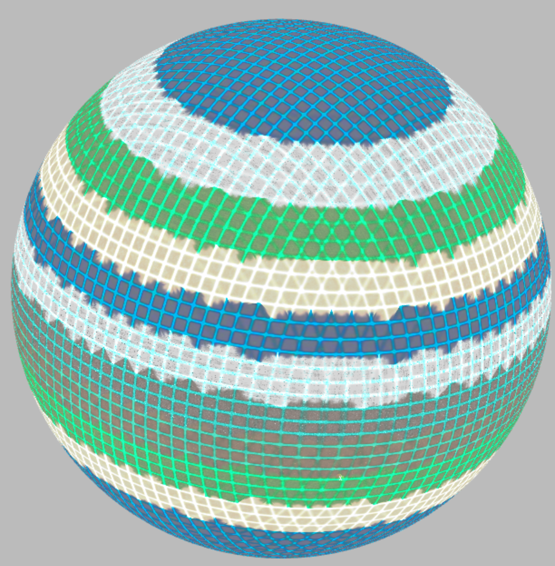
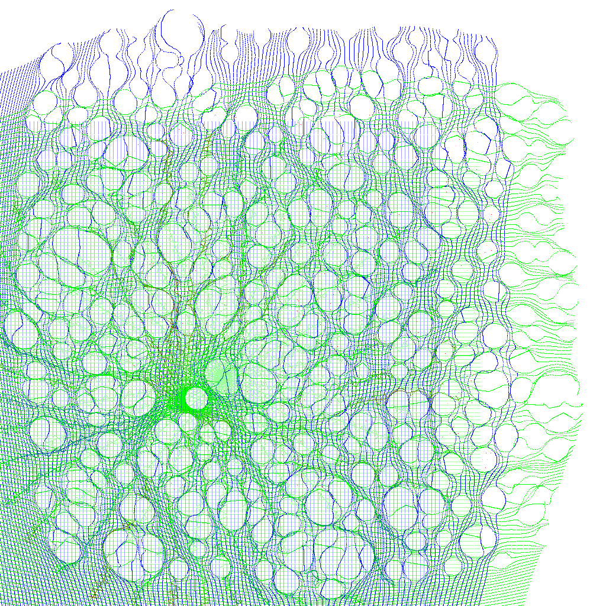
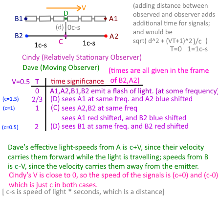

While developing this I've come across several issues with theoretical physics; that is those physics which rely on thought experiment to describe behaviors.  In some cases, even the basic geometry which math exists in, is subject of scepticism; that is although a system may even result in the overall net same effect, the geometry it's built on, or that is implied by the steps of the math, is not actually compatibile with reality.

So, below are a 'quick' summary of most of my issues.

## 1) Spin
Parameterizing spin as a 2D subset of 3D rotations (using azimuth/elivation or latitude/longitude) gives a different geometry to the problem than exists in 3D rotations.  There become available 'equitorial waves' or waves that go around the equator (an all other longitudes); these don't exist alone, and surely don't exist within the electorn probability cloud, and yet the spins are parameterized as a Bloch Sphere (or ...) which is latitude/longitude sort of settings.

This demonstrates the polar graph overlaps one would get from a proper coordinate system eminating from 3 perpendicular poles, which does not have equitorial waves; there are no real longitudinal coordinates (except on the great circles passing through the poles); but really those are coordinates from another pole, and not the pole the line is passing through.

## 2) Bell's Theorum
The paper that Bell wrote proposes a upper limit of local hidden variables(LHV) as a ratio of 'yes'/'no' vs the total samples; while the quantum mechanical term is a ratio of 'yes' to 'no' and not to the total.  A ratio of 'yes' to 'no' for LHV yields a curve very much like the quantum version.

The blue line is `cos(theta)` and the green line ratio of `a` to `b` from `a+b=2`; Red is the error between the curves.  There's actually quite a wide error bar.  at `pi/3` is exactly 50% just like the quantum result; and as the predicted value in Bell's paper.  

### 2.1) CHSH Inequality
CHSH is another inequality proposition, but this can actually be implemented as in this [Demo](https://d3x0r.github.io/STFRPhysics/math/CHSH_Game.html).  More information [here](https://github.com/d3x0r/STFRPhysics/blob/master/QuantizedProbability.md#chsh-experiment).  Easily beatable, by defining a more generous correlation function for the LHV than ( [John Clauser](https://en.wikipedia.org/wiki/John_Clauser), [Michael Horne](https://en.wikipedia.org/wiki/Michael_Horne_(physicist)), [Abner Shimony](https://en.wikipedia.org/wiki/Abner_Shimony), and [Richard Holt](https://en.wikipedia.org/wiki/Richard_Holt_(physicist)) (whence the name “CHSH”)) defined.

## 3) Literally Curved Space
Rather than defining some abstract idea that space-time is curved, just move the curvature to space itself, and leave time out of it.

.jpg)

I should define some abstract terms.... normally space is not-stretched; that is to say there is no displacement of that space.  Space is 'less dense' when it is stretched, and is 'deeper in a gravity field' or 'closer to a massive body'.  The total sum of all displaments of the atoms making up the mass has a total stretching of space nearest to the body.  The space is less displaced when further away from a body.  Photons travel in this space.  Matter exists outside of the space, and is responsible for curving space via displacement of a bit of space.  There is no 'photon space' within a nucleus.  What exists there is outside of space, and that makes the (I call it) 'surface tension of space' itself basically equivalent to the strong force.  What is in these perfectly spherical regions of space is best described by rotation vectors.  

The following image shows geodesic rotation curves within the gap... Each point represents the end of a rotation vector, about which, orthagona to that axis, a thing is spinning.

![[rotation-curves-in-displacement.png]]

The total sum of spatial displacements results in a net expansion of space.   The total average density of things in space, that light passes by, but does not interact with, such that it may be observed near or on earth, expands space, which causes light passing through that space to also be red shifted.  This is a non-dopler redshift; but rather is an indirect sort of gravitational redshift as in [Pound-Rebkah Experiment](https://en.wikipedia.org/wiki/Pound%E2%80%93Rebka_experiment).  Similarly in that experiment, light emitted from a less-stretched space (away from a gravitational source) is emitted at a higher frequency, and is received in longer space which is more stretched, which compounds that the frequency is shorter when received.  Converslly, a signal emitted from less-dense space, is longer, and when received in a less-curved space appears longer and red shifted.   That is to say, the effect happens, but not for the reasons presented in the experiment; since the light isn't actually 'accelerated' by gravity.

## 4) Relativity

1) The laws of physics take the same form in all [inertial frames of reference](https://en.wikipedia.org/wiki/Inertial_frames_of_reference "Inertial frames of reference").  
2) As measured in any inertial frame of reference, light is always propagated in empty [space](https://en.wikipedia.org/wiki/Space "Space") with a definite velocity _c_ that is independent of the state of motion of the emitting body. Or: the speed of light in free space has the same value _c_ in all inertial frames of reference.

Other than 2) disregards any idea about velocity becoming... 

 2) As measured in any inertial frame of reference, light is always propagated in empty [space](https://en.wikipedia.org/wiki/Space "Space") with a definite velocity _c_.

This yeilds that a non-moving body is not contracted/dilated.  A body moving towards an observer appears expanded/elongated in the direction of motion, while a body moving away appears contracted.  

After considering the later time dilation effect, the example shows that an observer might interpret the speed of light as constant to themselves, if they use what they see as the length the light traveled rather than the length they know their body to be.  However, this doesn't account for the difference in time from stationary events- which 1 light second away still take the same amount of time, but it's quite clear that their position is a net 2 light seconds apart... when you track back the ray, and especially all rays continuously emitted, they are still coming from the same place.

### 4.1) Inequivalence of Equivalence Principle 
First, if a body sees a non-moving body, then the non-moving body appears exactly the same; so if a body is itself moving fast, and assumes itself to be at rest, and the other body is moving, would be predicted to have length elongation/contraction, but this is not what would be observed.

Second, if a body is moving, and emits light along its length, it would be possible to measure you are moving.

Third, light emitted perpendicular to the velocity will drift backwards with a rate of `-v`. 

Fourth - the curvature of space (Literally Curved Space), does make the geodesic path of light change, but it is not like gravity accelerating a mass.   Mass geodesics and light geodesics are not the same.  But within a gravity field, it does appear to be like being in a room with a velocity (and does not require acceleration)

## 5) Time Dilation
Calculating the 1 way speed of light, and the drag on that clock according to velocity is one way to approach it.  The problem with this, is that it's only a hypothetical clock, that cannot actually be turned, according to the rules of reality.  Consider instead of a photon clock, that you use an hour glass.

Calculating the time of 1 tick for various angles of a clock, [as shown here](https://www.desmos.com/calculator/a9mkigjupo), then the various directions of velocity have a different amount of time for a clock that is always oriented the same direction; π/2 is one of them, and is equivalent to the Lorentz Gamma Factor.  A two way speed of light (green sin-like wave calculated with (f(x)+f(x+π))/2 ) isn't even really a constant (as noticed in it's wave character)... although a 4-way speed of light `(f(x)+f(x+π/2)+f(x+π)+f(x+3π/2))/4`, is actually fairly constant ( blue sin-like wave on the graph) at even 0.4c it's less than half a percent variation (0.00403).   

![[desmos-light-speed-graph.png]]

The gamma factors of $1/sqrt(cc-VV)$(Lorentz), $c/(cc-VV)$(worst case 2-way), $(c+\sqrt{(cc-VV)})/\left(2(cc-VV)\right)$ (average of Lorentz (1-way) and worse case 2-way, or the minimum 4-way).

Then, noting that photon clocks are actually highly variable, one has to consider that the Michelson-Morley experiment's null result is 1) just measuring the two way speed of light, which has less variation than the 1-way speed of light (at least for significant fractions of `c`); Or really that it's measuring the 4-way speed of light - which has even less variations.  Really, however, the experiment is measuring the two-way transform of the wavelength of light, which has nothing to do with the speed of light.

As noted in this expanded thought experiment, the frequency of light for fast moving objects is different (see observations of galactic rotation red shift as evidence).

Since 'Dave' on the moving frame observes his own lights at an unmodified frequency, any red shift for the motion in the light frequency itself is compressed by the observing device also moving at the same rate as the light that was emitted. 

---

Lorentz Transformation, the length is 'shorter' so the front light to the observer still covers this 'short' distance at `1/c`; the front distance is `1` to start, and at V, it's `1/(c+v)`, so then the length divided by C is `c/(c+v)`; but then their clock is dilated by the Lorentz Gamma Factor `1/sqrt(1-v/c)`; so it covers the same distance in a longer time... but c/(c+v) does match (1c/1.5 or 2/3m/s.  So without the clock dilation, this example appears to work.

Let's consider the other side, which is also supposed to be shorter ( it's not, it's expanded )  and its length is `1`, and at `V` is `1/(c-v)`, and `c/(c-v)` or `1/0.5` is 2.  so it makes sense to have traveled 2 seconds to reach the observer.  Only, again their clock is slow, so it's still not the speed of light.

And, real, static, at rest, stationary space, does not contract or expand, because any signal emitted from where it is is always from where it is.  

Maybe 0.5c is a bad choice.  0.9c.  makes the lengths `1/(1.9)` and `1/0.1` or `0.52` and `10`.  So the light from the front is seen at 1/(c+v) and the tail 1/(c-v).

![[TransformedBody-0.9c.png]]

So this shows a moving body at 0.9c; without time scaling, looks like it is 10 long, so light 'should' take 10 seconds to get there, but really it's that it did take 10 seconds to get there; and 0.5(2) contracted, because it did take 0.52 seconds to get to the observer in the center of his body.  The body is 1 light-second square; and really the observer in the ship knows that - they can pace it out, and measure the length; although each step to the back will make the back seem to approach faster than 1 step worth of space, while the front will receed at less than 1 step worth of space.

![[TransformedBody-0.9c-time.png]]

Also, it can be known that the light is from 10 seconds ago... the above image adds shading for time.  Green is 'now', the order of time is green-blue-red-green; so the sides near the `X` are red, because they are 1 second in the past, the blue sides are 2 seconds in the past, etc... going back until the back of the ship is 10 seconds in the past.

---
Okay; then multiply by some Lorentz Gamma Factor to correct the clock, and scale the length appropriately.  Though, really you know how long hour ship was, and although a moving train/ship/body to something on the body looks a lot like it looks to an external observer, its front length observed contracted and it's back observed long, then the speed of light is technically still correct by what you're observing.  But you know that the two events happen to you at some different time, and can know that light was travelling at less then or more than C from one end or the other.

Although that's true only in regards to the signals emitted from the train/body itself.
![[TransformedBody-0.9c-stationary.png]]
The same signals emitted from a stationary object (magenta square) will also take 10 seconds to get there from the left, and 0.52 secons from the front, and it's position will not appear to be anywhere else.  It was, is and will be always where it was.  In the moving bodies case, where it is at various times changes over time.  And when it was 'red' at the back of the train, and emitted (10 seconds ago) that's where it was.