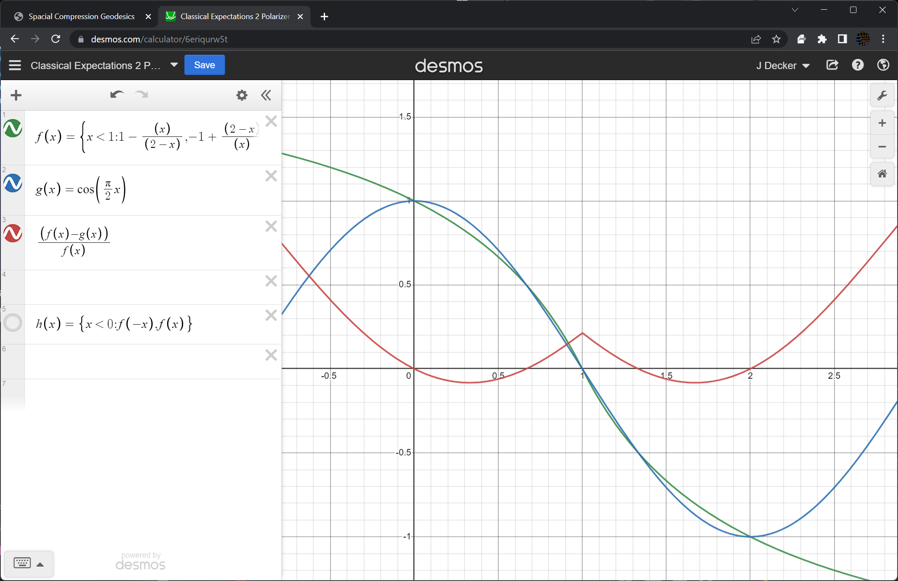

While developing this I've come across several issues with theoretical physics; that is those physics which rely on thought experiment to describe behaviors.

## Spin
Parameterizing spin as a 2D subset of 3D rotations (using azimuth/elivation or latitude/longitude) gives a different geometry to the problem than exists in 3D rotations.  There become available 'equitorial waves' or waves that go around the equator (an all other longitudes); these don't exist alone, and surely don't exist within the electorn probability cloud, and yet the spins are parameterized as a Bloch Sphere (or ...) which is latitude/longitude sort of settings.

## Bell's Theorum
The paper that Bell wrote proposes a upper limit of local hidden variables(LHV) as a ratio of 'yes'/'no' vs the total samples; while the quantum mechanical term is a ratio of 'yes' to 'no' and not to the total.  A ratio of 'yes' to 'no' for LHV yields a curve very much like the quantum version.

The blue line is `cos(theta)` and the green line ratio of `a` to `b` from `a+b=2`; Red is the error between the curves.  There's actually quite a wide error bar.  at `pi/3` is exactly 50% just like the quantum result; and as the predicted value in Bell's paper.  

### CHSH Inequality
CHSH is another inequality proposition, but this can actually be implemented as in this [Demo](https://d3x0r.github.io/STFRPhysics/math/CHSH_Game.html).  More information [here](https://github.com/d3x0r/STFRPhysics/blob/master/QuantizedProbability.md#chsh-experiment).  Easily beatable, by defining a more generous correlation function for the LHV than ( [John Clauser](https://en.wikipedia.org/wiki/John_Clauser), [Michael Horne](https://en.wikipedia.org/wiki/Michael_Horne_(physicist)), [Abner Shimony](https://en.wikipedia.org/wiki/Abner_Shimony), and [Richard Holt](https://en.wikipedia.org/wiki/Richard_Holt_(physicist)) (whence the name “CHSH”)) defined.

## Literally Curved Space
Rather than defining some abstract idea that space-time is curved, just move the curvature to space itself, and leave time out of it.

## Relativity

1) The laws of physics take the same form in all [inertial frames of reference](https://en.wikipedia.org/wiki/Inertial_frames_of_reference "Inertial frames of reference").  
2) As measured in any inertial frame of reference, light is always propagated in empty [space](https://en.wikipedia.org/wiki/Space "Space") with a definite velocity _c_ that is independent of the state of motion of the emitting body. Or: the speed of light in free space has the same value _c_ in all inertial frames of reference.

Other than 2) disregards any idea about velocity becoming... 

 2) As measured in any inertial frame of reference, light is always propagated in empty [space](https://en.wikipedia.org/wiki/Space "Space") with a definite velocity _c_.

This yeilds that a non-moving body is not contracted/dilated.  A body moving towards an observer appears expanded/elongated in the direction of motion, while a body moving away appears contracted.

### Inequivalence of Equivalence Principle 
First, if a body sees a non-moving body, then the non-moving body appears exactly the same; so if a body is itself moving fast, and assumes itself to be at rest, and the other body is moving, would be predicted to have length elongation/contraction, but this is not what would be observed.

Second, if a body is moving, and emits light along its length, it would be possible to measure you are moving.

Third, light emitted perpendicular to the velocity will drift backwards with a rate of `-v`. 

Fourth - the curvature of space (Literally Curved Space), does make the geodesic path of light change, but it is not like gravity accelerating a mass.   Mass geodesics and light geodesics are not the same.  But within a gravity field, it does appear to be like being in a room with a velocity (and does not require acceleration)

