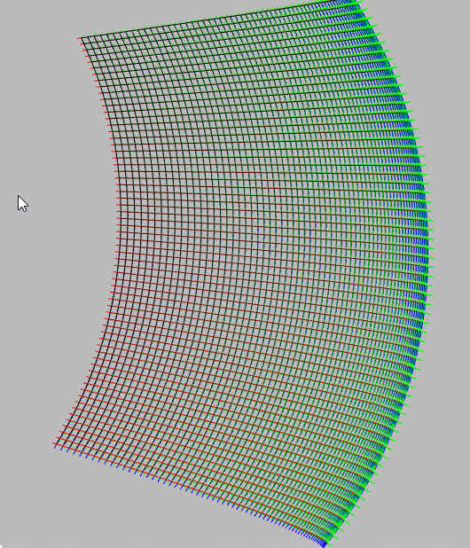

# On Natural Rotations

Controls for the freepsace demo :

|key| action|
|---|----|
| TAB | Toggle mouse lock |
| A | camera strafe left |
| D | camera strafe left |
| W | camera forward |
| S | camera back |
| Space | camera strafe up |
| C | camera strafe down |
| -numpad- | --------- |
| num0 | body accelerate |
| num. | body decelerate |
| num1 | body strafe left |
| num3 | body strafe right |
| num4 | body turn left |
| num6 | body turn right |
| num2 | body pitch up |
| num8 | body pitch down |
| num7 | body roll left |
| num9 | body roll right |
| num0 | body accelerate |
| num-enter | body strafe down |
| num-5 | body strafe up |


[Demo](d3x0r.github.io/STFRPhysics/freeSpaceTest)

Many camera systems in games have a fixed yaw/pitch for a standard fixed camera.

They lock the pitch to +90 and -90 so the rotation doesn't flip.

A minor modification is to turn the view by the same X/Y adjustment, no matter where the player looks, this maps a regular grid



The only thing you need to correct is any roll mis-alignment.

The amount of roll can be determined by the arcsin of the right vector's Y coordinate.  Applying this spin around the rotation
normalizes and naturally flips the viewer's camera as you pass overhead or below...  Like if you were standing in a field, and 
watching a plane fly overhead you would naturally turn your body around to flatten out your view as the plane looked overhead, 
and a natural motion would be to look up and up and up until you were forced to turn, then look down and down.

But, no matter what your angle, the left/right angle is always the same amount of change, instead of, when looking towards a poll, 
the camera in a gimbal-locked yaw-pitch sort of system will just turn you, and not actually look sideways... so you have to do some 
other operation to actually look to the left and right.  Instead, using the  deltaX and deltaY as pitch angle and yaw angle from 
where you are currently looking, yeilds consistent movement always; what rotations that yeild a roll... (looking up 45 degrees and then to the right 90 degrees
your view would end up 'rolled' to 45 degrees... but correcting for any roll difference back to 0 works wonders.


If one set a base orientation that was applied at the very last stage of orentation you could make this relative to any 
fixed base orientation.


``` js
	// tick = delta of this frame, used to scale the roll rotation factor to be that angle per frame
        //        instead of per second.
        // phiDelta - is the amount of angle looking up/down (from the Y change)
        // thetaDelta - is the amount of angle looking left/right (from the X change)


	// get the 'right'
	const rt = scope.motion.orientation.right();

       	scope.motion.rotation.x = -phiDelta;
	scope.motion.rotation.y = thetaDelta;

	// subtracting the roll angle out  (rotation around z)
	scope.motion.rotation.z = -Math.asin(rt.y)/tick; // normalize rotation to full rotation for this tick.

	scope.motion.rotation.dirty = true;

	const rot = scope.motion.rotation; // short hand
	// the above calculates (x,y,z) rotation vector.
        const angle = Math.sqrt( rot.x * rot.x + rot.y * rot.y + rot.z * rot.z );
        const axis = { x: rot.x / angle, y:rot.y/angle, z:rot.z/angle }
        
        const rotation_quaternion = { w: Math.cos( angle/2 )
                                    , x: Math.sin( angle/2 ) * axis.x
                                    , y: Math.sin( angle/2 ) * axis.y
                                    , z: Math.sin( angle/2 ) * axis.z
                                    }

```


