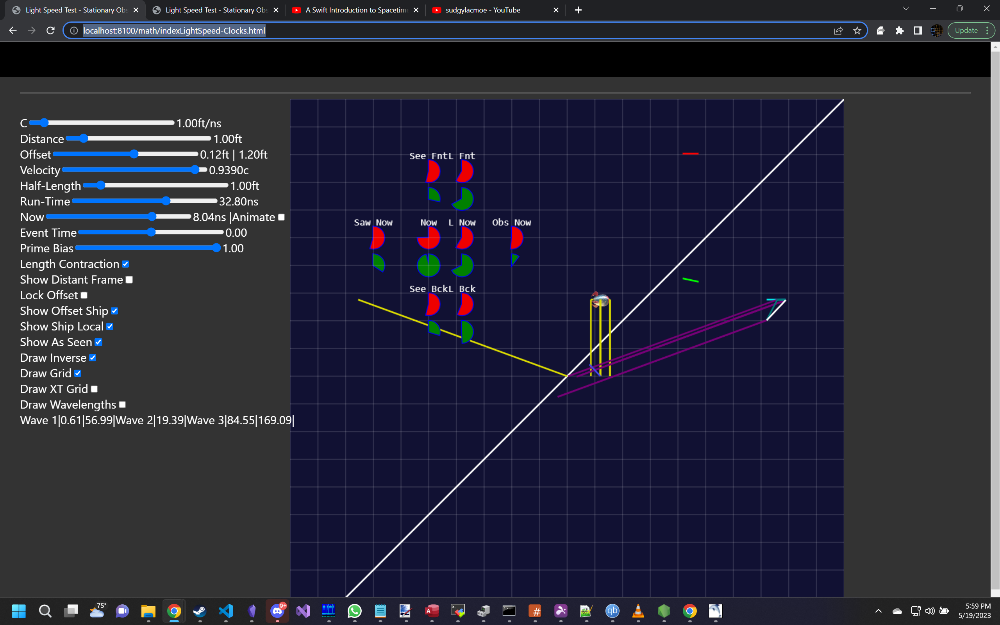

# Lightspeed Clocks

There is a ship that is moving.  There is an observer that is stationary (This may change; but it's good enough for now).  There is a earth and andromeda galaxy as distant objects which can be observed which are considered stationary.  There is an observer in the ship too, so when speaking of 'the ship observed' it's about an observer within the ship seeing.

This is a comparison of clocks.
 1) what clocks are for one stationary observer and one moving observer
 2) what closks are seen as (observer seeing the ships clock, the ship seeing the observer's clock)
 3) what a clock at the front of a ship and back of a ship would show to an observer in the ship.
 4) When two events happen at the same real time, such as [this exam question.](LightSpeedSim.md#lorentz-problem) There are two beings, one in andromeda and the other on earth, and they both start eating breakfast at the same moment.  What can a ship travelling between say about this situation?

The controls are
 - C : the speed of light
 - Distance : how far away (in the Y direction, which is above and below the simulation) the observer is from the ship.
 - Offset : Controls the observer's position in the ship, when showing what an observer in the ship sees.  It also controls the offset of the ship between Andromeda and Earth.
 - Velocity : How fast the relative velocity is between the observer and ship, or the ship is going between andromeda/earth.  This is scaled by the speed of light, and is always a fraction of the speed of light.
 - Half-Length : how long the ship is.
 - Run Time : how long the simulation is.  This allows covering a longer range of positions for a certain velocity.  
 - Now (and Animate): This is a slider that automatically updates to show what the current time value is, when animating.  If the animate option is disabled, then the slider allows setting a specific time.
 - Event Time : This is a marker that marks the simultaneous time that breakfast happens in Andromeda and on Earth.
 - Prime Bias : This is a slider to translate between the two frames considering themselves stationary.  Either the observer is stationary, so their world line goes up straight, changing only time, and not position; or the ship can consider that they themselves are stationary and everythng else is moving relative to them.  This slider goes from 0 (Observer stationary) to 1 (Ship Stationary); and covers a range inbetween.  The translation is from real position in real time (from the stationary observer's view), and the ships 0 position at the ship's clock, which moves everything.
 
## Check Options
 
 - Length Contraction : disables length contraction (more of a debug tool)
 - Show Distant Frame : This enables showing information about the Andromeda and Earth frame.
 - Lock Offset : This computes an offset for the ship based on its velocity and time that it will see both breakfast events at the same time.
 - Show Offset Ship : This toggles showing the main ship, with its trajectory lines, and also the main observer's line, which is initially a line straight up.
 - Show Ship Local : THis toggles showing the ship from the point of view of an observer on the ship.  This is subject to the clock on the ship, and is the real position.  This may appear to go faster than the speed of light at > $\frac{\sqrt 2} 2 c$ or more than 70.7% the speed of light.  
 - Show as Seen : This adds  a green line to show where the ship is seen from - it makes sure that the ship was in a place to be seen when it was seen.  It also adds a red line at 'now' to show what the observer sees in the flat now.  (Does not respect Prime Bias)
 - Draw Inverse : This was a first addition, it draws where the observer is seen by the ship, as if the ship was stationary.  (This is in the same direction as the observer's line when 'Prime Bias' is at 1).
 - Draw Grid : Draw a background grid, and speed of light lines
 - Draw XT Grid : not very helpful.
 - Draw Wavelengths : extended test, to track how many wavelengths of light are between the front and back, the back and front, and laterally.
 - Wave information : This shows the number of wavelengths from the front to the back (line 1), and the total of wave2+wave1.  Wave 2 is the second line, and is the wavelengths between the back of the ship and the front.   Wave 3 is the lateral waves; with time dilation, this ends up being always an exact number of waves.
 
## Clocks

Clocks are drawn with a label, and an upper Red arc, and a lower green arc.  The red arc fills from -runtime/2 to +runtime/2.  Because of various conditions clocks may appear to be greater than or usually long time before the current 'now'.  

If the clock is before -runtime/2 then it is shown in purple and counts backwards.  If the clock is after +runtime/2 then it is shown as a dark yellow.

Then green clock ticks at 8 times per 1 red clock.  So it gives a 360 degrees per 45 degress on the red clock.

The words in parenthesis are the option that enable the clock.

- Now : now.  This is as close to 'now' as anyone can get.  Both the observer and ships clock are synchronized to 'now=0', in the middle of the runtime, to be halfway on the clock.
- Saw Now : The clock the observer sees from the center of the ship.
- Frm Bck : (Show Distant Frame) The clock on the left side (Andromeda) that is currently seen by the ship.
- Frm Fnt : (Show Distant Frame) The clock from the right side (Earth) that is currently seen by the ship.
- See Fnt : (As Seen) The clock the observer sees from the front of the ship.  
- See Bck : (As Seen) The clock the observer sees from the back of the ship.
- L Now : (Show Local Ship) The clock local to the observer on the ship. (wrist time?)
- L Fnt : (Show Local Ship) The clock the observer at an offset on the ship sees from the front wall.
- L Bck : (Show Local Ship) The clock the observer at an offset on the ship sees from the back wall.
- Obs Now: (Draw Inverse) This is the 'Now' clock as seen by the ship.

'Saw Now' (observer seeing ship) and 'Obs Now' are not symmetric values.  'Now' always ticks at the same speed (until I add a second velocity option).  