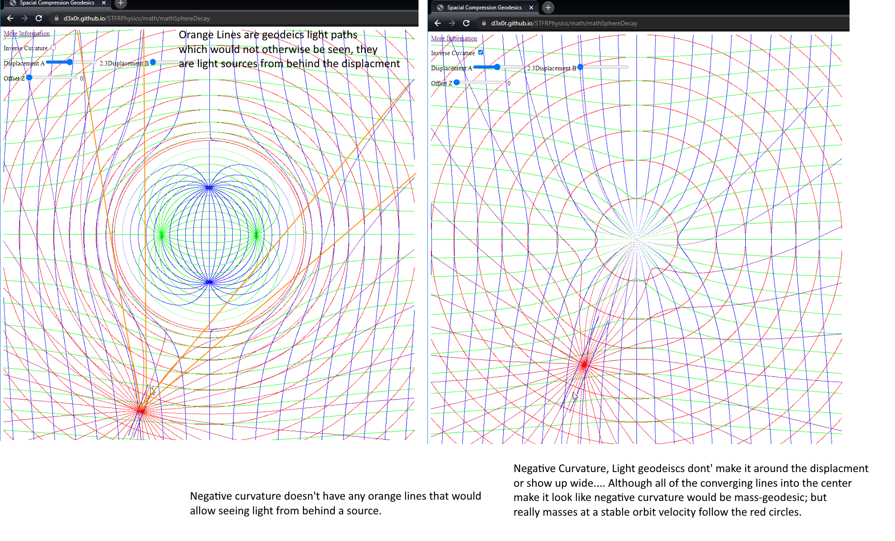

This is in reply (and sent to?) to

https://www.youtube.com/watch?v=t2_hNdlEuMg "Black Holes as you've never seen them."    (Physics Videos by Eugene Khutoryansky)  

# Curvature Inversion

Now that I've gathered how this topological space displacment actually happens (without time, there is no 4D required for this, and time and space(or linear position/translation) don't have any more relation than time and spin.), 
I now realize all these guys that make space warping so complex are wrong... and it's a positive curvature that applies to this.  

The EU (electric universe) Once put out a video saying exactly the above, and I took it with a grain of salt, that surely it wasn't the rest of the world that had the sign inverted; but no, come to find out, it's considered a negative displacment of space.
This only works for matter-geodesics... which aren't really so much geodesics and flowing toward and compelled to be in the least dense space;  the gradient of space being wider toward the bottom, but not actually affecting the physical flat space a thing occupies
will cause the spin to happen slightly slower on one side, and tend to cause particles to interact slightly closer/slightly longer on one side than the other implying a general motion to the matter.  But really matter changes velocities all the time when it's orbiting,
that's not the same with light at all, which is always a constant velocity.

This is an image, which demonstrates the straight lines that are definitly behind a gravitational source, but that can be seen by an observer at the point they all meet.

This image includes the comparison in inverted curvature space.

Light would fall into a source a lont time before beting able to be seen on the far side of a thing.

If black holes were this inverted curvature, they would blank out a huge arc of the sky behind them, not lense it forward.

THe geodesics that light follows do not move; and the space they are IN does not move.

The spatial displacement generated by the massive effective of a black hole allows light to follow ideal geodesics around it, making it actually nearly cloaked.

Gravitational Lensing is not a convex lense... otherwise we would be able to see a lot more smearing of various minor arcs.

You should zoom out a bit on your black hole idea, and put a earth and a distant star, and then turn down the inverted curvature a bit... how does that light get around the sun to the earth?  By the time there's an 
arc that is not curved into the gravitational source it's a arc way off to the side that can't be seen by the earth... even if it wasn't actually behind the gravity source.   (Eddington Experiment)

