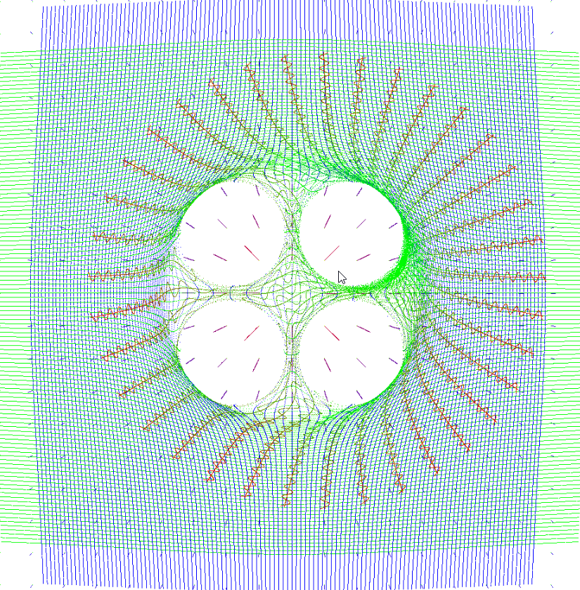
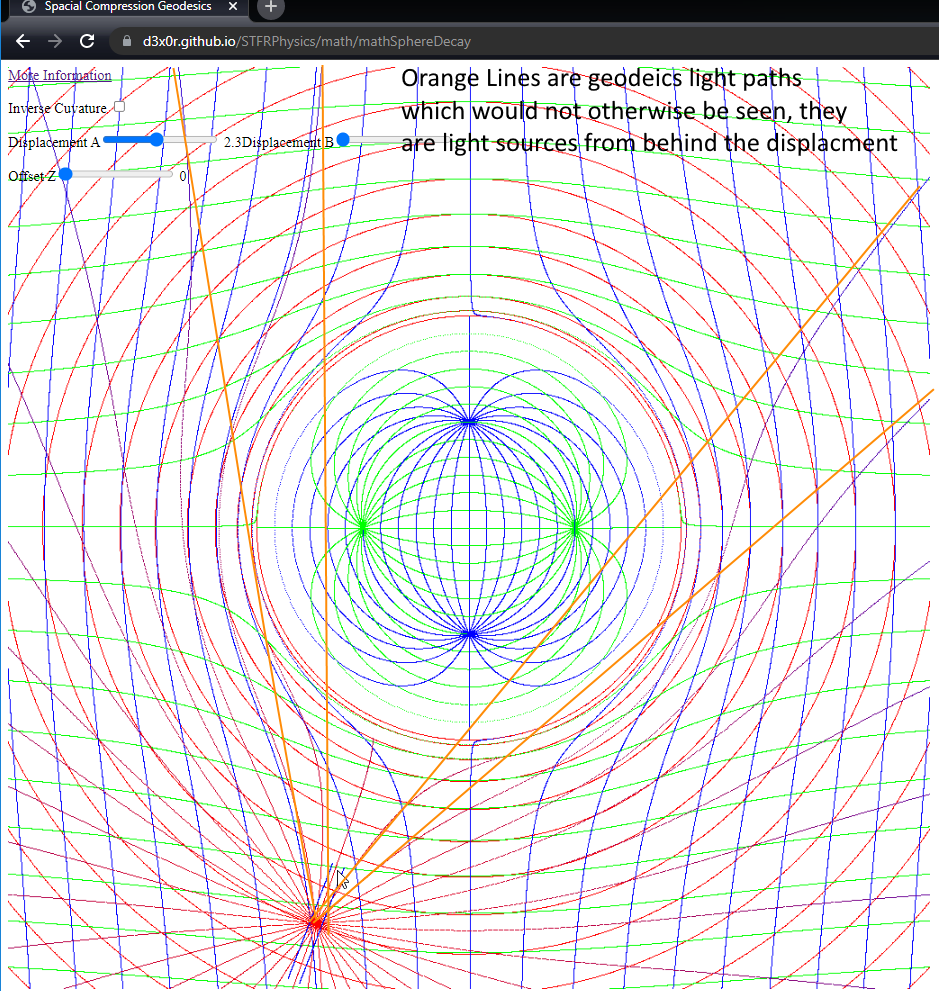

# 

When I first did the mathSphereDecay plot, and realized that the curvature is a positive pressure in space, this lead me to consider the dark energy aspect of modern science; and that this displacment of space pushes stuff away from each other.
When I started to dig into that as a method of implementing gravity force, everything move away from each other instead of towards each other, and I had anti-gravity; so the space displacement itself does not affect the thing
displacing it.  This is proven in the null experiment of Michelson-Morley.  Mass is not affected by the curvature of space; that is the cause of the mass is not subject to the curvature; the bobbers in the water don't feel the water(?).

https://en.wikipedia.org/wiki/Pound%E2%80%93Rebka_experiment shows red shift without doppler cause; the top of the building is not moving away from or towards the ground in any way; the gradient of gravity itself shifts the frequency.

The frequency component of light is generally along it's travel velocity, and is the wavelength forward/backward; while there is also an amplitude tangentially, which is also related to the wavelength.  If light emitted at some frequency goes
from a gravitational gradient further away, the linear component in the direction of gravity is less compressed further away, so approaching the gravitational source, the frequency compresses, and becomes blue shifted; Conversely, travelling
away from a gravitational source the gradient of space is less compressed and the signal appears red shifted.  This is only one aspect of the shift though, also the frequency generator deeper in the gravity well is running slower, what it emits
as a frequency is slightly lower when received by a clock further out in the gradient, and again, emitted from outside, the clock is slightly faster than the low clocks, so the top to bottom is blue shifted from a time delay.

Now, also, the tangential component of light will spread with distance in a gravitational source.  The light would have to be described by a line and a cylinder around it, and any line on the cylinder will diverge tangentially from 
the center when leaving a gravitational source, which causes a red shift; any gravitational displacments of space that happen tangnetial to the light will not have any effect on making the light converge or diverge more; except in the region 
that is closest, if a probe was in that spot, it might see a blue shifted signal when between two other massive objects.  But, then as I was following along in the Einstein Field Equations, which are built from the results of various other
math, the Ricci tensor and scalar are just describing the transformation of space, and time really isn't even a factor.

So... there wasn't a big bang?  Nothing's moving away from each other?  The Hubble Constant is just the general mass of objects - and how much space is displaced by graviational sources?  The graviational sources do not push each other away
by displacing the space (they're generally attracted to each other) which does push more space to the outside of themselves.  The least dense space is near a massive object (and technically IN the massive object, since that's where the negative curvature actually happens; 
I mean if there's a positive side to the curve, there must be a negative; and as demonstrated in images below, the negative curvature is NOT on the outside).

## I don't know...

As far as I can tell, the Big Bang Theory isn't so much of a theory as a creation myth.

A lot of science is being based on assigning some meaning of this big bang that has led to a lot of misconceptions...

When building the spatial displacement https://www.geogebra.org/3d/sadtqz3x math from 

It's almost like noone has actually plotted out the math to see it; so it's some abstract concept math people have in their heads
that is unsharable with the rest of the world.  Keeping it a secret art burying it in `for()` loop iterator symbols (christoffel symbols) and mis-projecting rotations as 2D when they're actually 3D (though you can omit one, it's best not to)

The sort of rotation and curvature I was developing with Dual lnQuats (  https://github.com/d3x0r/STFRPhysics/blob/master/MATH.md   https://github.com/d3x0r/STFRPhysics/blob/master/whitepaper.md  ) is not the sort of curvature that happens to space.
Rotation of space would look more like a twist, which we don't see.

Gravitational Lensing isn't convex lense lensing; it's gravitational lensing.

Light follow straight lines; from a far enough away source the light rays are nearly all parallel... but really they come from a point source, and have a small angle/spread to them...

This graph highlights straight light geodesics which appear to reach the other side of the gravity source (seeing around the corner)

This is the same graph as above, but compared with negative curvature and the same light geodesic emitter.

It's pretty clear to me that the negative curvature that is commonly shown in modern animations is just wrong; except maybe in the case of matter, and considering the curvature as what happens to massive objects, which constantly change velocity and are not on light geodesics.  (Well they may be, but they are free to change geodesics where light isn't).

## Other Projects

This demo needs refinement and documentation.... 

https://d3x0r.github.io/STFRPhysics/3d/indexSphereMap2.html

This is a tool observing the curavture behavior, (One of the Ricci Scalar values) is just the Y offset getting back to start after going out along a curvature;  (Other Ricci curvature values are better represented 
on this demo https://d3x0r.github.io/STFRPhysics/3d/indexSphereMap.html (Turn off "Use Polar Map", and increase the size to see curvature applied to rectangular geodesics).  It's sort of hard to have a single value for this,
unless the value is only considered radially, which then only shows up in hyperbolic spatial displacement...  ( https://d3x0r.github.io/STFRPhysics/math/mathSphereDecay, https://d3x0r.github.io/STFRPhysics/math/gravityFields.html'
, 	https://d3x0r.github.io/STFRPhysics/3d/index-gravity-field.html ).  It's the time axis that's negative coordinates, space is still positive... and the displacement we see across time in space is also positive.

The X/Y Sliders control the segments of the square stepping formation; X column sliders control how far each leg is, Y column sliders control the angle turned before stepping along the new geodesic.

The Z (Size) slider controls the curvature of a surface.  The greater the curvature, the more angle is covered for a unit step of arc-length.

Under the Z column, the bottom most slider controls the angular step taken at each step; instead of taking many steps like the square, this path turns at every forward step.

## External References

This is a partial list of resources that at least partially influenced the understanding of curvature.

These are good with pictures, and don't do anything specificially but keeps all the relationships abstract, to not get confused with real space.

https://www.youtube.com/watch?v=xodtfM1r9FA   The Maths of General Relativity (1/8) - Spacetime and Worldlines

https://www.youtube.com/watch?v=hhhYzfozon0   Ricci Tensor & Scalar (eigenchris)

https://www.youtube.com/watch?v=3LBitCErlBE Geodesic Curves

## Other tangential topics

https://www.youtube.com/watch?v=qDaoV5S9oTE  Quantum Spin (2) - Pauli Matrices

https://www.youtube.com/watch?v=10qvMocHFZg  Quantum Spin (3) - The Bloch Sphere   (quntum spin)