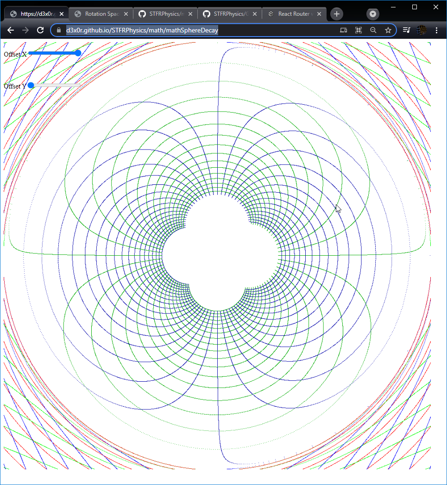
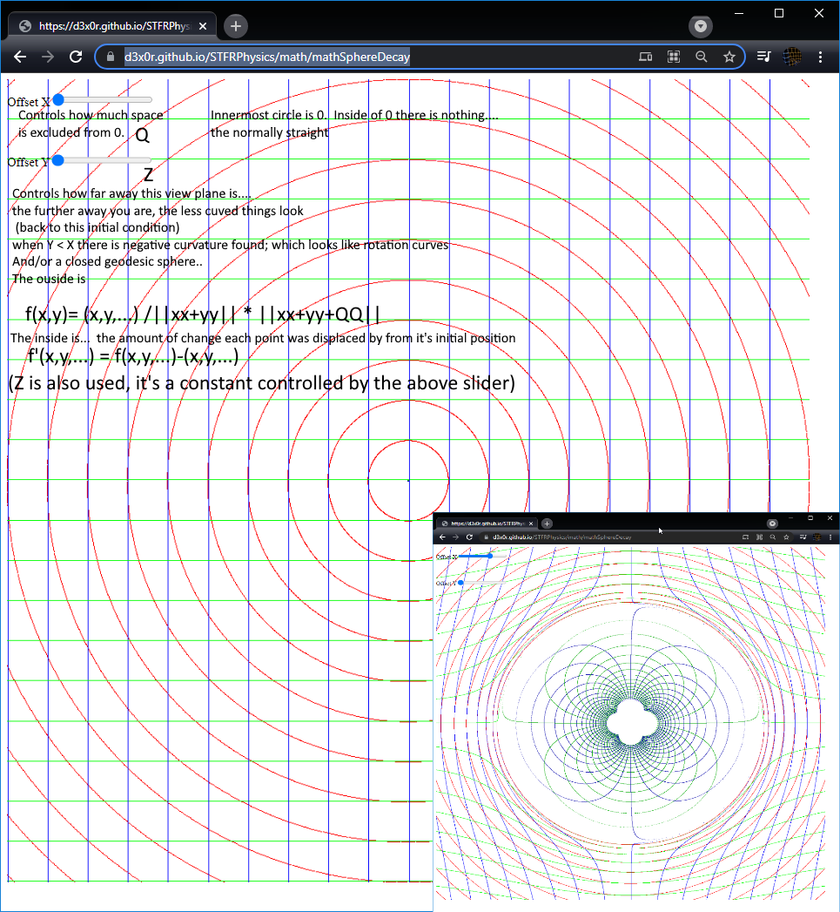

# Math of Spherical Surface Displacment

This ends up considering that gravity is a increasing gradient towards the source; the strength of gravity is stronger; rather than the convention that the kinetic energy component is large far away.  The relation between these is f(x)=1/x.


## Demo

- [Single Source](https://d3x0r.github.io/STFRPhysics/math/mathSphereDecay) - This shows curvature for a single poing displacement.
- [4 Sources](https://d3x0r.github.io/STFRPhysics/math/gravityFields.html) - This is 4 point displacements; the points  do not move and do not scale with the displacement they generate.

The `Displacment A` slider controls the inner displacment of 0.  The point that used to be at 0 is no longer at 0, but is instead
shoved away from the 0 by some amount.  Straight lines are proportionally scaled such that there position relative to the 0 is still the same.... as the radius increases, the surface area of the spheres increase more than the radius, 
which allows a larger radius to contain any inner radius plus some amount of its original amount, which results in a net decay of displacement over distance from the source. 

The graph shows the (red) circular displacement, where 0,1,2,3,4,... units are displaced from their original position.  The innermost circle is 0, and there is no space within the 0; this is entirely where curvature and rotations. 

Then X lines are in green, and Y lines are drawn in the intial position with no displacement curvature; then as `Displacment A` is increased, the lines around 0 deviate.  The lines crossing near 0 are not At 0, so they will bend around; 
This would be a good place to put a Schrodinger operator, where the path to the left or right is uncertain, and either is viable; (usually these result as a collision, imparting a linear momentum).

The inner lines (< 0 in the circles) are the difference each point is displaced from it's origin; it's the delta of the x/y lines... green and blue match respecitvely (the green is the (x,y,z) change in the Y=n geodesic lines.  blue is the (x,y,z) change in the X=n geodesic lines).

The `Offset Z` is offset of the Z position being viewed, if X and Y are the gridlines; it's a distance away from the center; it was meant more as a bias on the Y direction that moving up, there's less and less displacment (scanning the graph from left to right 
the green lines up 'up' less and less the further away they are, this offset controls how far every point is away from the origin.

When `Displacment A` is ____ then `Offset Z`
 - less than - ( the space geodesics are closed, and fill follow space like paths )
 - greater than or equal to - almost no apparent curvature is overserved, but you do start to see the spinning core; this is a close graph of geodeics.

`Displacment B` dialates the inner infinity and inserts another graph.  This is the derivitive of the curve actually.

Displacment A and Displacement B I think are spaces that rotate between themselves, representing an electro static and electromagnetic field.

(Perhaps there's a Displacment C for Strong force?  I suspect Weak Force will fall out as time-base probability of change.)






## See also

- [First Principles](/FirstPrinciples.md)
- [Sphere map](/3d/indexSphereMap.md)
- [Parallel transport using rotations over curvatures](https://d3x0r.github.io/STFRPhysics/3d/indexSphereMap2.html)


### A thing that's spinning continue's to spin....

The only way that rotation could have itself inertia is if it was never an angular velocity at some distance, but was instead a spin in place.  The inner geodesics follow rotation-like paths.

Minkowski space and most systems only consider conservation of energy (barly) in order to allow rotation; but there's many places where the loss to velocity would be notable; spin really does deserve its own thing.

(should go back and edit first prinicples and fill in some of this displacement stuff.)

(Multiple sources will sum together, having a source smaller than a significant amount of curvature)

## Analogy of Math to reality

We start with a circle of radius 0.

The hyperbolic curve minus X is the path around the displacement.

`Q_0` This is length in light-space.

`Q_1` is the inverse translation from 'real' to (x/y/z) in light space.

`dQ_0` is the first derivitive of Q_0.  This curve isn't shown... they are lines that bow outward/form a circle around the origin.

`A_0` This converts any arbitrary value from flat space to light space

The code later uses A_0(x, (x,y,z,Q) -> (x,y,z) ) - x  which removes the sloped part of hte hyparbolic, which is the deviation from a straight line (or a light-like path).

``` js
const _2to1 = (x,y)=> Math.sqrt(x*x+y*y);
const _3to1 = (x,y,z)=> Math.sqrt(x*x+y*y+z*z);
const _4to1 = (x,y,z,w)=> Math.sqrt(x*x+y*y+z*z+w*w);

const Q_0 = _4to1;  // length in displaced space
const Q_i = (x,y,z,Q) => Math.sqrt( x*x+y*y+z*z-Q*Q );  // from converted to real (unsquash)
const dQ_0 = (l,x,y,z,Q) => l/_4to1(x,y,z,Q);  // from real to converted (squash)
const A_0 = (l,x,y,z,Q) => l/Math.sqrt(x*x+y*y+z*z) * Q_0(x,y,z,Q)
```

##


## Working notes

   Along the way I picked up some clues from these guys and others not mentioned...

``` txt

   ------------------
   
   https://www.youtube.com/watch?v=qBJCCe81OCg
   pseudo reimanian spacetime
   
   squared lengths have +,0,-   (+ length is timelike, -length is space like and 0 is light-like)
   
   and we have a relation of theta between space and time where 0 degrees is lightlike and >0 +pi/4 is timelike and <0 -pi/4 is spacelike
      - lightlike is proper time is 0 (but that makes proper space 0 too?)
   
   1x3 
   
   spaces with metrics 'apply metric' is to transform from a conventional 'flat' notation to their real coordinates, and get a resulting length; but then the lines are continuous transformations that get a different length
   between the chord length and the arc length; which are both different from the intrinsic length.
     chord lengths leave the manifold... so it's arc length
   
   tangent velocity vector ( working form 2d, on a sphere)
   
   ----
   parallel transport.  
   
   So I have this vector - it's in some directionon the manifold; but it's in some direction tangent to the manifold, and to compare that vector with another
   I have- the transform in the manifold space has to be found.
   
   geodesic - paralel transport of vector along its own direction is parallel to itself.
   
   --------------------
   Primary perpendiculars https://www.geogebra.org/3d/ehvemap2
   given V1, V2, cross product is also....
   https://www.geogebra.org/3d/vmhcjr4h
   
   https://www.geogebra.org/3d/vmhcjr4h so; in a sense, 
   cross product is... every vector has a perpendicular that is a projection in the frame's plane... 
   (V1 dot planes, and then swap coordinates for perpendicular) dot ( v2 dot planes ); 
	each plane give the coodinate for the axis perpendiular to that plane... (so the final dot projection is actually an off-plane result)
   
   (V2 dot planes(yz,xz,xy) ) -> (0,b,c)   (A)
                                 (a,0,c)
                                 (a,b,0)
					 
   (V1 primary perpendiculars) -> (0,c,-b)    (B)
                                  (-c,0,a)
								  (b,-a,0)
								  
    cross = A dot B

// so my output is 6 coordinates.
// which means my vectorsare really 6 oordinates... and not 4.

	// project V2 on planes( yz,xz,xy,xw,yw,zw )
				(a,b,c,d,e,f)
	
				t1	 (a,0,0,d,0,0)
				t2	 (0,b,0,d,0,0)					 
				t3	 (0,0,c,d,0,0)
				t4	 (0,b,c,0,0,0)
				t5	 (a,0,c,0,0,0)					 
				t6	 (a,b,0,0,0,0)
					 
					 
      v2 into spaces? 
						(0,y,z,w)
						(x,0,z,w)
						(x,y,0,w)
						(x,y,z,0)
						
						
		// err, perpendiculars are spaces..... 
   (V1 primary (space)perpendiculars) -> (0,c,d,-b)    (B)
                                         (d,0,a,-c)
						       		     (b,-d,0,a)
								         (c,-a,b,0)

   (V1 primary perpendiculars) -> (d,0,0,-a)    (B)
                                  (0,d,0,-b)
								  (0,0,d,-c)
								  (c,0,-a,0)
								  (b,-a,0,0)


- so the perpendicular of a projection of a vector onto a plane is also parpendicular to that vector. ?

	(there are many pperpendiculars to choose from - but like the above, a specific pairing represents a right-left handed system
	
	angle-angle-angle-angle -> rotate around x,y,z,w simultaneously.
	
	1) rotating around X with W?
	   - y->z gets lost.
	     - should be an implicit change of y->w and z->w ; an x axis rotation IS perpendicular ot these.
         with z->y and y->z		 
	   
	   
	   ----
	   So in 3D the axis perpendiular to the plane is also a real axis...  'xy'=z, 
	   
	   in 4D, the axis is more properly the 'xy', or 'yz' axis, and you never actually rotate around a 'w' axis.
	     but now saying 'around the z axis' is not enough, you'd have to specify more specifically xy, xw, or yw axis to rotate around.
		 
		 ----------------------
		 SO back converting form 6 coordinates to 4 coordinates...
		 
		 yz yw zw  - x axis rotation should affect these....
		 xz xw zw  - y
		 xy xw yw  - z
		 xy xz yz  - w
		 
		xy xz xw  
		xy yz yw
		xz yz zw
		xw yw zw  any change in value in any of these planes would affect the W component in the other plane, and change that value...
		
		// these planes are mutually orthagonal.
		// a rotation in one of these planes can leave its paired plane unchanged.
		// 
		yz = xw
		xz = yw
		xy = zw
		
		// rotating these planes modifies all of the other planes.
		yz = xy xz yw zw
		xz = xy yz xw zw
		xy = xz yz xw yw
		xw = xy xz yw zw
		yw = xy yz xw zw
		zw = xz yz xw yw
		
		
		x wx
		y wy
		z yz
		
		
		xx = square linear metric.
		xxx = cube linear metric?
		
		4d Rotation is extra complex - 2 planes are invariant
		like the 1 axis is invariant
		------------------------
		Bi-Spinnor seems to be a useful thing
		
		
		aa1 which spins by aa2
		
		
		
		class BiLnQuat() {
			
			lnQ0 = new lnQuat();
			lnQ1 = new lnQuat();
			
			lnQX = new lnQuat();
			
			AdotB = 0;
			xmy = 0;
			xpy = 0;
			cxmy = 0;
			cxpy = 0;
			sxmy = 0;
			sxpy = 0;
			
			constructor() {
			}
			
			set( q1, q2 ) {
				const lnQ0 = this.lnQ0;
				const lnQ1 = this.lnQ1;
				lnQ0.set(q1).update();
				lnQ1.set(q2).update();
				
				this.AdotB = lnQ0.nx*lnQ1.nx + lnQ0.ny*lnQ1.ny +lnQ0.nz*lnQ1.nz;
				this.xmy = (lnQ1.? - lnQ0.? )/2;
				this.xpy = (lnQ1.? + lnQ0.? )/2;
			
				this.cxmy = Math.cos(this.xmy);
				this.cxpy = Math.cos(this.xpy);
				this.sxmy = Math.sin(this.xmy);
				this.sxpy = Math.sin(this.xpy);
			
				lnQx.? = Math.acos( ( ( this.AdotB )*(this.cxpy - this.cxmy) + this.cxmy + this.cxpy )/2 )*2;

				const ss1 = this.sxmy + this.sxpy  // 2 cos(y) sin(x)
				const ss2 = this.sxpy - this.sxmy  // 2 cos(x) sin(y)
				const cc1 = this.cxmy - this.cxpy  // 2 sin(x) sin(y)
        
				//1/2 (B sin(a/2) cos(b/2) - A sin^2(b/2) + A cos^2(b/2))
				// the following expression is /2 (has to be normalized anyway keep 1 bit)
				// and is not normalized with sin of angle/2.
				const crsX = (lnQ1.ny*lnQ0.nz-lnQ1.nz*lnQ0.ny);
				const crsY = (lnQ1.nz*lnQ0.nx-lnQ1.nx*lnQ0.nz);
				const crsZ = (lnQ1.nx*lnQ0.ny-lnQ1.ny*lnQ0.nx);
				const Cx = ( crsX * cc1 +  lnQ1.nx * ss1 + lnQ0.nx * ss2 );
				const Cy = ( crsY * cc1 +  lnQ1.ny * ss1 + lnQ0.ny * ss2 );
				const Cz = ( crsZ * cc1 +  lnQ1.nz * ss1 + lnQ0.nz * ss2 );
        
				// this is NOT /sin(theta);  it is, but only in some ranges...
				const Clx = (lnQuat.sinNormal)
				          ?(1/(2*Math.sin( ang/2 )))
				          :1/Math.sqrt(Cx*Cx+Cy*Cy+Cz*Cz);

				lnQX.nx = Cx*Clx;
				lnQX.ny = Cy*Clx;
				lnQX.nz = Cz*Clx;
        
				lnQX.x  = lnQX.nx*lnQx.?;
				lnQX.y  = lnQX.ny*lnQx.?;
				lnQX.z  = lnQX.nz*lnQx.?;
        
				lnQX.dirty = false;
			}
		
			applyDel( q, dt ) {
			
				const xmy = (lnQ1.?*dt - lnQ0.?*dt )/2;
				const xpy = (lnQ1.?*dt + lnQ0.?*dt )/2;
			
				const cxmy = Math.cos(this.xmy);
				const cxpy = Math.cos(this.xpy);
				const sxmy = Math.sin(this.xmy);
				const sxpy = Math.sin(this.xpy);
			
				lnQx.? = Math.acos( ( ( this.AdotB )*(cxpy - cxmy) + cxmy + cxpy )/2 )*2;

				const ss1 = sxmy + sxpy  // 2 cos(y) sin(x)
				const ss2 = sxpy - sxmy  // 2 cos(x) sin(y)
				const cc1 = cxmy - cxpy  // 2 sin(x) sin(y)
        
				//1/2 (B sin(a/2) cos(b/2) - A sin^2(b/2) + A cos^2(b/2))
				// the following expression is /2 (has to be normalized anyway keep 1 bit)
				// and is not normalized with sin of angle/2.
				const crsX = (lnQ1.ny*lnQ0.nz-lnQ1.nz*lnQ0.ny);
				const crsY = (lnQ1.nz*lnQ0.nx-lnQ1.nx*lnQ0.nz);
				const crsZ = (lnQ1.nx*lnQ0.ny-lnQ1.ny*lnQ0.nx);
				const Cx = ( crsX * cc1 +  lnQ1.nx * ss1 + lnQ0.nx * ss2 );
				const Cy = ( crsY * cc1 +  lnQ1.ny * ss1 + lnQ0.ny * ss2 );
				const Cz = ( crsZ * cc1 +  lnQ1.nz * ss1 + lnQ0.nz * ss2 );
				// if theta is very small, the above direction vector will also be near 0
				if( lnQX.? > 1e-13) {
					// this is NOT /sin(theta);  it is, but only in some ranges...
					const Clx = (1/(2*Math.sin( lnQX.?/2 )))
                
					lnQX.nx = Cx*Clx;
					lnQX.ny = Cy*Clx;
					lnQX.nz = Cz*Clx;
                
					lnQX.x  = lnQX.nx*lnQx.?;
					lnQX.y  = lnQX.ny*lnQx.?;
					lnQX.z  = lnQX.nz*lnQx.?;
                
					lnQX.dirty = false;
				}
				
				q.freeSpin( lnQX.?*dt, lnQX );
			}
		
		}
	
function finishRodrigues( q, oct, ax, ay, az, th ) {
	oct = oct || 0;
	const AdotB = (q.nx*ax + q.ny*ay + q.nz*az);
	
	// using sin(x+y)+sin(x-y)  expressions replaces multiplications with additions...
	// same sin/cos lookups sin(x),cos(x),sin(y),cos(y)  
	//   or sin(x+y),cos(x+y),sin(x-y),cos(x-y)
	const xmy = (th - q.?)/2; // X - Y  ('x' 'm'inus 'y')
	const xpy = (th + q.?)/2  // X + Y  ('x' 'p'lus 'y' )
	const cxmy = Math.cos(xmy);
	const cxpy = Math.cos(xpy);

	// cos(angle result)
	//const cosCo2 = ( ( 1-AdotB )*cxmy + (1+AdotB)*cxpy )/2;
	// ( 2 cos(x) cos(y) - 2 A sin(x) sin(y) ) / 2
	
	const cosCo2 = ( ( this.AdotB )*(this.cxpy - this.cxmy) + this.cxmy + this.cxpy )/2;
	//   (1-cos(A))cos(x-y)+(1+cos(A))cos(x+y)
	//    cos(A) (cos(x + y) - cos(x - y)) + cos(x - y) + cos(x + y)
	// octive should have some sort of computation that gets there...
	// would have to be a small change
	ang = Math.acos( ( ( this.AdotB )*(this.cxpy - this.cxmy) + this.cxmy + this.cxpy )/2 )*2 + oct * (Math.PI*4);

	if( ang ) {
		const sxmy = Math.sin(xmy);
		const sxpy = Math.sin(xpy);
		// vector rotation is just...
		// when both are large, cross product is dominant (pi/2)
		const ss1 = sxmy + sxpy  // 2 cos(y) sin(x)
		const ss2 = sxpy - sxmy  // 2 cos(x) sin(y)
		const cc1 = cxmy - cxpy  // 2 sin(x) sin(y)

		//1/2 (B sin(a/2) cos(b/2) - A sin^2(b/2) + A cos^2(b/2))
		// the following expression is /2 (has to be normalized anyway keep 1 bit)
		// and is not normalized with sin of angle/2.
		const crsX = (ay*q.nz-az*q.ny);
		const crsY = (az*q.nx-ax*q.nz);
		const crsZ = (ax*q.ny-ay*q.nx);
		const Cx = ( crsX * cc1 +  ax * ss1 + q.nx * ss2 );
		const Cy = ( crsY * cc1 +  ay * ss1 + q.ny * ss2 );
		const Cz = ( crsZ * cc1 +  az * ss1 + q.nz * ss2 );

		// this is NOT /sin(theta);  it is, but only in some ranges...
		const Clx = (lnQuat.sinNormal)
		          ?(1/(2*Math.sin( ang/2 )))
		          :1/Math.sqrt(Cx*Cx+Cy*Cy+Cz*Cz);
		if(0) {
			// this normalizes the rotation so there's no overflows.
			const other = 1/Math.sqrt(Cx*Cx+Cy*Cy+Cz*Cz);
			if( Math.abs( other - Clx ) > 0.001 ) {
				console.log( "Compare A and B:", Clx, other, th, q.? );
			}
		}
		q.rn = Clx; // I'd like to save this to see what the normal actually was
		q.?  = ang;
		q.nx = Cx*Clx;
		q.ny = Cy*Clx;
		q.nz = Cz*Clx;

		q.x  = q.nx*ang;
		q.y  = q.ny*ang;
		q.z  = q.nz*ang;

		q.dirty = false;
	} else {
		// result angle is 0
		if( AdotB > 0 ) {
			q.?  = q.?+th;
		}else {
			q.?  = q.?+th;
		}
		q.x = (q.nx) * q.?;
		q.y = (q.ny) * q.?;
		q.z = (q.nz) * q.?;
		q.dirty = false;
	}
	return q;
}

}


-------------------------------------------------


	  
	  ------------------
	  so... to show geodesics...
	  motion on a sphere is 2?1?d, 1 forward 1 angle.
	  
	  forward is only ever around the geodesic with the origin at the center.
	  
	  the initial angle doesn't matter except to bias the whole graph.
	  
	  (0, k * arclength )  for some forward distance of arclength, on a curvature of k ( with radius radius of 1/k )
	 
		( (?,?,?), k*arclength ) is the axis-angle representation, where ?,?,? is the normal of the geodesic.
		    for any position on the sphere, only certain directions are allowed to be geodesic, and they lie in a plane with the position as the normal
		
		    from the origin, this plane is the x/z plane
		
		up() = 'up'. the plane perpendicular to this contains the rotation axis.
		    (set the normal x/z rotation, and then rotate to this?)
			the rotation vector for this up should be a real coordinate, with real bias, eventhoug there's a 2x rotation.
			// it's perpedicular ot this - so it should be at least 45 degree offset I guess.. //
	  (up.spin(D1), k * arclength ) (from the given rotation point)
	  
	  /* repeat */
	  (up.spin(D2), k * arclength ) (from the given rotation point)
			here.spin( right(), newForward * k*arclength );


		(0,th0,0)  // turn forward in the right direction
		
		spin( k*arclength, ( cos(th0), 0, sin(th0) ) )  // advance forward 
		
		spin( k*arclen2,  ( right.x*cos(th1) +forward.x*sin(th1) ,right.y*cos(th1) +forward.y*sin(th1),right.z*cos(th1) +forward.z*sin(th1) ))
		
		spin( k*arclen3,  ( right.x*cos(th2) +forward.x*sin(th2) ,right.y*cos(th2) +forward.y*sin(th2),right.z*cos(th2) +forward.z*sin(th2) ))
		

	


	const xmy = (th - q.?)/2;
	const xpy = (th + q.?)/2;
	const cxmy = Math.cos(xmy);
	const cxpy = Math.cos(xpy);
	ang = Math.acos( ( this.cxmy + this.cxpy )/2 )*2 ;

	if( ang ) {
		const sxmy = Math.sin(xmy);
		const sxpy = Math.sin(xpy);
		const ss1 = sxmy + sxpy
		const ss2 = sxpy - sxmy
		const cc1 = cxmy - cxpy

		const crsX = (-az*q.ny);
		const crsY = 0;
		const crsZ = (ax*q.ny);
		const Cx = ( crsX * cc1 +  ax * ss1 + 0          );
		const Cy = ( 0          +  0        + q.ny * ss2 );
		const Cz = ( crsZ * cc1 +  az * ss1 + 0          );

		// this is NOT /sin(theta);  it is, but only in some ranges...
		const Clx = (1/(2*Math.sin( ang/2 )));
		          
		q.?  = ang;
		q.nx = Cx*Clx;
		q.ny = Cy*Clx;
		q.nz = Cz*Clx;

		q.x  = q.nx*ang;
		q.y  = q.ny*ang;
		q.z  = q.nz*ang;

		q.dirty = false;
	} else {
	}

	// this is angle 0, and forward step 0
	
	
	-------
	
	http://mathb.in/67745  
	http://mathb.in/67746 This is the algorithm recaptured in math... 
	http://mathb.in/67747
	
	1) yaw(dt)
	
		// compute 'up' from 'q'
		const ax = ( 1 - Math.cos( q.? ) * q.ny*q.nx ) - Math.sin( q.? )*q.nz;
		const ay = ( 1 - Math.cos( q.? ) * q.ny*q.ny ) + Math.cos( q.? );
		const az = ( 1 - Math.cos( q.? ) * q.ny*q.nz ) + Math.sin( q.? )*q.nx;

			// rotate 'q' around 'up' by 'X'
			const th = X; // amount of yaw per step... (360/steps - 2*k (NO))
			const AdotB = (q.nx*ax + q.ny*ay + q.nz*az);
			const xmy = (th - q.?)/2; 
			const xpy = (th + q.?)/2;
			const cxmy = Math.cos(xmy);
			const cxpy = Math.cos(xpy);

			const cosCo2 = ( ( AdotB )*(cxpy - cxmy) + cxmy + cxpy )/2;
			let ang = acos( cosCo2 )*2;

			const sxmy = Math.sin(xmy);
			const sxpy = Math.sin(xpy);
	
			const ss1 = sxmy + sxpy
			const ss2 = sxpy - sxmy
			const cc1 = cxmy - cxpy
    
			const crsX = (ay*q.nz-az*q.ny);
			const crsY = (az*q.nx-ax*q.nz);
			const crsZ = (ax*q.ny-ay*q.nx);
			const Cx = ( crsX * cc1 +  ax * ss1 + q.nx * ss2 );
			const Cy = ( crsY * cc1 +  ay * ss1 + q.ny * ss2 );
			const Cz = ( crsZ * cc1 +  az * ss1 + q.nz * ss2 );
    
			// this is NOT /sin(theta);  it is, but only in some ranges...
			const Clx = (1/(2*Math.sin( ang/2 )));
			
			q.rn = Clx; // I'd like to save this to see what the normal actually was
			q.?  = ang;
			q.nx = Cx*Clx;
			q.ny = Cy*Clx;
			q.nz = Cz*Clx;
    
			q.x  = q.nx*ang;
			q.y  = q.ny*ang;
			q.z  = q.nz*ang;


			// the above q is what's used for this.
			// rotate (k,0,0) by the new frame to get the axis relative to that frame
			const vx = (Math.PI*2)*k /100;
			const c = Math.cos(acos( cosCo2 )*2);
			const s = Math.sin(acos( cosCo2 )*2);
    
			const Vector = new vectorType(
				  vx*c        + q.nx * (1-c)*((q.nx * vx ) )
				, + s*(q.nz)  + q.ny * (1-c)*((q.nx * vx ) )
				, + s*(-q.ny) + q.nz * (1-c)*((q.nx * vx ) ) );


			// This is repeated twice, once on the current q1
			// another time on the t(n) as q.
			const th = length(Vector); // amount of yaw per step... (360/steps - 2*k (NO))
			const ax = Vector.x/th;
			const ay = Vector.y/th;
			const az = Vector.z/th;
			
			// this q is still the above q... 
			const AdotB2 = (q.nx*ax + q.ny*ay + q.nz*az);
			const xmy = (th - acos( cosCo2 )*2 )/2; 
			const xpy = (th + acos( cosCo2 )*2 )/2;
			const cxmy = Math.cos(xmy);
			const cxpy = Math.cos(xpy);

			const cosCo2 = ( ( AdotB2 )*(cxpy - cxmy) + cxmy + cxpy )/2;
			let ang = acos( cosCo2 )*2;

			const sxmy = Math.sin(xmy);
			const sxpy = Math.sin(xpy);
	
			const ss1 = sxmy + sxpy
			const ss2 = sxpy - sxmy
			const cc1 = cxmy - cxpy
    
			const crsX = (ay*q.nz-az*q.ny);
			const crsY = (az*q.nx-ax*q.nz);
			const crsZ = (ax*q.ny-ay*q.nx);
			const Cx = ( crsX * cc1 +  ax * ss1 + q.nx * ss2 );
			const Cy = ( crsY * cc1 +  ay * ss1 + q.ny * ss2 );
			const Cz = ( crsZ * cc1 +  az * ss1 + q.nz * ss2 );
    
			const Clx = (1/(2*Math.sin( ang/2 )));
			
			q.?  = ang;
			q.nx = Cx*Clx;
			q.ny = Cy*Clx;
			q.nz = Cz*Clx;
    
			q.x  = q.nx*ang;
			q.y  = q.ny*ang;
			q.z  = q.nz*ang;

		
---	

	m[0] = {0,0,0}
	m'(n) = m(n-1) x Yaw(X)
	
	s(n) = {k,0,0} x m'(n)

	m(n) = m'(n) x s(n)
	t(n) = t(n-1) x s(n)
	
	
	
	
	
	------------------
	log(x) is also 1/x and log(x)*2 is 1/x^2
	(roughly) 
	
	
	move 0 -> 1, 1->1/2 2->1/4 3->1/9
	
	C = 2pr
	S = 4pr2
	V = 4/3pr3
	
	1  4/3p
	   / S = 1/3pr
	
	
	4pi(r+x)^2 - 4pir^2 = 4/3pir^3
	
	( (r+x)^2-r^2 ) = 1/3r^3
	
	r^2 + 2xr + x^2 - r^2 = 1/3 r^3
	
	x^2 = 1/3r^3 - 2xr
	
	x^2 + 2xr - 1/3r^3 = 0
	
	volume of a sphere at some r (y) had a thickness of x
	
	4/3pir^3 = 4/3pi(r+x)^3 -4/3pi(r)^3
	
	 ( 4/3pi(r+1)^3 - 4/3pi(r)^3 ) = 4/3pi(r+x)^3 - 4/3pi(r+0.25)^3 
	
	 (volume within R) adds x to have same volume outside of R   x ~= 1/4R   .25992  1.25992105
	 
	... so the volume of the inner sphere displaces to R+1/4R 
	   and then the volume that displaces is R*1.25*1.25
	   
	   
	   0 -> 1    1->1.25
	   1-2     
	   
	   
	   another way 1) volume contains N
	      .25r of his contains this N
		  thisN now contains (the same amount)
		  
		  -------------------
		  there's a simple correction term already, but.....
		  
		  1 = 1 + 1/(1-0)^2*10000
		  2 = 2 + 1/(2-1)^2*10000 = 
		  3 = 3 + 1/3
		  
		  
		  volume density    would be -1/x  for 1/x^2 surface density -2/x^3 
		  (sum of N at N)
		                         (value at N)
								                      change of value at N at N

			okay so now 0-1 is in 1-1.25 
			so 1-2 is now in 1.25 to ?
			
			from N^3 
			sum( n^3 )
			
			
			0->1   1.0->1.25   (0-1)
			1->2   1.25->
			
			vol(2)-vol(1) = vol(x)-vol( 1.25 )

			vol(1)-vol(0) + vol( ofs ) = vol(x) = vol(n0) (get radius)		cubrt 2	

			vol(1.1)-vol(1) + vol( n-1 ) = vol(x)  (get radius)  (2.08)

			vol(2)-vol(1) + vol( n-1 ) = vol(x)  (get radius)  (2.08)
			
			vol(r)-vol(r-1)  (thickness of 1) at any x
			   = vol(x) - vol(n-1)
			   
					+ vol( n-1 ) = vol(x)  (get radius)  (2.08)
			
			
			vol(r)-vol(r-1)+ v(2^1/3 r)
			
			vol(r)-vol(r-1) = vol(x) - vol(n-1)

			
			
			
			1) displacement total
			  vol(n)-vol(0) = vol(x)-vol(n)
			  vol(n)+vol(n) = vol(x);
			  
			  (2n^3)^1/3 
			
			0 = n*2^1/3  (1.2599)
			
			vol(r+thick) - vol(r) = vol(x) - vol(n-1) 
			
			r( vol(r+tick)-vol(r)
			  (the difference for each subsequent thickness increases exponentially, but fits into exponentialy more space too)
			  
			  total thickness of 2-0 to 
			  
			  
			  (vol(r)+vol(G))^3 = R^3
			  
			  R -vol(G) = vol(r)
			  
			  (R^1/3 - vol(G))^1/3 = r;
			  
			  r(A,x)  = (x^3+A^3)^1/3
			  
			  rd(A,x)  = (x^3+A^3)^1/3 - x
			  
			  dr(A,x) =  Ax^2 / (A^3+x^3)^2/3 - A
			       
			  r*(A,x) = (x^3-A^3)^1/3
			  r*(A,x) = (x^3-A^3)^1/3 - x
			  dr*(A,x) = x^2/(x^3-A^3)^(2/3)
			  
			  
			  r(A,x)/x = tensor strength between where space is to(over) where space should be
				
			    stress tensor = ( (A^3+x^3)^1/3 ) / x       >1 to 1
				
				delta stress tensor =  -A^3 / (x^2  (A^3 + x^3)^(2/3))
				
												-A^3 / (x^2  (A^3 + x^3)^(2/3))
												  (same as)
												-A^3 / (x (A^3+x^3)^1/3)^2
												
												and that looks more like 1/x^4
				
				
				
			-----------------------
			
			  planetary period - vr^2 = N * semimajor-axis ^3 
			               m^3/s = m^3
						   
			  oh   s^2 (vr^2)
			  vs   semimajor ^3
			  
			  
			  --------------------
			  
			  
			  https://www.youtube.com/watch?v=km7WTO_6K5s
			  
			  s^2 = (ct)^2 - x^2
			     
			  l^2 = x^2 + y^2 
			  
			  so we stay in the same  squared.. 
			  
			  so the basis have to converge on the vector; rather than rotate around the vector.
			  
			  transform from one frame to another ( ct= gamma(   ct    - beta x )
													x = gamma(-beta ct  + x )
													
												( this was done for minkowsky vector)
											( et= gamma(   et    + beta ex )
													ex = gamma(+beta et  + ex )
															
										so for some frame with velocity beta
										beta = v/c
										gamma = 1/sqrt(1-beta^2)
										
										_gamma2 = sqrt(1-beta^2)
				
				Okay minkowsky though s^2 is spin not a dependant variable.
				
				and s^2+x^2 = ct^2 is the required time to go...
				
				but we can, like P=IE or E=IR shuffle these around meaningfully as desired.
				
				Only that prevents any negatives from appearing; but since s^2 < 0 ; negative spin almost works, since at least it also results with an i term... 
				
				galilaen relativity u+v
				minkowski add hyperbolic angles of uv 
				
				----
				https://www.geogebra.org/3d/sadtqz3x  so this hyperbolic curve... can't just not square root the other one to have it equal
				
				y^2-x^2-Q^2 = 0 
				
				sqrt(x^2+Q^2)    !=  x^2 + Q^2
				
				
				proper acceleration `alpha` is length of `A->` (4-acceleartion vector)
				
				d^2 S / dtau2
				
				alpha acceleration is 0, or 4 accel A-> is 0 (good... spin change is 0)
				
				(this also implies that delta X^2 is 0 and delta ct^3 is 0 
				
				(Inertial Observer Defintiion)
				
				(https://www.youtube.com/watch?v=3LBitCErlBE)
				
				ct = x~ sinh (c~t/D ) Rindler is negative spin... and his clocks are running backwards.
				x = x~ cosh (c~t/D ) Rindler is negative spin... and his clocks are running backwards.
				
				light is complex because it's T=0 which is not well defined acceleration.
				
				---------------
				
				q(sqrt(yy+xx))
				
				y=M
				x  r
				
				p(x,y) 
				see - around here https://youtu.be/Ggtpb0_gXPE?t=1926   we have
				  1/2 r^2 + vEff(r) = E
				  -GM/r + l^2/2r^2 +Ml^2/r^3  (l is L not 1 )
				  
				  for point (x,y) offset is q(x,y)
				    (previously only for X)
					   same angle...
					   
					     (x,y)/sqrt(xx+yy) * Q_0(x,y,Q)
						 
						 (x,1)/sqrt(xx+11) * Q_0(x,1,Q)
						 
						 for some point p(x,y,z) distance from 0,0,0 Q_0
						     (x^2+y^2+z^2+S^2)^(1/2)
						   
						   
						     x/Sqrt[S^2 + x^2+ y^2+ z^2]

```
