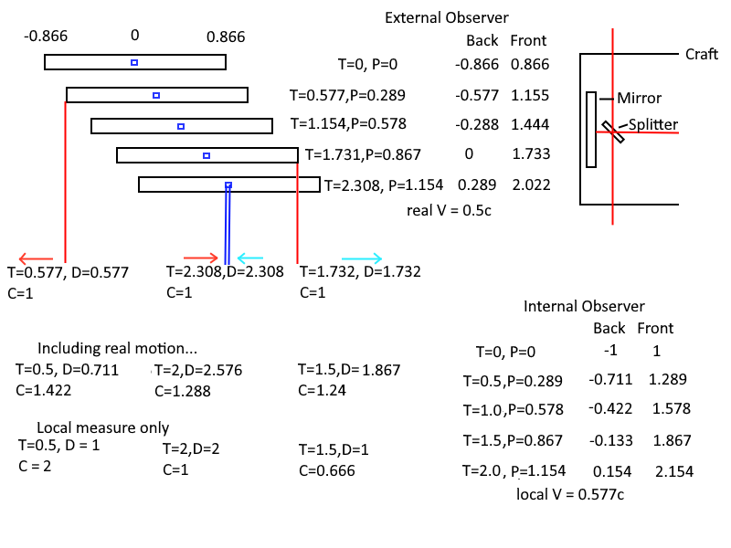
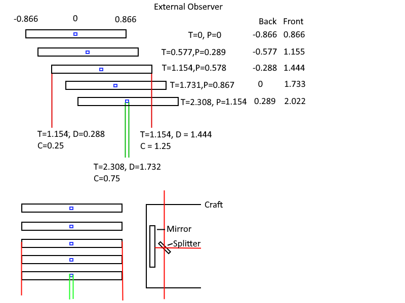

| [Abstract](LSP2-Abstract.md)                        | 3. [Light Aberration](LSP2-Light-Aberration.md)       | 7. [Experiment Proposal](LSP2-Experiment.md)                          | [Appendix C](LSP2-Appendix-C.md) | [Appendix G](LSP2-Appendix-G.md) |
| --------------------------------------------------- | ----------------------------------------------------- | --------------------------------------------------------------------- | -------------------------------- | -------------------------------- |
| [Introduction](LSP2-Introduction.md)               | 4. [Full Transformation](LSP2-Full-Transformation.md) | 8. [References and Declarations](LSP2-References-and-Declarations.md) | [Appendix D](LSP2-Appendix-D.md) | [Appendix H](LSP2-Appendix-H.md) |
| 1. [Light Propagation](LSP2-Propagation.md)         | 5. [Doppler Effects](LSP2-Doppler.md)                 | [Appendix A](LSP2-Appendix-A.md)                                      | [Appendix E](LSP2-Appendix-E.md) | [Appendix I](LSP2-Appendix-I.md) |
| 2. [Length Contraction](LSP2-Length-Contraction.md) | 6. [Results](LSP2-Results.md)                         | [Appendix B](LSP2-Appendix-B.md)                                      | [Appendix F](LSP2-Appendix-F.md) | [Appendix J](LSP2-Appendix-J.md) |
# Introduction

Starting from the ground up to derive the math of Special Relativity, by
developing the math for the propagation of light at a constant speed in
a stationary medium, or alternatively that there were at least three
observers, who all agree that the speed of light was constant in any
direction, they may have to consider their own velocity relative to the
point the light was emitted from, and any effects their velocity may
have on their own clock. The resulting equations challenge aspects of
the Principle of Equivalence employed by Einstein. The math also results
in a system that expects a null result from any interferometer
experiments such as Michelson-Morley, or interferometer implementations
such as The Laser Interferometer Gravitational-Wave Observatory (LIGO).

A frame is a set of orthogonal axes which measure distances between
locations within the frame, the orientation of the frame, and a time.
When a velocity is applied, the frame moves in the direction and speed
of the velocity. There are a minimum of 3 frames; the global frame
itself has no velocity, and is always in the same location, both the
observer and observed have their own frames. The global frame has an
origin defined at a location defined as appropriate for the situation
being evaluated. In this paper all frames share the same origin
$\vec{X}=\{0,0,0\}$ and orientation $\vec{Q}=\{0,0,0\}$ at $T=0$. The global frame
is the frame light propagates in; given the constant clarity we observe
in galaxies out to the edge of the universe, it can be assumed that the
space this global frame represents does not have significant currents or
motions, and represents space. There are minor oscillations in the
density and curvatures in this space, but it’s not like looking through
hot air currents.

Light is given a constant propagation speed of $C$ in global frame.

Bodies move at some speed and direction or combining speed and direction
into a single term, at a velocity. This medium is called space. Space
has no velocity or orientation, and the clock in the frame of space
ticks at constant rate. The clock in this frame is called the global
clock. A frame which moves within the space frame, or global frame, is
called a local frame. A local frame has a local clock, which may tick at
a different rate than the global clock.

The specific density of space (the average distance between two points)
in a frame may differ at various locations. This paper does not
implement varied density, and only considers frames that have entirely
homogeneous coordinates. It should not be entirely discounted given
gravitational wave detection that space can move at least slightly.

A body can only be observed if it has emitted or re-emitted a photon. A
photon on an observed body will come from position on the observed body.
The photon, once emitted, travels in the global frame, independent of
the body it was emitted from. An observer has a body itself and will
observe the photon from the observed body at some position in the frame
of the observer a later time after the body emitted a photon.

Once the basic math of propagation of light at a constant speed in
space, with an observed frame and an observer’s frame was developed,
other aspects detailed by Special Relativity were considered, since they
were not immediately obvious from the propagation. Those aspects being
length contraction, and time dilation. Time dilation would be better
called time contraction, since less time passes on a clock, much like
length contraction there’s less distance than a real distance. The
details of [length contraction](#_Length_Contraction) and [time
contraction](#_Time_Contraction) will be discussed later.

Light aberration was the last missing factor from the system. Light
aberration is an effect that for a moving body, the angle light is seen
is advanced in the direction of the velocity of the viewer. While light
propagation usually results in a time-lagged view of an observed body,
light aberration advances the angle, which counteracts the effects of a
delayed propagation. Light aberration then makes two bodies that are
relatively stationary, at the same speed that are side-by-side still
appear side-by-side, even though the photons seen by an observer would
normally appear to be lagged to the observer.

Evaluating the resulting math with an [interferometer
demonstration](#InterferometerDemo), then led to the development of the
expression for doppler effect, or the shift of frequency of photons
emitted from a body at a velocity, or as seen from another body with
another velocity. The doppler effect equation is quite dissimilar from
Einstein’s equation. There are predicted red/blue shifts with Transverse
Doppler Effect with Einstein’s equations, while these would show no
frequency change in the transverse direction.

## Conventions

Variables are upper case unless they come from an external reference.
This makes variables mentioned in the text stand out.

-  Equations with numbers that have been stricken are invalid, for example: (999). They are provided for consideration only.
-  Velocity is a vector $\vec{V}$.
-  Speed refers to the magnitude of the velocity (  ||$\vec{V}$|| ).
-  Direction refers to the unit vector of velocity ($\frac{\vec{V}}{||\vec{V}||}$).
-  Position is a vector of the same order as velocity, $\vec{V}$ is an example.
-  $\vec{X}\times\vec{Y}$ denotes a cross product.
-  $\vec{X}\cdot\vec{Y}$ denotes a dot product. This may also be written as $\vec{X}\vec{Y}$.
-  $\vec{X}^2$ is the same as $\vec{X}\cdot\vec{X}$.
-  $\|\vec{X}\|$ is the same as $\sqrt{{\vec{X}}^{2}}$
-  $X\cdot Y$ denotes a multiplication of two simple numbers; may also be written as $XY$.

$C$ is the constant speed of propagation defined in light-seconds per
second as used in this paper. It may also be used as a distance, in
which case $C_L$ light-seconds and has the same value as
$C$, but with units of length instead of speed. For example, $C$ could
be in meters per second (300,000,000 approximately), and then
$C_L$ meters would be 300,000,000. The value is always
actually identical to $C$ other than the units:
$\frac{C}{C_{L}} = 1s^{- 1}$ or $\frac{C_{L}}{C} = 1s$.

The phrase 'emits an event' is 'emits a photon that will be seen'
describes the creation of a signal that propagates through space. A body
that emits an event, emits a signal. It is the signal that propagates
through space. Reception of a signal is also observation of an event.

## Rotation

Rotations are 3D vectors *Q⃗* is an example; they are effectively the log
of a quaternion. This is used for [light
aberration](#d-aberration-with-rotation).

-   The angular rate is the magnitude of a rotation vector ( $\|\vec{Q}\|$).
-   The axis of rotation is the unit vector of a rotation(
    $\frac{\vec{Q}}{||\vec{Q}||}$).
-   Given a rotation vector *Q⃗*, the angular rate is *θ* = ∥*Q⃗*∥ and
    axis $\vec{A} = \frac{\vec{Q}}{\theta}$ used
    in the following
    equation:$\vec{X'} = \cos(\theta)\vec{X} + \sin(\theta)(\vec{A} \times \vec{X}) + (1 - \cos(\theta)) \cdot (\vec{A} \cdot \vec{X})\vec{A}$

## A Thought Experiment

Before diving into [the math](#_Light_Propagation), let me put forth my extended train through experiment.

Consider a somewhat extended thought experiment of an observer named Abe in the center of a train car with an observer by the train named Bonny.  The train car is 2 light-seconds long, which makes the ends of the train 1 light second away from Abe in both directions on each of the ends of the train car are two light emitters.  At the same position as the ends of the train are two light posts 2 light-seconds apart.  Bonny is standing at the midway point between the two light posts, one light is mounted on each of the light posts.  At time zero(0), Abe and Bonny are at their closest distance.  The train car is moving at a speed of 50% of the speed of light and has been moving at that speed even before time zero.  At time zero all 4 lights flash for a moment long enough to be seen; the four lights are the two on the ends of the train and the two on the light posts by the train. 

The lights emit a pulse of light that is a certain frequency of green. Green is specified since it is a frequency between blue and red, blue is a higher frequency than green, and red is a lower frequency.  The terms redshift and blueshift are a shift from green towards blue or red.

The notion of time contraction is ignored, so assume they can both use a clock that is in the frame of the train tracks. 

Abe on the train will see the two flashes from the front of the train and the light post near the front of the train before the two flashes at the back of the train. The time that the flashes from the front of the train are seen is 0.5 seconds. The time that the flashes from the back of the train is 1.5 seconds. The flashes from the front and back of the train will be seen at the exact frequency that was emitted.  The flash from the light post towards the front of the train is seen as blue shifted, and the flash from the light post towards the back of the train is seen as red-shifted.

Bonny by the train will see all four flashes at the same time 1 second after they are emitted.  The flashes from the light posts by the train are seen at exactly the frequency that was emitted.  The flash from the back of the train is seen as blueshifted, and the flash from the front of the train is seen redshifted.

|          |                 |       |                 |       |
| -------- | --------------- | ----- | --------------- | ----- |
| Observer | Lights in Train |       | Lights by Train |       |
| Front    | Back            | Front | Back            |       |
| Abe      | green           | green | blue            | red   |
| Bonny    | red             | blue  | green           | green |

Table 1: summary of frequency shifts by emissions from certain places as seen by each observer.

|          |                 |       |                 |      |
| -------- | --------------- | ----- | --------------- | ---- |
| Observer | Lights in Train |       | Lights by Train |      |
| Front    | Back            | Front | Back            |      |
| Abe      | 0.5s            | 1.5s  | 0.5s            | 1.5s |
| Bonny    | 1s              | 1s    | 1s              | 1s   |

Table 2: summary of length of time an observer will see the flashes from the time they are emitted.

### Modified Experiment

The other experiment which is more in-line with special relativity, is to replace the emitters in the above thought experiment with mirrors and then give Abe and Bonny each a light emitter.  When the emitter initially fires, it’s assumed there’s essentially 0 distance between Abe and Bonny and the emitter, so they don’t see the initial flash; though it can just note that first, almost instantaneously from the time of emission they see the flash, but it’s the subsequent information from the mirrors that are considered.  The flash from Abe that is seen by Bonny and vice versa are not shifted in frequency; at time 0 when Abe is exactly passing Bonny their relative speed is 0.

The pulses are emitted at the same time, and for the time calculations, which light is used doesn’t matter.  When considering what the frequency of the light is, it matters which emitted light is used.  In the above case, the light only has a single emitter and single observer to consider.  The lights from the train are seen by Abe and Bonny, and the lights from the light posts are seen by Abe and Bonny, and there’s only 4 combinations to consider.  When introducing mirrors, there are 2 emitters and 2 observers along the path to consider and there are a total of 8 combinations to consider below.

Mirrors are both observers and emitters.  An emitter that is moving emits a signal that is blue shifted to the front, and red shifted behind.  One way of looking at it is that a photon is not instantaneously produced but is produced over a small amount of time; when the creation of the photon starts, the emitter is in a certain location, and before completion of the wave the emitter has moved.  The motion of the emitter causes the wave to be compressed if the wave is ahead of the emitter along its velocity, while a wave trailing the emitter is elongated.  An observer or detector moving into a wave sees the wave as more compressed, and is blue shifted, while an observer moving away from a wave sees the wave elongated.  Redshift is associated with elongation, and blueshift is compression.  A mirror that is moving into a wave will blue shift it on the observation side and produce a compressed version when sending it. Conversely, a mirror moving away from a wave will elongate the wave and double redshift the wave.

Abe, on the train, will see the flashes reflected from the mirrors on the train 2.667 seconds after they were emitted, he will see the reflections from the light post at the back of the train 4 seconds after it was emitted, and will see the flashes reflected from the light post at the front of the train 1.333 seconds after the flash, while light from the back light post will be seen after 4 seconds.

The flash will hit the back mirror in the train only 0.667, because in the time the light is travelling, it will then take 2 seconds from the back mirror to get back to Abe. 

The flashes will hit the back mirror on the light post in 1 second, and the train will have moved 0.5 light seconds forward and have a total distance from the mirror to Abe of 1.5 light seconds to cover (while still moving forward).  In the next second, the light will be back at the starting position, and Abe will have moved another 0.5 light seconds, but now the light is only 1 light second from Abe.  In the next second, the light will be where Abe was, and at the front light post, but Abe will have moved another 0.5 light seconds forward and be 0.5 light seconds away from the light.  In the next second, which is a total of 4, the light will finally reach Abe.

The flashes will hit the front light post mirror in 1 second, and still the train will have move 0.5 light seconds forward.  The return over 0.5 light seconds with the train moving at 0.5 light seconds into it is 0.333 seconds, for a total of 1.333 seconds.

Considering the case of Bonny looking at the reflections from the train’s mirrors, the trip times are different.  The flash hits the back mirror in the train in 0.666 seconds, which the train will have moved forward 0.333 light-seconds, and reflect to Bonny another 0.666 seconds, for a total of 1.333 seconds.  The flashes will hit the front mirror of the train in 2 seconds, and the train will have moved forward 1 light second in that time, making the return trip 2 seconds, for a total of 4 seconds.

Abe will see the reflection of his own emitter unshifted in frequency from the mirrors on the train. The initial flash from Abe’s emitter is blue shifted towards the front of the train, and redshifted towards the back. When the mirror receives the light, it will undo the shift and go back to green, but then the front mirror will reflect the blueshifted signal as redshifted, and Abe will be heading into that wave and blue shift the signal back to green. A similar case, but the opposite, will happen with the back mirror.

Abe will see his own emitter reflected from the front light post blue shifted twice, once for the forward motion blue shifting emitted light and again from the reflection of the blue shifted light returning to him that he’s heading into, and from the back light post red shifted twice.  The mirrors are not moving in this case, and so the blue- or redshifted light received is reflected with the same frequency.

Abe will see the reflected light from Bonny’s emitter from the front of the train is red shifted, and the light from the back of the train is blue shifted. Bonny is not moving, so the signal she emits is green, when it hits the front mirror, it will be red shifted, and when it’s emitted from the mirror again it will be red shifted again.  Abe’s motion towards the front mirror’s location will blueshift one of the redshifts, and it will have 1 redshift component left.

Abe will see the reflected light of Bonny’s emitter from the front light post blue shifted, and the light from the back light post red shifted.  The emitted light from Bonny will not be shifted, and the stationary mirrors will not additionally shift the frequency, the only shift that happens is when Abe observes the signal.

Bonny will see the reflection of her own emitter unshifted in frequency from the mirrors by the track each 2 seconds after the light is emitted.  She will see the light reflected from the back of the train double blue shifted, 1.33 seconds after it was emitted.  Bonny will see the light reflected from the front of the train double red shifted, 4 seconds after it was emitted.  As mentioned earlier, when the mirrors receive the light, they always double-apply whatever shift they cause when first observing a signal.

|   |   |   |   |   |
|---|---|---|---|---|
|Abe’s Emitter   Observer|Mirrors in Train|   |Mirrors by Train|   |
|Front|Back|Front|Back|
|Abe|Green|green|2*blue|2*red|
|blue emitted|red emitted|blue emitted|red emitted|
|red into mirror|blue into mirror|No shift|No shift|
|red from mirror|blue from mirror|No shift|No shift|
|Blue received|red received|blue received|red Received|
|Bonny|red   (blue+red+red+none)|blue   (red+blue+blue+none)|blue   (blue+none+none+none)|red   (red+none+none+none)|

Table 3: summary of frequency shifts by emissions from certain places as seen by each observer.

|   |   |   |   |   |
|---|---|---|---|---|
|Bonny’s Emitter   Observer|Mirrors in Train|   |Mirrors by Train|   |
|Front|Back|Front|Back|
|Abe|red   (none+red   +red+blue)|blue   (none+blue   +blue+red)|blue   (none+none   +none+blue)|red   (none+none   +none+red)|
|Bonny|2*red   (none+red   +red+none)|2*blue   (none+blue   +blue+none)|green   (0+0+0+0)|green   (0+0+0+0)|

Table 4: summary of frequency shifts by emissions reflected from Bonny’s emitter as seen by each observer.

|   |   |   |   |   |
|---|---|---|---|---|
|Observer|Mirrors in Train|   |Mirrors by Train|   |
|Front|Back|Front|Back|
|Abe|2.667s   (0.667+2)|2.667s   (2+0.667)|1.33s   (1+0.33)|4s   (1+3)|
|Bonny|4s   (2+2)|1.33s   (0.66+0.67)|2s|2s|

Table 5: Summary of length of time before an observer will see the reflected flashes from the time they are emitted.

If time and length contraction are also considered, Abe’s frame is contracted, Bonny’s is not, Abe’s clock is running slow by the same amount the length is contracted, so he will still see the flashes from his own mirrors in 2s.  It does change the time that Bonny sees the flashes from the train’s mirrors because the train is contracted; the reflection from the front will be , and from the back is .  Abe’s clock also changes the time he sees the flashes from the light posts because his clock is contracted. 

|   |   |   |   |   |
|---|---|---|---|---|
|Observer|Mirrors in Train|   |Mirrors by Train|   |
|Front|Back|Front|Back|
|Abe|2s   (1.5+0.5)|2s   (0.5+1.5)|1.154s   (0.866+0.288)|3.464s   (0.866+2.589)|
|Bonny|3.464s   (1.732+1.732)|1.154s   (0.577+0.577)|2s   (1+1)|2s   (1+1)|

Table 6: Summary of length of time before an observer will see the reflected flashes including length and time contraction.

There are a bunch of numbers which are presented for which the math has not been presented yet.  By the end of the paper, you should be able to revisit this and perform the math yourself.

Abe, in his own frame, with his own clock, sees reflections in the mirrors in his frame after 2 seconds.  Bonny, in her own frame, with her own clock, sees reflections in mirrors in her frame after 2 seconds. 

Abe, in his frame, sees reflections in the mirrors by the tracks after 1.154 seconds from the front mirror and 3.464 seconds from the back mirror; the partial trip times from the time of emission until the reflection and from the reflection to observation are not the same as the partial times that apply for Bonny in her frame.  Bonny conversely sees the reflection from the back of the train in 1.154 seconds and from the front of the train after 3.464 seconds.

The length contraction means the signal travels a shorter path, and the time contraction means that the time it takes to cover that shorter path is longer.  The overall effect is that in real time, Abe sees the signal from the front and back of the train at 2.309 seconds according to Bonny’s clock, which is after Bonny sees her simultaneous signals, but is still 2 seconds on his own clock, which matches the 2 seconds on Bonny’s clock.

A craft that is 2 light-second long travelling at 0.5c, with a photon emitter in the center and a beam splitter before a mirror at each ends of the craft, with a final detector in the middle of the craft will always see the signal from either end come back at the same time, and the distance divided by one-half of the time will equal the speed of light.  The beam splitters allow for an external observer to register where the light pulse was detected, and two photon detectors placed externally can give the time the pulse is detected.  The position of these detectors can be computed ahead of time to already be a constant distance. 

Figure 1: Modified experiment graph and calculations.

Figure 1 includes a calculation that, if the internal observer also included their position update, then the speed of light would be calculated as slightly faster than the speed of light.  The inclusion of the frame’s velocity within the frame is usually not done; If you’re considering flying on a plane, and throwing a ball back and forth, the speed of the plane is usually not included in the calculated speed of the ball.

The above image includes length contraction of the moving body, and time contraction for the internal observer’s clock.  Space outside of the frame is not contracted, and the position shown for the internal observer is the real position, that if they were to stop at that time value on their clock, both the internal and external observer would agree on the position of the train.  The stationary observer external to the train can measure the time and distance signals happen within the craft, and using the one-way constant speed through space calculation this paper presents will observe that all segments of the trip, that light has traveled at the speed of light.

The internal observer will only calculate that the two-way path from the center to the ends and back to the center is the speed of light covering the contracted distance (which they do not observe as contracted, and assume that the length is still 1 light second), but they also have a contracted clock, which ticks slow, and means that their contracted distance divided by a slow clock is the speed of light.

If the internal observer does include the speed of their craft, then  is what they will calculate for the speed of light, which is entirely dependent on their velocity, and is already more than C; however, as mentioned before, this is not the usual calculation since they are assumed to be stationary and without the ability to measure their speed.

## Clock Synchronization

  
Figure 2: Various conditions of asynchronous clock transmission times.  Transmission starts from the lower side and goes up; time goes from left to right.

In modern communications networks, sometimes the send path is faster than the receive path or vice versa or can be entirely symmetric.  The case where the paths are symmetric is represented by the middle graph in the above figure.  The path where the transmission from bottom to top is slower than the return path is the top graph; and the bottom graph represents the condition where the transmission is faster than reception path.  There is no algorithm that can exactly synchronize the clocks in the above figures.  Instead, what can be done will have a skew between the two clocks, indicated by the numbers above and below the graph, where transmitting from one point to another seems like it’s accurate, this is what happens if you synchronize to round-trip time divided by 2.

This is a similar condition to what happens in Special Relativity with the mechanism specified by Einstein.  It is potentially not true that the forward path from clock A to clock B is the same as the transmission time from B to A.  If the speed of light one-way was always 'THE speed of light' as is the current consensus belief, an external observer would see the signal propagate at more than or less than the speed of light and would not meet the criteria that the speed of light is constant to all observers.

Figure 3: This is a diagram of what would be observed by an external observer if, as hypothesized by Einstein that the speed of light for any observer is always the same in any direction.

Figure 3 shows what an external observer would see if somehow the light emitted from the center hit both ends at 1 second according to the local clock and reflected to the outside. The overall speed of light the external observer would compute would be 0.75 times the speed of light.  This means that the speed of light is not the same for an external frame.  Not even the two-way speed is the speed of light.

The length is contracted to 0.866, and the clock of the local frame is also contracted by 0.866.  For the external observer, the distance that the light would have to cover to the back of the craft is only 0.288 light seconds, while it would have to cover 1.444 light seconds to reach the front reflector.  The return trips are the same, for a total of 1.732 light seconds (0.288+1.444), and the time it takes to return to the center is 2.308.  It would only be the speed of light to an observer in the moving frame, which makes their frame privileged, and the only one that can compute their speed of light as the speed of light.  While in the other case of a true one-way speed of light that propagates through stationary space, the local observer can compute a wo-way speed of light that is constant, which is all that experimental evidence has been able to prove.  An external stationary observer would be able to say every segment of the trip is the speed of light, and it’s just relatively offset for the observer because they are able to move while the light is travelling.

The speed of light is not affected by the speed of the transmitter, and once transmitted light is moving through a stationary space.  The speed of the receiver relative to space is what can affect their relative sense of the speed of light in one direction.

## The Equivalence Principle

The equivalence principle is an idea which is used for thought
experiments to equate one situation to another similar situation. The
principle only applies within certain limits, or under certain
conditions.

Two bodies that are moving at the same velocity to each other are
relatively stationary, that is not equivalent to being stationary.
Through the development of this it is shown that an observer moving at
any velocity with an observed body will see the body exactly the same as
if they were actually stationary ( see [3D Demo](#VoxelariumDemo) ).
However, let us consider a more classical example, instead of locking
the observer in a room with no access to the outside, they are freely
able to go to the deck of a ship and observe things. On a boat that is
stationary, let’s say it bobs up and down, and therefore emits waves in
concentric circles around it. When it starts to move, a wake is formed,
and the concentric circles from its bobbing motion are no longer
concentric but are offset. If there were two boats stationary, and one
takes off at some speed, it is illogical to say 'no, I'm not moving,
it's the other boat moving, and it has a wake in front of it'. You can
clearly see that your boat is making a wake, and that the other is still
emitting concentric circles of waves. This is also true of light
traveling at a one-way constant speed in space, that all observers can
agree it is traveling at. A stationary body is one that is still near
where it has previously emitted photons, while a moving body is one that
has changed position from where it has previously emitted photons. This
doesn't remove the idea of a frame being relatively stationary with
another frame, or having a relative velocity to another, but it does
have consequences which will be discussed later. The equivalence
principle will not be used, and further issues will be discussed later.

## Consistency of Physics

There is a postulate of Special Relativity that no experiment to an
isolated experimenter can determine the ambient velocity of the frame.
This idea isolates an experimenter in a box with no ability to take note
of information outside of the box. For example, an experimenter in the
hold of a sea going ship, without senses to the outside world. For an
observer that can look out a window, the aberration of stars and
galaxies will give an idea of direction and speed of motion at
relativistic speeds.

Quoted from Wikipedia: “The [laws of physics](https://en.wikipedia.org/wiki/Laws_of_physics) are [invariant](https://en.wikipedia.org/wiki/Invariant_(physics)) (identical)
in all [inertial frames of reference](https://en.wikipedia.org/wiki/Inertial_frame_of_reference) (that
is, [frames of reference](https://en.wikipedia.org/wiki/Frame_of_reference) with
no [acceleration](https://en.wikipedia.org/wiki/Acceleration)).“

This is essentially true, but like General Relativity modified Newton’s
Gravity, there are certain physics laws that need additional correction
factors.

## Relative Light Speed

Once a photon is emitted, then it is in space and is no longer related
to the body that emitted it. The photon travels at its own constant
speed through space. This means that a photon emitted from the front of
a moving body towards the back, where front and back are determined by
the velocity of the body; the back is moving towards the photon moving
at C with a speed of V, and the light effectively travels at C+V.
Conversely, a photon emitted from the back, and moving towards the front
is moving at C, and the front is moving away from the photon at V, which
gives an effective velocity of C-V; that the photon is never relatively
at the speed of light, unless the body is stationary.

## One Way Constant Speed of Light(C)

Given a propagation speed of C, in a stationary, frictionless, massless
medium, bodies move at various speeds in various directions, or combined
into a single term at a certain velocity. This medium is called space.
Space has no velocity, so there is nothing like length contraction or
time contraction (this is a term that will be defined later) that
applies, the clock in the frame of space ticks at the fastest and
constant rate. This clock may also be called the global clock as opposed
to a local clock on a moving body, or in a local frame.
