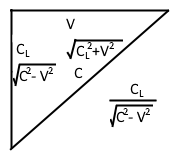

| [Abstract](LSP2-Abstract.md)                        | 3. [Light Aberration](LSP2-Light-Aberration.md)       | 7. [Experiment Proposal](LSP2-Experiment.md)                          | [Appendix C](LSP2-Appendix-C.md) | [Appendix G](LSP2-Appendix-G.md) |
| --------------------------------------------------- | ----------------------------------------------------- | --------------------------------------------------------------------- | -------------------------------- | -------------------------------- |
| [Introduction](LSP2-Introduction.md)               | 4. [Full Transformation](LSP2-Full-Transformation.md) | 8. [References and Declarations](LSP2-References-and-Declarations.md) | [Appendix D](LSP2-Appendix-D.md) | [Appendix H](LSP2-Appendix-H.md) |
| 1. [Light Propagation](LSP2-Propagation.md)         | 5. [Doppler Effects](LSP2-Doppler.md)                 | [Appendix A](LSP2-Appendix-A.md)                                      | [Appendix E](LSP2-Appendix-E.md) | [Appendix I](LSP2-Appendix-I.md) |
| 2. [Length Contraction](LSP2-Length-Contraction.md) | 6. [Results](LSP2-Results.md)                         | [Appendix B](LSP2-Appendix-B.md)                                      | [Appendix F](LSP2-Appendix-F.md) | [Appendix J](LSP2-Appendix-J.md) |

# Length Contraction

There is a phenomenon called Length Contraction, where the length of a
body moving with a velocity is contracted in the direction of the
velocity. The length of the body is physically contracted. It is
impossible to measure length contraction of a frame because any ruler in
the frame is likewise contracted, and even if LIDAR is used – the
propagation time to a target and back in any direction takes the same
time. The contraction comes from the fact that propagation of
electromagnetic forces happens at the same speed as the propagation of
light; therefore, even the electron clouds of atoms are contracted so
the electrons orbit the same speed in any direction. The worst-case
travel time of forward-backward gets scaled to the best-case lateral
travel time; that is the time a photon travels perpendicular to the
velocity, that scalar is then applied to the length in the direction of
the velocity vector.

In the following equations, $\vec{V}$ is the velocity of a moving body, to
determine contraction in the specified direction, $T_W$ is the worst case time, parallel to the velocity vector:

$$\begin{array}{r}
{T_{W}} = \frac{1}{{2}}\left( \frac{C_{{L}}}{C + \left\| \vec{{V}} \right\|} + \frac{C_{{L}}}{C - \left\| \vec{{V}} \right\|} \right)\\ (2.1)
\end{array}$$

$$\begin{array}{r}
{T_{W}} = \frac{1}{2}\left( \frac{{\left( C - \left\| \vec{V} \right\| \right)C_L}}{\left( C - \left\| \vec{V} \right\| \right)\left( C + \left\| \vec{V} \right\| \right)} + \frac{\left( C + \left\| \vec{V} \right\| \right)C_L}{\left( C + \left\| \vec{V} \right\| \right)\left( C - \left\| \vec{V} \right\| \right)} \right)\\ (2.2)
\end{array}$$

$$\begin{array}{r}
{T_{W}} = \frac{1}{{2}}\left( \frac{2CC_{L}}{C^{{2}} - \vec{{V}}\vec{{V}}} \right)\\ (2.3)
\end{array}$$

$$\begin{array}{r}
{T_{W}} = \frac{CC_L}{C^{{2}} - \vec{{V}}\vec{{V}}}\\ (2.4)
\end{array}$$

The best-case time is:

  
Figure 1: Graph relating $C_L$ for distance related to
velocity and $C$ for velocity related to velocity. Used to show the
geometric relation used for calculation $T_B$.

$$\begin{array}{r}
T_{B} = \frac{C_{L}}{\sqrt{C^{2} - \vec{{V}}\vec{{V}}}}\\ (2.5)
\end{array}$$

$$\begin{array}{r}
\frac{T_{B}}{T_{W}} = \frac{\frac{C_{L}}{\sqrt{{C_{L}}^{2} - \vec{{V}}\vec{{V}}}}}{\frac{CC_{L}}{C^{{2}} - \vec{{V}}\vec{{V}}}} = \frac{C_{L}}{\sqrt{C^{2} - \vec{{V}}\vec{{V}}}}\frac{C^{{2}} - \vec{{V}}\vec{{V}}}{CC_{L}}\\ (2.6)
\end{array}$$

$$\begin{array}{r}
\boxed{\Gamma = \frac{T_{B}}{T_{W}} = \frac{\sqrt{C^{2} - \vec{V}\vec{V}}}{C}}\\ (2.7)
\end{array}$$

## **Vector Expression to Apply Length Contraction**

Compute the vector that is the position projected on the velocity
vector. This vector is in the same direction as the velocity, scaled by
the length of X projected on V.

$$\begin{array}{r}
\vec{A} = \frac{\vec{V}\left( \vec{X} \cdot \vec{V} \right)}{{\vec{V}}^{2}}\\ (2.8)
\end{array}$$

Subtract the projected position vector, and then add the projection
length contracted:

$$\begin{array}{r}
\vec{X^{'}} = \vec{X} - \vec{A} + \vec{A}\frac{\sqrt{CC - VV}}{C}\\ (2.9)
\end{array}$$

Refactor of the previous equation – subtract the amount of the projected
vector that has been contracted out.

$$\begin{array}{r}
\vec{X^{'}} = \vec{X} - \vec{A}\left( 1 - \frac{\sqrt{CC - VV}}{C} \right)\\ (2.10)
\end{array}$$
